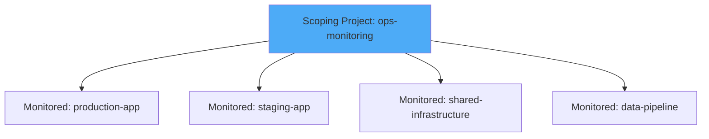

# How to Set Up Metrics Scopes for Cross-Project Monitoring on Google Cloud

Author: [nawazdhandala](https://www.github.com/nawazdhandala)

Tags: GCP, Metrics Scopes, Cross-Project Monitoring, Google Cloud Monitoring, Multi-Project, Observability

Description: Learn how to configure metrics scopes in Google Cloud Monitoring to monitor multiple GCP projects from a single dashboard and alerting configuration.

---

Most organizations on GCP do not run everything in a single project. You probably have separate projects for production, staging, development, shared infrastructure, and maybe per-team or per-service projects. The problem is that Cloud Monitoring is scoped to a single project by default, which means you need to switch between projects to see your full picture.

Metrics scopes solve this. A metrics scope lets you aggregate monitoring data from multiple GCP projects into a single "scoping project" where you can build dashboards, create alerts, and analyze metrics across your entire organization. This post walks through setting up metrics scopes for cross-project monitoring.

## What Is a Metrics Scope

Every GCP project has a metrics scope. By default, a project's metrics scope contains only that project's own data. But you can add other projects (called "monitored projects") to a scoping project's metrics scope. Once added, the scoping project can see metrics, logs, and uptime check results from all its monitored projects.

Think of it like this:



The scoping project does not need to run any workloads. It can be a dedicated monitoring project whose sole purpose is to aggregate metrics from other projects.

## Creating a Dedicated Monitoring Project

While you can use any project as your scoping project, best practice is to create a dedicated project for monitoring:

```bash
# Create a dedicated monitoring project
gcloud projects create ops-monitoring \
  --name="Operations Monitoring" \
  --organization=YOUR_ORG_ID

# Enable the Cloud Monitoring API
gcloud services enable monitoring.googleapis.com --project=ops-monitoring

# Enable the Cloud Logging API
gcloud services enable logging.googleapis.com --project=ops-monitoring
```

## Adding Monitored Projects to the Metrics Scope

You can add monitored projects through the Cloud Console or the API. Here is the API approach:

```bash
# Add a project to the metrics scope using the gcloud CLI
gcloud beta monitoring metrics-scopes create \
  projects/production-app \
  --project=ops-monitoring

# Add more projects
gcloud beta monitoring metrics-scopes create \
  projects/staging-app \
  --project=ops-monitoring

gcloud beta monitoring metrics-scopes create \
  projects/shared-infrastructure \
  --project=ops-monitoring
```

To do this through the Console:
1. Go to Monitoring in the ops-monitoring project
2. Click Settings in the left navigation
3. Click "Add GCP Projects" under Metrics Scope
4. Select the projects you want to monitor
5. Click Add

You can also use the Cloud Monitoring API directly with Python:

```python
from google.cloud import monitoring_metrics_scope_v1

def add_monitored_project(scoping_project_id, monitored_project_id):
    """Add a monitored project to a scoping project's metrics scope."""
    client = monitoring_metrics_scope_v1.MetricsScopesClient()

    # The metrics scope name for the scoping project
    metrics_scope = f"locations/global/metricsScopes/{scoping_project_id}"

    # Create the monitored project reference
    monitored_project = monitoring_metrics_scope_v1.MonitoredProject()
    monitored_project.name = (
        f"{metrics_scope}/projects/{monitored_project_id}"
    )

    # Add the monitored project
    operation = client.create_monitored_project(
        parent=metrics_scope,
        monitored_project=monitored_project,
    )

    result = operation.result()
    print(f"Added {monitored_project_id} to {scoping_project_id}'s metrics scope")
    return result

# Add multiple projects
projects_to_monitor = [
    "production-app",
    "staging-app",
    "shared-infrastructure",
    "data-pipeline",
]

for project in projects_to_monitor:
    add_monitored_project("ops-monitoring", project)
```

## Verifying the Metrics Scope Configuration

After adding projects, verify the configuration:

```bash
# List all monitored projects in the metrics scope
gcloud beta monitoring metrics-scopes list \
  --project=ops-monitoring

# You can also list from the API
gcloud beta monitoring metrics-scopes describe \
  locations/global/metricsScopes/ops-monitoring
```

## Building Cross-Project Dashboards

Now that your metrics scope includes multiple projects, you can build dashboards that show data from all of them. The key is to use the `project_id` resource label to filter or group by project.

Here is a dashboard that shows CPU utilization across all monitored projects:

```json
{
  "displayName": "Cross-Project Infrastructure Overview",
  "mosaicLayout": {
    "tiles": [
      {
        "width": 12,
        "height": 4,
        "widget": {
          "title": "CPU Utilization by Project",
          "xyChart": {
            "dataSets": [
              {
                "timeSeriesQuery": {
                  "timeSeriesFilter": {
                    "filter": "resource.type=\"gce_instance\" AND metric.type=\"compute.googleapis.com/instance/cpu/utilization\"",
                    "aggregation": {
                      "alignmentPeriod": "300s",
                      "perSeriesAligner": "ALIGN_MEAN",
                      "crossSeriesReducer": "REDUCE_MEAN",
                      "groupByFields": ["resource.labels.project_id"]
                    }
                  }
                },
                "plotType": "LINE"
              }
            ]
          }
        }
      },
      {
        "width": 6,
        "yPos": 4,
        "height": 4,
        "widget": {
          "title": "Cloud Run Request Count by Project",
          "xyChart": {
            "dataSets": [
              {
                "timeSeriesQuery": {
                  "timeSeriesFilter": {
                    "filter": "resource.type=\"cloud_run_revision\" AND metric.type=\"run.googleapis.com/request_count\"",
                    "aggregation": {
                      "alignmentPeriod": "300s",
                      "perSeriesAligner": "ALIGN_RATE",
                      "crossSeriesReducer": "REDUCE_SUM",
                      "groupByFields": ["resource.labels.project_id"]
                    }
                  }
                },
                "plotType": "STACKED_BAR"
              }
            ]
          }
        }
      },
      {
        "xPos": 6,
        "yPos": 4,
        "width": 6,
        "height": 4,
        "widget": {
          "title": "Error Rate by Project",
          "xyChart": {
            "dataSets": [
              {
                "timeSeriesQuery": {
                  "timeSeriesFilter": {
                    "filter": "resource.type=\"cloud_run_revision\" AND metric.type=\"run.googleapis.com/request_count\" AND metric.labels.response_code_class=\"5xx\"",
                    "aggregation": {
                      "alignmentPeriod": "300s",
                      "perSeriesAligner": "ALIGN_RATE",
                      "crossSeriesReducer": "REDUCE_SUM",
                      "groupByFields": ["resource.labels.project_id"]
                    }
                  }
                },
                "plotType": "LINE"
              }
            ]
          }
        }
      }
    ]
  }
}
```

Deploy it:

```bash
# Create the cross-project dashboard in the scoping project
gcloud monitoring dashboards create \
  --config-from-file=cross-project-dashboard.json \
  --project=ops-monitoring
```

## Creating Cross-Project Alerting Policies

Alerting policies in the scoping project automatically have access to metrics from all monitored projects. You can create alerts that watch for conditions across your entire organization:

```bash
# Alert when any project has instances with high CPU
gcloud alpha monitoring policies create \
  --display-name="Cross-Project: High CPU Alert" \
  --condition-display-name="CPU > 90% on any instance in any project" \
  --condition-filter='resource.type="gce_instance" AND metric.type="compute.googleapis.com/instance/cpu/utilization"' \
  --condition-threshold-value=0.9 \
  --condition-threshold-comparison=COMPARISON_GT \
  --condition-threshold-duration=300s \
  --condition-threshold-aggregation-alignment-period=60s \
  --condition-threshold-aggregation-per-series-aligner=ALIGN_MEAN \
  --notification-channels=projects/ops-monitoring/notificationChannels/12345 \
  --project=ops-monitoring
```

You can also create project-specific alerts within the scoping project by filtering on `resource.labels.project_id`:

```bash
# Alert only on production project high CPU
gcloud alpha monitoring policies create \
  --display-name="Production: High CPU Alert" \
  --condition-display-name="CPU > 85% in production" \
  --condition-filter='resource.type="gce_instance" AND metric.type="compute.googleapis.com/instance/cpu/utilization" AND resource.labels.project_id="production-app"' \
  --condition-threshold-value=0.85 \
  --condition-threshold-comparison=COMPARISON_GT \
  --condition-threshold-duration=300s \
  --notification-channels=projects/ops-monitoring/notificationChannels/12345 \
  --project=ops-monitoring
```

## IAM Permissions for Cross-Project Monitoring

For the scoping project to access metrics from monitored projects, the right IAM permissions must be in place. When you add a project through the Console or API, the necessary permissions are usually granted automatically. But if you need to set them up manually:

```bash
# Grant the monitoring viewer role on the monitored project to the scoping project's service account
gcloud projects add-iam-policy-binding production-app \
  --member="serviceAccount:service-SCOPING_PROJECT_NUMBER@gcp-sa-monitoring-notification.iam.gserviceaccount.com" \
  --role="roles/monitoring.viewer"
```

## Limitations and Best Practices

There are some limits to be aware of:

- A metrics scope can contain up to 375 monitored projects (previously the limit was lower, but Google has expanded it)
- Each project can only be monitored by one metrics scope at a time
- You cannot nest metrics scopes - a scoping project cannot be a monitored project of another scoping project

Best practices:

- Use a dedicated project for monitoring that does not run workloads
- Organize your metrics scopes by team or environment (one for production, one for staging)
- Use consistent resource labeling across projects so cross-project dashboards make sense
- Create team-specific dashboards within the shared scoping project

## Summary

Metrics scopes are the key to managing monitoring across multiple GCP projects without constantly switching between them. Set up a dedicated scoping project, add your workload projects as monitored projects, and build cross-project dashboards and alerts. Your operations team gets a single pane of glass for monitoring everything, while your development teams keep their project-level isolation. It takes about 15 minutes to set up and saves hours of context switching every week.
