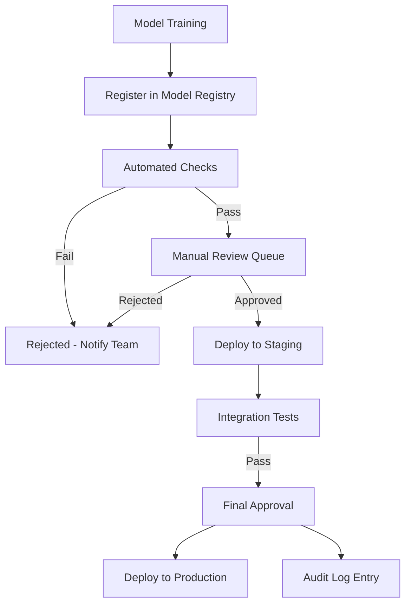

# How to Set Up Model Governance and Approval Workflows in Vertex AI Model Registry

Author: [nawazdhandala](https://www.github.com/nawazdhandala)

Tags: Vertex AI, Model Governance, Model Registry, MLOps, Google Cloud

Description: Learn how to set up model governance and approval workflows in Vertex AI Model Registry for controlled model deployment with audit trails and compliance.

---

As your ML practice grows from a few experimental models to dozens of production systems, governance becomes critical. Who approved this model for production? What data was it trained on? Has it been tested for bias? These are not just academic questions - they are compliance requirements in industries like finance, healthcare, and insurance.

Vertex AI Model Registry provides the foundation for model governance by tracking model versions, metadata, and deployment status. But out of the box, it does not enforce approval workflows. You need to build that layer yourself. In this post, I will show you how to create a model governance system with approval gates, audit trails, and automated compliance checks.

## The Governance Architecture

Here is the system we are building.



## Step 1: Define Model Registration Standards

Every model registered in the Model Registry should include standardized metadata. Create a registration function that enforces this.

```python
# governance/register_model.py
from google.cloud import aiplatform
from datetime import datetime
import json

# Required metadata fields for governance
REQUIRED_METADATA = [
    "training_dataset_uri",
    "training_dataset_version",
    "framework",
    "framework_version",
    "training_pipeline_id",
    "evaluation_metrics",
    "feature_list",
    "owner",
    "team",
    "purpose",
]

def register_model_with_governance(
    model_artifact_uri,
    display_name,
    metadata,
    labels=None,
):
    """Register a model with mandatory governance metadata.
    Rejects registration if required fields are missing."""

    # Validate that all required metadata is present
    missing_fields = [f for f in REQUIRED_METADATA if f not in metadata]
    if missing_fields:
        raise ValueError(
            f"Cannot register model. Missing required metadata fields: {missing_fields}"
        )

    aiplatform.init(project="my-project", location="us-central1")

    # Add governance-specific metadata
    governance_metadata = {
        **metadata,
        "registration_timestamp": datetime.utcnow().isoformat(),
        "governance_status": "pending_review",
        "approved_by": None,
        "approval_timestamp": None,
        "compliance_checks_passed": False,
    }

    # Register the model
    model = aiplatform.Model.upload(
        display_name=display_name,
        artifact_uri=model_artifact_uri,
        serving_container_image_uri="us-docker.pkg.dev/vertex-ai/prediction/sklearn-cpu.1-2:latest",
        labels={
            "governance_status": "pending",
            "team": metadata["team"],
            **(labels or {}),
        },
        description=json.dumps(governance_metadata),
    )

    print(f"Model registered: {model.resource_name}")
    print(f"Status: pending_review")

    # Trigger automated compliance checks
    trigger_compliance_checks(model.resource_name, governance_metadata)

    return model.resource_name
```

## Step 2: Implement Automated Compliance Checks

Before a model reaches a human reviewer, run automated checks for common issues.

```python
# governance/compliance_checks.py
from google.cloud import aiplatform
from google.cloud import bigquery
import json

class ModelComplianceChecker:
    """Runs automated compliance checks on registered models."""

    def __init__(self, project_id):
        self.project_id = project_id
        aiplatform.init(project=project_id, location="us-central1")

    def run_all_checks(self, model_resource_name, metadata):
        """Run all compliance checks and return results."""
        results = {
            "performance_check": self.check_performance_thresholds(metadata),
            "data_recency_check": self.check_data_recency(metadata),
            "bias_check": self.check_bias_metrics(metadata),
            "documentation_check": self.check_documentation(metadata),
            "security_check": self.check_security_requirements(metadata),
        }

        all_passed = all(r["passed"] for r in results.values())

        # Log results
        print(f"Compliance check results for {model_resource_name}:")
        for check_name, result in results.items():
            status = "PASS" if result["passed"] else "FAIL"
            print(f"  {check_name}: {status} - {result['message']}")

        # Update model labels based on results
        model = aiplatform.Model(model_resource_name)
        new_status = "pending_review" if all_passed else "compliance_failed"
        model.update(
            labels={"governance_status": new_status}
        )

        return {"all_passed": all_passed, "checks": results}

    def check_performance_thresholds(self, metadata):
        """Verify model meets minimum performance requirements."""
        metrics = metadata.get("evaluation_metrics", {})

        if isinstance(metrics, str):
            metrics = json.loads(metrics)

        # Define minimum thresholds per metric
        thresholds = {
            "accuracy": 0.80,
            "f1_score": 0.75,
            "auc_roc": 0.80,
        }

        failures = []
        for metric_name, threshold in thresholds.items():
            value = metrics.get(metric_name)
            if value is not None and value < threshold:
                failures.append(
                    f"{metric_name}: {value:.4f} < {threshold}"
                )

        if failures:
            return {
                "passed": False,
                "message": f"Below threshold: {'; '.join(failures)}"
            }
        return {"passed": True, "message": "All metrics meet thresholds"}

    def check_data_recency(self, metadata):
        """Verify training data is recent enough."""
        from datetime import datetime, timedelta

        dataset_version = metadata.get("training_dataset_version", "")
        # Parse the date from the dataset version
        try:
            dataset_date = datetime.fromisoformat(dataset_version)
            max_age_days = 90
            age = (datetime.utcnow() - dataset_date).days

            if age > max_age_days:
                return {
                    "passed": False,
                    "message": f"Training data is {age} days old (max: {max_age_days})"
                }
            return {"passed": True, "message": f"Training data is {age} days old"}
        except (ValueError, TypeError):
            return {
                "passed": False,
                "message": "Cannot determine training data date"
            }

    def check_bias_metrics(self, metadata):
        """Check for bias in model predictions across protected groups."""
        bias_metrics = metadata.get("bias_metrics", {})

        if not bias_metrics:
            return {
                "passed": False,
                "message": "No bias metrics provided. Bias evaluation is required."
            }

        # Check demographic parity
        max_disparity = 0.1  # 10% maximum allowed disparity
        for group, disparity in bias_metrics.items():
            if abs(disparity) > max_disparity:
                return {
                    "passed": False,
                    "message": f"Bias disparity for {group}: {disparity:.4f} exceeds threshold"
                }

        return {"passed": True, "message": "Bias metrics within acceptable range"}

    def check_documentation(self, metadata):
        """Verify that model documentation is complete."""
        required_docs = ["purpose", "feature_list", "owner", "team"]
        missing = [d for d in required_docs if not metadata.get(d)]

        if missing:
            return {
                "passed": False,
                "message": f"Missing documentation: {missing}"
            }
        return {"passed": True, "message": "Documentation is complete"}

    def check_security_requirements(self, metadata):
        """Verify security requirements are met."""
        checks = []

        # Verify training data source is approved
        approved_sources = ["bigquery", "cloud_storage", "vertex_datasets"]
        data_source = metadata.get("training_dataset_uri", "")
        source_approved = any(s in data_source.lower() for s in approved_sources)

        if not source_approved:
            checks.append("Training data source is not from an approved location")

        if checks:
            return {"passed": False, "message": "; ".join(checks)}
        return {"passed": True, "message": "Security requirements met"}
```

## Step 3: Build the Approval Workflow

Create an approval system that tracks who approved a model and when.

```python
# governance/approval_workflow.py
from google.cloud import aiplatform
from google.cloud import firestore
from datetime import datetime
import json

class ModelApprovalWorkflow:
    """Manages the approval workflow for model deployments."""

    def __init__(self, project_id):
        self.project_id = project_id
        self.db = firestore.Client(project=project_id)
        aiplatform.init(project=project_id, location="us-central1")

    def submit_for_review(self, model_resource_name, submitted_by, notes=""):
        """Submit a model for review after passing compliance checks."""
        review_doc = {
            "model_resource_name": model_resource_name,
            "submitted_by": submitted_by,
            "submitted_at": datetime.utcnow().isoformat(),
            "status": "pending_review",
            "notes": notes,
            "reviewers": [],
            "approvals": [],
            "rejections": [],
        }

        # Store the review request in Firestore
        doc_ref = self.db.collection("model_reviews").document()
        doc_ref.set(review_doc)

        print(f"Model submitted for review. Review ID: {doc_ref.id}")
        return doc_ref.id

    def approve_model(self, review_id, approver_email, comments=""):
        """Record an approval for a model."""
        doc_ref = self.db.collection("model_reviews").document(review_id)
        review = doc_ref.get().to_dict()

        if review["status"] != "pending_review":
            raise ValueError(f"Cannot approve. Current status: {review['status']}")

        approval = {
            "approver": approver_email,
            "timestamp": datetime.utcnow().isoformat(),
            "comments": comments,
        }

        review["approvals"].append(approval)

        # Check if we have enough approvals (require 2 approvers)
        required_approvals = 2
        if len(review["approvals"]) >= required_approvals:
            review["status"] = "approved"
            review["approved_at"] = datetime.utcnow().isoformat()

            # Update the model labels in the registry
            model = aiplatform.Model(review["model_resource_name"])
            model.update(labels={"governance_status": "approved"})

            print(f"Model approved with {len(review['approvals'])} approvals")
        else:
            remaining = required_approvals - len(review["approvals"])
            print(f"Approval recorded. {remaining} more approval(s) needed")

        doc_ref.set(review)
        return review["status"]

    def reject_model(self, review_id, rejector_email, reason):
        """Record a rejection for a model."""
        doc_ref = self.db.collection("model_reviews").document(review_id)
        review = doc_ref.get().to_dict()

        rejection = {
            "rejector": rejector_email,
            "timestamp": datetime.utcnow().isoformat(),
            "reason": reason,
        }

        review["rejections"].append(rejection)
        review["status"] = "rejected"

        # Update model labels
        model = aiplatform.Model(review["model_resource_name"])
        model.update(labels={"governance_status": "rejected"})

        doc_ref.set(review)
        print(f"Model rejected by {rejector_email}")
        return "rejected"

    def get_pending_reviews(self):
        """List all models waiting for review."""
        reviews = self.db.collection("model_reviews").where(
            "status", "==", "pending_review"
        ).get()

        pending = []
        for doc in reviews:
            review = doc.to_dict()
            review["review_id"] = doc.id
            pending.append(review)

        return pending
```

## Step 4: Create the Audit Trail

Every governance action should be recorded in an immutable audit log.

```python
# governance/audit_log.py
from google.cloud import bigquery
from datetime import datetime
import json

class GovernanceAuditLog:
    """Maintains an immutable audit trail for model governance actions."""

    def __init__(self, project_id, dataset_id="ml_governance"):
        self.client = bigquery.Client(project=project_id)
        self.table_id = f"{project_id}.{dataset_id}.audit_log"

    def log_event(self, event_type, model_resource, actor, details=None):
        """Record a governance event in the audit log."""
        row = {
            "event_id": str(hash(f"{model_resource}{event_type}{datetime.utcnow()}")),
            "event_type": event_type,
            "model_resource": model_resource,
            "actor": actor,
            "timestamp": datetime.utcnow().isoformat(),
            "details": json.dumps(details or {}),
        }

        errors = self.client.insert_rows_json(self.table_id, [row])
        if errors:
            print(f"Error writing audit log: {errors}")
        else:
            print(f"Audit log: {event_type} by {actor}")

    def get_model_history(self, model_resource):
        """Get the complete governance history for a model."""
        query = f"""
        SELECT *
        FROM `{self.table_id}`
        WHERE model_resource = @model_resource
        ORDER BY timestamp ASC
        """

        job_config = bigquery.QueryJobConfig(
            query_parameters=[
                bigquery.ScalarQueryParameter(
                    "model_resource", "STRING", model_resource
                )
            ]
        )

        results = self.client.query(query, job_config=job_config)
        return [dict(row) for row in results]
```

## Step 5: Integrate Governance into Your Deployment Pipeline

Wire the governance checks into your CI/CD pipeline so models cannot be deployed without approval.

```python
# governance/deployment_gate.py
from google.cloud import aiplatform

def check_deployment_allowed(model_resource_name):
    """Check if a model has been approved for deployment.
    This function should be called before any deployment action."""
    aiplatform.init(project="my-project", location="us-central1")

    model = aiplatform.Model(model_resource_name)

    # Check the governance status label
    status = model.labels.get("governance_status", "unknown")

    if status != "approved":
        raise PermissionError(
            f"Model deployment blocked. Governance status: {status}. "
            f"Model must be approved before deployment."
        )

    print(f"Model {model.display_name} is approved for deployment")
    return True
```

## Wrapping Up

Model governance is not about slowing teams down - it is about building trust in your ML systems. By combining Vertex AI Model Registry with automated compliance checks, approval workflows, and audit trails, you create a system where models are deployed with confidence. Start with the basics - required metadata and automated performance checks - and add more governance controls as your organization's ML maturity grows. The audit trail is particularly important for regulated industries where you need to prove that every production model was reviewed and approved.
