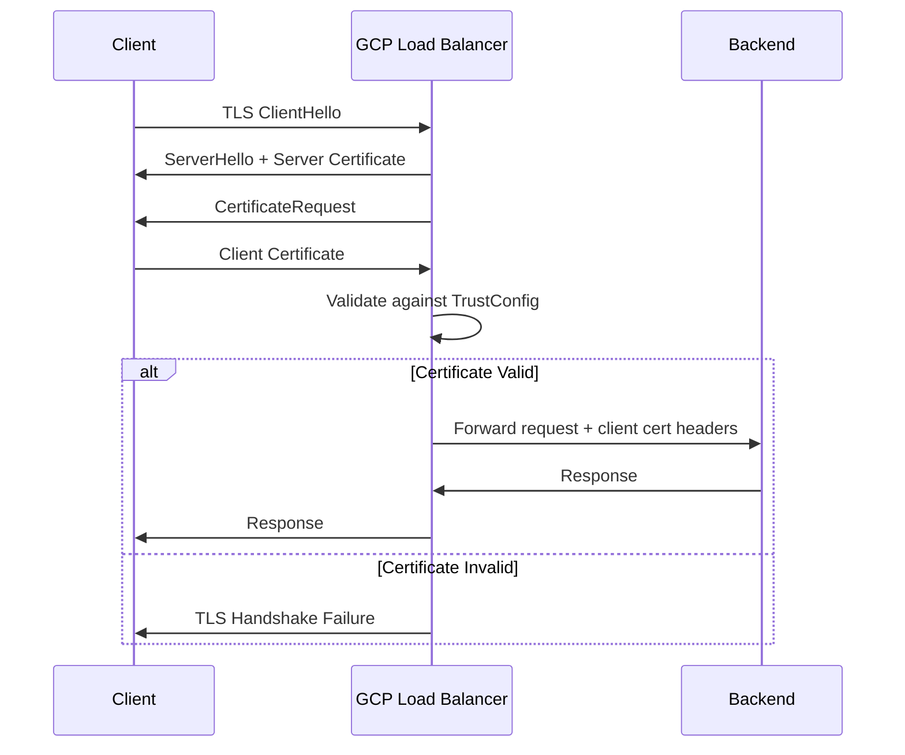

# How to Set Up mTLS on a GCP External Application Load Balancer

Author: [nawazdhandala](https://www.github.com/nawazdhandala)

Tags: GCP, mTLS, Load Balancer, Security, Certificates

Description: A detailed guide to configuring mutual TLS (mTLS) on a GCP external application load balancer for client certificate authentication and zero-trust security.

---

Standard TLS is one-directional - the client verifies the server's identity, but the server does not verify the client. Mutual TLS (mTLS) adds the other direction: the server also verifies the client's identity through a client certificate. This is a cornerstone of zero-trust security architectures and is commonly used for API-to-API communication, B2B integrations, IoT device authentication, and anywhere you need strong client identity verification beyond just passwords or API keys.

This post shows how to configure mTLS on a GCP global external application load balancer.

## How mTLS Works on GCP Load Balancers

When mTLS is enabled on a GCP load balancer:

1. The client initiates a TLS connection
2. The load balancer presents its server certificate (normal TLS)
3. The load balancer requests a client certificate
4. The client presents its certificate
5. The load balancer validates the client certificate against a trust store (TrustConfig)
6. If validation passes, the request is forwarded to the backend with client certificate information in headers
7. If validation fails, the request is rejected (or allowed with an error flag, depending on configuration)



## Prerequisites

- A global external application load balancer (`EXTERNAL_MANAGED` scheme) already running
- A Certificate Authority (CA) for issuing client certificates
- Client certificates signed by that CA
- The `gcloud` CLI and the Certificate Manager API enabled

## Step 1: Create a Trust Config

The TrustConfig tells the load balancer which Certificate Authorities to trust when validating client certificates. You need the CA certificate in PEM format.

First, create a YAML file describing the trust config:

```bash
# Create the trust config YAML file
cat > trust-config.yaml << 'EOF'
name: my-trust-config
trustStores:
- trustAnchors:
  - pemCertificate: |
      -----BEGIN CERTIFICATE-----
      YOUR_CA_CERTIFICATE_CONTENT_HERE
      -----END CERTIFICATE-----
  intermediateCas:
  - pemCertificate: |
      -----BEGIN CERTIFICATE-----
      YOUR_INTERMEDIATE_CA_CERT_HERE_IF_ANY
      -----END CERTIFICATE-----
EOF
```

Create the TrustConfig resource:

```bash
# Create the trust config in Certificate Manager
gcloud certificate-manager trust-configs create my-trust-config \
    --source=trust-config.yaml \
    --location=global
```

## Step 2: Create a Server TLS Policy

The ServerTlsPolicy defines how the load balancer handles mTLS. You can configure it to require client certificates or to make them optional.

For strict mTLS (reject connections without valid client certificates):

```bash
# Create the server TLS policy YAML for strict mTLS
cat > server-tls-policy.yaml << 'EOF'
name: my-mtls-policy
mtlsPolicy:
  clientValidationMode: REJECT_INVALID
  clientValidationTrustConfig: projects/MY_PROJECT/locations/global/trustConfigs/my-trust-config
EOF

# Create the server TLS policy
gcloud network-security server-tls-policies create my-mtls-policy \
    --source=server-tls-policy.yaml \
    --location=global
```

For permissive mTLS (accept connections with or without certificates, but validate if present):

```bash
# Create the server TLS policy YAML for permissive mTLS
cat > server-tls-policy-permissive.yaml << 'EOF'
name: my-mtls-policy-permissive
mtlsPolicy:
  clientValidationMode: ALLOW_INVALID_OR_MISSING_CLIENT_CERT
  clientValidationTrustConfig: projects/MY_PROJECT/locations/global/trustConfigs/my-trust-config
EOF

gcloud network-security server-tls-policies create my-mtls-policy-permissive \
    --source=server-tls-policy-permissive.yaml \
    --location=global
```

## Step 3: Attach the Policy to the Target HTTPS Proxy

Update your existing target HTTPS proxy to use the mTLS policy:

```bash
# Update the target HTTPS proxy with the mTLS policy
gcloud compute target-https-proxies update my-https-proxy \
    --server-tls-policy=my-mtls-policy \
    --global
```

## Step 4: Generate Client Certificates

If you do not already have a CA and client certificates, here is how to create them with OpenSSL:

```bash
# Generate a CA private key
openssl genrsa -out ca-key.pem 4096

# Create the CA certificate (valid for 10 years)
openssl req -new -x509 -key ca-key.pem -out ca-cert.pem -days 3650 \
    -subj "/CN=My Internal CA/O=My Company"

# Generate a client private key
openssl genrsa -out client-key.pem 2048

# Create a certificate signing request (CSR) for the client
openssl req -new -key client-key.pem -out client.csr \
    -subj "/CN=api-client-1/O=My Company"

# Sign the client certificate with the CA
openssl x509 -req -in client.csr -CA ca-cert.pem -CAkey ca-key.pem \
    -CAcreateserial -out client-cert.pem -days 365
```

Use the `ca-cert.pem` content in your TrustConfig, and distribute `client-cert.pem` and `client-key.pem` to clients.

## Step 5: Test mTLS

Test with curl using the client certificate:

```bash
# Test with a valid client certificate
curl --cert client-cert.pem --key client-key.pem \
    https://app.example.com/api/data

# Test without a client certificate (should fail with strict mTLS)
curl https://app.example.com/api/data
# Expected: SSL handshake failure or 403
```

## Reading Client Certificate Information in Your Backend

The load balancer passes client certificate details to your backend through custom headers. You can access these headers to identify the client:

```bash
# Configure the load balancer to forward client cert info
gcloud compute backend-services update my-backend \
    --global \
    --custom-request-headers="X-Client-Cert-Present:{client_cert_present}" \
    --custom-request-headers="X-Client-Cert-Chain-Verified:{client_cert_chain_verified}" \
    --custom-request-headers="X-Client-Cert-Error:{client_cert_error}" \
    --custom-request-headers="X-Client-Cert-Hash:{client_cert_sha256_fingerprint}" \
    --custom-request-headers="X-Client-Cert-Serial:{client_cert_serial_number}" \
    --custom-request-headers="X-Client-Cert-SPIFFE:{client_cert_spiffe_id}" \
    --custom-request-headers="X-Client-Cert-Subject-DN:{client_cert_subject_dn}" \
    --custom-request-headers="X-Client-Cert-Issuer-DN:{client_cert_issuer_dn}"
```

Then in your backend application:

```python
# Python Flask example reading client cert headers
from flask import Flask, request, jsonify

app = Flask(__name__)

@app.route('/api/data')
def get_data():
    # Read client certificate information from load balancer headers
    cert_present = request.headers.get('X-Client-Cert-Present', 'false')
    cert_verified = request.headers.get('X-Client-Cert-Chain-Verified', 'false')
    cert_subject = request.headers.get('X-Client-Cert-Subject-DN', '')
    cert_hash = request.headers.get('X-Client-Cert-Hash', '')

    if cert_present != 'true' or cert_verified != 'true':
        return jsonify({"error": "Valid client certificate required"}), 403

    # Use the certificate subject for authorization decisions
    return jsonify({
        "message": "Authenticated",
        "client": cert_subject,
        "fingerprint": cert_hash
    })
```

## Using Google-Managed CAS (Certificate Authority Service)

Instead of managing your own CA with OpenSSL, you can use Google's Certificate Authority Service:

```bash
# Create a CA pool
gcloud privateca pools create my-ca-pool \
    --location=us-central1 \
    --tier=devops

# Create a root CA
gcloud privateca roots create my-root-ca \
    --pool=my-ca-pool \
    --location=us-central1 \
    --subject="CN=My Root CA, O=My Company" \
    --key-algorithm=ec-p256-sha256

# Issue a client certificate
gcloud privateca certificates create client-cert-1 \
    --pool=my-ca-pool \
    --location=us-central1 \
    --ca=my-root-ca \
    --subject="CN=api-client-1, O=My Company" \
    --validity=P365D \
    --cert-output-file=client-cert.pem \
    --key-output-file=client-key.pem
```

Then use the CA certificate from CAS in your TrustConfig.

## Certificate Revocation

If a client certificate is compromised, you need to revoke it. GCP's mTLS supports certificate revocation through CRLs (Certificate Revocation Lists):

```bash
# Add a CRL to the trust config
cat > trust-config-with-crl.yaml << 'EOF'
name: my-trust-config-with-crl
trustStores:
- trustAnchors:
  - pemCertificate: |
      -----BEGIN CERTIFICATE-----
      CA_CERT_CONTENT
      -----END CERTIFICATE-----
allowlistedCertificates: []
EOF
```

For real-time revocation, consider using short-lived certificates (valid for hours or days) instead of long-lived ones with CRLs.

## Troubleshooting

**TLS handshake failures**: Check that the CA certificate in TrustConfig matches the CA that signed the client certificates. Even a minor mismatch will cause validation to fail.

**Client receives "certificate required" error**: The client needs to be configured to send its certificate. In curl, use `--cert` and `--key`. In programming languages, configure the TLS client with the certificate and key.

**Backend not receiving cert headers**: Custom request headers must be explicitly configured on the backend service. The load balancer does not forward cert info by default.

## Wrapping Up

mTLS on GCP load balancers provides strong client authentication at the edge, before traffic even reaches your application. The setup involves creating a TrustConfig with your CA certificates, a ServerTlsPolicy defining the validation behavior, and attaching the policy to your load balancer. Combined with custom request headers, your backend can make authorization decisions based on client certificate attributes without handling the TLS complexity itself.
