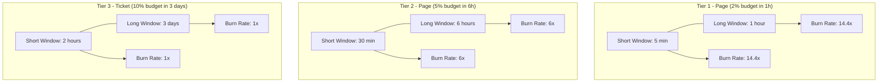
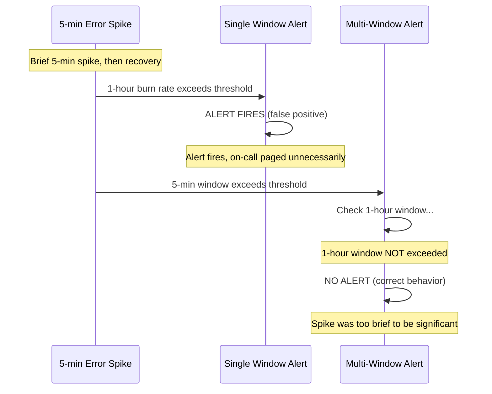

# How to Set Up Multi-Window Multi-Burn-Rate Alerting for SLOs on Google Cloud

Author: [nawazdhandala](https://www.github.com/nawazdhandala)

Tags: GCP, SLO, Multi-Burn-Rate, Alerting, SRE, Cloud Monitoring, Google Cloud

Description: Step-by-step guide to implementing multi-window multi-burn-rate alerting for SLOs on Google Cloud for precise and low-noise incident detection.

---

Single-window burn rate alerts have a problem: they either detect fast but generate false positives, or they are precise but slow to detect. The multi-window multi-burn-rate (MWMBR) approach, described in Google's SRE Workbook, solves this by combining a fast-burning short window with a slower-burning long window. Both must be true simultaneously for the alert to fire. This dramatically reduces noise while maintaining fast detection. In this post, I will implement MWMBR alerting on Google Cloud Monitoring step by step.

## Why Multi-Window?

With a single 1-hour window and a 14.4x burn rate threshold, a sharp 5-minute spike that resolves itself can still trigger an alert. The spike was severe enough to push the 1-hour burn rate above the threshold, but the incident is already over by the time someone responds.

By requiring a longer window to also exceed a threshold, you ensure the problem is sustained. If the 1-hour burn rate is above 14.4x AND the 6-hour burn rate is also elevated, you know this is not just a momentary blip.

## The MWMBR Framework

The SRE Workbook recommends four alert tiers, each with two windows.



## Step 1: Set Up the SLO

Start with a solid SLO definition.

```bash
# Create the SLO that will be the basis for burn rate alerts
gcloud monitoring slos create \
    --service=my-api-service \
    --slo-id=availability-slo \
    --display-name="API Availability - 99.9%" \
    --request-based-sli \
    --good-total-ratio-threshold \
    --good-service-filter='metric.type="loadbalancing.googleapis.com/https/request_count" AND metric.labels.response_code_class="200"' \
    --total-service-filter='metric.type="loadbalancing.googleapis.com/https/request_count"' \
    --goal=0.999 \
    --rolling-period=30d \
    --project=my-gcp-project
```

## Step 2: Create Tier 1 - Critical Page Alert

This tier catches severe incidents that would consume 2% of your monthly error budget in just 1 hour. It requires both the short window (5 minutes) and the long window (1 hour) to show a burn rate above 14.4x.

```bash
# Tier 1: Critical - both 5-min and 1-hour windows must exceed 14.4x burn rate
cat > tier1-alert.json << 'ALERT'
{
  "displayName": "[SLO] Tier 1 - Critical: Fast Burn on Availability SLO",
  "conditions": [
    {
      "displayName": "Short window burn rate (5 min) > 14.4x",
      "conditionThreshold": {
        "filter": "select_slo_burn_rate(\"projects/my-gcp-project/services/my-api-service/serviceLevelObjectives/availability-slo\", \"300s\")",
        "comparison": "COMPARISON_GT",
        "thresholdValue": 14.4,
        "duration": "0s",
        "trigger": { "count": 1 }
      }
    },
    {
      "displayName": "Long window burn rate (1 hour) > 14.4x",
      "conditionThreshold": {
        "filter": "select_slo_burn_rate(\"projects/my-gcp-project/services/my-api-service/serviceLevelObjectives/availability-slo\", \"3600s\")",
        "comparison": "COMPARISON_GT",
        "thresholdValue": 14.4,
        "duration": "0s",
        "trigger": { "count": 1 }
      }
    }
  ],
  "combiner": "AND",
  "notificationChannels": [
    "projects/my-gcp-project/notificationChannels/PAGERDUTY_CHANNEL"
  ],
  "documentation": {
    "content": "## Critical SLO Burn Rate Alert\n\nThe error budget is being consumed at 14.4x the sustainable rate over both short and long windows. At this rate, the entire monthly error budget will be exhausted in approximately 2 days.\n\n### Immediate Actions\n1. Check the service dashboard for error spikes\n2. Review recent deployments\n3. Check dependent service health",
    "mimeType": "text/markdown"
  },
  "alertStrategy": {
    "autoClose": "1800s"
  }
}
ALERT

gcloud monitoring policies create --policy-from-file=tier1-alert.json
```

The crucial detail here is `"combiner": "AND"`. Both conditions must be true for the alert to fire.

## Step 3: Create Tier 2 - High Severity Alert

This catches incidents that would consume 5% of the budget in 6 hours. Significant but not catastrophic.

```bash
# Tier 2: High severity - both 30-min and 6-hour windows must exceed 6x burn rate
cat > tier2-alert.json << 'ALERT'
{
  "displayName": "[SLO] Tier 2 - High: Elevated Burn on Availability SLO",
  "conditions": [
    {
      "displayName": "Short window burn rate (30 min) > 6x",
      "conditionThreshold": {
        "filter": "select_slo_burn_rate(\"projects/my-gcp-project/services/my-api-service/serviceLevelObjectives/availability-slo\", \"1800s\")",
        "comparison": "COMPARISON_GT",
        "thresholdValue": 6,
        "duration": "0s",
        "trigger": { "count": 1 }
      }
    },
    {
      "displayName": "Long window burn rate (6 hours) > 6x",
      "conditionThreshold": {
        "filter": "select_slo_burn_rate(\"projects/my-gcp-project/services/my-api-service/serviceLevelObjectives/availability-slo\", \"21600s\")",
        "comparison": "COMPARISON_GT",
        "thresholdValue": 6,
        "duration": "0s",
        "trigger": { "count": 1 }
      }
    }
  ],
  "combiner": "AND",
  "notificationChannels": [
    "projects/my-gcp-project/notificationChannels/PAGERDUTY_CHANNEL"
  ],
  "documentation": {
    "content": "## High Severity SLO Burn Rate Alert\n\nElevated error budget consumption detected over both 30-minute and 6-hour windows. At this rate, the monthly budget would be exhausted in approximately 5 days.\n\n### Actions\n1. Investigate error patterns in Cloud Logging\n2. Check for degraded dependencies\n3. Consider rolling back recent changes"
  },
  "alertStrategy": {
    "autoClose": "3600s"
  }
}
ALERT

gcloud monitoring policies create --policy-from-file=tier2-alert.json
```

## Step 4: Create Tier 3 - Low Severity Ticket

This catches slow, sustained degradation that would not trigger the faster alerts but would still exhaust the budget if left unchecked.

```bash
# Tier 3: Low severity - 2-hour and 3-day windows exceeding 1x burn rate
cat > tier3-alert.json << 'ALERT'
{
  "displayName": "[SLO] Tier 3 - Low: Sustained Burn on Availability SLO",
  "conditions": [
    {
      "displayName": "Short window burn rate (2 hours) > 1x",
      "conditionThreshold": {
        "filter": "select_slo_burn_rate(\"projects/my-gcp-project/services/my-api-service/serviceLevelObjectives/availability-slo\", \"7200s\")",
        "comparison": "COMPARISON_GT",
        "thresholdValue": 1,
        "duration": "0s",
        "trigger": { "count": 1 }
      }
    },
    {
      "displayName": "Long window burn rate (3 days) > 1x",
      "conditionThreshold": {
        "filter": "select_slo_burn_rate(\"projects/my-gcp-project/services/my-api-service/serviceLevelObjectives/availability-slo\", \"259200s\")",
        "comparison": "COMPARISON_GT",
        "thresholdValue": 1,
        "duration": "0s",
        "trigger": { "count": 1 }
      }
    }
  ],
  "combiner": "AND",
  "notificationChannels": [
    "projects/my-gcp-project/notificationChannels/TICKET_CHANNEL"
  ],
  "documentation": {
    "content": "## Low Severity SLO Burn Alert\n\nSustained elevated error budget consumption detected. The current burn rate exceeds the sustainable level over both short and long windows.\n\n### Actions\n1. Review error trends for the past few days\n2. Investigate any correlations with recent changes\n3. Plan remediation within the next business day"
  },
  "alertStrategy": {
    "autoClose": "86400s"
  }
}
ALERT

gcloud monitoring policies create --policy-from-file=tier3-alert.json
```

## Step 5: Implement with Terraform

For a complete Terraform implementation, here is how to manage all three tiers.

```hcl
locals {
  slo_id = google_monitoring_slo.availability.id

  # Define alert tiers with their window sizes and burn rate thresholds
  alert_tiers = {
    tier1_critical = {
      display_name    = "[SLO] Tier 1 - Critical: Fast Burn"
      short_window    = "300s"    # 5 minutes
      long_window     = "3600s"   # 1 hour
      burn_rate       = 14.4
      channels        = [var.pager_channel]
      auto_close      = "1800s"
    }
    tier2_high = {
      display_name    = "[SLO] Tier 2 - High: Elevated Burn"
      short_window    = "1800s"   # 30 minutes
      long_window     = "21600s"  # 6 hours
      burn_rate       = 6
      channels        = [var.pager_channel]
      auto_close      = "3600s"
    }
    tier3_low = {
      display_name    = "[SLO] Tier 3 - Low: Sustained Burn"
      short_window    = "7200s"   # 2 hours
      long_window     = "259200s" # 3 days
      burn_rate       = 1
      channels        = [var.ticket_channel]
      auto_close      = "86400s"
    }
  }
}

# Create alert policies for each tier
resource "google_monitoring_alert_policy" "slo_burn_rate" {
  for_each = local.alert_tiers

  display_name = each.value.display_name
  project      = var.project_id
  combiner     = "AND"

  conditions {
    display_name = "Short window burn rate"
    condition_threshold {
      filter          = "select_slo_burn_rate(\"${local.slo_id}\", \"${each.value.short_window}\")"
      comparison      = "COMPARISON_GT"
      threshold_value = each.value.burn_rate
      duration        = "0s"
      trigger { count = 1 }
    }
  }

  conditions {
    display_name = "Long window burn rate"
    condition_threshold {
      filter          = "select_slo_burn_rate(\"${local.slo_id}\", \"${each.value.long_window}\")"
      comparison      = "COMPARISON_GT"
      threshold_value = each.value.burn_rate
      duration        = "0s"
      trigger { count = 1 }
    }
  }

  notification_channels = each.value.channels

  alert_strategy {
    auto_close = each.value.auto_close
  }
}
```

## How Multi-Window Reduces False Positives

Here is a visual comparison.



## Tuning Tips

After running MWMBR alerts for a while, you will likely need to tune them. If you get too many false positives on Tier 1, increase the short window from 5 minutes to 10 minutes. If Tier 3 is too noisy, increase its burn rate threshold from 1x to 1.5x.

Keep track of alert firings and their outcomes. An alert that fires but does not result in any action is noise that erodes trust in your alerting system. Every alert should either lead to immediate action (Tier 1 and 2) or a tracked ticket (Tier 3).

## Wrapping Up

Multi-window multi-burn-rate alerting is the gold standard for SLO-based incident detection. By requiring both a short window and a long window to exceed the burn rate threshold, you get alerts that are both responsive to real incidents and resilient against false positives from transient spikes. The three-tier approach maps naturally to incident response processes - Tier 1 pages immediately, Tier 2 pages with less urgency, and Tier 3 creates a ticket. On Google Cloud Monitoring, the `select_slo_burn_rate` function with `AND` combiner makes this straightforward to implement, and Terraform makes it reproducible across environments.
