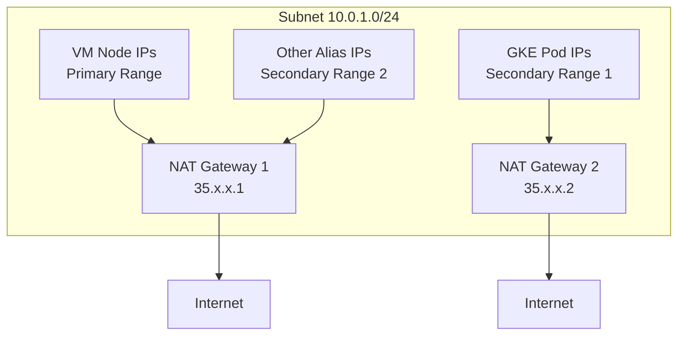

# How to Set Up Multiple Cloud NAT Gateways on the Same VPC Subnet in GCP

Author: [nawazdhandala](https://www.github.com/nawazdhandala)

Tags: GCP, Cloud NAT, VPC, Networking, Multi-Gateway

Description: Learn how to configure multiple Cloud NAT gateways on the same VPC subnet to separate traffic flows, increase port capacity, and isolate workload groups.

---

Most Cloud NAT setups use a single gateway per region. But there are valid reasons to run multiple NAT gateways on the same VPC subnet - separating traffic for different workload types, increasing your total port capacity, or providing different external IP addresses for different applications. GCP supports this configuration, though the rules for how traffic gets routed between gateways have some nuances worth understanding.

## Why Use Multiple NAT Gateways?

Here are the common reasons teams deploy multiple NAT gateways on the same subnet:

**Traffic isolation:** You want API-calling workloads to use different NAT IPs than your general-purpose VMs. Third parties see consistent IPs for API traffic.

**Port capacity:** A single NAT gateway with a fixed number of IPs has a limited total port pool. Adding a second gateway with its own IPs doubles the available ports.

**Different configurations:** Some workloads need aggressive timeouts while others need long-lived connections. Separate gateways let you apply different timeout settings.

**Compliance:** Some regulatory requirements mandate that certain traffic flows use dedicated, auditable IP addresses.

## How Multiple Gateways Work on the Same Subnet

The key rule is: you cannot have two NAT gateways serving the exact same IP ranges on the same subnet. Each gateway must serve different IP ranges within the subnet. GCP handles this through subnet IP range configuration.

A subnet in GCP has:
- A primary IP range (used for VM interfaces)
- Zero or more secondary IP ranges (used for alias IPs, GKE pods, etc.)

You can assign different NAT gateways to different IP ranges within the same subnet.



## Step 1: Understand Your Subnet's IP Ranges

First, check what IP ranges your subnet has:

```bash
# Describe the subnet to see all IP ranges
gcloud compute networks subnets describe your-subnet \
  --region=us-central1 \
  --format="yaml(ipCidrRange, secondaryIpRanges)" \
  --project=your-project-id
```

This shows you the primary range and any secondary ranges. You need at least two distinct ranges to assign to different gateways.

## Step 2: Create Two Cloud Routers

Each NAT gateway needs its own Cloud Router. You can have multiple Cloud Routers on the same network:

```bash
# Create the first Cloud Router
gcloud compute routers create nat-router-1 \
  --network=your-vpc \
  --region=us-central1 \
  --description="Router for NAT gateway 1 - VM traffic" \
  --project=your-project-id

# Create the second Cloud Router
gcloud compute routers create nat-router-2 \
  --network=your-vpc \
  --region=us-central1 \
  --description="Router for NAT gateway 2 - Pod traffic" \
  --project=your-project-id
```

## Step 3: Reserve Static IPs for Each Gateway

Reserve separate IP pools for each gateway:

```bash
# IPs for gateway 1 (VM traffic)
gcloud compute addresses create nat-gw1-ip-1 --region=us-central1
gcloud compute addresses create nat-gw1-ip-2 --region=us-central1

# IPs for gateway 2 (Pod traffic)
gcloud compute addresses create nat-gw2-ip-1 --region=us-central1
gcloud compute addresses create nat-gw2-ip-2 --region=us-central1
```

## Step 4: Create NAT Gateway 1 for the Primary Range

Configure the first gateway to handle the subnet's primary IP range (node/VM IPs):

```bash
# Create NAT gateway 1 for primary subnet range only
gcloud compute routers nats create nat-gateway-1 \
  --router=nat-router-1 \
  --region=us-central1 \
  --nat-external-ip-pool=nat-gw1-ip-1,nat-gw1-ip-2 \
  --nat-custom-subnet-ip-ranges="your-subnet" \
  --project=your-project-id
```

When you specify just the subnet name without a secondary range suffix, it covers only the primary IP range.

## Step 5: Create NAT Gateway 2 for Secondary Ranges

Configure the second gateway to handle the secondary IP ranges (pod IPs, alias IPs):

```bash
# Create NAT gateway 2 for secondary (pod) IP ranges
gcloud compute routers nats create nat-gateway-2 \
  --router=nat-router-2 \
  --region=us-central1 \
  --nat-external-ip-pool=nat-gw2-ip-1,nat-gw2-ip-2 \
  --nat-custom-subnet-ip-ranges="your-subnet:pods-range" \
  --project=your-project-id
```

The `:pods-range` suffix tells Cloud NAT to only handle traffic from the secondary range named `pods-range`.

## Step 6: Verify the Configuration

Check both gateways:

```bash
# Verify gateway 1
gcloud compute routers nats describe nat-gateway-1 \
  --router=nat-router-1 \
  --region=us-central1 \
  --project=your-project-id \
  --format=yaml

# Verify gateway 2
gcloud compute routers nats describe nat-gateway-2 \
  --router=nat-router-2 \
  --region=us-central1 \
  --project=your-project-id \
  --format=yaml
```

## Different Configurations Per Gateway

Now that you have separate gateways, you can configure them independently:

```bash
# Gateway 1: Conservative settings for VM traffic
gcloud compute routers nats update nat-gateway-1 \
  --router=nat-router-1 \
  --region=us-central1 \
  --min-ports-per-vm=128 \
  --tcp-established-idle-timeout=1200 \
  --tcp-time-wait-timeout=120 \
  --enable-logging \
  --log-filter=ERRORS_ONLY \
  --project=your-project-id

# Gateway 2: Aggressive settings for high-throughput pod traffic
gcloud compute routers nats update nat-gateway-2 \
  --router=nat-router-2 \
  --region=us-central1 \
  --enable-dynamic-port-allocation \
  --min-ports-per-vm=256 \
  --max-ports-per-vm=8192 \
  --tcp-established-idle-timeout=300 \
  --tcp-time-wait-timeout=30 \
  --enable-logging \
  --log-filter=ALL \
  --project=your-project-id
```

## Alternative: Multiple NAT Gateways Using Different Subnets

If your workloads are on different subnets rather than different IP ranges on the same subnet, the setup is simpler:

```bash
# Gateway for subnet A
gcloud compute routers nats create nat-subnet-a \
  --router=nat-router-1 \
  --region=us-central1 \
  --auto-allocate-nat-external-ips \
  --nat-custom-subnet-ip-ranges="subnet-a" \
  --project=your-project-id

# Gateway for subnet B
gcloud compute routers nats create nat-subnet-b \
  --router=nat-router-2 \
  --region=us-central1 \
  --auto-allocate-nat-external-ips \
  --nat-custom-subnet-ip-ranges="subnet-b" \
  --project=your-project-id
```

## Monitoring Multiple Gateways

When you have multiple gateways, make sure your monitoring covers all of them:

```bash
# Check for port exhaustion across all gateways
gcloud logging read \
  'resource.type="nat_gateway" AND jsonPayload.allocation_status="DROPPED"' \
  --project=your-project-id \
  --freshness=1h \
  --format="table(timestamp, resource.labels.gateway_name, jsonPayload.connection.src_ip, jsonPayload.connection.dest_ip)"
```

Create separate alerts for each gateway so you know which one has issues:

```bash
# Create metric for gateway 1 port exhaustion
gcloud logging metrics create nat-gw1-exhaustion \
  --project=your-project-id \
  --description="Port exhaustion on NAT gateway 1" \
  --log-filter='resource.type="nat_gateway" AND resource.labels.gateway_name="nat-gateway-1" AND jsonPayload.allocation_status="DROPPED"'

# Create metric for gateway 2 port exhaustion
gcloud logging metrics create nat-gw2-exhaustion \
  --project=your-project-id \
  --description="Port exhaustion on NAT gateway 2" \
  --log-filter='resource.type="nat_gateway" AND resource.labels.gateway_name="nat-gateway-2" AND jsonPayload.allocation_status="DROPPED"'
```

## Limitations and Gotchas

A few things to watch for with multiple NAT gateways:

1. **No overlapping IP ranges:** Two gateways cannot serve the same IP range on the same subnet. GCP will reject this configuration.

2. **Router limits:** There is a limit on the number of Cloud Routers per region and NAT gateways per router. Check your quotas.

3. **Debugging complexity:** With multiple gateways, troubleshooting connectivity issues requires checking logs from all gateways. Include the gateway name in your log queries.

4. **Cost:** Each NAT gateway and its associated IPs has separate billing. More gateways means higher cost.

5. **Consistency:** If a VM has traffic from both primary and alias IP ranges, that traffic goes through different gateways and gets different external IPs. Make sure this is what you want.

## When NOT to Use Multiple Gateways

Sometimes a single gateway with more IPs is simpler and sufficient:

- If you just need more ports, adding IPs to an existing gateway is simpler than creating a new one
- If you do not need different configurations or IP isolation, a single gateway reduces operational complexity
- If your workloads are small and port exhaustion is not an issue, one gateway handles it fine

## Wrapping Up

Multiple Cloud NAT gateways on the same subnet give you flexibility to isolate traffic flows, apply different configurations, and manage separate IP pools for different workloads. The setup requires careful planning of which IP ranges each gateway serves, but once configured, it runs reliably. Use this pattern when you have a genuine need for traffic separation or independent gateway configurations, and stick with a single gateway when simplicity serves you better.
