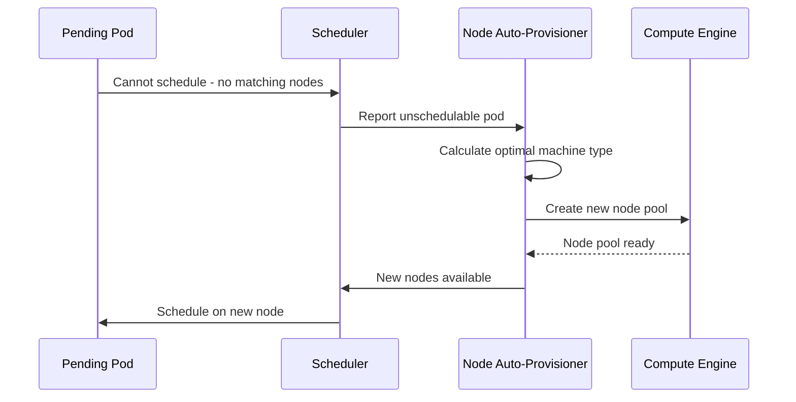

# How to Set Up Node Auto-Provisioning in GKE to Automatically Create Optimal Node Pools

Author: [nawazdhandala](https://www.github.com/nawazdhandala)

Tags: GCP, GKE, Kubernetes, Autoscaling, Node Auto-Provisioning

Description: Learn how to configure Node Auto-Provisioning in GKE so the cluster automatically creates and manages optimal node pools based on your workload requirements.

---

The standard GKE cluster autoscaler scales node pools you have already created - it adds or removes nodes within the bounds you set. But it cannot create new node pools. If you deploy a workload that needs GPU nodes and you only have CPU node pools, the pod stays pending forever.

Node Auto-Provisioning (NAP) takes autoscaling a step further. It automatically creates new node pools with the right machine types, GPU configurations, and other properties to match pending pod requirements. When those workloads go away, NAP scales the node pool down to zero and eventually deletes it.

This is particularly useful for clusters that run diverse workloads - some need high-memory machines, some need GPUs, some are fine on small instances. Instead of pre-creating node pools for every possible configuration, you let NAP figure it out.

## How NAP Works

When a pod cannot be scheduled because no existing node pool has the right resources, NAP kicks in:

1. It looks at the pending pod's resource requests, node selectors, tolerations, and affinity rules
2. It determines the optimal machine type and configuration
3. It creates a new node pool with that configuration
4. The pod gets scheduled on the new node



## Enabling NAP

Enable NAP on your GKE cluster with resource limits that cap how much compute NAP can provision.

```bash
# Enable Node Auto-Provisioning with resource limits
gcloud container clusters update my-cluster \
  --region us-central1 \
  --enable-autoprovisioning \
  --min-cpu 1 \
  --max-cpu 100 \
  --min-memory 1 \
  --max-memory 400 \
  --autoprovisioning-scopes https://www.googleapis.com/auth/cloud-platform
```

The `min-cpu/max-cpu` and `min-memory/max-memory` set the total resource limits across all auto-provisioned node pools. These are guardrails to prevent runaway scaling.

## Configuring NAP with a YAML File

For more detailed configuration, use a YAML config file.

```yaml
# nap-config.yaml - Detailed NAP configuration
autoprovisioning:
  enabled: true
  resourceLimits:
    - resourceType: cpu
      minimum: 1
      maximum: 100
    - resourceType: memory
      minimum: 1
      maximum: 400
    # Enable GPU auto-provisioning
    - resourceType: nvidia-tesla-t4
      minimum: 0
      maximum: 8
  autoprovisioningNodePoolDefaults:
    # Set the default machine family for auto-provisioned pools
    # NAP picks the best size within this family
    imageType: COS_CONTAINERD
    # Configure boot disk
    bootDiskKmsKey: ""
    diskSizeGb: 100
    diskType: pd-standard
    # Set default service account for auto-provisioned nodes
    serviceAccount: node-sa@YOUR_PROJECT_ID.iam.gserviceaccount.com
    # Enable Workload Identity on auto-provisioned pools
    management:
      autoUpgrade: true
      autoRepair: true
    # Set the default upgrade strategy
    upgradeSettings:
      maxSurge: 1
      maxUnavailable: 0
```

```bash
# Apply the configuration
gcloud container clusters update my-cluster \
  --region us-central1 \
  --enable-autoprovisioning \
  --autoprovisioning-config-file nap-config.yaml
```

## NAP with GPU Workloads

NAP really shines with GPU workloads. Instead of pre-creating GPU node pools that sit idle (and cost money), NAP creates them on demand.

```yaml
# gpu-workload.yaml - A pod that needs a GPU
apiVersion: v1
kind: Pod
metadata:
  name: ml-training
spec:
  containers:
    - name: trainer
      image: nvidia/cuda:12.0-runtime-ubuntu22.04
      resources:
        limits:
          # Request a GPU - NAP will create a GPU node pool if needed
          nvidia.com/gpu: 1
          cpu: "4"
          memory: "16Gi"
  tolerations:
    # NAP auto-provisioned GPU nodes get a taint
    - key: nvidia.com/gpu
      operator: Exists
      effect: NoSchedule
```

When you submit this pod, if no GPU node pool exists, NAP will:
1. Detect the GPU requirement
2. Create a node pool with the appropriate GPU machine type
3. Install NVIDIA drivers automatically
4. Schedule the pod

When the pod finishes and no other GPU workloads are pending, NAP scales the GPU node pool to zero.

## Custom Machine Families

You can guide NAP toward specific machine families by setting preferences.

```bash
# Configure NAP to prefer N2 machine family
gcloud container clusters update my-cluster \
  --region us-central1 \
  --enable-autoprovisioning \
  --autoprovisioning-min-cpu-platform "Intel Cascade Lake"
```

Or use node affinity in your pod specs to request specific machine types.

```yaml
# Pod that requests a specific machine family
apiVersion: v1
kind: Pod
metadata:
  name: memory-intensive
spec:
  affinity:
    nodeAffinity:
      requiredDuringSchedulingIgnoredDuringExecution:
        nodeSelectorTerms:
          - matchExpressions:
              # Request a high-memory machine type
              - key: cloud.google.com/machine-family
                operator: In
                values:
                  - n2d
  containers:
    - name: worker
      image: my-app:latest
      resources:
        requests:
          cpu: "2"
          memory: "32Gi"  # High memory request will trigger NAP
```

NAP will create an n2d node pool with machines large enough to fit this pod.

## Setting Up Spot/Preemptible Nodes with NAP

NAP can create node pools using Spot VMs for cost savings.

```bash
# Enable Spot VM support in NAP
gcloud container clusters update my-cluster \
  --region us-central1 \
  --enable-autoprovisioning \
  --autoprovisioning-locations us-central1-a,us-central1-b,us-central1-c \
  --enable-autoprovisioning-autorepair \
  --enable-autoprovisioning-autoupgrade
```

Then request Spot nodes in your workload.

```yaml
# Workload that tolerates Spot nodes
apiVersion: apps/v1
kind: Deployment
metadata:
  name: batch-processor
spec:
  replicas: 10
  selector:
    matchLabels:
      app: batch-processor
  template:
    metadata:
      labels:
        app: batch-processor
    spec:
      nodeSelector:
        # Request Spot VMs
        cloud.google.com/gke-spot: "true"
      tolerations:
        - key: cloud.google.com/gke-spot
          operator: Equal
          value: "true"
          effect: NoSchedule
      containers:
        - name: processor
          image: batch-processor:latest
          resources:
            requests:
              cpu: "1"
              memory: "2Gi"
      terminationGracePeriodSeconds: 25
```

## Monitoring NAP Activity

Watch what NAP is doing with your cluster.

```bash
# List all node pools, including auto-provisioned ones
gcloud container node-pools list --cluster my-cluster --region us-central1

# Auto-provisioned pools have names like "nap-<random>"
# Check the details of an auto-provisioned pool
gcloud container node-pools describe nap-abc123 \
  --cluster my-cluster \
  --region us-central1

# View NAP events in the cluster
kubectl get events --field-selector reason=ScaleUp,reason=ScaleDown
```

## Resource Limits and Cost Control

The resource limits you set on NAP are your primary cost control mechanism.

```bash
# Update resource limits
gcloud container clusters update my-cluster \
  --region us-central1 \
  --autoprovisioning-max-cpu 50 \
  --autoprovisioning-max-memory 200
```

The limits apply to the total resources across all auto-provisioned node pools. If NAP has already provisioned 50 CPUs worth of nodes and a new workload needs more, it will not create additional node pools.

## NAP vs. Manual Node Pools

NAP does not replace all manual node pools. Here is when to use each:

- **Manual node pools**: For your baseline workload that runs 24/7 with predictable resource needs. You know exactly what machine types you need.
- **NAP**: For variable workloads, burst capacity, GPU jobs, batch processing, or any situation where you do not know ahead of time what machine types you will need.

Most clusters use a combination: a manually configured default node pool for the base workload, plus NAP enabled for everything else.

## Wrapping Up

Node Auto-Provisioning removes the guesswork from node pool management. Instead of pre-creating node pools for every possible workload type, you set resource limits and let NAP create the optimal configuration on demand. It is especially valuable for GPU workloads, batch processing, and any cluster that runs diverse workload types. Start with conservative resource limits, enable NAP alongside your existing manually managed node pools, and gradually expand as you gain confidence in the automation. The cost savings from not running idle GPU nodes alone can justify the setup time.
