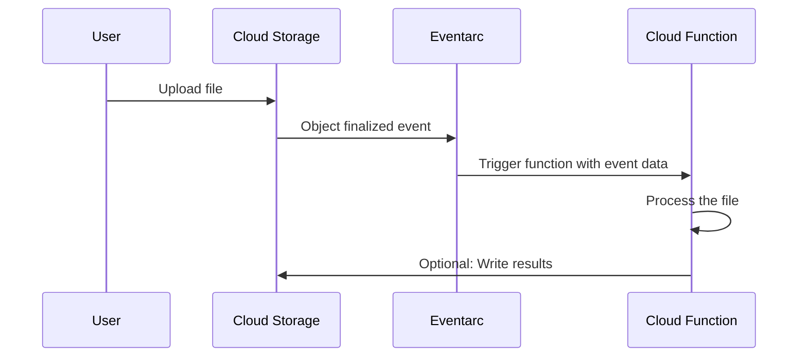

# How to Set Up Object Change Notifications Using Google Cloud Storage and Cloud Functions

Author: [nawazdhandala](https://www.github.com/nawazdhandala)

Tags: GCP, Google Cloud Storage, Cloud Functions, Event-Driven, Serverless

Description: Learn how to set up object change notifications using Google Cloud Storage event triggers and Cloud Functions to build automated serverless workflows.

---

One of the most powerful patterns in cloud architecture is reacting to events automatically. When a file lands in a Cloud Storage bucket, you often want to process it immediately - resize an image, parse a CSV, trigger a pipeline, or send a notification. Cloud Functions with GCS event triggers give you exactly this: serverless functions that run automatically whenever objects are created, updated, or deleted in a bucket.

This guide walks through setting up Cloud Functions triggered by Cloud Storage events, with practical examples for common use cases.

## How GCS Event Triggers Work

Cloud Functions can subscribe directly to Cloud Storage events. Under the hood, this uses Eventarc (for 2nd gen functions) or a direct trigger (for 1st gen functions). When an event occurs:

1. An object is created/deleted/archived in the bucket
2. GCS emits an event
3. Eventarc routes the event to your Cloud Function
4. Your function receives the event with full object metadata
5. Your function processes the event and exits



## Setting Up a Basic Cloud Function (Python)

### The Function Code

Create a directory for your function:

```bash
# Create the function directory
mkdir -p gcs-processor && cd gcs-processor
```

Write the function in `main.py`:

```python
import functions_framework
from google.cloud import storage

@functions_framework.cloud_event
def process_gcs_event(cloud_event):
    """Triggered by a Cloud Storage event.

    This function is called whenever an object is created or overwritten
    in the configured bucket.
    """
    data = cloud_event.data

    # Extract event details
    bucket_name = data["bucket"]
    file_name = data["name"]
    event_type = cloud_event["type"]
    metageneration = data.get("metageneration")
    time_created = data.get("timeCreated")
    size = data.get("size", 0)

    print(f"Event: {event_type}")
    print(f"File: gs://{bucket_name}/{file_name}")
    print(f"Size: {size} bytes")
    print(f"Created: {time_created}")

    # Skip directory markers
    if file_name.endswith("/"):
        print("Skipping directory marker")
        return

    # Process based on file type
    if file_name.endswith(".csv"):
        process_csv(bucket_name, file_name)
    elif file_name.endswith(".json"):
        process_json(bucket_name, file_name)
    elif file_name.lower().endswith((".jpg", ".jpeg", ".png")):
        process_image(bucket_name, file_name)
    else:
        print(f"No handler for file type: {file_name}")


def process_csv(bucket_name, file_name):
    """Process an uploaded CSV file."""
    client = storage.Client()
    bucket = client.bucket(bucket_name)
    blob = bucket.blob(file_name)

    # Download and count rows
    content = blob.download_as_text()
    rows = content.strip().split("\n")
    print(f"CSV has {len(rows)} rows (including header)")

    # Write a summary to the processed directory
    summary = f"File: {file_name}\nRows: {len(rows)}\n"
    summary_blob = bucket.blob(f"processed/summaries/{file_name}.txt")
    summary_blob.upload_from_string(summary)
    print(f"Summary written to processed/summaries/{file_name}.txt")


def process_json(bucket_name, file_name):
    """Process an uploaded JSON file."""
    import json

    client = storage.Client()
    bucket = client.bucket(bucket_name)
    blob = bucket.blob(file_name)

    content = blob.download_as_text()
    data = json.loads(content)

    if isinstance(data, list):
        print(f"JSON array with {len(data)} items")
    elif isinstance(data, dict):
        print(f"JSON object with {len(data)} keys: {list(data.keys())[:5]}")


def process_image(bucket_name, file_name):
    """Handle an uploaded image - log metadata."""
    client = storage.Client()
    bucket = client.bucket(bucket_name)
    blob = bucket.get_blob(file_name)

    print(f"Image uploaded: {file_name}")
    print(f"Content type: {blob.content_type}")
    print(f"Size: {blob.size / 1024:.1f} KB")
```

Create `requirements.txt`:

```
functions-framework==3.*
google-cloud-storage==2.*
```

### Deploying the Function

```bash
# Deploy a 2nd gen Cloud Function triggered by GCS object creation
gcloud functions deploy gcs-processor \
  --gen2 \
  --runtime=python312 \
  --region=us-central1 \
  --source=. \
  --entry-point=process_gcs_event \
  --trigger-event-filters="type=google.cloud.storage.object.v1.finalized" \
  --trigger-event-filters="bucket=my-upload-bucket" \
  --memory=256MB \
  --timeout=120s
```

## Setting Up a Node.js Function

### Function Code

`index.js`:

```javascript
const { Storage } = require('@google-cloud/storage');
const storage = new Storage();

/**
 * Triggered by a Cloud Storage object change event.
 * Processes uploaded files based on their type.
 */
exports.processGcsEvent = async (cloudEvent) => {
  const data = cloudEvent.data;

  const bucketName = data.bucket;
  const fileName = data.name;
  const contentType = data.contentType;
  const fileSize = parseInt(data.size, 10);

  console.log(`New file: gs://${bucketName}/${fileName}`);
  console.log(`Type: ${contentType}, Size: ${fileSize} bytes`);

  // Skip directory markers and zero-byte files
  if (fileName.endsWith('/') || fileSize === 0) {
    console.log('Skipping empty file or directory marker');
    return;
  }

  // Route to the appropriate handler
  if (contentType === 'text/csv' || fileName.endsWith('.csv')) {
    await handleCsv(bucketName, fileName);
  } else if (contentType === 'application/json') {
    await handleJson(bucketName, fileName);
  } else if (contentType && contentType.startsWith('image/')) {
    await handleImage(bucketName, fileName, contentType);
  } else {
    console.log(`No handler for content type: ${contentType}`);
  }
};

async function handleCsv(bucketName, fileName) {
  const file = storage.bucket(bucketName).file(fileName);

  // Download the CSV content
  const [content] = await file.download();
  const text = content.toString('utf-8');
  const lines = text.trim().split('\n');

  console.log(`CSV processed: ${lines.length} rows`);

  // Save processing result
  const resultFile = storage.bucket(bucketName).file(`results/${fileName}.meta.json`);
  await resultFile.save(JSON.stringify({
    originalFile: fileName,
    rowCount: lines.length,
    processedAt: new Date().toISOString(),
  }));
}

async function handleJson(bucketName, fileName) {
  const file = storage.bucket(bucketName).file(fileName);
  const [content] = await file.download();
  const data = JSON.parse(content.toString('utf-8'));

  if (Array.isArray(data)) {
    console.log(`JSON array: ${data.length} items`);
  } else {
    console.log(`JSON object: ${Object.keys(data).length} keys`);
  }
}

async function handleImage(bucketName, fileName, contentType) {
  console.log(`Image received: ${fileName} (${contentType})`);
  // Add image processing logic here (e.g., thumbnail generation)
}
```

`package.json`:

```json
{
  "name": "gcs-event-processor",
  "version": "1.0.0",
  "dependencies": {
    "@google-cloud/storage": "^7.0.0",
    "@google-cloud/functions-framework": "^3.0.0"
  }
}
```

Deploy:

```bash
# Deploy the Node.js function
gcloud functions deploy gcs-processor-node \
  --gen2 \
  --runtime=nodejs20 \
  --region=us-central1 \
  --source=. \
  --entry-point=processGcsEvent \
  --trigger-event-filters="type=google.cloud.storage.object.v1.finalized" \
  --trigger-event-filters="bucket=my-upload-bucket" \
  --memory=256MB \
  --timeout=120s
```

## Available Event Types

You can trigger on different types of storage events:

```bash
# Trigger on object creation (includes overwrites)
--trigger-event-filters="type=google.cloud.storage.object.v1.finalized"

# Trigger on object deletion
--trigger-event-filters="type=google.cloud.storage.object.v1.deleted"

# Trigger on metadata updates
--trigger-event-filters="type=google.cloud.storage.object.v1.metadataUpdated"

# Trigger on object archival (versioned buckets)
--trigger-event-filters="type=google.cloud.storage.object.v1.archived"
```

## Filtering by File Pattern

You cannot filter by file extension at the trigger level, but you can do it efficiently in your function code:

```python
@functions_framework.cloud_event
def process_gcs_event(cloud_event):
    """Only process specific file types."""
    file_name = cloud_event.data["name"]

    # Define which prefixes and extensions to process
    allowed_prefixes = ["uploads/", "incoming/"]
    allowed_extensions = [".csv", ".json", ".xml"]

    # Check prefix
    if not any(file_name.startswith(p) for p in allowed_prefixes):
        print(f"Skipping: not in allowed prefix: {file_name}")
        return

    # Check extension
    if not any(file_name.lower().endswith(ext) for ext in allowed_extensions):
        print(f"Skipping: not an allowed file type: {file_name}")
        return

    # Process the file
    print(f"Processing: {file_name}")
    # ... your processing logic here
```

## Avoiding Infinite Loops

A common mistake is writing output back to the same bucket that triggers the function. This creates an infinite loop - the function triggers, writes a file, which triggers the function again.

```python
@functions_framework.cloud_event
def safe_processor(cloud_event):
    """Avoid infinite loops by checking the file path."""
    file_name = cloud_event.data["name"]

    # Only process files in the input directory
    if not file_name.startswith("input/"):
        print(f"Skipping non-input file: {file_name}")
        return

    # Write results to the output directory (does not trigger re-processing)
    # Because our function only processes files in input/
    output_path = file_name.replace("input/", "output/")
    # ... process and write to output_path
```

Better yet, use a separate bucket for output:

```python
INPUT_BUCKET = "my-input-bucket"    # Triggers the function
OUTPUT_BUCKET = "my-output-bucket"  # No trigger configured
```

## Error Handling and Retries

Cloud Functions retries failed invocations by default. Make your function idempotent:

```python
@functions_framework.cloud_event
def idempotent_processor(cloud_event):
    """Process files idempotently to handle retries safely."""
    data = cloud_event.data
    bucket_name = data["bucket"]
    file_name = data["name"]
    generation = data["generation"]

    client = storage.Client()
    bucket = client.bucket(bucket_name)

    # Use the generation number to create a unique processing marker
    marker_path = f"processed-markers/{file_name}_{generation}"
    marker_blob = bucket.blob(marker_path)

    # Check if this specific version was already processed
    if marker_blob.exists():
        print(f"Already processed: {file_name} (generation {generation})")
        return

    # Process the file
    print(f"Processing: {file_name}")
    # ... your processing logic here

    # Write a marker to prevent reprocessing
    marker_blob.upload_from_string(
        f"Processed at {datetime.utcnow().isoformat()}"
    )
    print(f"Marked as processed: {file_name}")
```

## Monitoring and Logging

View function logs:

```bash
# View recent logs for your function
gcloud functions logs read gcs-processor \
  --gen2 \
  --region=us-central1 \
  --limit=50

# Follow logs in real time
gcloud functions logs read gcs-processor \
  --gen2 \
  --region=us-central1 \
  --limit=10 \
  --start-time="2026-02-17T00:00:00Z"
```

## Terraform Deployment

```hcl
# Cloud Function source code bucket
resource "google_storage_bucket" "function_source" {
  name     = "my-function-source-bucket"
  location = "US"
}

# Upload function source
resource "google_storage_bucket_object" "function_zip" {
  name   = "function-source.zip"
  bucket = google_storage_bucket.function_source.name
  source = "function-source.zip"
}

# Cloud Function
resource "google_cloudfunctions2_function" "gcs_processor" {
  name     = "gcs-event-processor"
  location = "us-central1"

  build_config {
    runtime     = "python312"
    entry_point = "process_gcs_event"
    source {
      storage_source {
        bucket = google_storage_bucket.function_source.name
        object = google_storage_bucket_object.function_zip.name
      }
    }
  }

  service_config {
    max_instance_count = 10
    available_memory   = "256M"
    timeout_seconds    = 120
  }

  event_trigger {
    trigger_region = "us-central1"
    event_type     = "google.cloud.storage.object.v1.finalized"
    event_filters {
      attribute = "bucket"
      value     = google_storage_bucket.upload_bucket.name
    }
  }
}
```

Cloud Functions triggered by Cloud Storage events are one of the simplest ways to build event-driven architectures on GCP. They scale automatically, you pay only for execution time, and they require no infrastructure management. Start with simple processing functions and build up to complex pipelines as your needs grow.
