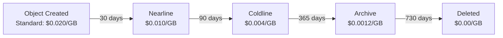

# How to Set Up Object Lifecycle Management Rules in Google Cloud Storage

Author: [nawazdhandala](https://www.github.com/nawazdhandala)

Tags: GCP, Google Cloud Storage, Lifecycle Management, Cost Optimization, Storage Classes

Description: A practical guide to setting up object lifecycle management rules in Google Cloud Storage to automate storage class transitions and object deletion for cost optimization.

---

If you have ever looked at your GCP billing and wondered why Cloud Storage costs keep climbing, lifecycle management rules are probably the answer you have been looking for. These rules let you automatically move objects to cheaper storage classes as they age, or delete them entirely when they are no longer needed. Set them up once, and they keep working in the background saving you money.

This guide covers everything you need to know about configuring lifecycle rules - from basic setups to more advanced patterns.

## How Lifecycle Management Works

Google Cloud Storage evaluates lifecycle rules once per day against every object in a bucket. When an object matches the conditions you define, GCS performs the specified action. There are two types of actions:

- **SetStorageClass** - moves objects to a different storage class
- **Delete** - permanently removes objects

Each rule has conditions that determine which objects it applies to. You can combine multiple conditions within a single rule (they work as AND logic), and you can have multiple rules on a bucket (they work independently).

## Basic Lifecycle Configuration

Lifecycle rules are defined in a JSON file. Here is a straightforward example that moves objects to Nearline after 30 days and deletes them after a year:

```json
{
  "rule": [
    {
      "action": {
        "type": "SetStorageClass",
        "storageClass": "NEARLINE"
      },
      "condition": {
        "age": 30
      }
    },
    {
      "action": {
        "type": "Delete"
      },
      "condition": {
        "age": 365
      }
    }
  ]
}
```

Apply this to your bucket using the gcloud CLI:

```bash
# Apply the lifecycle configuration file to a bucket
gcloud storage buckets update gs://my-bucket \
  --lifecycle-file=lifecycle.json
```

## Available Conditions

You have several conditions to work with. Understanding each one helps you build precise rules.

### Age

The number of days since the object was created (or since it became noncurrent, for versioned objects using `age` on noncurrent versions).

```json
{
  "action": {"type": "Delete"},
  "condition": {"age": 90}
}
```

### CreatedBefore

Matches objects created before a specific date. Useful for one-time cleanup operations.

```json
{
  "action": {"type": "Delete"},
  "condition": {"createdBefore": "2025-01-01"}
}
```

### IsLive

Works with versioned buckets. When set to `false`, it targets noncurrent (archived) versions of objects.

```json
{
  "action": {"type": "Delete"},
  "condition": {
    "isLive": false,
    "age": 30
  }
}
```

### NumNewerVersions

Also for versioned buckets. Targets noncurrent versions when there are more than N newer versions.

```json
{
  "action": {"type": "Delete"},
  "condition": {
    "isLive": false,
    "numNewerVersions": 3
  }
}
```

### MatchesStorageClass

Only applies the rule to objects in specific storage classes.

```json
{
  "action": {
    "type": "SetStorageClass",
    "storageClass": "COLDLINE"
  },
  "condition": {
    "age": 90,
    "matchesStorageClass": ["NEARLINE"]
  }
}
```

### MatchesPrefix and MatchesSuffix

Target objects based on their name prefix or suffix. This is great when you want different lifecycle rules for different types of data in the same bucket.

```json
{
  "action": {"type": "Delete"},
  "condition": {
    "age": 7,
    "matchesPrefix": ["tmp/", "logs/debug/"]
  }
}
```

### DaysSinceCustomTime

If you set custom time metadata on objects, you can use it as a condition trigger.

```json
{
  "action": {"type": "Delete"},
  "condition": {
    "daysSinceCustomTime": 90
  }
}
```

## Real-World Configuration Examples

### Log Retention Policy

This is a common pattern for application logs stored in GCS:

```json
{
  "rule": [
    {
      "action": {
        "type": "SetStorageClass",
        "storageClass": "NEARLINE"
      },
      "condition": {
        "age": 30,
        "matchesPrefix": ["logs/"],
        "matchesStorageClass": ["STANDARD"]
      }
    },
    {
      "action": {
        "type": "SetStorageClass",
        "storageClass": "COLDLINE"
      },
      "condition": {
        "age": 90,
        "matchesPrefix": ["logs/"],
        "matchesStorageClass": ["NEARLINE"]
      }
    },
    {
      "action": {
        "type": "Delete"
      },
      "condition": {
        "age": 365,
        "matchesPrefix": ["logs/"]
      }
    }
  ]
}
```

This creates a tiered approach: Standard for the first month, Nearline from 30-90 days, Coldline from 90-365 days, then deletion.

### Versioned Bucket Cleanup

When versioning is enabled, old versions pile up fast. This keeps costs under control:

```json
{
  "rule": [
    {
      "action": {"type": "Delete"},
      "condition": {
        "isLive": false,
        "numNewerVersions": 5
      }
    },
    {
      "action": {"type": "Delete"},
      "condition": {
        "isLive": false,
        "age": 90
      }
    }
  ]
}
```

This deletes noncurrent versions when there are more than 5 newer versions, or when a noncurrent version is older than 90 days.

### Temporary Upload Cleanup

For buckets that receive uploads which get processed and should be cleaned up:

```json
{
  "rule": [
    {
      "action": {"type": "Delete"},
      "condition": {
        "age": 1,
        "matchesPrefix": ["uploads/tmp/"]
      }
    },
    {
      "action": {"type": "Delete"},
      "condition": {
        "age": 7,
        "matchesPrefix": ["uploads/pending/"]
      }
    },
    {
      "action": {
        "type": "SetStorageClass",
        "storageClass": "NEARLINE"
      },
      "condition": {
        "age": 30,
        "matchesPrefix": ["uploads/processed/"]
      }
    }
  ]
}
```

## Managing Lifecycle Rules

### Viewing Current Rules

```bash
# View the current lifecycle configuration for a bucket
gcloud storage buckets describe gs://my-bucket --format="json(lifecycle)"
```

### Removing All Lifecycle Rules

To clear all lifecycle rules from a bucket, create an empty lifecycle file:

```json
{
  "rule": []
}
```

Then apply it:

```bash
# Remove all lifecycle rules by applying an empty configuration
gcloud storage buckets update gs://my-bucket \
  --lifecycle-file=empty-lifecycle.json
```

Or use the shorthand:

```bash
# Clear lifecycle configuration entirely
gcloud storage buckets update gs://my-bucket \
  --clear-lifecycle
```

## Using Terraform

If you manage infrastructure as code, here is how lifecycle rules look in Terraform:

```hcl
resource "google_storage_bucket" "data_bucket" {
  name          = "my-data-bucket"
  location      = "US"
  storage_class = "STANDARD"

  # Move to Nearline after 30 days
  lifecycle_rule {
    action {
      type          = "SetStorageClass"
      storage_class = "NEARLINE"
    }
    condition {
      age = 30
    }
  }

  # Delete after 365 days
  lifecycle_rule {
    action {
      type = "Delete"
    }
    condition {
      age = 365
    }
  }

  # Clean up old versions
  lifecycle_rule {
    action {
      type = "Delete"
    }
    condition {
      num_newer_versions = 3
      with_state         = "ARCHIVED"
    }
  }
}
```

## Cost Impact Visualization

Here is how lifecycle management affects storage costs over time:



## Important Things to Know

**Rules are evaluated daily.** Do not expect instant transitions. There can be a delay of up to 24 hours between when an object meets a condition and when the action is performed.

**Storage class transitions are one-directional.** You can move from Standard to Nearline, Nearline to Coldline, or Coldline to Archive. You cannot go the other way with lifecycle rules. To move an object to a warmer class, you need to rewrite it.

**Minimum storage durations still apply.** If you move an object to Nearline (30-day minimum) and then a lifecycle rule tries to delete it at day 15, you will still be charged for the full 30 days.

**Multiple rules can match the same object.** If both a SetStorageClass and a Delete rule match, the Delete action takes precedence.

**AbortIncompleteMultipartUpload is also available.** You can automatically clean up incomplete multipart uploads:

```json
{
  "rule": [
    {
      "action": {"type": "AbortIncompleteMultipartUpload"},
      "condition": {"age": 7}
    }
  ]
}
```

Lifecycle management is one of those features that pays for itself many times over. Spend 15 minutes setting up good rules, and you will save significant money every month without any manual intervention. Start with the patterns above, adjust the timings to match your data access patterns, and let GCS do the work.
