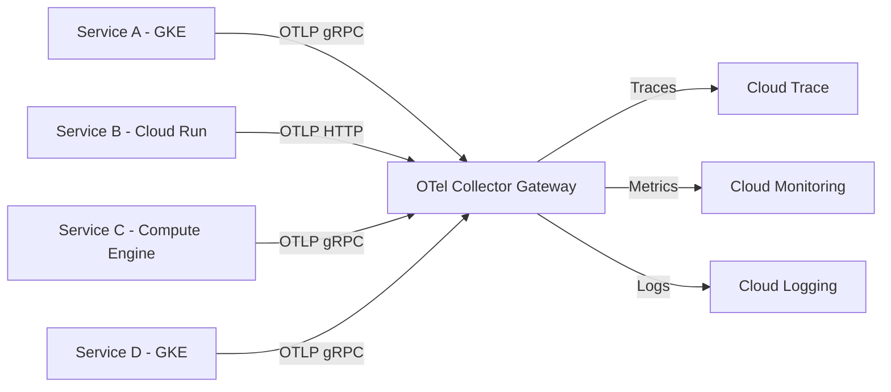

# How to Set Up OpenTelemetry Collector as a Gateway for Multi-Service Telemetry on GCP

Author: [nawazdhandala](https://www.github.com/nawazdhandala)

Tags: GCP, OpenTelemetry, OpenTelemetry Collector, Observability, Google Cloud, Telemetry

Description: Learn how to deploy the OpenTelemetry Collector as a centralized gateway on Google Cloud to aggregate and route telemetry from multiple services.

---

When you have a bunch of services running on GCP - some on GKE, some on Compute Engine, maybe a few on Cloud Run - getting all their telemetry data routed correctly becomes a real coordination problem. Each service sending directly to Google Cloud Monitoring and Cloud Trace works fine at small scale, but it gets messy fast. The OpenTelemetry Collector deployed as a gateway gives you a single point to receive, process, and export telemetry from all your services. In this post, I will walk through setting that up on Google Cloud.

## Why a Gateway Pattern?

Instead of each service having its own exporter configuration pointing to multiple backends, the gateway pattern centralizes that complexity. Your services send telemetry to the collector, and the collector handles routing, batching, retrying, and transforming the data before sending it to Google Cloud.

The benefits are practical. You get a single place to change export configuration. You reduce the number of outbound connections to Google APIs. You can add processing like filtering or attribute enrichment in one spot. And you can buffer data during backend outages.

## Architecture

Here is how the gateway pattern looks in practice.



## Step 1: Create the Collector Configuration

The collector configuration is a YAML file that defines receivers, processors, and exporters. Here is a production-ready configuration for a GCP gateway.

```yaml
# otel-collector-config.yaml
# This configuration receives telemetry via OTLP and exports to GCP services

receivers:
  # Accept OTLP data over both gRPC and HTTP
  otlp:
    protocols:
      grpc:
        endpoint: 0.0.0.0:4317
      http:
        endpoint: 0.0.0.0:4318

processors:
  # Batch spans and metrics to reduce API calls
  batch:
    send_batch_size: 1024
    send_batch_max_size: 2048
    timeout: 5s

  # Add memory limits to prevent OOM
  memory_limiter:
    check_interval: 1s
    limit_mib: 1024
    spike_limit_mib: 256

  # Add GCP-specific resource attributes
  resourcedetection:
    detectors: [gcp]
    timeout: 5s

  # Add custom attributes to all telemetry
  attributes:
    actions:
      - key: environment
        value: production
        action: upsert
      - key: collector.gateway
        value: "true"
        action: upsert

exporters:
  # Export traces to Cloud Trace
  googlecloud:
    project: my-gcp-project

  # Export metrics to Cloud Monitoring
  googlemanagedprometheus:
    project: my-gcp-project

  # Export logs to Cloud Logging
  googlecloud/logging:
    project: my-gcp-project
    log:
      default_log_name: otel-collector-gateway

  # Debug exporter for troubleshooting
  debug:
    verbosity: basic

extensions:
  # Health check endpoint for load balancer probes
  health_check:
    endpoint: 0.0.0.0:13133

  # Performance profiling endpoint
  pprof:
    endpoint: 0.0.0.0:1777

  # Prometheus metrics about the collector itself
  zpages:
    endpoint: 0.0.0.0:55679

service:
  extensions: [health_check, pprof, zpages]
  pipelines:
    # Trace pipeline
    traces:
      receivers: [otlp]
      processors: [memory_limiter, resourcedetection, attributes, batch]
      exporters: [googlecloud]

    # Metrics pipeline
    metrics:
      receivers: [otlp]
      processors: [memory_limiter, resourcedetection, attributes, batch]
      exporters: [googlemanagedprometheus]

    # Logs pipeline
    logs:
      receivers: [otlp]
      processors: [memory_limiter, resourcedetection, attributes, batch]
      exporters: [googlecloud/logging]
```

## Step 2: Deploy the Collector on GKE

For GKE deployments, a Kubernetes Deployment with a Service is the standard approach. Here is the manifest.

```yaml
# collector-deployment.yaml
apiVersion: apps/v1
kind: Deployment
metadata:
  name: otel-collector-gateway
  namespace: observability
  labels:
    app: otel-collector-gateway
spec:
  replicas: 3
  selector:
    matchLabels:
      app: otel-collector-gateway
  template:
    metadata:
      labels:
        app: otel-collector-gateway
    spec:
      serviceAccountName: otel-collector
      containers:
        - name: otel-collector
          # Use the contrib image which includes GCP exporters
          image: otel/opentelemetry-collector-contrib:0.96.0
          args:
            - "--config=/etc/otel/config.yaml"
          ports:
            - containerPort: 4317  # OTLP gRPC
              name: otlp-grpc
            - containerPort: 4318  # OTLP HTTP
              name: otlp-http
            - containerPort: 13133 # Health check
              name: health
          resources:
            requests:
              cpu: 500m
              memory: 1Gi
            limits:
              cpu: "2"
              memory: 2Gi
          livenessProbe:
            httpGet:
              path: /
              port: 13133
            initialDelaySeconds: 10
          readinessProbe:
            httpGet:
              path: /
              port: 13133
            initialDelaySeconds: 5
          volumeMounts:
            - name: config
              mountPath: /etc/otel
      volumes:
        - name: config
          configMap:
            name: otel-collector-config
---
# Service to expose the collector within the cluster
apiVersion: v1
kind: Service
metadata:
  name: otel-collector-gateway
  namespace: observability
spec:
  selector:
    app: otel-collector-gateway
  ports:
    - name: otlp-grpc
      port: 4317
      targetPort: 4317
    - name: otlp-http
      port: 4318
      targetPort: 4318
  type: ClusterIP
```

## Step 3: Set Up Workload Identity

The collector needs permissions to write to Cloud Trace, Cloud Monitoring, and Cloud Logging. Workload Identity is the recommended way to handle this on GKE.

```bash
# Create a GCP service account for the collector
gcloud iam service-accounts create otel-collector \
    --display-name="OpenTelemetry Collector"

# Grant the necessary roles
gcloud projects add-iam-policy-binding my-gcp-project \
    --member="serviceAccount:otel-collector@my-gcp-project.iam.gserviceaccount.com" \
    --role="roles/cloudtrace.agent"

gcloud projects add-iam-policy-binding my-gcp-project \
    --member="serviceAccount:otel-collector@my-gcp-project.iam.gserviceaccount.com" \
    --role="roles/monitoring.metricWriter"

gcloud projects add-iam-policy-binding my-gcp-project \
    --member="serviceAccount:otel-collector@my-gcp-project.iam.gserviceaccount.com" \
    --role="roles/logging.logWriter"

# Bind the Kubernetes service account to the GCP service account
gcloud iam service-accounts add-iam-policy-binding \
    otel-collector@my-gcp-project.iam.gserviceaccount.com \
    --role="roles/iam.workloadIdentityUser" \
    --member="serviceAccount:my-gcp-project.svc.id.goog[observability/otel-collector]"
```

Create the Kubernetes service account with the annotation.

```yaml
# service-account.yaml
apiVersion: v1
kind: ServiceAccount
metadata:
  name: otel-collector
  namespace: observability
  annotations:
    iam.gke.io/gcp-service-account: otel-collector@my-gcp-project.iam.gserviceaccount.com
```

## Step 4: Configure Services to Send Telemetry to the Gateway

Now configure your application services to export their telemetry to the collector gateway instead of directly to GCP.

For services running in the same GKE cluster, point them at the internal service DNS.

```bash
# Set the OTLP endpoint environment variable in your service
OTEL_EXPORTER_OTLP_ENDPOINT=http://otel-collector-gateway.observability.svc.cluster.local:4317
OTEL_EXPORTER_OTLP_PROTOCOL=grpc
```

For services outside the cluster (Compute Engine, Cloud Run), you will need to expose the collector through an Internal Load Balancer.

```yaml
# internal-lb-service.yaml
apiVersion: v1
kind: Service
metadata:
  name: otel-collector-gateway-ilb
  namespace: observability
  annotations:
    networking.gke.io/load-balancer-type: "Internal"
spec:
  selector:
    app: otel-collector-gateway
  ports:
    - name: otlp-grpc
      port: 4317
      targetPort: 4317
    - name: otlp-http
      port: 4318
      targetPort: 4318
  type: LoadBalancer
```

## Step 5: Monitor the Collector Itself

The collector exposes its own metrics that you should monitor. Use the zpages extension to check the collector's internal state.

```bash
# Port-forward to check zpages locally
kubectl port-forward -n observability svc/otel-collector-gateway 55679:55679

# Then open http://localhost:55679/debug/tracez in your browser
```

## Scaling Considerations

For high-throughput environments, consider these adjustments. Increase the number of replicas and ensure you have a Horizontal Pod Autoscaler configured based on CPU and memory usage. If you are receiving more than 10,000 spans per second, consider sharding by service name using the routing connector. And always set the memory limiter processor - without it, a burst of telemetry can crash the collector.

## Wrapping Up

Running the OpenTelemetry Collector as a gateway on GCP gives you a clean separation between your application instrumentation and your telemetry backend. Your services just need to know one endpoint, and all the complexity of batching, retrying, and routing lives in the collector configuration. When you need to change how telemetry is processed or add a new backend, you update the collector config and roll it out - no changes to application code needed.
