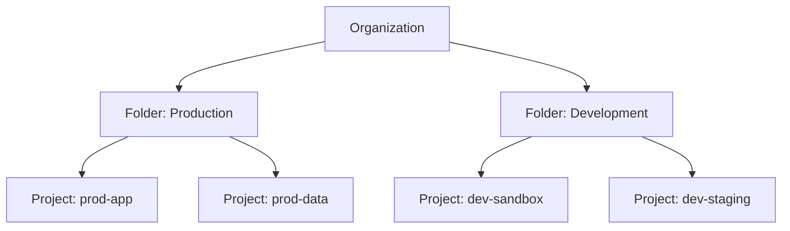

# How to Set Up Organization Policy Constraints to Restrict Resource Locations in GCP

Author: [nawazdhandala](https://www.github.com/nawazdhandala)

Tags: GCP, Organization Policy, Resource Locations, Compliance, Governance, Security

Description: Learn how to use GCP Organization Policy constraints to restrict which regions and zones your cloud resources can be created in for data residency compliance.

---

Data residency is a real concern for many organizations. Regulations like GDPR, CCPA, or industry-specific requirements often mandate that data must stay within certain geographic boundaries. In GCP, even if you have a policy document that says "only deploy in us-central1," there is nothing stopping a developer from accidentally spinning up a VM in europe-west1 - unless you enforce it with Organization Policy constraints.

Organization Policy Service lets you define rules at the organization, folder, or project level that GCP enforces automatically. In this post, I will show you how to restrict resource locations so that resources can only be created in approved regions.

## How Organization Policies Work

Organization Policies apply to GCP resources in a hierarchical manner:



A policy set at the organization level applies to all folders and projects below it. Policies at the folder level apply to all projects in that folder. You can also set policies at the project level.

The inheritance rules allow you to:
- Set a default at the org level
- Override it at the folder or project level (if the policy allows)
- Or enforce it strictly so child resources cannot override

## Step 1: Understand the Location Constraint

The constraint for restricting resource locations is:

```
constraints/gcp.resourceLocations
```

This constraint accepts a list of allowed locations using GCP location values. Locations can be:

- **Regions**: `in:us-central1-locations`, `in:europe-west1-locations`
- **Multi-regions**: `in:us-locations`, `in:eu-locations`
- **Zones**: Specific zones within regions

## Step 2: Set Location Restrictions at the Organization Level

Restrict all resources in your organization to US locations:

```bash
# Set organization-wide location restriction
gcloud resource-manager org-policies set-policy \
    --organization=123456789 \
    policy.yaml
```

Create the policy YAML file:

```yaml
# policy.yaml - Restrict resources to US locations only
constraint: constraints/gcp.resourceLocations
listPolicy:
  allowedValues:
    - in:us-locations
```

The `in:us-locations` value group includes all US regions (us-central1, us-east1, us-east4, us-west1, us-west2, us-west3, us-west4, us-south1) and the US multi-region.

## Step 3: Set More Specific Restrictions

If you want to restrict to specific regions rather than an entire country:

```yaml
# specific-regions-policy.yaml - Only allow specific US regions
constraint: constraints/gcp.resourceLocations
listPolicy:
  allowedValues:
    - in:us-central1-locations
    - in:us-east4-locations
```

This is more restrictive - resources can only be created in us-central1 or us-east4, not in any US region.

Apply it to a specific folder:

```bash
# Apply to a production folder
gcloud resource-manager org-policies set-policy \
    --folder=987654321 \
    specific-regions-policy.yaml
```

Or to a specific project:

```bash
# Apply to a specific project
gcloud resource-manager org-policies set-policy \
    --project=my-project \
    specific-regions-policy.yaml
```

## Step 4: Allow Different Locations for Different Environments

A common pattern is to be strict about production but flexible for development:

For the production folder:

```yaml
# prod-locations.yaml - Production restricted to two regions
constraint: constraints/gcp.resourceLocations
listPolicy:
  allowedValues:
    - in:us-central1-locations
    - in:us-east4-locations
```

For the development folder:

```yaml
# dev-locations.yaml - Development can use any US region
constraint: constraints/gcp.resourceLocations
listPolicy:
  allowedValues:
    - in:us-locations
```

Apply them:

```bash
# Set production location policy
gcloud resource-manager org-policies set-policy \
    --folder=PROD_FOLDER_ID \
    prod-locations.yaml

# Set development location policy
gcloud resource-manager org-policies set-policy \
    --folder=DEV_FOLDER_ID \
    dev-locations.yaml
```

## Step 5: Verify the Policy

Check what policy is effective for a specific project:

```bash
# View the effective policy for a project
gcloud resource-manager org-policies describe \
    constraints/gcp.resourceLocations \
    --project=my-project \
    --effective
```

This shows the combined result of org, folder, and project-level policies.

## Step 6: Test the Constraint

Try creating a resource in a restricted location:

```bash
# This should fail if europe-west1 is not in the allowed list
gcloud compute instances create test-vm \
    --project=my-project \
    --zone=europe-west1-b \
    --machine-type=e2-micro

# Expected error:
# ERROR: (gcloud.compute.instances.create) Could not fetch resource:
# - Request violates constraint 'constraints/gcp.resourceLocations'
```

And verify it works in an allowed location:

```bash
# This should succeed
gcloud compute instances create test-vm \
    --project=my-project \
    --zone=us-central1-a \
    --machine-type=e2-micro
```

## Using Terraform

Here is how to manage location policies with Terraform:

```hcl
# Terraform - Organization level location restriction
resource "google_org_policy_policy" "location_restriction" {
  name   = "organizations/123456789/policies/gcp.resourceLocations"
  parent = "organizations/123456789"

  spec {
    rules {
      values {
        allowed_values = [
          "in:us-central1-locations",
          "in:us-east4-locations"
        ]
      }
    }
  }
}

# Terraform - Folder level override for development
resource "google_org_policy_policy" "dev_location" {
  name   = "folders/${var.dev_folder_id}/policies/gcp.resourceLocations"
  parent = "folders/${var.dev_folder_id}"

  spec {
    rules {
      values {
        allowed_values = [
          "in:us-locations"
        ]
      }
    }
  }
}
```

## Deny-Based Policies

Instead of specifying which locations are allowed, you can deny specific locations:

```yaml
# deny-eu-policy.yaml - Deny EU locations specifically
constraint: constraints/gcp.resourceLocations
listPolicy:
  deniedValues:
    - in:eu-locations
    - in:europe-west1-locations
    - in:europe-west2-locations
    - in:europe-west3-locations
```

However, allow-list policies are generally safer than deny-list policies. With an allow list, new regions are automatically blocked until explicitly added. With a deny list, new regions are automatically allowed unless explicitly denied.

## What the Constraint Covers

The `gcp.resourceLocations` constraint applies to most regional and zonal GCP resources:

| Service | Covered Resources |
|---------|------------------|
| Compute Engine | VMs, disks, snapshots, images |
| Cloud Storage | Bucket locations |
| Cloud SQL | Instance locations |
| BigQuery | Dataset locations |
| GKE | Cluster locations |
| Cloud Functions | Function locations |
| Pub/Sub | Topic locations (for single-region topics) |
| Cloud Run | Service locations |

Some resources are global by nature (like IAM policies, DNS zones) and are not affected by this constraint.

## Handling Exceptions

Sometimes a specific project needs access to a location that the org policy blocks. You can handle this in a few ways:

### Project-Level Override

If the org policy allows inheritance overrides:

```yaml
# exception-policy.yaml - Allow additional regions for this project
constraint: constraints/gcp.resourceLocations
listPolicy:
  allowedValues:
    - in:us-central1-locations
    - in:us-east4-locations
    - in:asia-east1-locations
  inheritFromParent: true
```

### Conditional Policy (Requires Policy Tags)

For more complex scenarios, you can use tag-based conditions:

```yaml
# conditional-policy.yaml
constraint: constraints/gcp.resourceLocations
listPolicy:
  allowedValues:
    - in:us-locations
  inheritFromParent: false
```

## Monitoring Policy Violations

Even with policies in place, it is good to monitor for attempted violations:

```bash
# Check audit logs for policy violation attempts
gcloud logging read 'protoPayload.status.message:"constraints/gcp.resourceLocations"' \
    --project=my-project \
    --limit=20 \
    --format="table(timestamp, protoPayload.authenticationInfo.principalEmail, protoPayload.resourceName)"
```

Set up an alert to notify you when someone tries to create resources in restricted locations:

```bash
# Create a log-based alert for policy violations
gcloud logging metrics create location-policy-violations \
    --project=my-project \
    --description="Count of resource location policy violations" \
    --log-filter='protoPayload.status.message:"constraints/gcp.resourceLocations"'
```

## Common Patterns

### Multi-Region Data Residency

For organizations that operate in multiple countries with different data residency requirements:

```
Organization
  Folder: US Operations
    Policy: in:us-locations
    Project: us-prod
    Project: us-staging
  Folder: EU Operations
    Policy: in:eu-locations
    Project: eu-prod
    Project: eu-staging
  Folder: APAC Operations
    Policy: in:asia-locations
    Project: apac-prod
```

### Compliance-First Approach

Start with the most restrictive policy and add locations as needed:

```yaml
# Start with just one region
constraint: constraints/gcp.resourceLocations
listPolicy:
  allowedValues:
    - in:us-central1-locations
```

Then expand when there is a documented business need.

## Wrapping Up

Organization Policy constraints for resource locations are one of the most important governance controls in GCP. They turn data residency requirements from documentation into automated enforcement. Set allow-list policies at the organization level, override at the folder level for different environments, and monitor for violation attempts. The key principle is to start restrictive and add locations only when there is a clear need. It is much easier to relax a tight policy than to tighten a loose one after resources are already spread across the globe.
