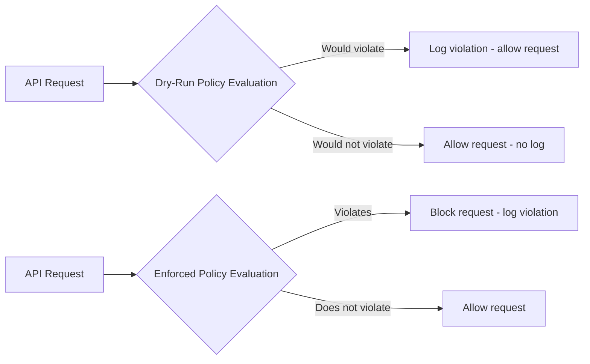

# How to Set Up Organization Policy Dry-Run Mode to Test Constraint Changes in GCP

Author: [nawazdhandala](https://www.github.com/nawazdhandala)

Tags: GCP, Organization Policy, Dry Run, Governance, Security

Description: Learn how to use GCP organization policy dry-run mode to simulate constraint changes before enforcing them, avoiding disruptions to production workloads.

---

Organization policies in GCP are powerful but potentially disruptive. A single misconfigured constraint can break deployments across an entire organization. If you enable a constraint that blocks external IP addresses on Compute Engine instances, every team that relies on public-facing VMs will immediately lose the ability to create new ones. If you restrict allowed locations, any team deploying to an unsupported region will hit a wall.

Dry-run mode was introduced to solve this exact problem. It lets you simulate what would happen if a constraint were enforced, without actually enforcing it. Violations are logged but not blocked. You can review the logs, identify workloads that would be affected, work with teams to remediate, and then flip the policy to enforcement with confidence.

## How Dry-Run Mode Works

When you create an organization policy in dry-run mode, GCP evaluates every relevant API request against the constraint but does not block anything. Instead, it writes an audit log entry when a request would have been denied. The log entry includes the constraint name, the resource that violated it, and the principal who made the request.

This gives you a realistic picture of the impact without any risk to running workloads.



## Prerequisites

- A GCP organization
- The `roles/orgpolicy.policyAdmin` role on the organization or the folder/project where you want to test
- The Organization Policy API enabled

## Setting Up a Dry-Run Policy

Let's walk through testing the `constraints/compute.vmExternalIpAccess` constraint, which controls whether VMs can have external IP addresses.

### Using gcloud

First, create the policy YAML file with the dry-run spec:

```yaml
# vm-external-ip-dryrun.yaml
# Test restricting external IP access without enforcing it
name: projects/my-project-id/policies/compute.vmExternalIpAccess
spec:
  rules:
    - allowAll: true
dryRunSpec:
  rules:
    - values:
        allowedValues:
          - "projects/my-project-id/zones/us-central1-a/instances/bastion-vm"
```

In this configuration, the `spec` (the enforced policy) allows everything, while the `dryRunSpec` restricts external IPs to only a bastion VM. This means nothing changes in practice, but you will see logs for every other VM that would be blocked.

Apply the policy:

```bash
# Apply the dry-run policy
gcloud org-policies set-policy vm-external-ip-dryrun.yaml \
  --project=my-project-id
```

### Using Terraform

```hcl
# Terraform configuration for a dry-run organization policy
resource "google_org_policy_policy" "vm_external_ip_dryrun" {
  name   = "projects/${var.project_id}/policies/compute.vmExternalIpAccess"
  parent = "projects/${var.project_id}"

  # The enforced spec - allows everything (current behavior)
  spec {
    rules {
      allow_all = "TRUE"
    }
  }

  # The dry-run spec - what we want to test
  dry_run_spec {
    rules {
      values {
        allowed_values = [
          "projects/${var.project_id}/zones/us-central1-a/instances/bastion-vm"
        ]
      }
    }
  }
}
```

## Monitoring Dry-Run Violations

After enabling the dry-run policy, violations appear in Cloud Audit Logs. You can query them to see which resources and principals would be affected:

```bash
# Query audit logs for dry-run violations
gcloud logging read 'protoPayload.metadata.constraint="constraints/compute.vmExternalIpAccess" AND protoPayload.metadata.dryRun=true' \
  --project=my-project-id \
  --limit=50 \
  --format="table(timestamp, protoPayload.resourceName, protoPayload.authenticationInfo.principalEmail)"
```

You can also set up a log-based metric to track violation counts over time:

```bash
# Create a log-based metric for dry-run violations
gcloud logging metrics create org-policy-dryrun-violations \
  --description="Count of organization policy dry-run violations" \
  --log-filter='protoPayload.metadata.dryRun=true AND protoPayload.metadata.constraint="constraints/compute.vmExternalIpAccess"' \
  --project=my-project-id
```

Then create a dashboard or alert based on this metric to track how violations trend over time as teams remediate their workloads.

## Testing Other Common Constraints

Here are dry-run configurations for other commonly used constraints.

### Resource Location Restriction

```yaml
# location-restriction-dryrun.yaml
# Test restricting resource creation to specific regions
name: organizations/ORG_ID/policies/gcp.resourceLocations
spec:
  rules:
    - allowAll: true
dryRunSpec:
  rules:
    - values:
        allowedValues:
          - "in:us-locations"
          - "in:eu-locations"
```

### Uniform Bucket-Level Access

```yaml
# uniform-bucket-access-dryrun.yaml
# Test requiring uniform bucket-level access on all storage buckets
name: organizations/ORG_ID/policies/storage.uniformBucketLevelAccess
spec:
  rules:
    - allowAll: true
dryRunSpec:
  rules:
    - enforce: true
```

### Disable Service Account Key Creation

```yaml
# disable-sa-keys-dryrun.yaml
# Test blocking the creation of user-managed service account keys
name: organizations/ORG_ID/policies/iam.disableServiceAccountKeyCreation
spec:
  rules:
    - enforce: false
dryRunSpec:
  rules:
    - enforce: true
```

## The Remediation Workflow

Once you have a dry-run policy collecting violations, follow this workflow to move toward enforcement:

1. **Collect data for at least two weeks.** This gives you a realistic picture of which teams and workloads would be affected. Some operations happen weekly or monthly, and you want to catch those.

2. **Generate a violation report.** Export the audit logs to BigQuery for analysis:

```bash
# Create a log sink to send violations to BigQuery
gcloud logging sinks create org-policy-violations-sink \
  bigquery.googleapis.com/projects/my-project-id/datasets/policy_violations \
  --log-filter='protoPayload.metadata.dryRun=true' \
  --project=my-project-id
```

3. **Notify affected teams.** Share the list of violations with each team and give them a deadline to remediate. Provide specific guidance on what they need to change.

4. **Track remediation progress.** As teams fix their resources, the violation count in your dashboard should decrease. When it reaches zero or near zero, you are ready to enforce.

5. **Switch from dry-run to enforcement.** Update the policy to move the dry-run spec into the enforced spec:

```yaml
# vm-external-ip-enforced.yaml
# Now enforcing the constraint after successful dry-run period
name: projects/my-project-id/policies/compute.vmExternalIpAccess
spec:
  rules:
    - values:
        allowedValues:
          - "projects/my-project-id/zones/us-central1-a/instances/bastion-vm"
```

```bash
# Apply the enforced policy
gcloud org-policies set-policy vm-external-ip-enforced.yaml \
  --project=my-project-id
```

## Running Dry-Run and Enforced Simultaneously

You can have both a dry-run and an enforced policy active at the same time. This is useful when you want to enforce a moderate constraint while testing a stricter one.

For example, you might enforce a location restriction that allows US and EU, while dry-running a stricter version that only allows US:

```yaml
# Enforced: US and EU allowed
# Dry-run: only US allowed
name: organizations/ORG_ID/policies/gcp.resourceLocations
spec:
  rules:
    - values:
        allowedValues:
          - "in:us-locations"
          - "in:eu-locations"
dryRunSpec:
  rules:
    - values:
        allowedValues:
          - "in:us-locations"
```

This way, resources in the EU are still allowed (enforced policy), but you get logs showing which ones would be blocked if you tightened the restriction to US-only.

## Best Practices

Start dry-run mode at the organization level, even if you plan to enforce at the folder or project level. Organization-wide dry runs give you the broadest view of impact.

Always keep the dry-run active for at least two weeks before enforcing. One week seems long enough, but monthly batch jobs and scheduled maintenance tasks can easily be missed in a shorter window.

Use separate notification channels for dry-run violations versus actual policy violations. Your security team needs to know about both, but the response urgency is different.

Document the expected enforcement date when you communicate the dry-run to teams. Without a deadline, remediation tends to slip indefinitely.

Dry-run mode transforms organization policy management from a high-risk, disruptive activity into a predictable, well-communicated process. Use it for every constraint change, even ones you think are safe. The cost of running a dry run is essentially zero, but the cost of an unexpected production outage from an overly aggressive policy can be significant.
