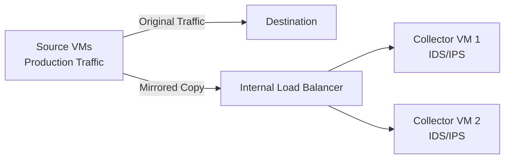

# How to Set Up Packet Mirroring for Deep Network Inspection in GCP

Author: [nawazdhandala](https://www.github.com/nawazdhandala)

Tags: GCP, Packet Mirroring, Network Security, IDS, Traffic Analysis

Description: Learn how to configure Packet Mirroring in GCP to copy network traffic to inspection tools like IDS/IPS systems for deep packet analysis and threat detection.

---

Firewall rules and flow logs tell you what connections are happening in your network, but they do not show you what is inside those connections. When you need to inspect actual packet contents - for threat detection, compliance auditing, or troubleshooting application protocols - you need Packet Mirroring.

Packet Mirroring copies traffic from specific VMs to a collector instance or internal load balancer where you run inspection tools like Suricata, Zeek, or a commercial IDS/IPS solution. The mirrored traffic is an exact copy - the original traffic is not affected.

In this post, I will walk through setting up Packet Mirroring end to end, from creating the collector to configuring mirroring policies.

## How Packet Mirroring Works



Packet Mirroring sends a copy of each packet to the collector. The source VMs do not know their traffic is being mirrored, and there is no performance impact on the source VMs since mirroring happens at the network infrastructure level.

Key components:
- **Mirrored sources**: The VMs whose traffic you want to copy. You can specify them by instance, tag, or subnet.
- **Collector**: An internal load balancer (ILB) fronting one or more collector VMs that run your inspection software.
- **Mirroring policy**: Defines which sources to mirror, which collector to send to, and optional filters on protocol, direction, and CIDR ranges.

## Step 1: Create the Collector Infrastructure

Start by creating the VMs that will receive and inspect the mirrored traffic.

### Create a Collector VM

```bash
# Create a collector VM with enough resources for traffic analysis
gcloud compute instances create ids-collector-1 \
  --zone=us-central1-a \
  --machine-type=e2-standard-4 \
  --subnet=collector-subnet \
  --image-family=debian-12 \
  --image-project=debian-cloud \
  --metadata=startup-script='#!/bin/bash
    apt-get update
    apt-get install -y suricata
    systemctl enable suricata
    systemctl start suricata'
```

```bash
# Create a second collector for redundancy
gcloud compute instances create ids-collector-2 \
  --zone=us-central1-b \
  --machine-type=e2-standard-4 \
  --subnet=collector-subnet \
  --image-family=debian-12 \
  --image-project=debian-cloud \
  --metadata=startup-script='#!/bin/bash
    apt-get update
    apt-get install -y suricata
    systemctl enable suricata
    systemctl start suricata'
```

### Create an Instance Group

```bash
# Create an unmanaged instance group for the collectors
gcloud compute instance-groups unmanaged create ids-collector-group \
  --zone=us-central1-a

gcloud compute instance-groups unmanaged add-instances ids-collector-group \
  --zone=us-central1-a \
  --instances=ids-collector-1
```

For multi-zone setups, create instance groups in each zone and add them as backends.

### Create the Internal Load Balancer

The Packet Mirroring collector must be an internal load balancer with `--is-mirroring-collector` enabled:

```bash
# Create a health check for the collector instances
gcloud compute health-checks create tcp ids-health-check \
  --port=4789 \
  --description="Health check for packet mirroring collectors"

# Create the backend service with mirroring collector flag
gcloud compute backend-services create ids-backend \
  --load-balancing-scheme=INTERNAL \
  --protocol=UDP \
  --region=us-central1 \
  --health-checks=ids-health-check \
  --is-mirroring-collector

# Add the collector instance group as a backend
gcloud compute backend-services add-backend ids-backend \
  --instance-group=ids-collector-group \
  --instance-group-zone=us-central1-a \
  --region=us-central1

# Create the forwarding rule
gcloud compute forwarding-rules create ids-forwarding-rule \
  --region=us-central1 \
  --load-balancing-scheme=INTERNAL \
  --network=production-vpc \
  --subnet=collector-subnet \
  --backend-service=ids-backend \
  --ip-protocol=UDP \
  --ports=4789 \
  --is-mirroring-collector
```

Port 4789 is the VXLAN port used to encapsulate mirrored packets.

## Step 2: Create the Packet Mirroring Policy

Now create a policy that specifies what traffic to mirror and where to send it:

```bash
# Mirror all traffic from specific tagged VMs
gcloud compute packet-mirrorings create mirror-production-web \
  --region=us-central1 \
  --network=production-vpc \
  --collector-ilb=ids-forwarding-rule \
  --mirrored-tags=web-server \
  --description="Mirror all web server traffic for IDS inspection"
```

### Mirror by Subnet

To mirror all traffic in a subnet:

```bash
# Mirror all traffic from an entire subnet
gcloud compute packet-mirrorings create mirror-subnet \
  --region=us-central1 \
  --network=production-vpc \
  --collector-ilb=ids-forwarding-rule \
  --mirrored-subnets=production-subnet \
  --description="Mirror all production subnet traffic"
```

### Mirror Specific Instances

```bash
# Mirror traffic from specific VM instances
gcloud compute packet-mirrorings create mirror-specific-vms \
  --region=us-central1 \
  --network=production-vpc \
  --collector-ilb=ids-forwarding-rule \
  --mirrored-instances=projects/my-project/zones/us-central1-a/instances/critical-vm-1,projects/my-project/zones/us-central1-a/instances/critical-vm-2 \
  --description="Mirror traffic from critical VMs"
```

## Step 3: Apply Filters

You can filter mirrored traffic to reduce the volume and focus on what matters:

```bash
# Mirror only HTTP and HTTPS traffic going to external IPs
gcloud compute packet-mirrorings create mirror-filtered \
  --region=us-central1 \
  --network=production-vpc \
  --collector-ilb=ids-forwarding-rule \
  --mirrored-tags=web-server \
  --filter-protocols=tcp \
  --filter-cidr-ranges=0.0.0.0/0 \
  --filter-direction=BOTH \
  --description="Mirror TCP traffic to/from external IPs"
```

Filter options:
- `--filter-protocols`: Specify tcp, udp, or icmp
- `--filter-cidr-ranges`: Only mirror traffic to/from these ranges
- `--filter-direction`: INGRESS, EGRESS, or BOTH

## Step 4: Configure the Collector Software

Mirrored packets arrive at the collector encapsulated in VXLAN (UDP port 4789). Your IDS/IPS needs to handle this encapsulation. Here is how to configure Suricata to inspect VXLAN-encapsulated traffic:

```bash
# SSH into the collector VM
gcloud compute ssh ids-collector-1 --zone=us-central1-a

# Create a VXLAN interface to decapsulate mirrored traffic
sudo ip link add vxlan0 type vxlan id 1 dev eth0 dstport 4789 local 10.10.0.50
sudo ip link set vxlan0 up
```

Configure Suricata to listen on the VXLAN interface. Edit the Suricata configuration:

```yaml
# /etc/suricata/suricata.yaml - relevant section
# Configure Suricata to monitor the VXLAN interface
af-packet:
  - interface: vxlan0
    cluster-id: 99
    cluster-type: cluster_flow
    defrag: yes
```

Restart Suricata:

```bash
# Restart Suricata to pick up the new configuration
sudo systemctl restart suricata

# Verify Suricata is capturing packets
sudo tail -f /var/log/suricata/fast.log
```

## Verifying Packet Mirroring

Check the mirroring policy status:

```bash
# List all packet mirroring policies
gcloud compute packet-mirrorings list \
  --region=us-central1 \
  --format="table(name, network, mirroredResources, collectorIlb, enable)"
```

```bash
# Describe a specific policy
gcloud compute packet-mirrorings describe mirror-production-web \
  --region=us-central1
```

Generate test traffic from a mirrored VM and verify it appears on the collector:

```bash
# On the collector VM, use tcpdump to verify mirrored packets arrive
sudo tcpdump -i eth0 -n port 4789 -c 10
```

## Enabling and Disabling Mirroring

You can temporarily disable mirroring without deleting the policy:

```bash
# Disable mirroring (pauses packet copying)
gcloud compute packet-mirrorings update mirror-production-web \
  --region=us-central1 \
  --no-enable

# Re-enable mirroring
gcloud compute packet-mirrorings update mirror-production-web \
  --region=us-central1 \
  --enable
```

## Cost and Performance Considerations

Packet Mirroring itself does not charge per packet, but you pay for:

- **Collector VM compute costs**: The collector VMs need to be sized to handle the traffic volume
- **Network egress**: If the collector is in a different zone, you pay inter-zone egress for mirrored traffic
- **Storage**: If your IDS stores captured packets for forensic analysis

To minimize costs:
- Use filters to mirror only the traffic you need
- Place collectors in the same zone as mirrored sources
- Start with a small subset of VMs and expand as needed

## Wrapping Up

Packet Mirroring gives you deep visibility into your network traffic without installing agents on your VMs or modifying your applications. It is essential for organizations that need IDS/IPS capabilities, regulatory compliance requiring packet-level auditing, or deep troubleshooting of network issues. Set up your collector infrastructure, create targeted mirroring policies with appropriate filters, and make sure your IDS is configured to handle VXLAN-encapsulated traffic. The key is starting focused - mirror critical workloads first, then expand as you build confidence in your collector capacity.
