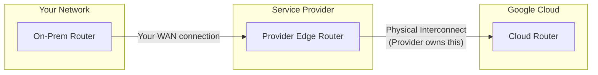

# How to Set Up Partner Interconnect with a Service Provider in GCP

Author: [nawazdhandala](https://www.github.com/nawazdhandala)

Tags: GCP, Partner Interconnect, Cloud Interconnect, Networking, Hybrid Cloud

Description: A practical guide to setting up Partner Interconnect in GCP through a supported service provider for hybrid cloud connectivity without dedicated physical links.

---

Not every organization has equipment in a colocation facility where Google has Dedicated Interconnect. Maybe your data center is in a location that Google does not serve directly, or maybe you do not need 10 Gbps of bandwidth. This is where Partner Interconnect comes in.

Partner Interconnect lets you connect to Google Cloud through a supported service provider. The provider has the physical connection to Google, and you get a logical connection through them. Bandwidth options range from 50 Mbps to 50 Gbps, and you do not need to worry about cross-connects or fiber optics.

## How Partner Interconnect Differs from Dedicated

The key difference is the physical layer. With Dedicated Interconnect, you own the physical connection. With Partner Interconnect, the service provider owns it, and you get a VLAN on their infrastructure:



From a practical standpoint:

- **Setup is faster**: Days instead of weeks, since no physical cross-connects are needed
- **Lower minimum bandwidth**: Start at 50 Mbps instead of 10 Gbps
- **Flexible locations**: Providers often cover locations Google does not serve directly
- **The trade-off**: Slightly higher latency and you depend on the provider's network

## Step 1: Choose a Service Provider

Google maintains a list of approved Partner Interconnect providers. The choice depends on:

- Geographic coverage (where your data center is)
- Available bandwidth tiers
- Pricing
- Whether they support Layer 2 or Layer 3 connectivity

To see available providers for a region:

```bash
# List Partner Interconnect locations and providers
gcloud compute interconnects locations list \
    --filter="facilityProviderFacilityId:*" \
    --format="table(name, description, facilityProvider, city)"
```

Common providers include Equinix, Megaport, Colt, Console Connect, and many regional carriers.

## Step 2: Decide Between Layer 2 and Layer 3

Service providers offer two types of Partner Interconnect:

**Layer 2 (L2)**: The provider gives you a raw VLAN and you manage BGP yourself between your router and Cloud Router. You have full control over routing.

**Layer 3 (L3)**: The provider manages BGP on your behalf. They peer with Cloud Router and with your router, acting as a route reflector. This is simpler but gives you less control.

For most scenarios, Layer 2 is preferred because it gives you direct BGP control and is more flexible. Use Layer 3 only if you do not have a BGP-capable router.

## Step 3: Create VLAN Attachments in GCP

Before contacting the provider, create the VLAN attachment on the GCP side. This generates a pairing key that the provider needs.

```bash
# Create a Cloud Router
gcloud compute routers create partner-router \
    --network=my-vpc \
    --region=us-east4 \
    --asn=16550

# Create the Partner Interconnect VLAN attachment
gcloud compute interconnects attachments partner create partner-attachment-1 \
    --router=partner-router \
    --region=us-east4 \
    --edge-availability-domain=availability-domain-1 \
    --description="Primary partner attachment"
```

Retrieve the pairing key:

```bash
# Get the pairing key for the provider
gcloud compute interconnects attachments describe partner-attachment-1 \
    --region=us-east4 \
    --format="value(pairingKey)"
```

The pairing key looks something like this:
```
7e51371e-72a3-40b5-b844-2e3efefaee59/us-east4/1
```

Write this down - you will give it to the service provider.

## Step 4: Create a Second Attachment for Redundancy

For the 99.99% SLA, create a second attachment in a different Edge Availability Domain:

```bash
# Create a second attachment in a different availability domain
gcloud compute interconnects attachments partner create partner-attachment-2 \
    --router=partner-router \
    --region=us-east4 \
    --edge-availability-domain=availability-domain-2 \
    --description="Redundant partner attachment"

# Get the second pairing key
gcloud compute interconnects attachments describe partner-attachment-2 \
    --region=us-east4 \
    --format="value(pairingKey)"
```

## Step 5: Work with the Service Provider

Now contact your chosen service provider and give them:

1. Both pairing keys
2. The bandwidth you want (e.g., 1 Gbps)
3. The VLAN ID preferences (if the provider allows you to choose)
4. Whether you want Layer 2 or Layer 3

The provider will set up their side of the connection. This typically takes anywhere from a few hours to a few days depending on the provider and whether you have an existing relationship with them.

## Step 6: Activate the Attachments

Once the provider completes their setup, the attachment state changes from `PENDING_PARTNER` to `PENDING_CUSTOMER`. You need to activate it:

```bash
# Check the attachment state
gcloud compute interconnects attachments describe partner-attachment-1 \
    --region=us-east4 \
    --format="value(state)"

# If it shows PENDING_CUSTOMER, activate it
gcloud compute interconnects attachments partner update partner-attachment-1 \
    --region=us-east4 \
    --admin-enabled
```

Do the same for the second attachment:

```bash
# Activate the redundant attachment
gcloud compute interconnects attachments partner update partner-attachment-2 \
    --region=us-east4 \
    --admin-enabled
```

At this point, verify the attachment details match what you expected:

```bash
# Verify the attachment configuration
gcloud compute interconnects attachments describe partner-attachment-1 \
    --region=us-east4 \
    --format="yaml(name, state, partnerMetadata, cloudRouterIpAddress, customerRouterIpAddress, vlanTag8021q)"
```

## Step 7: Configure BGP (Layer 2 Only)

If you chose Layer 2, you need to configure BGP sessions between your router and Cloud Router.

Add BGP peers on the Cloud Router:

```bash
# Add BGP peer for the first attachment
gcloud compute routers add-interface partner-router \
    --interface-name=if-partner-1 \
    --interconnect-attachment=partner-attachment-1 \
    --region=us-east4

gcloud compute routers add-bgp-peer partner-router \
    --peer-name=onprem-peer-1 \
    --interface=if-partner-1 \
    --peer-ip-address=169.254.60.2 \
    --peer-asn=65001 \
    --region=us-east4

# Add BGP peer for the second attachment
gcloud compute routers add-interface partner-router \
    --interface-name=if-partner-2 \
    --interconnect-attachment=partner-attachment-2 \
    --region=us-east4

gcloud compute routers add-bgp-peer partner-router \
    --peer-name=onprem-peer-2 \
    --interface=if-partner-2 \
    --peer-ip-address=169.254.61.2 \
    --peer-asn=65001 \
    --region=us-east4
```

On your on-premises router, configure matching BGP sessions using the Cloud Router IP addresses and VLAN IDs from the attachment details.

## Step 8: Verify Connectivity

```bash
# Check BGP peer status
gcloud compute routers get-status partner-router \
    --region=us-east4 \
    --format="table(result.bgpPeerStatus[].name, result.bgpPeerStatus[].status, result.bgpPeerStatus[].numLearnedRoutes)"

# Check attachment operational status
gcloud compute interconnects attachments list \
    --region=us-east4 \
    --format="table(name, state, operationalStatus, type)"
```

## Cost Considerations

Partner Interconnect pricing has several components:

- **GCP VLAN attachment fee**: Monthly charge per attachment, varies by bandwidth
- **Service provider fee**: Varies widely by provider. Get quotes from multiple providers
- **Egress traffic**: Standard GCP egress pricing with interconnect discount

The total cost is typically lower than Dedicated Interconnect for bandwidths under 10 Gbps, but once you need consistent high bandwidth, Dedicated becomes more cost-effective.

## Monitoring

Set up monitoring for both your attachments:

```bash
# Check attachment health metrics
gcloud monitoring metrics list \
    --filter="metric.type:interconnect" \
    --format="table(name, description)"
```

Key metrics to watch:

- `compute.googleapis.com/interconnect/link/received_bytes_count` - incoming traffic
- `compute.googleapis.com/interconnect/link/transmitted_bytes_count` - outgoing traffic
- `compute.googleapis.com/interconnect/attachment/received_bytes_count` - per-attachment traffic
- BGP session status through Cloud Router metrics

## Common Pitfalls

**Attachment stuck in PENDING_PARTNER**: The provider has not completed their configuration yet. Contact them with your pairing key.

**Forgetting to activate**: After the provider is done, you must explicitly enable the attachment with `--admin-enabled`. Many people miss this step.

**Wrong Edge Availability Domain**: If both attachments are in the same domain, you do not qualify for the 99.99% SLA. Always use different domains.

**Layer 3 provider but trying to configure BGP**: If your provider handles BGP (Layer 3), you do not need to add BGP peers on Cloud Router. The provider takes care of it.

## Wrapping Up

Partner Interconnect is a great middle ground between VPN (limited bandwidth, variable latency) and Dedicated Interconnect (requires physical presence, high minimum bandwidth). The setup involves a bit of coordination with the service provider, but once the pairing keys are exchanged and both sides activate, you get reliable, low-latency connectivity to GCP. Always create attachments in pairs across different Edge Availability Domains, and verify your BGP sessions are healthy before routing production traffic.
