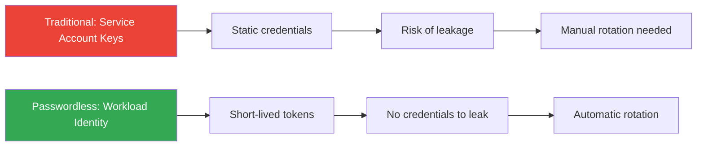

# How to Set Up Passwordless Authentication for Google Cloud Workloads

Author: [nawazdhandala](https://www.github.com/nawazdhandala)

Tags: GCP, Passwordless Authentication, Workload Identity, Service Accounts, Google Cloud Security

Description: Learn how to set up passwordless authentication for Google Cloud workloads using workload identity federation, eliminating the need for service account keys.

---

Service account keys are one of the most common security vulnerabilities in Google Cloud environments. They are long-lived credentials that can be stolen, accidentally committed to git repositories, or leaked through logs. Passwordless authentication eliminates these risks by letting your workloads authenticate to Google Cloud without any static credentials.

Google Cloud offers several mechanisms for passwordless workload authentication depending on where your workload runs. This guide covers each scenario with practical setup instructions.

## Why Passwordless Authentication Matters

Every service account key is a liability. They do not expire by default, they can be copied, and once compromised, they provide persistent access until someone rotates them. Google's own security guidance recommends avoiding service account keys entirely.



## Scenario 1: GKE Workloads with Workload Identity

For applications running on Google Kubernetes Engine, Workload Identity is the standard approach. It maps Kubernetes service accounts to Google Cloud service accounts.

```bash
# Enable Workload Identity on your GKE cluster
gcloud container clusters update my-cluster \
    --workload-pool=my-project.svc.id.goog \
    --zone=us-central1-a

# Create a Google Cloud service account for your workload
gcloud iam service-accounts create my-app-sa \
    --display-name="My App Service Account"

# Grant the Kubernetes service account permission to impersonate the GCP service account
gcloud iam service-accounts add-iam-policy-binding my-app-sa@my-project.iam.gserviceaccount.com \
    --role=roles/iam.workloadIdentityUser \
    --member="serviceAccount:my-project.svc.id.goog[my-namespace/my-k8s-sa]"

# Grant the GCP service account permissions it needs
gcloud projects add-iam-policy-binding my-project \
    --role=roles/storage.objectViewer \
    --member="serviceAccount:my-app-sa@my-project.iam.gserviceaccount.com"
```

Configure the Kubernetes service account to use the GCP identity:

```yaml
# k8s-service-account.yaml
# Kubernetes service account annotated for Workload Identity
apiVersion: v1
kind: ServiceAccount
metadata:
  name: my-k8s-sa
  namespace: my-namespace
  annotations:
    # This annotation links the K8s SA to the GCP SA
    iam.gke.io/gcp-service-account: my-app-sa@my-project.iam.gserviceaccount.com
```

```yaml
# deployment.yaml
# Pod spec that uses the workload identity service account
apiVersion: apps/v1
kind: Deployment
metadata:
  name: my-app
  namespace: my-namespace
spec:
  template:
    spec:
      serviceAccountName: my-k8s-sa
      containers:
        - name: app
          image: gcr.io/my-project/my-app:latest
          # No credentials needed - the app uses Application Default Credentials
          # which automatically picks up the Workload Identity token
```

Your application code does not need any changes. The Google Cloud client libraries automatically detect the Workload Identity environment:

```python
# Application code - no credentials specified
# The client library automatically uses Workload Identity tokens
from google.cloud import storage

# This works without any explicit credentials
client = storage.Client()
bucket = client.get_bucket('my-bucket')
blobs = list(bucket.list_blobs())
```

## Scenario 2: Compute Engine with Default Service Account

VMs on Compute Engine can use the metadata server to obtain tokens without any keys:

```bash
# Create a VM with a specific service account (no keys needed)
gcloud compute instances create my-vm \
    --zone=us-central1-a \
    --service-account=my-app-sa@my-project.iam.gserviceaccount.com \
    --scopes=cloud-platform \
    --no-service-account-key
```

From inside the VM, applications automatically get tokens from the metadata server:

```bash
# Verify that the VM is using the correct service account
# This queries the metadata server directly
curl -H "Metadata-Flavor: Google" \
    "http://metadata.google.internal/computeMetadata/v1/instance/service-accounts/default/email"

# Get an access token from the metadata server
curl -H "Metadata-Flavor: Google" \
    "http://metadata.google.internal/computeMetadata/v1/instance/service-accounts/default/token"
```

## Scenario 3: External Workloads with Workload Identity Federation

For workloads running outside Google Cloud (AWS, Azure, on-premises), Workload Identity Federation lets them exchange their native credentials for Google Cloud access tokens:

### Federating with AWS

```bash
# Create a workload identity pool
gcloud iam workload-identity-pools create aws-pool \
    --location=global \
    --description="Pool for AWS workloads"

# Create an AWS provider in the pool
gcloud iam workload-identity-pools providers create-aws aws-provider \
    --workload-identity-pool=aws-pool \
    --location=global \
    --account-id=123456789012

# Allow the AWS role to impersonate a GCP service account
gcloud iam service-accounts add-iam-policy-binding my-app-sa@my-project.iam.gserviceaccount.com \
    --role=roles/iam.workloadIdentityUser \
    --member="principalSet://iam.googleapis.com/projects/PROJECT_NUMBER/locations/global/workloadIdentityPools/aws-pool/attribute.aws_role/arn:aws:sts::123456789012:assumed-role/my-aws-role"
```

Generate a credential configuration file that your application uses:

```bash
# Generate a credential config for the AWS workload
gcloud iam workload-identity-pools create-cred-config \
    projects/PROJECT_NUMBER/locations/global/workloadIdentityPools/aws-pool/providers/aws-provider \
    --service-account=my-app-sa@my-project.iam.gserviceaccount.com \
    --aws \
    --output-file=credential-config.json
```

On the AWS side, set the environment variable and use Google Cloud libraries:

```bash
# Set the credential config path
export GOOGLE_APPLICATION_CREDENTIALS=/path/to/credential-config.json

# Your application uses Google Cloud libraries normally
# The library handles the token exchange automatically
python my_app.py
```

### Federating with GitHub Actions

```bash
# Create a provider for GitHub Actions OIDC
gcloud iam workload-identity-pools providers create-oidc github-provider \
    --workload-identity-pool=ci-pool \
    --location=global \
    --issuer-uri="https://token.actions.githubusercontent.com" \
    --attribute-mapping="google.subject=assertion.sub,attribute.repository=assertion.repository" \
    --attribute-condition="assertion.repository == 'myorg/myrepo'"

# Allow the GitHub repo to impersonate a service account
gcloud iam service-accounts add-iam-policy-binding deploy-sa@my-project.iam.gserviceaccount.com \
    --role=roles/iam.workloadIdentityUser \
    --member="principalSet://iam.googleapis.com/projects/PROJECT_NUMBER/locations/global/workloadIdentityPools/ci-pool/attribute.repository/myorg/myrepo"
```

Use it in your GitHub Actions workflow:

```yaml
# .github/workflows/deploy.yml
# GitHub Actions workflow using workload identity federation
name: Deploy to GCP
on: push

permissions:
  id-token: write  # Required for OIDC token
  contents: read

jobs:
  deploy:
    runs-on: ubuntu-latest
    steps:
      - uses: google-github-actions/auth@v2
        with:
          # No service account key needed
          workload_identity_provider: 'projects/PROJECT_NUMBER/locations/global/workloadIdentityPools/ci-pool/providers/github-provider'
          service_account: 'deploy-sa@my-project.iam.gserviceaccount.com'

      - uses: google-github-actions/setup-gcloud@v2

      - run: gcloud compute instances list
```

## Scenario 4: Cloud Run and Cloud Functions

Cloud Run and Cloud Functions automatically have access to a service account identity without keys:

```bash
# Deploy Cloud Run with a specific service account
gcloud run deploy my-service \
    --image=gcr.io/my-project/my-service:latest \
    --service-account=my-app-sa@my-project.iam.gserviceaccount.com \
    --region=us-central1
```

The application code uses Application Default Credentials:

```python
# Cloud Run / Cloud Functions - no credentials needed
from google.cloud import bigquery

def handle_request(request):
    # Client automatically uses the service's identity
    client = bigquery.Client()
    query_job = client.query("SELECT COUNT(*) FROM `my_dataset.my_table`")
    results = query_job.result()
    return str(list(results))
```

## Disabling Service Account Key Creation

Once you have migrated to passwordless authentication, prevent new key creation:

```bash
# Set an organization policy to disable service account key creation
gcloud resource-manager org-policies set-policy disable-sa-keys.yaml \
    --organization=123456789
```

```yaml
# disable-sa-keys.yaml
# Prevents creation of new service account keys across the organization
constraint: iam.disableServiceAccountKeyCreation
booleanPolicy:
  enforced: true
```

## Auditing Existing Key Usage

Before disabling keys, find which ones are still in use:

```bash
# List all service account keys across the project
gcloud iam service-accounts list --format="value(email)" | while read sa; do
  echo "Service Account: $sa"
  gcloud iam service-accounts keys list --iam-account="$sa" \
    --managed-by=user \
    --format="table(name.basename(), validAfterTime, validBeforeTime)"
done

# Check key usage in Cloud Monitoring
gcloud logging read 'protoPayload.authenticationInfo.serviceAccountKeyName!=""' \
    --limit=100 \
    --format="table(timestamp, protoPayload.authenticationInfo.principalEmail, protoPayload.authenticationInfo.serviceAccountKeyName)"
```

## Summary

Moving to passwordless authentication is one of the highest-impact security improvements you can make in your Google Cloud environment. Use Workload Identity for GKE, the metadata server for Compute Engine, Workload Identity Federation for external workloads, and built-in service identity for Cloud Run and Cloud Functions. Once everything is migrated, disable key creation at the organization level and never worry about leaked keys again.
