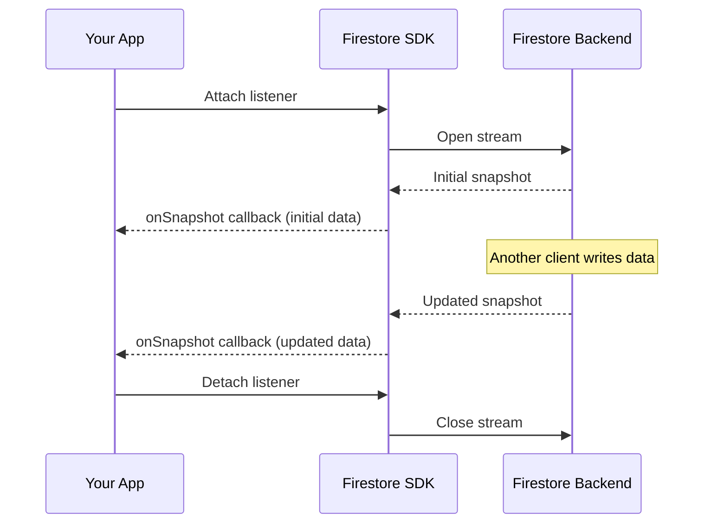

# How to Set Up Real-Time Listeners for Live Data Updates in Firestore

Author: [nawazdhandala](https://www.github.com/nawazdhandala)

Tags: GCP, Firestore, Real-Time, Listeners, Firebase

Description: Learn how to use Firestore real-time listeners to push live data updates to your application without polling or manual refreshes.

---

Polling a database every few seconds to check for changes is wasteful and slow. Firestore solves this with real-time listeners - you subscribe to a document or query, and Firestore pushes updates to your app the instant data changes. No polling, no WebSocket servers to manage, no infrastructure to maintain.

I have used this pattern in everything from chat applications to live dashboards, and it consistently delivers a great user experience with minimal code. Let me walk you through how to set it up properly.

## How Real-Time Listeners Work

When you attach a listener to a Firestore document or query, the SDK opens a persistent connection to the Firestore backend. Whenever the data you are listening to changes - whether from your app, another user, or a Cloud Function - Firestore sends the updated data down that connection immediately.

The listener fires once with the initial data and then again whenever the data changes. On the client side, you get a snapshot object that contains the current state of the data.



## Listening to a Single Document

The simplest case is listening to one document. This is useful for things like a user's profile, app settings, or a single chat room.

```javascript
// Listen to a single document for real-time updates
// The callback fires immediately with current data, then on every change
import { doc, onSnapshot } from 'firebase/firestore';

const userRef = doc(db, 'users', 'user-123');

const unsubscribe = onSnapshot(userRef, (snapshot) => {
  if (snapshot.exists()) {
    const userData = snapshot.data();
    console.log('User data:', userData);
    // Update your UI here
    updateUserProfile(userData);
  } else {
    console.log('Document does not exist');
  }
});

// When you are done listening (e.g., component unmount), unsubscribe
// This is important to prevent memory leaks
unsubscribe();
```

Always store the unsubscribe function and call it when you no longer need updates. In React, you would do this in a `useEffect` cleanup. In Angular, in `ngOnDestroy`. Forgetting to unsubscribe is one of the most common sources of memory leaks in Firestore apps.

## Listening to a Collection or Query

You can also listen to an entire collection or a filtered query. Every time any document in the result set changes, your listener fires.

```javascript
// Listen to all documents in a collection that match a query
// This returns all active orders and updates whenever any of them change
import { collection, query, where, orderBy, onSnapshot } from 'firebase/firestore';

const ordersQuery = query(
  collection(db, 'orders'),
  where('status', '==', 'active'),
  orderBy('createdAt', 'desc')
);

const unsubscribe = onSnapshot(ordersQuery, (querySnapshot) => {
  const orders = [];
  querySnapshot.forEach((doc) => {
    orders.push({ id: doc.id, ...doc.data() });
  });
  console.log(`Got ${orders.length} active orders`);
  renderOrderList(orders);
});
```

## Tracking Document Changes

When a query snapshot fires, you do not have to rebuild your entire list from scratch. Firestore tells you exactly which documents changed and how.

```javascript
// Track individual document changes within a query snapshot
// This is much more efficient than rebuilding the entire list
import { collection, onSnapshot } from 'firebase/firestore';

const unsubscribe = onSnapshot(collection(db, 'messages'), (snapshot) => {
  snapshot.docChanges().forEach((change) => {
    const messageData = { id: change.doc.id, ...change.doc.data() };

    if (change.type === 'added') {
      // A new document was added to the result set
      console.log('New message:', messageData);
      addMessageToUI(messageData);
    }

    if (change.type === 'modified') {
      // An existing document was updated
      console.log('Modified message:', messageData);
      updateMessageInUI(messageData);
    }

    if (change.type === 'removed') {
      // A document was removed from the result set
      // This could mean it was deleted or no longer matches the query
      console.log('Removed message:', messageData);
      removeMessageFromUI(messageData.id);
    }
  });
});
```

This is particularly powerful for building chat UIs, live feeds, or any list that needs to update in real time. Instead of re-rendering the entire list, you only touch the items that actually changed.

## Handling Errors

Listeners can fail for several reasons - network issues, permission changes, or the user's auth token expiring. Always include an error handler.

```javascript
// Always include an error handler with your listeners
// This catches permission errors, network issues, etc.
import { doc, onSnapshot } from 'firebase/firestore';

const unsubscribe = onSnapshot(
  doc(db, 'restricted', 'secret-doc'),
  (snapshot) => {
    // Success handler
    console.log('Data:', snapshot.data());
  },
  (error) => {
    // Error handler
    console.error('Listener error:', error.code, error.message);

    if (error.code === 'permission-denied') {
      // User lost access - maybe they were signed out
      showPermissionError();
    }
  }
);
```

When a listener encounters an error, it is automatically detached. You will not receive any more updates. If you want to retry, you need to attach a new listener.

## Using Listeners with React

If you are using React, here is a clean pattern with hooks:

```javascript
// Custom React hook for real-time Firestore data
// Handles subscription and cleanup automatically
import { useState, useEffect } from 'react';
import { doc, onSnapshot } from 'firebase/firestore';

function useFirestoreDoc(collectionName, docId) {
  const [data, setData] = useState(null);
  const [loading, setLoading] = useState(true);
  const [error, setError] = useState(null);

  useEffect(() => {
    if (!docId) return;

    // Attach listener when component mounts or docId changes
    const unsubscribe = onSnapshot(
      doc(db, collectionName, docId),
      (snapshot) => {
        setData(snapshot.exists() ? { id: snapshot.id, ...snapshot.data() } : null);
        setLoading(false);
      },
      (err) => {
        setError(err);
        setLoading(false);
      }
    );

    // Cleanup: detach listener when component unmounts
    return () => unsubscribe();
  }, [collectionName, docId]);

  return { data, loading, error };
}

// Usage in a component
function UserProfile({ userId }) {
  const { data: user, loading, error } = useFirestoreDoc('users', userId);

  if (loading) return <div>Loading...</div>;
  if (error) return <div>Error: {error.message}</div>;
  if (!user) return <div>User not found</div>;

  return <div>{user.displayName}</div>;
}
```

## Metadata and Cache Awareness

Snapshots include metadata that tells you whether the data came from the server or the local cache.

```javascript
// Include metadata changes in your listener
// This lets you distinguish between cached and server data
import { doc, onSnapshot } from 'firebase/firestore';

const unsubscribe = onSnapshot(
  doc(db, 'posts', 'post-1'),
  { includeMetadataChanges: true },  // Opt in to metadata change events
  (snapshot) => {
    const source = snapshot.metadata.fromCache ? 'local cache' : 'server';
    console.log(`Data from ${source}:`, snapshot.data());

    if (snapshot.metadata.hasPendingWrites) {
      console.log('This data includes local changes not yet synced');
    }
  }
);
```

By default, the listener only fires when data changes. With `includeMetadataChanges: true`, it also fires when the metadata changes - for example, when cached data is confirmed by the server.

## Performance Considerations

Each active listener maintains a connection and consumes bandwidth. For most apps this is not a problem, but if you are listening to hundreds of queries simultaneously, you might run into issues.

A few tips to keep things efficient. First, listen to specific queries rather than entire collections whenever possible. If you only need active orders, filter by status instead of listening to all orders and filtering client-side. Second, detach listeners you no longer need. If the user navigates away from a page, unsubscribe from that page's listeners. Third, consider using snapshot listeners for frequently changing data and one-time reads (`getDoc`) for data that rarely changes.

## Wrapping Up

Real-time listeners are one of Firestore's strongest features. They let you build reactive applications with minimal code and zero infrastructure overhead. The key is to manage your listeners carefully - always unsubscribe when done, handle errors gracefully, and be thoughtful about what you listen to. Get these basics right, and you can build anything from a simple live counter to a full collaborative editing experience.
