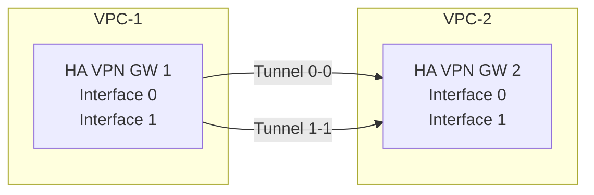
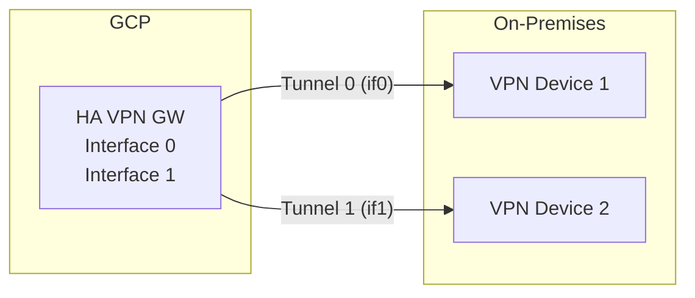
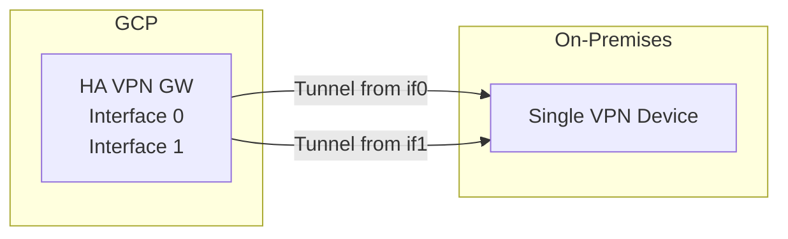

# How to Set Up Redundant VPN Tunnels for 99.99 Percent SLA on GCP HA VPN

Author: [nawazdhandala](https://www.github.com/nawazdhandala)

Tags: GCP, HA VPN, Redundancy, SLA, Cloud VPN, High Availability

Description: Learn how to configure redundant VPN tunnels on GCP HA VPN to achieve the 99.99 percent availability SLA with proper gateway and tunnel setup.

---

GCP offers a 99.99% availability SLA for HA VPN, but only if you configure it correctly. A single tunnel will not cut it. You need redundant tunnels across multiple interfaces and, ideally, multiple HA VPN gateways. In this post, I will show you exactly what configuration qualifies for the full SLA and how to set it up.

## What the SLA Actually Requires

Google's 99.99% SLA for HA VPN is not automatic. You must meet specific configuration requirements:

- Each HA VPN gateway has two interfaces (interface 0 and interface 1)
- You must configure tunnels on both interfaces
- Both tunnels must be active and passing traffic
- You must use dynamic routing with Cloud Router (BGP)

The SLA covers the GCP side of the connection. If your on-premises device fails, that is outside the SLA scope.

## Architecture Options

There are three main configurations that qualify for the SLA, depending on what you are connecting to:

### Option 1: GCP to GCP (Two HA VPN Gateways)

When connecting two VPC networks in GCP, you create tunnels between both interfaces of each gateway:



### Option 2: GCP to On-Premises (Two On-Prem Devices)

For the highest availability with on-premises connections, use two on-premises VPN devices:



### Option 3: GCP to On-Premises (Single On-Prem Device)

If you only have one on-premises device with a single external IP, you still create two tunnels from both GCP interfaces to that device:



This still qualifies for the SLA because both GCP gateway interfaces have active tunnels.

## Step-by-Step Setup (GCP to On-Premises, Two Devices)

Let me walk through the most common production setup: connecting to two on-premises VPN devices.

### Create the HA VPN Gateway

```bash
# Create HA VPN gateway in your VPC
gcloud compute vpn-gateways create ha-vpn-gw \
    --network=production-vpc \
    --region=us-central1
```

### Create the External VPN Gateway

Define your on-premises devices as an external VPN gateway with two interfaces:

```bash
# Define the two on-premises VPN devices
gcloud compute external-vpn-gateways create onprem-vpn-gw \
    --interfaces=0=203.0.113.1,1=203.0.113.2
```

Here, `203.0.113.1` is your first on-premises device and `203.0.113.2` is the second.

### Create Cloud Router

```bash
# Create Cloud Router with a private ASN
gcloud compute routers create ha-vpn-router \
    --region=us-central1 \
    --network=production-vpc \
    --asn=65001
```

### Create Four VPN Tunnels

For full redundancy with two on-premises devices, create four tunnels - one from each GCP interface to each on-premises device:

```bash
# Tunnel 1: GCP interface 0 to on-prem device 0
gcloud compute vpn-tunnels create tunnel-0-to-onprem-0 \
    --peer-external-gateway=onprem-vpn-gw \
    --peer-external-gateway-interface=0 \
    --region=us-central1 \
    --ike-version=2 \
    --shared-secret=secret-tunnel-0-0 \
    --router=ha-vpn-router \
    --vpn-gateway=ha-vpn-gw \
    --interface=0

# Tunnel 2: GCP interface 0 to on-prem device 1
gcloud compute vpn-tunnels create tunnel-0-to-onprem-1 \
    --peer-external-gateway=onprem-vpn-gw \
    --peer-external-gateway-interface=1 \
    --region=us-central1 \
    --ike-version=2 \
    --shared-secret=secret-tunnel-0-1 \
    --router=ha-vpn-router \
    --vpn-gateway=ha-vpn-gw \
    --interface=0

# Tunnel 3: GCP interface 1 to on-prem device 0
gcloud compute vpn-tunnels create tunnel-1-to-onprem-0 \
    --peer-external-gateway=onprem-vpn-gw \
    --peer-external-gateway-interface=0 \
    --region=us-central1 \
    --ike-version=2 \
    --shared-secret=secret-tunnel-1-0 \
    --router=ha-vpn-router \
    --vpn-gateway=ha-vpn-gw \
    --interface=1

# Tunnel 4: GCP interface 1 to on-prem device 1
gcloud compute vpn-tunnels create tunnel-1-to-onprem-1 \
    --peer-external-gateway=onprem-vpn-gw \
    --peer-external-gateway-interface=1 \
    --region=us-central1 \
    --ike-version=2 \
    --shared-secret=secret-tunnel-1-1 \
    --router=ha-vpn-router \
    --vpn-gateway=ha-vpn-gw \
    --interface=1
```

### Configure BGP Sessions

Each tunnel needs its own BGP session. Here are the four BGP configurations:

```bash
# BGP for tunnel 0 to on-prem device 0
gcloud compute routers add-interface ha-vpn-router \
    --interface-name=if-tunnel-0-0 \
    --ip-address=169.254.0.1 \
    --mask-length=30 \
    --vpn-tunnel=tunnel-0-to-onprem-0 \
    --region=us-central1

gcloud compute routers add-bgp-peer ha-vpn-router \
    --peer-name=peer-tunnel-0-0 \
    --interface=if-tunnel-0-0 \
    --peer-ip-address=169.254.0.2 \
    --peer-asn=65002 \
    --region=us-central1

# BGP for tunnel 0 to on-prem device 1
gcloud compute routers add-interface ha-vpn-router \
    --interface-name=if-tunnel-0-1 \
    --ip-address=169.254.1.1 \
    --mask-length=30 \
    --vpn-tunnel=tunnel-0-to-onprem-1 \
    --region=us-central1

gcloud compute routers add-bgp-peer ha-vpn-router \
    --peer-name=peer-tunnel-0-1 \
    --interface=if-tunnel-0-1 \
    --peer-ip-address=169.254.1.2 \
    --peer-asn=65003 \
    --region=us-central1

# BGP for tunnel 1 to on-prem device 0
gcloud compute routers add-interface ha-vpn-router \
    --interface-name=if-tunnel-1-0 \
    --ip-address=169.254.2.1 \
    --mask-length=30 \
    --vpn-tunnel=tunnel-1-to-onprem-0 \
    --region=us-central1

gcloud compute routers add-bgp-peer ha-vpn-router \
    --peer-name=peer-tunnel-1-0 \
    --interface=if-tunnel-1-0 \
    --peer-ip-address=169.254.2.2 \
    --peer-asn=65002 \
    --region=us-central1

# BGP for tunnel 1 to on-prem device 1
gcloud compute routers add-interface ha-vpn-router \
    --interface-name=if-tunnel-1-1 \
    --ip-address=169.254.3.1 \
    --mask-length=30 \
    --vpn-tunnel=tunnel-1-to-onprem-1 \
    --region=us-central1

gcloud compute routers add-bgp-peer ha-vpn-router \
    --peer-name=peer-tunnel-1-1 \
    --interface=if-tunnel-1-1 \
    --peer-ip-address=169.254.3.2 \
    --peer-asn=65003 \
    --region=us-central1
```

## Verifying Redundancy

After everything is set up, verify that all tunnels are established and BGP sessions are up:

```bash
# Check all VPN tunnel statuses
gcloud compute vpn-tunnels list \
    --region=us-central1 \
    --format="table(name, status, detailedStatus)"

# Check BGP peer statuses
gcloud compute routers get-status ha-vpn-router \
    --region=us-central1 \
    --format="table(result.bgpPeerStatus[].name, result.bgpPeerStatus[].status, result.bgpPeerStatus[].numLearnedRoutes)"
```

All tunnels should show `ESTABLISHED` and all BGP peers should show `UP`.

## Checking Your SLA Coverage

GCP provides a way to check the HA VPN SLA coverage directly:

```bash
# Check the HA VPN gateway status including SLA coverage
gcloud compute vpn-gateways get-status ha-vpn-gw \
    --region=us-central1 \
    --format="yaml(result.vpnConnections)"
```

Look for `highAvailability.state` in the output. It should show `CONNECTION_REDUNDANCY_MET` for the full SLA.

Possible values:

- **CONNECTION_REDUNDANCY_MET**: Full 99.99% SLA coverage
- **CONNECTION_REDUNDANCY_NOT_MET**: Some tunnels are missing or down - no SLA
- **CONNECTION_REDUNDANCY_DEGRADED**: Partial redundancy - reduced SLA

## Traffic Distribution Across Tunnels

With multiple tunnels, Cloud Router distributes traffic using ECMP (Equal-Cost Multi-Path) routing. This means:

- Traffic is distributed per-flow, not per-packet
- Each TCP/UDP flow is consistently routed through one tunnel
- Different flows may use different tunnels
- If a tunnel goes down, flows automatically shift to remaining tunnels

You do not need to configure anything special for this. Cloud Router handles it automatically based on the BGP routes learned from each tunnel.

## Monitoring Redundancy Health

Set up alerts to know immediately if you lose redundancy:

```bash
# Monitor that all tunnels stay up
gcloud alpha monitoring policies create \
    --display-name="VPN Redundancy Alert" \
    --condition-display-name="VPN tunnel down" \
    --condition-filter='metric.type="compute.googleapis.com/vpn/tunnel_established" AND resource.type="vpn_gateway"' \
    --condition-comparison=COMPARISON_LT \
    --condition-threshold-value=1 \
    --condition-duration=60s \
    --notification-channels=projects/my-project/notificationChannels/12345
```

This triggers when any tunnel drops, giving you time to fix it before losing more tunnels and breaking the SLA.

## Wrapping Up

Getting the 99.99% SLA on HA VPN comes down to one principle: redundancy at every layer. Both gateway interfaces must have active tunnels, BGP sessions must be healthy on all tunnels, and your on-premises side should ideally have redundant devices too. The four-tunnel configuration with two on-premises devices gives you the best resilience. Use the `get-status` command to verify your SLA coverage, and set up monitoring alerts so you know the moment a tunnel drops.
