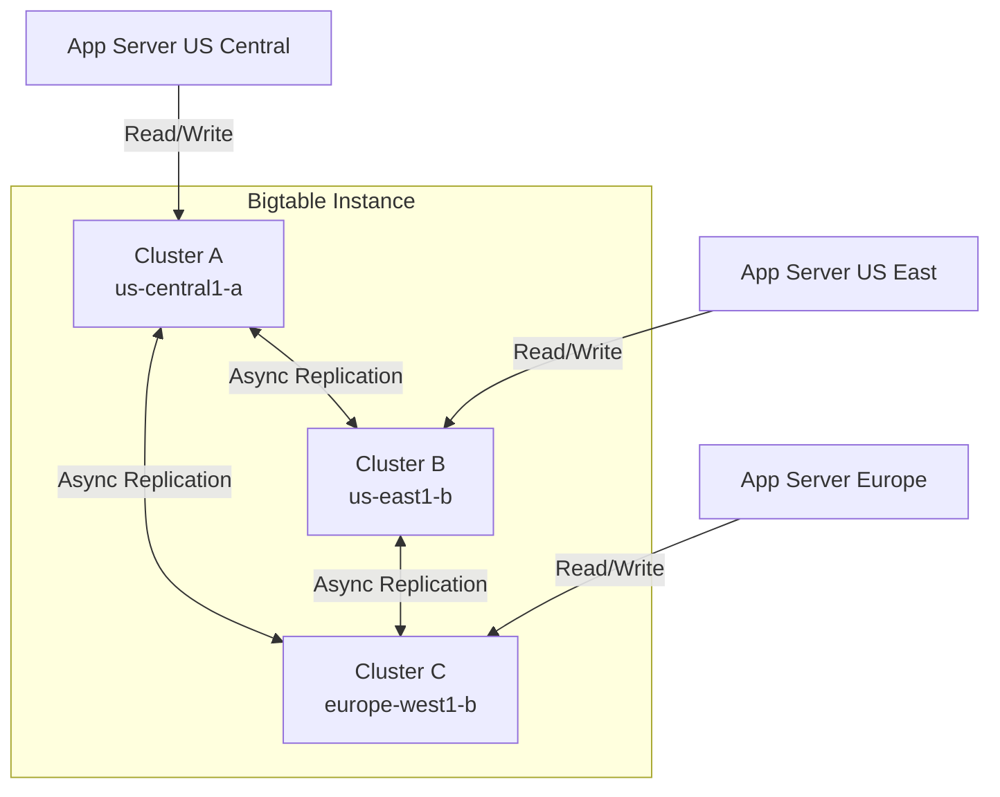
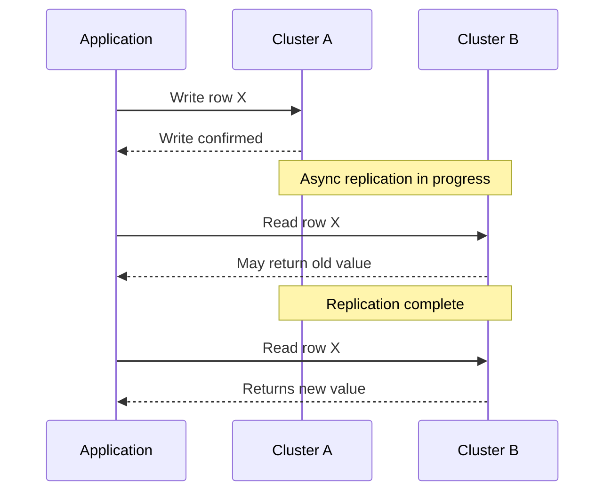

# How to Set Up Replication Between Bigtable Clusters for High Availability

Author: [nawazdhandala](https://www.github.com/nawazdhandala)

Tags: GCP, Cloud Bigtable, Replication, High Availability, Disaster Recovery

Description: Learn how to configure multi-cluster replication in Cloud Bigtable for high availability, automatic failover, and lower read latency across regions.

---

A single Bigtable cluster in one zone gives you good performance, but if that zone has an outage, your database goes down. Bigtable replication lets you run multiple clusters in different zones or regions, with data automatically synchronized between them. If one cluster fails, your application transparently fails over to another. You also get lower read latency because clients can read from the nearest cluster.

Setting up replication is straightforward, but understanding the consistency model and configuration options is important for making good decisions. Let me walk through the whole process.

## How Replication Works

When you add a second cluster to a Bigtable instance, Bigtable automatically replicates all writes to both clusters. The replication is asynchronous - a write goes to the cluster that receives it first, and then Bigtable propagates it to the other cluster(s) in the background. This typically takes less than a few seconds but is not guaranteed to be instant.



## Creating a Multi-Cluster Instance

You can set up replication when creating a new instance or add clusters to an existing one.

Create a new instance with two clusters from the start:

```bash
# Create an instance with two clusters in different zones
# This gives you high availability from day one
gcloud bigtable instances create my-ha-instance \
  --display-name="HA Instance" \
  --cluster-config=id=cluster-central,zone=us-central1-a,nodes=3 \
  --cluster-config=id=cluster-east,zone=us-east1-b,nodes=3 \
  --instance-type=PRODUCTION \
  --project=your-project-id
```

Or add a cluster to an existing instance:

```bash
# Add a second cluster to an existing instance
# Data will automatically start replicating to the new cluster
gcloud bigtable clusters create cluster-east \
  --instance=my-instance \
  --zone=us-east1-b \
  --num-nodes=3 \
  --project=your-project-id
```

For cross-region high availability, put clusters in different regions:

```bash
# Add a cluster in a different region for disaster recovery
gcloud bigtable clusters create cluster-europe \
  --instance=my-instance \
  --zone=europe-west1-b \
  --num-nodes=3 \
  --project=your-project-id
```

## Configuring App Profiles

App profiles control how your application connects to the Bigtable instance. They determine which cluster(s) your app talks to and how routing works.

There are two routing policies:

**Multi-cluster routing**: Requests are automatically routed to the nearest healthy cluster. This is the default and gives you automatic failover.

```bash
# Create an app profile with multi-cluster routing
# Requests go to the nearest cluster automatically
gcloud bigtable app-profiles create multi-cluster-profile \
  --instance=my-ha-instance \
  --route-any \
  --description="Routes to nearest cluster" \
  --project=your-project-id
```

**Single-cluster routing**: All requests go to one specific cluster. Useful when you need read-after-write consistency.

```bash
# Create an app profile that routes to a specific cluster
# Use this when you need strong consistency guarantees
gcloud bigtable app-profiles create us-central-profile \
  --instance=my-ha-instance \
  --route-to=cluster-central \
  --transactional-writes \
  --description="Routes to US Central cluster only" \
  --project=your-project-id
```

## Using App Profiles in Your Application

When connecting to Bigtable from your application, specify the app profile to control routing.

```python
# Python: Connect using a specific app profile
from google.cloud import bigtable

client = bigtable.Client(project='your-project-id', admin=False)
instance = client.instance('my-ha-instance')

# Use multi-cluster routing for automatic failover
table = instance.table('my-table', app_profile_id='multi-cluster-profile')

# Read data - automatically routed to nearest cluster
row = table.read_row(b'row-key-1')

# Use single-cluster routing when you need read-after-write consistency
table_consistent = instance.table('my-table', app_profile_id='us-central-profile')
```

```java
// Java: Connect using a specific app profile
import com.google.cloud.bigtable.data.v2.BigtableDataClient;
import com.google.cloud.bigtable.data.v2.BigtableDataSettings;

// Configure the client with a specific app profile
BigtableDataSettings settings = BigtableDataSettings.newBuilder()
    .setProjectId("your-project-id")
    .setInstanceId("my-ha-instance")
    .setAppProfileId("multi-cluster-profile")  // Use multi-cluster routing
    .build();

BigtableDataClient client = BigtableDataClient.create(settings);
```

## Understanding Consistency

Bigtable replication is eventually consistent. This means:

- A write to Cluster A is immediately visible on Cluster A
- The write propagates to Cluster B asynchronously (usually within seconds)
- If you write to Cluster A and immediately read from Cluster B, you might not see the write yet

For most read-heavy workloads, eventual consistency is fine. For workflows that need to read what they just wrote, use a single-cluster app profile.



## Handling Conflicts

With multi-cluster replication, it is possible for two clients to write to the same cell in different clusters at nearly the same time. Bigtable resolves conflicts using a last-write-wins strategy based on the cell timestamp.

```python
# Conflict resolution: last-write-wins based on cell timestamp
# To avoid conflicts, use server-assigned timestamps

# This write uses an explicit timestamp - could conflict
row = table.direct_row(b'user#123')
row.set_cell('data', b'name', b'Alice', timestamp=datetime.datetime.utcnow())
row.commit()

# Better: let the server assign the timestamp
# The server ensures each version has a unique timestamp
row = table.direct_row(b'user#123')
row.set_cell('data', b'name', b'Alice')  # No timestamp - server assigns one
row.commit()
```

For use cases where conflicts are a concern (like counters), consider routing all writes for a given entity to the same cluster using a single-cluster app profile.

## Monitoring Replication

Keep an eye on replication lag to make sure data is flowing between clusters.

```bash
# Check replication status
gcloud bigtable instances describe my-ha-instance --project=your-project-id

# List all clusters and their status
gcloud bigtable clusters list --instance=my-ha-instance --project=your-project-id
```

In Cloud Monitoring, look for these metrics:
- `bigtable.googleapis.com/server/latencies` - per-cluster latency
- `bigtable.googleapis.com/cluster/cpu_load` - per-cluster CPU
- `bigtable.googleapis.com/replication/max_delay` - replication lag between clusters

Set up alerts on replication delay so you know if data synchronization falls behind:

```bash
# Create an alert policy for replication lag
gcloud monitoring policies create \
  --display-name="Bigtable Replication Lag Alert" \
  --condition-display-name="Replication lag > 10 seconds" \
  --condition-filter='metric.type="bigtable.googleapis.com/replication/max_delay" AND resource.type="bigtable_cluster"' \
  --condition-threshold-value=10 \
  --condition-threshold-duration=300s \
  --notification-channels=your-channel-id
```

## Scaling Clusters Independently

Each cluster in a replicated instance can be scaled independently. If one region gets more traffic, you can add nodes to that cluster without changing the others.

```bash
# Scale the US Central cluster to 5 nodes
gcloud bigtable clusters update cluster-central \
  --instance=my-ha-instance \
  --num-nodes=5

# Scale the Europe cluster to 3 nodes
gcloud bigtable clusters update cluster-europe \
  --instance=my-ha-instance \
  --num-nodes=3
```

You can also enable autoscaling per cluster:

```bash
# Enable autoscaling on a cluster
# Automatically adjusts nodes based on CPU utilization and storage
gcloud bigtable clusters update cluster-central \
  --instance=my-ha-instance \
  --autoscaling-min-nodes=3 \
  --autoscaling-max-nodes=10 \
  --autoscaling-cpu-target=60 \
  --autoscaling-storage-target=2560
```

## Cost Considerations

Replication doubles (or triples) your storage costs since data is stored in each cluster. Compute costs scale with the number of nodes across all clusters. Replication network traffic between clusters in different regions incurs network egress charges.

For many production workloads, the cost of replication is justified by the availability guarantee. A single-zone outage will not affect your application if you have clusters in multiple zones. But for development and staging environments, a single cluster is usually sufficient.

## Wrapping Up

Bigtable replication is the foundation for building highly available, globally distributed applications. Set up multiple clusters in different zones or regions, use multi-cluster app profiles for automatic failover and nearest-cluster routing, and switch to single-cluster profiles when you need strong consistency. Monitor replication lag to stay ahead of issues, and scale each cluster independently based on its traffic patterns. The setup is simple, and the peace of mind of knowing your database survives zone and region failures is well worth the additional cost.
