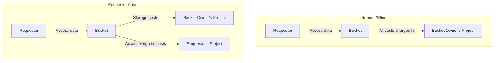

# How to Set Up Requester Pays on Google Cloud Storage Buckets

Author: [nawazdhandala](https://www.github.com/nawazdhandala)

Tags: GCP, Google Cloud Storage, Requester Pays, Cost Management, Cloud Billing

Description: Learn how to configure Requester Pays on Google Cloud Storage buckets to shift data access and transfer costs to the requesting project.

---

When you share large datasets or files through Cloud Storage, you normally pay for all the network egress and operations when others access your data. For public datasets, popular shared resources, or cross-organization data sharing, these costs can add up fast. Requester Pays shifts these costs to the project making the request, so you only pay for storing the data while consumers pay for accessing it.

This guide covers how to set up Requester Pays, how requesters access the data, and the billing implications for both sides.

## How Requester Pays Works

Under normal billing, the bucket owner's project pays for:
- Storage costs
- Operation costs (list, get, etc.)
- Network egress costs

With Requester Pays enabled, the bucket owner still pays for storage, but the requester's project pays for:
- Operation costs
- Network egress costs
- Retrieval costs (for Nearline, Coldline, Archive classes)



## Enabling Requester Pays

### On an Existing Bucket

```bash
# Enable Requester Pays on a bucket
gcloud storage buckets update gs://my-shared-dataset \
  --requester-pays
```

### On a New Bucket

```bash
# Create a bucket with Requester Pays enabled
gcloud storage buckets create gs://public-research-data \
  --location=us-central1 \
  --requester-pays
```

### Verifying the Configuration

```bash
# Check if Requester Pays is enabled
gcloud storage buckets describe gs://my-shared-dataset \
  --format="value(requester_pays)"
```

### Disabling Requester Pays

```bash
# Disable Requester Pays on a bucket
gcloud storage buckets update gs://my-shared-dataset \
  --no-requester-pays
```

## Accessing a Requester Pays Bucket

When Requester Pays is enabled, every request must include a billing project. Without it, the request fails.

### Using gcloud

```bash
# Access a Requester Pays bucket by specifying a billing project
gcloud storage ls gs://requester-pays-bucket/ \
  --billing-project=my-billing-project

# Download a file from a Requester Pays bucket
gcloud storage cp gs://requester-pays-bucket/data/file.csv ./file.csv \
  --billing-project=my-billing-project

# Upload to a Requester Pays bucket
gcloud storage cp ./report.pdf gs://requester-pays-bucket/reports/ \
  --billing-project=my-billing-project
```

### Using gsutil

```bash
# Set a default billing project for gsutil
gsutil -u my-billing-project ls gs://requester-pays-bucket/

# Download with billing project specified
gsutil -u my-billing-project cp gs://requester-pays-bucket/data.csv ./

# You can also set it globally in your boto config
# Add to ~/.boto: [GSUtil] default_project_id = my-billing-project
```

### Using Python

```python
from google.cloud import storage

def access_requester_pays_bucket(bucket_name, blob_name, billing_project):
    """Download from a Requester Pays bucket with billing project specified."""

    # The billing project must be set on the client or per-request
    client = storage.Client(project=billing_project)

    bucket = client.bucket(bucket_name, user_project=billing_project)
    blob = bucket.blob(blob_name)

    # Download the file - charges go to the billing project
    content = blob.download_as_text()

    print(f"Downloaded {blob_name} ({len(content)} chars)")
    print(f"Charges billed to project: {billing_project}")

    return content

def list_requester_pays_objects(bucket_name, billing_project, prefix=None):
    """List objects in a Requester Pays bucket."""
    client = storage.Client(project=billing_project)

    # user_project tells GCS which project to bill for the list operation
    bucket = client.bucket(bucket_name, user_project=billing_project)
    blobs = bucket.list_blobs(prefix=prefix)

    for blob in blobs:
        print(f"{blob.name} ({blob.size} bytes)")

# Access a shared dataset
data = access_requester_pays_bucket(
    "public-genomics-data",
    "datasets/sample-001.csv",
    "my-research-project"
)

# List available files
list_requester_pays_objects(
    "public-genomics-data",
    "my-research-project",
    prefix="datasets/"
)
```

### Using Node.js

```javascript
const { Storage } = require('@google-cloud/storage');

async function downloadFromRequesterPays(bucketName, fileName, billingProject) {
  // Create a client with the billing project
  const storage = new Storage({
    projectId: billingProject,
  });

  // Set userProject on the bucket to specify billing
  const bucket = storage.bucket(bucketName, {
    userProject: billingProject,
  });

  // Download the file - charges go to billingProject
  const [contents] = await bucket.file(fileName).download();

  console.log(`Downloaded ${fileName} (${contents.length} bytes)`);
  console.log(`Billed to: ${billingProject}`);

  return contents;
}

async function listRequesterPaysObjects(bucketName, billingProject, prefix) {
  const storage = new Storage({ projectId: billingProject });

  const [files] = await storage
    .bucket(bucketName, { userProject: billingProject })
    .getFiles({ prefix });

  files.forEach(file => {
    console.log(`${file.name} (${file.metadata.size} bytes)`);
  });
}

// Access shared data
downloadFromRequesterPays(
  'public-research-data',
  'experiments/results-2026.json',
  'my-analysis-project'
);
```

## Common Use Cases

### Public Datasets

Research institutions and data providers often use Requester Pays for large public datasets:

```bash
# Example: Accessing public research data
gcloud storage ls gs://genomics-public-data/ \
  --billing-project=my-research-project

# Download a specific dataset
gcloud storage cp gs://genomics-public-data/clinvar/clinvar.vcf.gz ./ \
  --billing-project=my-research-project
```

### Cross-Organization Data Sharing

When sharing data between organizations, Requester Pays ensures each org pays for their own usage:

```bash
# Partner organization accesses shared data
gcloud storage cp gs://shared-partner-data/reports/monthly-report.csv ./ \
  --billing-project=partner-org-project
```

### Internal Shared Resources

Within a company, different teams or departments can share data while each paying for their own access:

```bash
# Analytics team accesses data engineering's bucket
gcloud storage cp -r gs://data-engineering-output/processed/2026-02/ ./local-data/ \
  --billing-project=analytics-team-project
```

## Terraform Configuration

```hcl
resource "google_storage_bucket" "shared_data" {
  name     = "company-shared-datasets"
  location = "US"

  # Enable Requester Pays
  requester_pays = true

  uniform_bucket_level_access = true
}

# Grant read access to specific teams
resource "google_storage_bucket_iam_member" "analytics_reader" {
  bucket = google_storage_bucket.shared_data.name
  role   = "roles/storage.objectViewer"
  member = "group:analytics-team@company.com"
}

resource "google_storage_bucket_iam_member" "partner_reader" {
  bucket = google_storage_bucket.shared_data.name
  role   = "roles/storage.objectViewer"
  member = "serviceAccount:reader@partner-project.iam.gserviceaccount.com"
}
```

## Permissions Required

For Requester Pays to work, the requester needs:

1. **Read permission on the bucket** - via IAM roles like `roles/storage.objectViewer`
2. **Billing permission on their project** - specifically `serviceusage.services.use` on the billing project

```bash
# Grant billing permission to a user on their project
gcloud projects add-iam-policy-binding my-billing-project \
  --member="user:alice@partner.com" \
  --role="roles/serviceusage.serviceUsageConsumer"
```

Without the billing permission, even if the user can read the bucket, the request will fail with a billing error.

## Cost Monitoring

### For Bucket Owners

Monitor storage costs as usual. Access costs are handled by requesters:

```bash
# Check storage usage for your Requester Pays bucket
gcloud storage du -s gs://my-shared-dataset
```

### For Requesters

Monitor the costs charged to your billing project:

```bash
# Set up a budget alert for unexpected access costs
gcloud billing budgets create \
  --billing-account=BILLING_ACCOUNT_ID \
  --display-name="GCS Requester Pays Budget" \
  --budget-amount=100USD \
  --threshold-rule=percent=50 \
  --threshold-rule=percent=80 \
  --threshold-rule=percent=100
```

## Important Considerations

**Anonymous access is not possible.** Requester Pays requires authentication because GCS needs to know which project to bill. Public anonymous access (allUsers) does not work with Requester Pays.

**The billing project must have billing enabled.** If the requester's project does not have an active billing account, requests will fail.

**Object-level operations require the billing project.** Every operation - listing, reading, writing, metadata updates - needs the billing project parameter.

**Cloud CDN and Requester Pays.** If you put a CDN in front of a Requester Pays bucket, the CDN's project pays for cache misses, not individual requesters.

**Audit logs still go to the bucket owner.** Even though the requester pays for access, the audit logs for bucket access are in the bucket owner's project.

**Signed URLs work differently.** Signed URLs for Requester Pays buckets must include the billing project in the URL parameters.

Requester Pays is a simple but effective mechanism for controlling costs when sharing data. It aligns incentives well - you share the data, and consumers pay proportionally to how much they use it. For large datasets or widely shared resources, it can save significant money on egress and operations costs.
