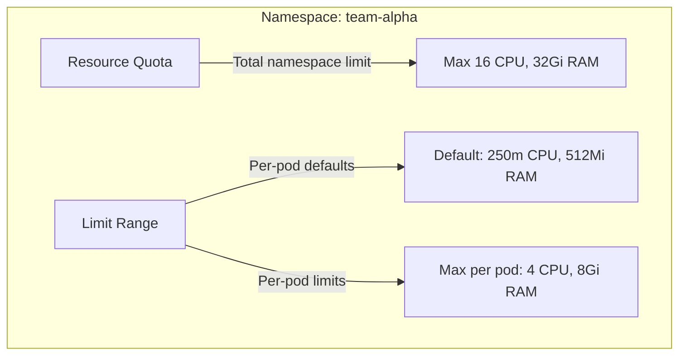

# How to Set Up Resource Quotas and Limit Ranges per Namespace in a Multi-Tenant GKE Cluster

Author: [nawazdhandala](https://www.github.com/nawazdhandala)

Tags: GCP, GKE, Kubernetes, Multi-Tenancy, Resource Management, Quotas

Description: A complete guide to configuring resource quotas and limit ranges per namespace in GKE to prevent resource hogging and ensure fair sharing in multi-tenant clusters.

---

Sharing a GKE cluster across teams sounds great in theory - lower infrastructure costs, shared tooling, centralized management. But without guardrails, one team's runaway deployment can consume all the cluster's resources, leaving nothing for everyone else. I have seen this happen: a developer accidentally sets 100 replicas instead of 10, or a memory leak causes pods to consume every available byte.

Resource Quotas and Limit Ranges are Kubernetes' built-in mechanisms for preventing this. Quotas cap the total resources a namespace can consume, and Limit Ranges set defaults and boundaries for individual pods and containers. Together, they give you the controls you need for safe multi-tenancy.

## The Two Layers of Control

Think of it as two layers:



- **ResourceQuota**: Sets the total resource budget for the entire namespace
- **LimitRange**: Sets defaults, minimums, and maximums for individual containers and pods

## Setting Up Resource Quotas

Create a ResourceQuota for each namespace. This sets a hard cap on total resources.

```yaml
# quota-team-alpha.yaml - Resource quota for team-alpha namespace
apiVersion: v1
kind: ResourceQuota
metadata:
  name: team-alpha-quota
  namespace: team-alpha
spec:
  hard:
    # Compute resource limits
    requests.cpu: "16"          # Total CPU requests across all pods
    requests.memory: "32Gi"     # Total memory requests across all pods
    limits.cpu: "32"            # Total CPU limits across all pods
    limits.memory: "64Gi"       # Total memory limits across all pods

    # Object count limits
    pods: "50"                  # Maximum number of pods
    services: "20"              # Maximum number of services
    services.loadbalancers: "2" # Maximum number of LoadBalancer services
    persistentvolumeclaims: "10" # Maximum number of PVCs
    secrets: "50"               # Maximum number of secrets
    configmaps: "50"            # Maximum number of ConfigMaps

    # Storage limits
    requests.storage: "100Gi"   # Total storage requests
```

```bash
# Create the namespace and apply the quota
kubectl create namespace team-alpha
kubectl apply -f quota-team-alpha.yaml
```

## Important: Quotas Require Resource Requests

Once you create a ResourceQuota that limits CPU or memory in a namespace, every pod in that namespace MUST specify resource requests and limits. Otherwise, the pod will be rejected.

```bash
# This will FAIL if a quota is in place and the pod has no resource requests
kubectl -n team-alpha run test --image=nginx
# Error: must specify limits/requests for cpu, memory
```

This is where LimitRanges come in - they set defaults so developers do not have to specify resources on every single pod.

## Setting Up Limit Ranges

LimitRanges apply defaults and enforce boundaries at the container and pod level.

```yaml
# limitrange-team-alpha.yaml - Default and maximum resources per container
apiVersion: v1
kind: LimitRange
metadata:
  name: team-alpha-limits
  namespace: team-alpha
spec:
  limits:
    # Defaults and limits for containers
    - type: Container
      default:
        # These are applied if a container does not specify limits
        cpu: "500m"
        memory: "512Mi"
      defaultRequest:
        # These are applied if a container does not specify requests
        cpu: "250m"
        memory: "256Mi"
      min:
        # Minimum allowed - prevents pods that are too small to be useful
        cpu: "50m"
        memory: "64Mi"
      max:
        # Maximum allowed per container - prevents resource hogging
        cpu: "4"
        memory: "8Gi"

    # Limits for pods (sum of all containers)
    - type: Pod
      max:
        cpu: "8"
        memory: "16Gi"

    # Limits for PVCs
    - type: PersistentVolumeClaim
      min:
        storage: "1Gi"
      max:
        storage: "50Gi"
```

```bash
kubectl apply -f limitrange-team-alpha.yaml
```

Now when a developer deploys a pod without specifying resources, the LimitRange automatically applies the defaults.

```yaml
# This deployment does not specify resources
apiVersion: apps/v1
kind: Deployment
metadata:
  name: simple-app
  namespace: team-alpha
spec:
  replicas: 3
  selector:
    matchLabels:
      app: simple-app
  template:
    metadata:
      labels:
        app: simple-app
    spec:
      containers:
        - name: app
          image: nginx
          # No resources specified - LimitRange will add:
          # requests: { cpu: 250m, memory: 256Mi }
          # limits: { cpu: 500m, memory: 512Mi }
```

## Quotas for Different Tiers

In practice, you will have teams with different resource needs. Create quota templates for different tiers.

```yaml
# quota-small.yaml - Small team quota
apiVersion: v1
kind: ResourceQuota
metadata:
  name: small-tier-quota
spec:
  hard:
    requests.cpu: "8"
    requests.memory: "16Gi"
    limits.cpu: "16"
    limits.memory: "32Gi"
    pods: "25"
    services: "10"
    services.loadbalancers: "1"
---
# quota-medium.yaml - Medium team quota
apiVersion: v1
kind: ResourceQuota
metadata:
  name: medium-tier-quota
spec:
  hard:
    requests.cpu: "32"
    requests.memory: "64Gi"
    limits.cpu: "64"
    limits.memory: "128Gi"
    pods: "100"
    services: "30"
    services.loadbalancers: "3"
---
# quota-large.yaml - Large team or critical service quota
apiVersion: v1
kind: ResourceQuota
metadata:
  name: large-tier-quota
spec:
  hard:
    requests.cpu: "64"
    requests.memory: "256Gi"
    limits.cpu: "128"
    limits.memory: "512Gi"
    pods: "200"
    services: "50"
    services.loadbalancers: "5"
```

## Priority-Based Quotas

You can create quotas that apply only to certain priority classes. This lets you have different limits for production versus development workloads within the same namespace.

```yaml
# Create priority classes
apiVersion: scheduling.k8s.io/v1
kind: PriorityClass
metadata:
  name: high-priority
value: 1000
globalDefault: false
description: "For production workloads"
---
apiVersion: scheduling.k8s.io/v1
kind: PriorityClass
metadata:
  name: low-priority
value: 100
globalDefault: true
description: "For development and testing"
---
# Quota scoped to high-priority pods only
apiVersion: v1
kind: ResourceQuota
metadata:
  name: high-priority-quota
  namespace: team-alpha
spec:
  hard:
    requests.cpu: "32"
    requests.memory: "64Gi"
  scopeSelector:
    matchExpressions:
      - scopeName: PriorityClass
        operator: In
        values:
          - high-priority
```

## Monitoring Quota Usage

Keep track of how much of their quota each team is using.

```bash
# View quota usage for a namespace
kubectl -n team-alpha describe resourcequota team-alpha-quota

# Example output:
# Name:                    team-alpha-quota
# Namespace:               team-alpha
# Resource                 Used   Hard
# --------                 ----   ----
# limits.cpu               12     32
# limits.memory            24Gi   64Gi
# pods                     15     50
# requests.cpu             6      16
# requests.memory          12Gi   32Gi
# services                 5      20
# services.loadbalancers   1      2

# Get quota usage as JSON for programmatic access
kubectl -n team-alpha get resourcequota team-alpha-quota -o json | \
  jq '.status'
```

## Automating Quota Management

For larger organizations, you probably want to automate namespace and quota creation. Here is a script that sets up a complete tenant namespace.

```bash
#!/bin/bash
# create-tenant.sh - Set up a new tenant namespace with quotas and limits

TENANT=$1
TIER=$2  # small, medium, or large

if [ -z "$TENANT" ] || [ -z "$TIER" ]; then
  echo "Usage: create-tenant.sh <tenant-name> <tier>"
  exit 1
fi

# Create the namespace with labels
kubectl create namespace "$TENANT"
kubectl label namespace "$TENANT" tier="$TIER" managed-by=platform-team

# Apply the appropriate quota template
kubectl -n "$TENANT" apply -f "quota-${TIER}.yaml"

# Apply standard limit ranges
kubectl -n "$TENANT" apply -f limitrange-standard.yaml

# Apply default network policy (deny all, allow DNS)
kubectl -n "$TENANT" apply -f network-policy-default.yaml

echo "Tenant $TENANT created with $TIER tier quota"
```

## What Happens When Quotas Are Exceeded

When a namespace hits its quota, new pods are rejected with a clear error message.

```bash
# Attempting to create a pod that would exceed the quota
kubectl -n team-alpha apply -f big-deployment.yaml
# Error: forbidden: exceeded quota: team-alpha-quota,
# requested: requests.cpu=8, used: requests.cpu=14, limited: requests.cpu=16
```

This is a hard limit - there is no grace period or overcommit. If the quota is reached, new pods simply will not be created until existing pods free up resources.

## Best Practices

A few things I have learned from managing multi-tenant GKE clusters:

1. **Always pair quotas with limit ranges.** Quotas require resource requests, and limit ranges provide defaults so developers are not forced to specify them on every pod.

2. **Start generous and tighten.** It is better to start with high quotas and lower them based on actual usage than to start too tight and block teams.

3. **Monitor quota utilization.** Set up alerts when a namespace uses more than 80% of its quota. This gives teams time to request more before they hit the limit.

4. **Include object count quotas.** CPU and memory quotas are not enough. A namespace with thousands of ConfigMaps or Secrets can impact the API server. Limit object counts too.

5. **Leave headroom for deployments.** During a rolling update, both old and new pods exist simultaneously. If a namespace is at 100% CPU quota, the rolling update cannot create new pods. Always leave 20-30% headroom.

## Wrapping Up

Resource Quotas and Limit Ranges are essential for running a multi-tenant GKE cluster. Without them, one team's resource consumption is everyone else's problem. With them, each team has a clear resource budget, sensible defaults apply automatically, and the cluster stays stable even when individual namespaces are under heavy load. Set them up early, monitor usage regularly, and adjust as your teams' needs evolve.
