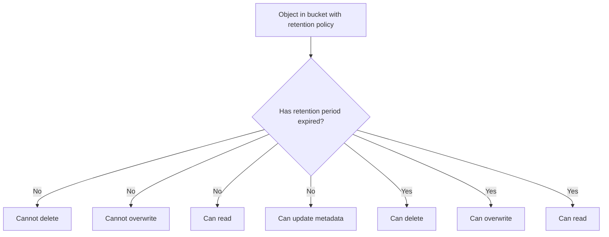

# How to Set Up Retention Policies and Bucket Lock in Google Cloud Storage

Author: [nawazdhandala](https://www.github.com/nawazdhandala)

Tags: GCP, Google Cloud Storage, Retention Policies, Bucket Lock, Compliance

Description: Learn how to configure retention policies and bucket lock in Google Cloud Storage for regulatory compliance and data immutability requirements.

---

When regulations like HIPAA, SOX, FINRA, or SEC Rule 17a-4 require you to retain data for a specific period and prevent anyone - including administrators - from deleting it, Google Cloud Storage's retention policies and bucket lock features are what you need. These features let you enforce write-once-read-many (WORM) storage at the bucket level.

This guide covers how to set up retention policies, lock them permanently, and understand the implications of doing so.

## Understanding Retention Policies

A retention policy specifies a minimum period that objects in a bucket must be retained. Once set, no object in the bucket can be deleted or overwritten until it reaches the specified age. The retention period starts from the object's creation time.

Key points:

- The retention period applies to all objects in the bucket
- Objects cannot be deleted or overwritten until the retention period expires
- You can increase the retention period but not decrease it once set
- New objects added to the bucket also get the retention policy applied

## Setting a Retention Policy

To add a retention policy to a bucket:

```bash
# Set a 90-day retention policy on a bucket
gcloud storage buckets update gs://my-compliance-bucket \
  --retention-period=90d
```

The retention period supports several formats:

```bash
# Retention period in seconds
gcloud storage buckets update gs://my-bucket --retention-period=7776000

# Retention period in days
gcloud storage buckets update gs://my-bucket --retention-period=90d

# Retention period in months (approximate - 30 days per month)
gcloud storage buckets update gs://my-bucket --retention-period=3m

# Retention period in years (approximate - 365.25 days per year)
gcloud storage buckets update gs://my-bucket --retention-period=7y
```

## How Retention Affects Object Operations

Once a retention policy is active, here is what changes:



You can still:
- Upload new objects to the bucket
- Read any object at any time
- Update object metadata (but not the data itself)
- Copy objects to other buckets

You cannot:
- Delete objects before the retention period expires
- Overwrite objects before the retention period expires
- Reduce the retention period (you can only increase it)

## Checking a Bucket's Retention Policy

```bash
# View retention policy details for a bucket
gcloud storage buckets describe gs://my-compliance-bucket \
  --format="json(retention_policy)"
```

The output shows the retention period, the effective time (when the policy was set), and whether it is locked.

## Modifying the Retention Period

You can increase the retention period at any time:

```bash
# Increase the retention period from 90 days to 365 days
gcloud storage buckets update gs://my-compliance-bucket \
  --retention-period=365d
```

To remove a retention policy (only possible if the bucket is not locked):

```bash
# Remove the retention policy from an unlocked bucket
gcloud storage buckets update gs://my-compliance-bucket \
  --clear-retention-period
```

## Understanding Bucket Lock

Here is where things get serious. A retention policy by itself can be removed or reduced by a project owner. Bucket lock makes the retention policy permanent and irreversible. Once locked:

- The retention policy cannot be removed
- The retention period cannot be reduced
- The bucket cannot be deleted until every object has met its retention period
- This is truly permanent - not even Google support can undo it

This is designed for regulatory compliance where you need to prove that data cannot be tampered with.

## Locking a Bucket

Before locking, make absolutely sure the retention period is correct. There is no going back.

```bash
# Lock the retention policy permanently - THIS CANNOT BE UNDONE
gcloud storage buckets update gs://my-compliance-bucket \
  --lock-retention-period
```

You will be prompted to confirm because this is irreversible.

## Compliance Workflow Example

Here is a typical compliance workflow for financial records:

```bash
# Step 1: Create a dedicated compliance bucket
gcloud storage buckets create gs://acme-financial-records \
  --location=us-central1 \
  --uniform-bucket-level-access

# Step 2: Set a 7-year retention policy (common for financial regulations)
gcloud storage buckets update gs://acme-financial-records \
  --retention-period=7y

# Step 3: Verify the retention policy is correct
gcloud storage buckets describe gs://acme-financial-records \
  --format="json(retention_policy)"

# Step 4: Upload test data and verify retention works
gcloud storage cp test-record.pdf gs://acme-financial-records/2026/test-record.pdf

# Step 5: Verify deletion is blocked
gcloud storage rm gs://acme-financial-records/2026/test-record.pdf
# This should fail with a 403 error

# Step 6: Lock the retention policy permanently when ready
gcloud storage buckets update gs://acme-financial-records \
  --lock-retention-period
```

## Working with Retention in Python

```python
from google.cloud import storage

def set_retention_policy(bucket_name, retention_seconds):
    """Set a retention policy on a bucket."""
    client = storage.Client()
    bucket = client.get_bucket(bucket_name)

    # Set the retention period in seconds
    bucket.retention_period = retention_seconds
    bucket.patch()

    print(f"Set retention policy of {retention_seconds} seconds "
          f"on bucket {bucket_name}")

def lock_retention_policy(bucket_name):
    """Lock the retention policy on a bucket. This is permanent."""
    client = storage.Client()
    bucket = client.get_bucket(bucket_name)

    # Metageneration is required to prevent race conditions
    bucket.lock_retention_policy()

    print(f"Locked retention policy on bucket {bucket_name}")
    print("WARNING: This action is irreversible")

def check_object_retention(bucket_name, blob_name):
    """Check when an object's retention period expires."""
    client = storage.Client()
    bucket = client.bucket(bucket_name)
    blob = bucket.get_blob(blob_name)

    if blob.retention_expiration_time:
        print(f"Object: {blob_name}")
        print(f"Created: {blob.time_created}")
        print(f"Retention expires: {blob.retention_expiration_time}")
    else:
        print(f"No retention policy applies to {blob_name}")

# Set a 90-day retention policy
set_retention_policy("my-compliance-bucket", 90 * 24 * 60 * 60)
```

## Terraform Configuration

```hcl
resource "google_storage_bucket" "compliance_bucket" {
  name     = "acme-compliance-records"
  location = "US"

  uniform_bucket_level_access = true

  retention_policy {
    # 7 years in seconds
    retention_period = 220898880

    # Set to true to lock - WARNING: irreversible
    is_locked = false
  }

  # Prevent accidental Terraform destruction
  lifecycle {
    prevent_destroy = true
  }
}
```

Note: Setting `is_locked = true` in Terraform is also irreversible. Be very careful with this.

## Retention Policy vs Object Hold

GCS also offers object holds, which work at the individual object level rather than the bucket level:

| Feature | Retention Policy | Object Hold |
|---|---|---|
| Scope | Entire bucket | Individual object |
| Duration | Fixed time period | Until manually removed |
| Locking | Can be permanently locked | Cannot be locked |
| Flexibility | Same period for all objects | Per-object control |

You can use both together. A retention policy provides the baseline, and object holds provide additional per-object control.

## Important Considerations

**Cost implications.** Objects under retention cannot be deleted, so you will pay for their storage for the entire retention period. For a 7-year policy on 10 TB of data, that is a significant commitment. Calculate the total cost before locking.

**Bucket deletion.** A locked bucket cannot be deleted until every object in it has met its retention period. If you have a 7-year retention policy, you are keeping that bucket for at least 7 years after the last object was added.

**Versioning interaction.** Retention policies work with object versioning. Noncurrent versions are also subject to the retention policy based on when they became noncurrent.

**Test thoroughly before locking.** Use an unlocked retention policy first. Upload test objects, verify that deletion is blocked, and confirm the retention period is correct. Only lock when you are completely sure.

**Event-based holds for flexible retention.** If you need the retention period to start from a specific business event rather than object creation, look into event-based holds combined with retention policies.

Retention policies and bucket lock are powerful tools for regulatory compliance. They provide verifiable guarantees that data cannot be tampered with or prematurely deleted. Just remember - bucket lock means what it says. There is no undo button.
