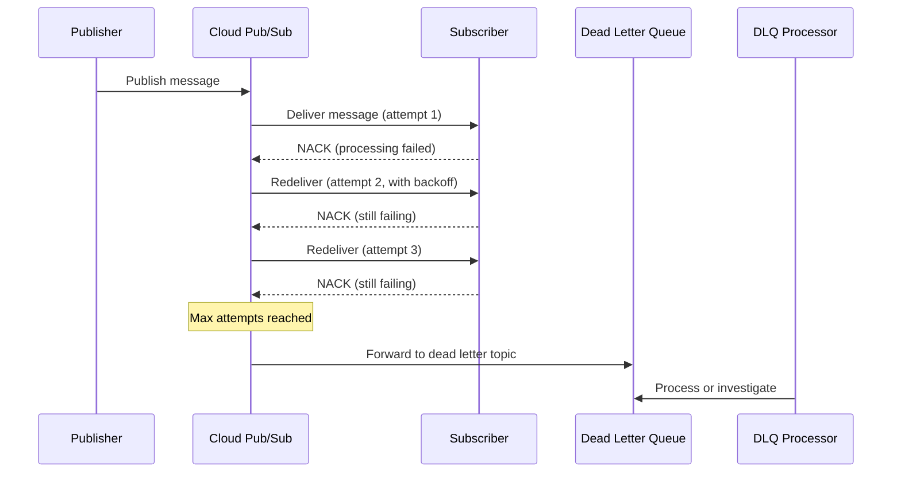

# How to Set Up Retry Policies and Dead Letter Queues for Reliable Microservice Communication on Pub/Sub

Author: [nawazdhandala](https://www.github.com/nawazdhandala)

Tags: GCP, Cloud Pub/Sub, Dead Letter Queue, Retry Policies, Microservices, Reliability

Description: Configure retry policies and dead letter queues on Google Cloud Pub/Sub to build reliable message-driven communication between microservices with proper failure handling.

---

In a message-driven microservice architecture, messages will fail to process. It is not a matter of if, but when. Maybe the downstream database is temporarily unavailable, or the message payload is malformed, or a bug in the consumer code causes an exception. What matters is how you handle these failures. Without proper retry and dead letter queue configuration, failed messages either get lost or block the entire processing pipeline.

Google Cloud Pub/Sub has built-in support for retry policies and dead letter queues (DLQs). In this post, I will show you how to configure them properly so your microservices handle failures gracefully without losing messages.

## Understanding Pub/Sub Message Delivery

By default, Pub/Sub uses exponential backoff for retries. When a subscriber does not acknowledge a message within the acknowledgement deadline, Pub/Sub redelivers it. This happens indefinitely unless you configure a dead letter queue. That means a single poison message - one that always fails to process - will be retried forever, wasting resources and potentially causing alerting noise.



## Configuring Retry Policies

The retry policy controls the backoff behavior between redelivery attempts. Configure it on the subscription.

```bash
# Create a subscription with a custom retry policy
gcloud pubsub subscriptions create order-processor-sub \
  --topic=order-events \
  --ack-deadline=30 \
  --min-retry-delay=10s \
  --max-retry-delay=600s

# The retry delay grows exponentially:
# Attempt 1: 10s delay
# Attempt 2: 20s delay
# Attempt 3: 40s delay
# ... up to the max of 600s (10 minutes)
```

You can also set the retry policy when creating a subscription programmatically.

```python
# create_subscription_with_retry.py
from google.cloud import pubsub_v1
from google.protobuf.duration_pb2 import Duration

subscriber = pubsub_v1.SubscriberClient()

# Define the retry policy
retry_policy = pubsub_v1.types.RetryPolicy(
    minimum_backoff=Duration(seconds=10),
    maximum_backoff=Duration(seconds=600),
)

subscription_path = subscriber.subscription_path('my-project', 'order-processor-sub')
topic_path = subscriber.topic_path('my-project', 'order-events')

# Create the subscription with the retry policy
subscription = subscriber.create_subscription(
    request={
        'name': subscription_path,
        'topic': topic_path,
        'ack_deadline_seconds': 30,
        'retry_policy': retry_policy,
    }
)

print(f'Subscription created: {subscription.name}')
```

## Setting Up Dead Letter Queues

A dead letter queue catches messages that have exhausted all retry attempts. Create a dead letter topic and configure the subscription to use it.

```bash
# Step 1: Create the dead letter topic and its subscription
gcloud pubsub topics create order-events-dlq
gcloud pubsub subscriptions create order-events-dlq-sub \
  --topic=order-events-dlq \
  --ack-deadline=60

# Step 2: Create the main subscription with dead letter policy
gcloud pubsub subscriptions create order-processor-sub \
  --topic=order-events \
  --ack-deadline=30 \
  --dead-letter-topic=order-events-dlq \
  --max-delivery-attempts=5 \
  --min-retry-delay=10s \
  --max-retry-delay=600s

# Step 3: Grant Pub/Sub permission to publish to the dead letter topic
# and to subscribe to the source subscription
PROJECT_NUMBER=$(gcloud projects describe my-project --format='value(projectNumber)')

gcloud pubsub topics add-iam-policy-binding order-events-dlq \
  --member="serviceAccount:service-${PROJECT_NUMBER}@gcp-sa-pubsub.iam.gserviceaccount.com" \
  --role="roles/pubsub.publisher"

gcloud pubsub subscriptions add-iam-policy-binding order-processor-sub \
  --member="serviceAccount:service-${PROJECT_NUMBER}@gcp-sa-pubsub.iam.gserviceaccount.com" \
  --role="roles/pubsub.subscriber"
```

## Building a Robust Message Consumer

Your consumer should distinguish between transient errors (retry might help) and permanent errors (retry will never help). Handle them differently.

```python
# order_processor.py - Consumer with proper error handling
from google.cloud import pubsub_v1
import json
import logging

subscriber = pubsub_v1.SubscriberClient()
subscription_path = subscriber.subscription_path('my-project', 'order-processor-sub')

def process_message(message):
    """Process a Pub/Sub message with proper error categorization."""
    delivery_attempt = message.delivery_attempt or 1
    logging.info(f'Processing message {message.message_id}, attempt {delivery_attempt}')

    try:
        # Parse the message payload
        data = json.loads(message.data.decode('utf-8'))

        # Validate the message structure
        if 'order_id' not in data:
            # This is a permanent error - retrying will not help
            logging.error(f'Invalid message format: missing order_id')
            message.ack()  # Acknowledge to prevent retries
            # Optionally publish to a separate "invalid messages" topic for investigation
            return

        # Process the order
        result = process_order(data)

        if result.success:
            message.ack()
            logging.info(f'Successfully processed order {data["order_id"]}')
        else:
            # Processing failed but might succeed on retry
            message.nack()
            logging.warning(f'Order processing failed, will retry: {result.error}')

    except json.JSONDecodeError as e:
        # Malformed JSON - permanent error, ack to prevent infinite retries
        logging.error(f'Malformed message payload: {e}')
        message.ack()

    except ConnectionError as e:
        # Transient error - nack to trigger retry with backoff
        logging.warning(f'Connection error, will retry: {e}')
        message.nack()

    except Exception as e:
        # Unknown error - nack and let the retry policy handle it
        logging.error(f'Unexpected error: {e}')
        message.nack()

# Start the subscriber
streaming_pull = subscriber.subscribe(
    subscription_path,
    callback=process_message,
    flow_control=pubsub_v1.types.FlowControl(
        max_messages=100,         # Process up to 100 messages concurrently
        max_bytes=10 * 1024 * 1024,  # 10 MB buffer
    ),
)

print(f'Listening on {subscription_path}')
streaming_pull.result()  # Block until the subscriber is shut down
```

## Processing the Dead Letter Queue

Messages in the DLQ need investigation. Build a processor that logs the failed messages and alerts your team.

```python
# dlq_processor.py - Handle messages that exhausted all retries
from google.cloud import pubsub_v1, firestore
import json
import logging

subscriber = pubsub_v1.SubscriberClient()
db = firestore.Client()

dlq_path = subscriber.subscription_path('my-project', 'order-events-dlq-sub')

def process_dead_letter(message):
    """Store dead letter messages for investigation."""
    try:
        data = json.loads(message.data.decode('utf-8'))
    except json.JSONDecodeError:
        data = {'raw': message.data.decode('utf-8', errors='replace')}

    # Store the failed message in Firestore for investigation
    doc_ref = db.collection('dead_letters').document(message.message_id)
    doc_ref.set({
        'message_id': message.message_id,
        'data': data,
        'attributes': dict(message.attributes),
        'publish_time': message.publish_time.isoformat(),
        'delivery_attempt': message.delivery_attempt,
        'received_at': firestore.SERVER_TIMESTAMP,
        'status': 'pending_review',
    })

    logging.error(
        f'Dead letter received: message_id={message.message_id}, '
        f'attempts={message.delivery_attempt}, '
        f'data={json.dumps(data)[:200]}'
    )

    # Acknowledge the DLQ message so it does not keep redelivering
    message.ack()

streaming_pull = subscriber.subscribe(dlq_path, callback=process_dead_letter)
print(f'DLQ processor listening on {dlq_path}')
streaming_pull.result()
```

## Replaying Dead Letter Messages

After fixing the bug that caused messages to fail, you want to replay them. Here is a utility to move messages from the DLQ back to the original topic.

```python
# replay_dlq.py - Replay dead letter messages after fixing the issue
from google.cloud import pubsub_v1, firestore
import json

publisher = pubsub_v1.PublisherClient()
db = firestore.Client()

def replay_dead_letters(project_id, original_topic, batch_size=100):
    """Replay dead letter messages back to the original topic."""
    topic_path = publisher.topic_path(project_id, original_topic)

    # Query unprocessed dead letters
    docs = (db.collection('dead_letters')
            .where('status', '==', 'pending_review')
            .limit(batch_size)
            .stream())

    replayed = 0
    for doc in docs:
        dl_data = doc.to_dict()

        # Republish to the original topic
        future = publisher.publish(
            topic_path,
            data=json.dumps(dl_data['data']).encode('utf-8'),
            replayed='true',
            original_message_id=dl_data['message_id'],
        )
        future.result()

        # Mark as replayed
        doc.reference.update({'status': 'replayed'})
        replayed += 1

    print(f'Replayed {replayed} messages to {original_topic}')
    return replayed
```

## Monitoring DLQ Metrics

Set up alerts on your dead letter queue to catch issues early.

```bash
# Create an alert when messages arrive in the DLQ
gcloud alpha monitoring policies create \
  --display-name="Messages in Dead Letter Queue" \
  --condition-display-name="DLQ messages > 0" \
  --condition-filter='resource.type="pubsub_subscription" AND resource.labels.subscription_id="order-events-dlq-sub" AND metric.type="pubsub.googleapis.com/subscription/num_undelivered_messages"' \
  --condition-threshold-value=1 \
  --condition-threshold-comparison=COMPARISON_GT
```

## Setting Up Per-Service DLQs

For a multi-service architecture, create separate DLQs for each service so failures are easy to track and investigate.

```bash
# Each service gets its own DLQ
for service in order-processor payment-processor shipping-processor; do
  gcloud pubsub topics create ${service}-dlq
  gcloud pubsub subscriptions create ${service}-dlq-sub --topic=${service}-dlq
done
```

## Summary

Retry policies and dead letter queues are the safety net for message-driven microservices. Configure appropriate backoff intervals based on the nature of your downstream dependencies. Set a reasonable max delivery attempts count - usually between 3 and 10 depending on how transient your errors typically are. Always process your DLQ messages instead of letting them sit there. And make sure you have alerts when messages start landing in the DLQ.

OneUptime can help you monitor your Pub/Sub infrastructure alongside your microservices, tracking message throughput, delivery latency, and DLQ accumulation. When messages start piling up in a dead letter queue, you want to know immediately - not days later when a customer reports a missing order.
