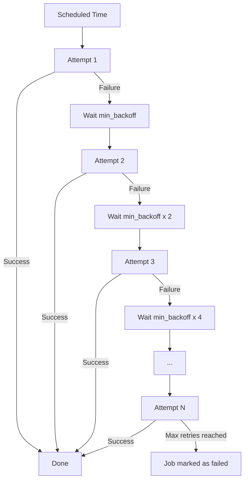

# How to Set Up Retry Policies and Exponential Backoff in Cloud Scheduler

Author: [nawazdhandala](https://www.github.com/nawazdhandala)

Tags: GCP, Cloud Scheduler, Retry Policy, Exponential Backoff, Reliability

Description: A detailed guide to configuring retry policies and exponential backoff in Google Cloud Scheduler to handle transient failures and build resilient scheduled jobs.

---

Scheduled jobs fail. Networks have blips, services go down briefly, cold starts add latency. The difference between a fragile system and a resilient one often comes down to retry configuration. Cloud Scheduler has built-in retry policies with exponential backoff, and setting them up correctly can save you from a lot of false alarms and manual intervention.

In this post, I will explain how Cloud Scheduler's retry mechanism works, how to configure it properly, and what settings make sense for different scenarios.

## How Cloud Scheduler Retries Work

When Cloud Scheduler sends a request to your target (HTTP endpoint, Pub/Sub topic, or App Engine), it expects a success response. For HTTP targets, success means a 2xx status code. If the target returns a non-2xx response or does not respond within the attempt deadline, Cloud Scheduler considers the attempt failed and may retry.

The retry behavior follows this sequence:

1. Initial attempt is made at the scheduled time
2. If it fails, wait for `min_backoff` seconds
3. Retry
4. If it fails again, double the wait time (up to `max_doublings` times)
5. After `max_doublings`, the wait time increases linearly up to `max_backoff`
6. Continue until `max_retry_attempts` is reached or the retry window expires



## Retry Configuration Parameters

Here are the parameters you can configure:

| Parameter | Description | Default | Range |
|-----------|-------------|---------|-------|
| `max-retry-attempts` | Total number of retry attempts | 0 (no retries) | 0-5 |
| `min-backoff` | Initial delay between retries | 5s | 0s-3600s |
| `max-backoff` | Maximum delay between retries | 3600s | 0s-3600s |
| `max-doublings` | Number of times backoff doubles | 16 | 0-20 |
| `attempt-deadline` | Timeout for each individual attempt | 180s | 15s-1800s |

## Creating a Job with Retry Configuration

Here is how to set up a scheduler job with a well-tuned retry policy.

```bash
# Create a job with explicit retry configuration
gcloud scheduler jobs create http api-sync-job \
  --location=us-central1 \
  --schedule="0 * * * *" \
  --uri="https://my-api.example.com/sync" \
  --http-method=POST \
  --max-retry-attempts=3 \
  --min-backoff="10s" \
  --max-backoff="300s" \
  --max-doublings=3 \
  --attempt-deadline="60s" \
  --time-zone="UTC" \
  --description="Hourly API sync with retry policy"
```

With these settings, if the first attempt fails, the retry schedule looks like this:

- Attempt 1: Immediate (at scheduled time)
- Attempt 2: 10 seconds later (min_backoff)
- Attempt 3: 20 seconds after attempt 2 (doubled)
- Attempt 4: 40 seconds after attempt 3 (doubled again, since max_doublings=3 means 3 doublings)

Total time from first attempt to last retry: about 70 seconds.

## Understanding Exponential Backoff Math

Let me walk through how the backoff intervals are calculated in detail.

```
# Configuration:
# min_backoff = 10s
# max_backoff = 300s
# max_doublings = 4

# Retry intervals:
# Retry 1: 10s   (min_backoff)
# Retry 2: 20s   (10 x 2^1) - doubling 1
# Retry 3: 40s   (10 x 2^2) - doubling 2
# Retry 4: 80s   (10 x 2^3) - doubling 3
# Retry 5: 160s  (10 x 2^4) - doubling 4 (max_doublings reached)
# Retry 6: 240s  (160 + 80) - linear increase after max_doublings
# Retry 7: 300s  (300, capped at max_backoff) - linear capped
```

After `max_doublings` is exhausted, the backoff increases linearly by the last doubled increment until it hits `max_backoff`.

## Configuration Profiles for Different Scenarios

### Quick Retries for Fast APIs

For targets that are fast (under a second response time) and you want quick recovery from blips.

```bash
# Quick retry - for fast, lightweight endpoints
gcloud scheduler jobs create http health-check \
  --location=us-central1 \
  --schedule="*/5 * * * *" \
  --uri="https://my-api.example.com/health" \
  --http-method=GET \
  --max-retry-attempts=5 \
  --min-backoff="5s" \
  --max-backoff="30s" \
  --max-doublings=3 \
  --attempt-deadline="15s" \
  --time-zone="UTC"
```

Retry intervals: 5s, 10s, 20s, 30s, 30s. All retries complete within about 2 minutes.

### Patient Retries for Heavy Operations

For targets that might be slow or temporarily overloaded.

```bash
# Patient retry - for heavy or potentially slow endpoints
gcloud scheduler jobs create http data-export \
  --location=us-central1 \
  --schedule="0 3 * * *" \
  --uri="https://my-api.example.com/export" \
  --http-method=POST \
  --max-retry-attempts=5 \
  --min-backoff="30s" \
  --max-backoff="600s" \
  --max-doublings=4 \
  --attempt-deadline="300s" \
  --time-zone="UTC"
```

Retry intervals: 30s, 60s, 120s, 240s, 480s. Total retry window is about 15 minutes, giving a slow service plenty of time to recover.

### Minimal Retries for Idempotent Tasks

For tasks where you want one retry but do not need aggressive retry behavior.

```bash
# Minimal retry - quick check then give up
gcloud scheduler jobs create http notification-send \
  --location=us-central1 \
  --schedule="0 9 * * 1" \
  --uri="https://my-api.example.com/notify" \
  --http-method=POST \
  --max-retry-attempts=1 \
  --min-backoff="60s" \
  --max-backoff="60s" \
  --attempt-deadline="30s" \
  --time-zone="UTC"
```

## Updating Retry Configuration

You can update the retry settings on an existing job without recreating it.

```bash
# Update retry configuration on an existing job
gcloud scheduler jobs update http api-sync-job \
  --location=us-central1 \
  --max-retry-attempts=5 \
  --min-backoff="15s" \
  --max-backoff="600s" \
  --max-doublings=5 \
  --attempt-deadline="120s"
```

## The Attempt Deadline

The `attempt-deadline` is critical and often misunderstood. It sets how long Cloud Scheduler waits for a response from the target before considering the attempt failed. This is separate from the retry settings.

If your target typically responds in 2 seconds but occasionally takes 30 seconds under load, set the deadline to something like 60 seconds to accommodate the slow cases without being too generous.

```bash
# Set a generous attempt deadline for slow endpoints
gcloud scheduler jobs update http slow-endpoint-job \
  --location=us-central1 \
  --attempt-deadline="300s"
```

If the deadline is too short, you will see failures even when your target is actually working - it just did not respond fast enough.

## What Counts as a Failure?

For HTTP targets, Cloud Scheduler considers these as failures:

- HTTP status codes 4xx (except 429) and 5xx
- Connection timeouts (no response within attempt deadline)
- DNS resolution failures
- Connection refused

HTTP 429 (Too Many Requests) is treated specially - Cloud Scheduler respects the `Retry-After` header if present.

A 2xx response is always considered a success. Even a 200 response with an error message in the body counts as success from Cloud Scheduler's perspective - it does not inspect the response body.

## Monitoring Retry Behavior

Track how your retries are performing.

```bash
# Check the last attempt status
gcloud scheduler jobs describe api-sync-job \
  --location=us-central1 \
  --format="yaml(name, state, lastAttemptTime, status, retryConfig)"

# View scheduler logs for retry details
gcloud logging read \
  'resource.type="cloud_scheduler_job" AND resource.labels.job_id="api-sync-job"' \
  --limit=20 \
  --format="table(timestamp, jsonPayload.@type, jsonPayload.status, jsonPayload.targetType)"
```

## Best Practices

**Set retries greater than zero for production jobs.** The default of 0 retries means any transient failure results in a missed execution. For most production workloads, 3-5 retries is reasonable.

**Match the attempt deadline to your target's response time.** If your Cloud Function has a 300-second timeout, set the attempt deadline to at least 300 seconds.

**Use longer backoff for external dependencies.** If your target calls third-party APIs, those services may need time to recover. A 30-second minimum backoff gives them breathing room.

**Do not set max_backoff too high for time-sensitive jobs.** If your job runs every hour, having a max_backoff of 3600 seconds means retries could overlap with the next execution.

**Make your targets idempotent.** Retries mean your target might receive the same request multiple times. Design your handlers so that processing the same request twice does not cause problems.

## Wrapping Up

Retry policies in Cloud Scheduler are your first line of defense against transient failures. The combination of exponential backoff and configurable limits lets you tune the retry behavior to match your specific workload. Start with sensible defaults (3 retries, 10s min backoff, 300s max backoff), monitor how your jobs perform, and adjust from there. A well-configured retry policy is the difference between a job that silently fails and one that recovers gracefully.
