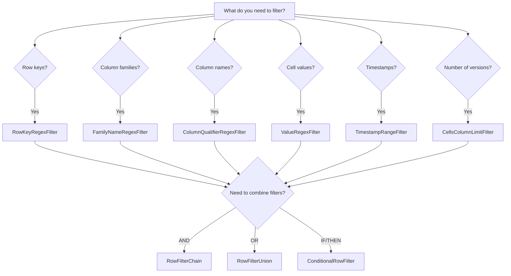

# How to Set Up Row-Level Filtering in Cloud Bigtable Queries

Author: [nawazdhandala](https://www.github.com/nawazdhandala)

Tags: GCP, Cloud Bigtable, Filters, Query Optimization, Row Filtering

Description: Master row-level filtering in Cloud Bigtable to build efficient queries that return only the data you need, reducing latency and network transfer costs.

---

When you query Cloud Bigtable without filters, you get everything - every column family, every column, every cell version, for every row in your scan range. For a table with hundreds of columns and years of versioned data, that is a lot of unnecessary bytes flying across the wire. Row-level filtering lets you tell Bigtable exactly what to return, and the filtering happens server-side before data is sent to your client.

I think of Bigtable filters as the equivalent of a WHERE clause in SQL, except they operate at the cell level rather than the row level. In this post, I will walk through all the major filter types and show you how to combine them for complex query patterns.

## How Bigtable Filters Work

Bigtable filters are applied server-side during a read operation. The server evaluates each cell against your filter criteria and only returns cells that pass. This is important because it means:

- Less data is transferred over the network
- Your client uses less memory
- Query latency decreases for filtered reads
- You are not charged for the filtered-out data transfer

Filters are passed as a parameter to the `read_row` or `read_rows` methods in the client library.

## Basic Filter Types

Let me cover each filter type with practical examples.

### Row Key Regex Filter

Filter rows based on their row key pattern:

```python
# Filter rows whose keys match a regex pattern
from google.cloud.bigtable import row_filters

# Match row keys that start with "sensor" followed by digits
key_filter = row_filters.RowKeyRegexFilter(b"sensor\\d+#.*")

rows = table.read_rows(filter_=key_filter)
for row in rows:
    print(f"Matched: {row.row_key.decode('utf-8')}")
```

This is useful when your scan range is broad but you only want rows matching a specific pattern. Note that row key range scans (start_key/end_key) are more efficient for prefix-based filtering since they skip data at the storage level.

### Column Family Filter

Return data from only specific column families:

```python
# Only return data from the "metrics" column family
family_filter = row_filters.FamilyNameRegexFilter("metrics")

row = table.read_row(b"server#web01", filter_=family_filter)
# row.cells will only contain the "metrics" family
```

### Column Qualifier Filter

Filter by specific column names within families:

```python
# Only return cells from columns matching a pattern
# This returns "cpu_usage" and "cpu_temp" but not "memory_usage"
col_filter = row_filters.ColumnQualifierRegexFilter(b"cpu_.*")

row = table.read_row(b"server#web01", filter_=col_filter)
```

### Value Filter

Filter cells based on their actual values:

```python
# Only return cells whose values match a regex
# Useful for finding rows with specific status values
value_filter = row_filters.ValueRegexFilter(b"error|critical")

rows = table.read_rows(
    start_key=b"log#2024-01-01",
    end_key=b"log#2024-01-02",
    filter_=value_filter
)
```

### Timestamp Range Filter

Return only cells written within a specific time window:

```python
# Filter cells to a specific timestamp range
import datetime

start = datetime.datetime(2024, 1, 1, tzinfo=datetime.timezone.utc)
end = datetime.datetime(2024, 1, 2, tzinfo=datetime.timezone.utc)

ts_filter = row_filters.TimestampRangeFilter(start=start, end=end)

rows = table.read_rows(
    start_key=b"events#",
    end_key=b"events$",
    filter_=ts_filter
)
```

### Cell Versions Limit

Control how many versions of each cell are returned:

```python
# Return only the 3 most recent versions of each cell
version_filter = row_filters.CellsColumnLimitFilter(3)

row = table.read_row(b"sensor#temp01", filter_=version_filter)
# Each column will have at most 3 cell versions
```

### Cells Per Row Limit

Limit the total number of cells returned per row, regardless of column:

```python
# Return at most 10 cells per row (across all columns)
cells_filter = row_filters.CellsRowLimitFilter(10)

rows = table.read_rows(
    start_key=b"user#",
    end_key=b"user$",
    filter_=cells_filter
)
```

## Combining Filters

Single filters are useful, but the real power comes from combining them. Bigtable provides three ways to combine filters.

### Filter Chain (AND Logic)

A chain applies filters sequentially. Each filter processes the output of the previous one. All conditions must be satisfied:

```python
# Chain filters: family must be "metrics" AND column must match "cpu_*"
# AND only the latest version
chain = row_filters.RowFilterChain(filters=[
    row_filters.FamilyNameRegexFilter("metrics"),
    row_filters.ColumnQualifierRegexFilter(b"cpu_.*"),
    row_filters.CellsColumnLimitFilter(1)
])

row = table.read_row(b"server#web01", filter_=chain)
```

### Filter Interleave (OR Logic)

An interleave returns cells that match any of the filters:

```python
# Interleave filters: return cells from "metrics" family OR "alerts" family
interleave = row_filters.RowFilterUnion(filters=[
    row_filters.FamilyNameRegexFilter("metrics"),
    row_filters.FamilyNameRegexFilter("alerts")
])

row = table.read_row(b"server#web01", filter_=interleave)
```

### Conditional Filter (IF/THEN/ELSE)

Apply different filters based on a condition:

```python
# Conditional filter: if the row has an "active" status, return all data
# Otherwise, return only the status column
condition = row_filters.ConditionalRowFilter(
    base_filter=row_filters.ValueRegexFilter(b"active"),
    true_filter=row_filters.PassAllFilter(True),
    false_filter=row_filters.ColumnQualifierRegexFilter(b"status")
)

row = table.read_row(b"user#12345", filter_=condition)
```

## Complex Filter Examples

Let me show some real-world filter combinations that I use regularly.

### Get Latest User Profile with Activity Count

```python
# Retrieve latest profile data and the most recent activity entry
profile_filter = row_filters.RowFilterChain(filters=[
    row_filters.FamilyNameRegexFilter("profile"),
    row_filters.CellsColumnLimitFilter(1)
])

activity_filter = row_filters.RowFilterChain(filters=[
    row_filters.FamilyNameRegexFilter("activity"),
    row_filters.ColumnQualifierRegexFilter(b"last_action"),
    row_filters.CellsColumnLimitFilter(1)
])

# Combine with OR to get both
combined = row_filters.RowFilterUnion(filters=[
    profile_filter,
    activity_filter
])

row = table.read_row(b"user#12345", filter_=combined)
```

### Time-Bounded Scan with Column Selection

```python
# Scan the last hour of sensor data, but only get temperature and humidity
import datetime

now = datetime.datetime.now(datetime.timezone.utc)
one_hour_ago = now - datetime.timedelta(hours=1)

time_and_columns = row_filters.RowFilterChain(filters=[
    # Only cells from the last hour
    row_filters.TimestampRangeFilter(start=one_hour_ago, end=now),
    # Only temperature and humidity columns
    row_filters.RowFilterUnion(filters=[
        row_filters.ColumnQualifierRegexFilter(b"temperature"),
        row_filters.ColumnQualifierRegexFilter(b"humidity")
    ]),
    # Only the latest reading per column
    row_filters.CellsColumnLimitFilter(1)
])

rows = table.read_rows(
    start_key=b"sensor#",
    end_key=b"sensor$",
    filter_=time_and_columns
)
```

## Filter Decision Tree

Use this decision tree to pick the right filter for your use case:



## Performance Considerations

**Filters do not replace good row key design.** A filter applied to a full table scan still scans the entire table. Always use start_key/end_key to limit the scan range, then apply filters within that range.

**Regex filters are more expensive.** Simple equality checks (exact column name matches) are cheaper than complex regex patterns. Use the simplest filter that does the job.

**Column family filters are the cheapest.** Bigtable can skip entire column families at the storage level, so filtering by family is very efficient.

**Value filters require reading the data.** Unlike key and column filters, value filters require Bigtable to read the actual cell data to evaluate the filter. They are the most expensive filter type.

**Test filter performance.** Use the Bigtable emulator or a test instance to benchmark your filter combinations before deploying to production.

## Strip Value Transformer

Sometimes you want to check if data exists without transferring the actual values. The strip value transformer returns empty cells, reducing data transfer:

```python
# Check which rows exist without transferring cell values
# Useful for existence checks or counting rows
strip_filter = row_filters.RowFilterChain(filters=[
    row_filters.FamilyNameRegexFilter("profile"),
    row_filters.CellsColumnLimitFilter(1),
    row_filters.StripValueTransformerFilter(True)
])

rows = table.read_rows(
    start_key=b"user#",
    end_key=b"user$",
    filter_=strip_filter
)

# Cell values will be empty bytes, but you can count rows
row_count = sum(1 for _ in rows)
print(f"Found {row_count} users")
```

## Wrapping Up

Row-level filtering in Bigtable is your primary tool for building efficient reads. Start by narrowing your scan range with row key bounds, then layer on filters to trim columns, families, versions, and values. The combination of well-designed row keys and targeted filters is what makes Bigtable reads fast even at petabyte scale. Get comfortable with filter chains and interleaves, because you will use them in nearly every production query.
