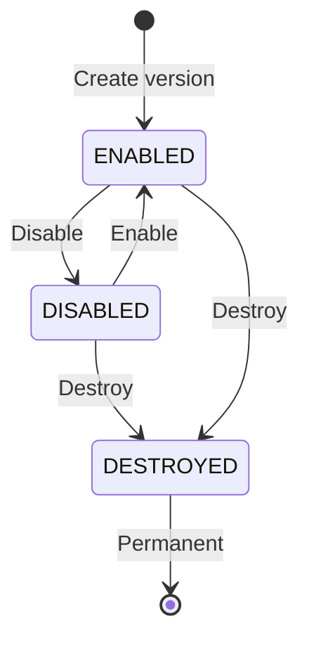

# How to Set Up Secret Versioning and Rollback Strategies in GCP Secret Manager

Author: [nawazdhandala](https://www.github.com/nawazdhandala)

Tags: GCP, Secret Manager, Versioning, Rollback, DevOps

Description: Understand how secret versioning works in GCP Secret Manager and build reliable rollback strategies for when a bad secret value breaks your application.

---

A routine secret rotation goes wrong. The new database password was generated, stored in Secret Manager, and deployed - but it was never actually applied to the database. Now your application is failing to connect and you need to roll back to the previous password immediately.

Secret Manager's versioning system is designed for exactly this scenario. Every time you add a new value to a secret, it creates a new immutable version while keeping all previous versions intact. Rolling back is as simple as pointing your application to an earlier version number.

But versioning alone is not a rollback strategy. You need a clear process for how versions are managed, how applications reference them, and how you recover when a bad version is deployed. This post covers the mechanics of versioning and the operational patterns that make rollbacks reliable.

## How Secret Versioning Works

Each secret in Secret Manager can have multiple versions, numbered sequentially starting from 1. When you add a new value, it becomes the next version number. Versions are immutable - once created, you cannot modify their contents.

Each version has a state:

- **ENABLED** - the version can be accessed normally
- **DISABLED** - the version exists but cannot be accessed (returns an error)
- **DESTROYED** - the version's data is permanently deleted

The special alias `latest` always points to the most recent enabled version.



## Working with Versions

Here is how to manage versions through the CLI:

```bash
# Add a new version (this becomes the "latest")
echo -n "password-v1" | gcloud secrets versions add my-secret \
  --data-file=- --project=my-project-id

# Add another version
echo -n "password-v2" | gcloud secrets versions add my-secret \
  --data-file=- --project=my-project-id

# List all versions
gcloud secrets versions list my-secret --project=my-project-id

# Access a specific version
gcloud secrets versions access 1 --secret=my-secret --project=my-project-id

# Access the latest version
gcloud secrets versions access latest --secret=my-secret --project=my-project-id
```

## Rollback Strategy 1: Pin to Specific Versions

The safest approach is to always reference secrets by their specific version number in your deployment configuration. This way, deploying a new secret version has no effect on running applications until you explicitly update the version reference.

```bash
# Deploy Cloud Run with a pinned secret version
gcloud run deploy my-service \
  --image=us-docker.pkg.dev/my-project-id/repo/app:latest \
  --set-secrets="DB_PASSWORD=db-password:3" \
  --region=us-central1 \
  --project=my-project-id
```

To roll back, simply redeploy with the previous version number:

```bash
# Roll back to version 2
gcloud run deploy my-service \
  --image=us-docker.pkg.dev/my-project-id/repo/app:latest \
  --set-secrets="DB_PASSWORD=db-password:2" \
  --region=us-central1 \
  --project=my-project-id
```

This approach works well for Cloud Run, GKE, and Compute Engine deployments. The downside is that every secret rotation requires a deployment update.

## Rollback Strategy 2: Use "latest" with Disable

If your application references the `latest` version alias, you can perform a rollback by disabling the bad version. When the newest enabled version is disabled, `latest` falls back to the most recent version that is still enabled.

```bash
# Current state: version 3 is latest and broken
# Disable version 3
gcloud secrets versions disable 3 \
  --secret=db-password \
  --project=my-project-id

# Now "latest" points to version 2 (the most recent enabled version)
# Verify
gcloud secrets versions access latest --secret=db-password --project=my-project-id
```

This is a faster rollback because you do not need to redeploy the application. However, running instances might still have the old value cached in memory. You may need to restart instances to pick up the change.

To re-enable the version after fixing the issue:

```bash
# Re-enable the version once the issue is resolved
gcloud secrets versions enable 3 \
  --secret=db-password \
  --project=my-project-id
```

## Rollback Strategy 3: Create a New Version with the Old Value

If you need to roll back and cannot simply disable the bad version (perhaps because other systems reference it by version number), you can create a new version with the old value:

```bash
# Read the old version's value and create it as a new version
gcloud secrets versions access 2 --secret=db-password --project=my-project-id | \
  gcloud secrets versions add db-password --data-file=- --project=my-project-id

# Now version 4 has the same value as version 2, and "latest" points to version 4
```

This keeps the version history clean and avoids confusion about which version is "current."

## Automating Rollback with a Script

Here is a script that automates the rollback process:

```bash
#!/bin/bash
# rollback-secret.sh - Roll back a secret to a previous version
# Usage: ./rollback-secret.sh SECRET_NAME VERSION_NUMBER PROJECT_ID

SECRET_NAME=$1
ROLLBACK_VERSION=$2
PROJECT_ID=$3

if [ -z "$SECRET_NAME" ] || [ -z "$ROLLBACK_VERSION" ] || [ -z "$PROJECT_ID" ]; then
  echo "Usage: $0 SECRET_NAME VERSION_NUMBER PROJECT_ID"
  exit 1
fi

echo "Rolling back $SECRET_NAME to version $ROLLBACK_VERSION..."

# Read the old version and create a new version with its value
gcloud secrets versions access "$ROLLBACK_VERSION" \
  --secret="$SECRET_NAME" \
  --project="$PROJECT_ID" | \
gcloud secrets versions add "$SECRET_NAME" \
  --data-file=- \
  --project="$PROJECT_ID"

# Get the new version number
NEW_VERSION=$(gcloud secrets versions list "$SECRET_NAME" \
  --project="$PROJECT_ID" \
  --sort-by="~name" \
  --limit=1 \
  --format="get(name)" | awk -F'/' '{print $NF}')

echo "Created new version $NEW_VERSION with value from version $ROLLBACK_VERSION"
echo "Latest now points to version $NEW_VERSION"
```

## Version Cleanup Policies

Over time, you will accumulate many secret versions, especially with automated rotation. Set up a cleanup process to manage old versions:

```python
# Python script to clean up old secret versions
# Keeps the latest N versions enabled, disables older ones
from google.cloud import secretmanager

def cleanup_old_versions(project_id, secret_id, keep_latest=5):
    """Disable versions older than the latest N versions."""
    client = secretmanager.SecretManagerServiceClient()
    parent = f"projects/{project_id}/secrets/{secret_id}"

    # List all versions
    versions = list(client.list_secret_versions(
        request={"parent": parent, "filter": "state:ENABLED"}
    ))

    # Sort by version number descending
    versions.sort(
        key=lambda v: int(v.name.split("/")[-1]),
        reverse=True,
    )

    # Disable versions beyond the retention count
    for version in versions[keep_latest:]:
        client.disable_secret_version(request={"name": version.name})
        print(f"Disabled version: {version.name}")

    print(f"Kept {min(keep_latest, len(versions))} latest versions enabled")

# Usage
cleanup_old_versions("my-project-id", "db-password", keep_latest=5)
```

## Testing Before Promoting

A safer pattern is to never update the production secret directly. Instead, use separate secrets for staging and production, and test new values in staging before promoting them:

```bash
# Store the new credential in the staging secret first
echo -n "new-password-789" | gcloud secrets versions add db-password-staging \
  --data-file=- --project=my-project-id

# Test with staging environment...

# If staging passes, promote to production
gcloud secrets versions access latest --secret=db-password-staging --project=my-project-id | \
  gcloud secrets versions add db-password-production --data-file=- --project=my-project-id
```

## Monitoring Version Health

Set up alerts for secret access failures, which often indicate a bad version:

```bash
# Search for secret access failures in the past hour
gcloud logging read 'resource.type="secretmanager.googleapis.com/Secret" AND protoPayload.status.code!=0' \
  --project=my-project-id \
  --freshness=1h \
  --format="table(timestamp, protoPayload.resourceName, protoPayload.status.message)"
```

Create a dashboard that tracks:
- The current version number of each critical secret
- The age of the current version (to verify rotation is happening)
- Access error rates (spikes indicate bad versions)
- Version creation frequency (anomalies might indicate automated issues)

## Integration with CI/CD

In your deployment pipeline, record which secret versions were used for each deployment. This makes it easy to correlate application issues with secret changes:

```bash
# Record secret versions used in this deployment
DB_VERSION=$(gcloud secrets versions describe latest \
  --secret=db-password --project=my-project-id \
  --format="get(name)" | awk -F'/' '{print $NF}')

API_VERSION=$(gcloud secrets versions describe latest \
  --secret=api-key --project=my-project-id \
  --format="get(name)" | awk -F'/' '{print $NF}')

echo "Deployed with db-password:${DB_VERSION}, api-key:${API_VERSION}"
```

Store these version numbers alongside your deployment metadata. When something breaks, you can quickly check whether a secret version changed between the last good deployment and the current one.

Versioning is one of Secret Manager's best features, but it only helps you if you build processes around it. Decide on a version reference strategy (pinned or latest), implement a rollback procedure, and test it before you need it. The middle of an outage is not the time to figure out how secret rollback works.
