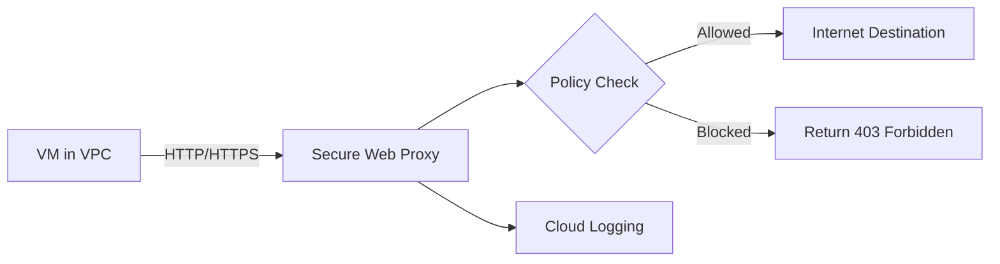

# How to Set Up Secure Web Proxy for Egress Traffic Inspection on GCP

Author: [nawazdhandala](https://www.github.com/nawazdhandala)

Tags: GCP, Secure Web Proxy, Egress Control, Network Security, Proxy

Description: Learn how to deploy Google Cloud Secure Web Proxy to inspect, filter, and control egress HTTP and HTTPS traffic from your GCP workloads.

---

Controlling what your workloads can access on the internet is a fundamental security requirement. A compromised VM that can freely communicate with the internet can exfiltrate data, download malware, or connect to command-and-control servers. Google Cloud Secure Web Proxy (SWP) gives you a managed proxy that sits in the egress path, inspecting outbound HTTP/HTTPS traffic, enforcing URL-based policies, and logging all access for auditing.

In this post, I will show you how to deploy Secure Web Proxy, configure URL-based access policies, and route egress traffic through it.

## How Secure Web Proxy Works

Secure Web Proxy is a managed forward proxy. Your workloads send outbound HTTP/HTTPS requests through the proxy, and it evaluates them against your policy rules. Allowed requests are forwarded to the internet, while blocked requests are rejected.



Unlike a network firewall that operates at the IP/port level, Secure Web Proxy understands URLs and domains. You can create rules like "allow access to pypi.org but block everything else" or "allow access to *.googleapis.com but deny *.social-media.com."

## Prerequisites

```bash
# Enable required APIs
gcloud services enable networksecurity.googleapis.com
gcloud services enable certificatemanager.googleapis.com
gcloud services enable compute.googleapis.com

# You need a VPC with a subnet for the proxy
# The subnet needs a dedicated IP range for the proxy endpoints
```

## Step 1 - Create a Gateway Security Policy

The gateway security policy defines the rules for what traffic is allowed and what is blocked.

```bash
# Create a gateway security policy
gcloud network-security gateway-security-policies create egress-policy \
    --location=us-central1 \
    --description="Egress filtering policy for production workloads"
```

## Step 2 - Add Policy Rules

Rules are evaluated in priority order. Lower priority numbers are evaluated first.

```bash
# Rule 1: Allow access to Google APIs
gcloud network-security gateway-security-policies rules create allow-google-apis \
    --gateway-security-policy=egress-policy \
    --location=us-central1 \
    --priority=100 \
    --basic-profile=ALLOW \
    --session-matcher='host().endsWith("googleapis.com")' \
    --description="Allow access to Google APIs"

# Rule 2: Allow access to package repositories
gcloud network-security gateway-security-policies rules create allow-package-repos \
    --gateway-security-policy=egress-policy \
    --location=us-central1 \
    --priority=200 \
    --basic-profile=ALLOW \
    --session-matcher='host() == "pypi.org" || host() == "files.pythonhosted.org" || host() == "registry.npmjs.org" || host().endsWith("debian.org")' \
    --description="Allow access to package repositories"

# Rule 3: Allow access to monitoring and logging services
gcloud network-security gateway-security-policies rules create allow-monitoring \
    --gateway-security-policy=egress-policy \
    --location=us-central1 \
    --priority=300 \
    --basic-profile=ALLOW \
    --session-matcher='host().endsWith("datadoghq.com") || host().endsWith("pagerduty.com") || host().endsWith("oneuptime.com")' \
    --description="Allow access to monitoring services"

# Rule 4: Allow access to container registries
gcloud network-security gateway-security-policies rules create allow-container-registries \
    --gateway-security-policy=egress-policy \
    --location=us-central1 \
    --priority=400 \
    --basic-profile=ALLOW \
    --session-matcher='host().endsWith("gcr.io") || host().endsWith("docker.io") || host() == "registry-1.docker.io" || host().endsWith("ghcr.io")' \
    --description="Allow access to container registries"

# Rule 5: Block everything else
gcloud network-security gateway-security-policies rules create deny-all \
    --gateway-security-policy=egress-policy \
    --location=us-central1 \
    --priority=65534 \
    --basic-profile=DENY \
    --session-matcher='true' \
    --description="Deny all other egress traffic"
```

## Step 3 - Create the Secure Web Proxy Instance

Create the proxy instance in your VPC.

```bash
# First, create a subnet for the proxy (if not already existing)
gcloud compute networks subnets create swp-subnet \
    --network=my-vpc \
    --region=us-central1 \
    --range=10.0.50.0/24 \
    --purpose=PRIVATE

# Reserve addresses for the proxy
gcloud compute addresses create swp-address \
    --region=us-central1 \
    --subnet=swp-subnet \
    --addresses=10.0.50.10

# Create the Secure Web Proxy instance
gcloud network-security gateways create egress-proxy \
    --location=us-central1 \
    --network=projects/my-project/global/networks/my-vpc \
    --subnetwork=projects/my-project/regions/us-central1/subnetworks/swp-subnet \
    --addresses=10.0.50.10 \
    --gateway-security-policy=egress-policy \
    --type=SECURE_WEB_GATEWAY \
    --ports=443,80 \
    --scope=scp-egress \
    --description="Egress proxy for production workloads"

# Verify the proxy is running
gcloud network-security gateways describe egress-proxy \
    --location=us-central1
```

## Step 4 - Configure Workloads to Use the Proxy

Your VMs need to route HTTP/HTTPS traffic through the proxy. There are two approaches: explicit proxy configuration or transparent proxy with routing.

### Explicit Proxy Configuration

Set the proxy environment variables on your VMs:

```bash
# Set proxy environment variables (add to /etc/environment or startup script)
export HTTP_PROXY=http://10.0.50.10:80
export HTTPS_PROXY=http://10.0.50.10:443
export NO_PROXY=metadata.google.internal,169.254.169.254,10.0.0.0/8

# For systemd services, add to the service unit file
# [Service]
# Environment="HTTP_PROXY=http://10.0.50.10:80"
# Environment="HTTPS_PROXY=http://10.0.50.10:443"
# Environment="NO_PROXY=metadata.google.internal,169.254.169.254,10.0.0.0/8"
```

For GKE pods, set the environment variables in your deployment:

```yaml
# deployment.yaml - Configure proxy for Kubernetes pods
apiVersion: apps/v1
kind: Deployment
metadata:
  name: my-app
spec:
  template:
    spec:
      containers:
        - name: app
          image: my-app:latest
          env:
            - name: HTTP_PROXY
              value: "http://10.0.50.10:80"
            - name: HTTPS_PROXY
              value: "http://10.0.50.10:443"
            - name: NO_PROXY
              value: "metadata.google.internal,169.254.169.254,10.0.0.0/8"
```

### Transparent Proxy with Routes

For transparent proxying, create routes that direct internet-bound traffic through the proxy.

```bash
# Create a route that sends internet traffic through the proxy
gcloud compute routes create egress-via-proxy \
    --network=my-vpc \
    --destination-range=0.0.0.0/0 \
    --next-hop-address=10.0.50.10 \
    --priority=800 \
    --tags=use-egress-proxy
```

Tag VMs that should use the proxy:

```bash
# Tag VMs to use the proxy route
gcloud compute instances add-tags my-vm \
    --zone=us-central1-a \
    --tags=use-egress-proxy
```

## Step 5 - Advanced Policy Rules

Secure Web Proxy supports sophisticated matching with CEL (Common Expression Language) expressions.

```bash
# Allow specific URL paths
gcloud network-security gateway-security-policies rules create allow-specific-paths \
    --gateway-security-policy=egress-policy \
    --location=us-central1 \
    --priority=150 \
    --basic-profile=ALLOW \
    --session-matcher='host() == "api.github.com"' \
    --application-matcher='request.path().startsWith("/repos/my-org/")' \
    --description="Allow GitHub API access only to our org repos"

# Allow based on source IP (specific VMs)
gcloud network-security gateway-security-policies rules create allow-from-build-servers \
    --gateway-security-policy=egress-policy \
    --location=us-central1 \
    --priority=50 \
    --basic-profile=ALLOW \
    --session-matcher='source.matchServiceAccount("build-sa@my-project.iam.gserviceaccount.com")' \
    --description="Allow build servers broader internet access"

# Time-based rules using session matcher
gcloud network-security gateway-security-policies rules create allow-updates-window \
    --gateway-security-policy=egress-policy \
    --location=us-central1 \
    --priority=250 \
    --basic-profile=ALLOW \
    --session-matcher='host().endsWith("ubuntu.com") || host().endsWith("debian.org")' \
    --description="Allow OS package updates"
```

## Step 6 - Monitor Proxy Traffic

All proxy decisions are logged to Cloud Logging.

```bash
# View recent proxy decisions
gcloud logging read \
    'resource.type="networksecurity.googleapis.com/Gateway"' \
    --format="table(timestamp, jsonPayload.httpRequest.requestUrl, jsonPayload.decision)" \
    --limit=50

# Find blocked requests
gcloud logging read \
    'resource.type="networksecurity.googleapis.com/Gateway" AND jsonPayload.decision="DENY"' \
    --format="table(timestamp, jsonPayload.source.ip, jsonPayload.httpRequest.requestUrl)" \
    --limit=50
```

Export to BigQuery for analysis:

```sql
-- Find the most commonly blocked destinations
SELECT
    REGEXP_EXTRACT(jsonPayload.httpRequest.requestUrl, r'https?://([^/]+)') AS domain,
    COUNT(*) AS block_count,
    COUNT(DISTINCT jsonPayload.source.ip) AS unique_sources
FROM
    `my_project.swp_logs.networksecurity_*`
WHERE
    jsonPayload.decision = "DENY"
    AND _TABLE_SUFFIX >= FORMAT_DATE('%Y%m%d', DATE_SUB(CURRENT_DATE(), INTERVAL 7 DAY))
GROUP BY domain
ORDER BY block_count DESC
LIMIT 20;
```

## Step 7 - Handling Exceptions

When a legitimate request is blocked, you need a process for adding exceptions.

```bash
# Check what rule blocked a specific request
gcloud logging read \
    'resource.type="networksecurity.googleapis.com/Gateway" AND jsonPayload.httpRequest.requestUrl:"blocked-domain.com"' \
    --format=json \
    --limit=5

# Add an exception rule with higher priority
gcloud network-security gateway-security-policies rules create allow-exception-domain \
    --gateway-security-policy=egress-policy \
    --location=us-central1 \
    --priority=175 \
    --basic-profile=ALLOW \
    --session-matcher='host() == "blocked-domain.com"' \
    --description="Exception: Allow access to blocked-domain.com per ticket JIRA-1234"
```

Always document exceptions with a ticket reference. This creates an audit trail for why each domain was allowed.

## Wrapping Up

Secure Web Proxy gives you URL-level control over what your workloads can access on the internet. Unlike IP-based firewalls, it understands domains and URLs, which means you can write policies in terms of "allow pypi.org" rather than trying to maintain a list of IP addresses that pypi.org resolves to. Deploy it with a default-deny policy, add allow rules for the specific services your workloads need, and monitor the blocked requests to identify missing rules. The proxy logs every request, giving your security team full visibility into what your workloads are communicating with externally.
