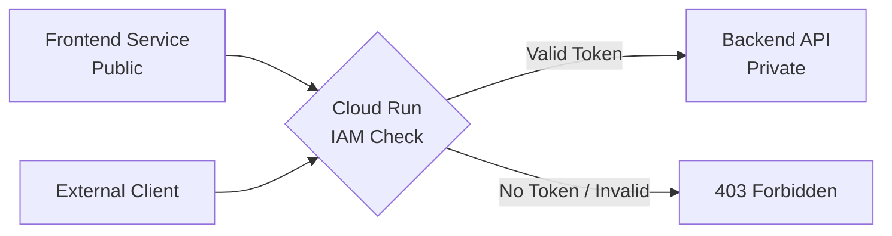

# How to Set Up Service-to-Service Authentication Between Two Cloud Run Services Using IAM

Author: [nawazdhandala](https://www.github.com/nawazdhandala)

Tags: GCP, Cloud Run, IAM, Authentication, Service-to-Service

Description: Learn how to configure secure service-to-service authentication between Cloud Run services using IAM and identity tokens, preventing unauthorized access to internal APIs.

---

When you have multiple Cloud Run services that communicate with each other, you need to make sure that only authorized services can call your internal APIs. Without authentication, anyone with the URL could hit your service. Cloud Run integrates directly with IAM for this, and the setup requires no external identity providers or custom auth code.

The pattern is simple: the calling service fetches an identity token from the metadata server and sends it with each request. The receiving service validates the token automatically through IAM. Let me walk through the entire setup.

## The Architecture



The backend API is configured to require authentication. Only requests with a valid identity token from an authorized service account are allowed through.

## Step 1: Create a Dedicated Service Account

While you could use the default Compute Engine service account, it is better practice to create a dedicated service account for each service:

```bash
# Create a service account for the frontend service
gcloud iam service-accounts create frontend-sa \
  --display-name="Frontend Cloud Run Service"

# Create a service account for the backend service
gcloud iam service-accounts create backend-sa \
  --display-name="Backend Cloud Run Service"
```

## Step 2: Deploy the Backend Service (Requires Authentication)

Deploy the backend API with authentication required (this is the default):

```bash
# Deploy the backend service with authentication required
gcloud run deploy backend-api \
  --image=us-central1-docker.pkg.dev/my-project/repo/backend-api:v1 \
  --region=us-central1 \
  --service-account=backend-sa@my-project.iam.gserviceaccount.com \
  --no-allow-unauthenticated
```

The `--no-allow-unauthenticated` flag (which is the default) means Cloud Run will reject any request that does not include a valid identity token.

Get the backend service URL:

```bash
# Get the backend service URL for the frontend to call
BACKEND_URL=$(gcloud run services describe backend-api \
  --region=us-central1 \
  --format="value(status.url)")
echo "Backend URL: ${BACKEND_URL}"
```

## Step 3: Grant the Frontend Permission to Invoke the Backend

Grant the frontend's service account the `roles/run.invoker` role on the backend service:

```bash
# Grant the frontend service account permission to invoke the backend
gcloud run services add-iam-policy-binding backend-api \
  --region=us-central1 \
  --member="serviceAccount:frontend-sa@my-project.iam.gserviceaccount.com" \
  --role="roles/run.invoker"
```

This is the critical step. Without this IAM binding, the frontend cannot call the backend, even if it sends a valid identity token.

## Step 4: Deploy the Frontend Service

The frontend needs to fetch an identity token and include it when calling the backend. Here is how to do it in several languages.

### Python Implementation

```python
# app.py - Frontend service that calls the authenticated backend
import os
import requests
from flask import Flask, jsonify
import google.auth.transport.requests
import google.oauth2.id_token

app = Flask(__name__)
BACKEND_URL = os.environ['BACKEND_URL']

def get_id_token(target_url):
    """
    Fetch an identity token for the target service.
    On Cloud Run, this uses the metadata server automatically.
    """
    auth_req = google.auth.transport.requests.Request()
    token = google.oauth2.id_token.fetch_id_token(auth_req, target_url)
    return token

@app.route('/api/data')
def get_data():
    """Call the backend API with a valid identity token."""
    try:
        # Get an identity token for the backend service
        token = get_id_token(BACKEND_URL)

        # Call the backend with the token in the Authorization header
        headers = {
            'Authorization': f'Bearer {token}'
        }
        response = requests.get(
            f'{BACKEND_URL}/api/items',
            headers=headers,
            timeout=10
        )
        response.raise_for_status()

        return jsonify({
            'source': 'frontend',
            'backend_data': response.json()
        })

    except Exception as e:
        return jsonify({
            'error': str(e)
        }), 500

if __name__ == '__main__':
    port = int(os.environ.get('PORT', 8080))
    app.run(host='0.0.0.0', port=port)
```

### Node.js Implementation

```javascript
// app.js - Frontend service calling the authenticated backend
const express = require('express');
const { GoogleAuth } = require('google-auth-library');

const app = express();
const BACKEND_URL = process.env.BACKEND_URL;

// Create a GoogleAuth instance for fetching identity tokens
const auth = new GoogleAuth();

async function callBackend(path) {
  // Get an ID token client for the backend URL
  const client = await auth.getIdTokenClient(BACKEND_URL);

  // Make an authenticated request to the backend
  const response = await client.request({
    url: `${BACKEND_URL}${path}`,
    method: 'GET'
  });

  return response.data;
}

app.get('/api/data', async (req, res) => {
  try {
    const backendData = await callBackend('/api/items');
    res.json({
      source: 'frontend',
      backend_data: backendData
    });
  } catch (error) {
    console.error('Error calling backend:', error.message);
    res.status(500).json({ error: error.message });
  }
});

const PORT = process.env.PORT || 8080;
app.listen(PORT, () => {
  console.log(`Frontend listening on port ${PORT}`);
});
```

### Go Implementation

```go
// main.go - Frontend service calling the authenticated backend
package main

import (
    "context"
    "encoding/json"
    "fmt"
    "io"
    "log"
    "net/http"
    "os"

    "google.golang.org/api/idtoken"
)

var backendURL string

func callBackend(ctx context.Context, path string) ([]byte, error) {
    // Create an HTTP client that adds identity tokens automatically
    client, err := idtoken.NewClient(ctx, backendURL)
    if err != nil {
        return nil, fmt.Errorf("failed to create ID token client: %w", err)
    }

    // Make the authenticated request
    resp, err := client.Get(backendURL + path)
    if err != nil {
        return nil, fmt.Errorf("request failed: %w", err)
    }
    defer resp.Body.Close()

    return io.ReadAll(resp.Body)
}

func handler(w http.ResponseWriter, r *http.Request) {
    data, err := callBackend(r.Context(), "/api/items")
    if err != nil {
        http.Error(w, err.Error(), http.StatusInternalServerError)
        return
    }

    w.Header().Set("Content-Type", "application/json")
    json.NewEncoder(w).Encode(map[string]interface{}{
        "source":       "frontend",
        "backend_data": json.RawMessage(data),
    })
}

func main() {
    backendURL = os.Getenv("BACKEND_URL")
    if backendURL == "" {
        log.Fatal("BACKEND_URL environment variable is required")
    }

    http.HandleFunc("/api/data", handler)

    port := os.Getenv("PORT")
    if port == "" {
        port = "8080"
    }

    log.Printf("Frontend listening on port %s", port)
    log.Fatal(http.ListenAndServe(":"+port, nil))
}
```

Deploy the frontend:

```bash
# Deploy the frontend service (publicly accessible)
gcloud run deploy frontend \
  --image=us-central1-docker.pkg.dev/my-project/repo/frontend:v1 \
  --region=us-central1 \
  --service-account=frontend-sa@my-project.iam.gserviceaccount.com \
  --allow-unauthenticated \
  --set-env-vars="BACKEND_URL=${BACKEND_URL}"
```

## Step 5: Test the Authentication

Test the frontend, which should successfully call the backend:

```bash
# Get the frontend URL
FRONTEND_URL=$(gcloud run services describe frontend \
  --region=us-central1 \
  --format="value(status.url)")

# Call the frontend - it should call the backend and return combined data
curl "${FRONTEND_URL}/api/data"
```

Try calling the backend directly without a token - it should fail:

```bash
# Direct call without authentication - should return 403
curl -s -o /dev/null -w "%{http_code}" "${BACKEND_URL}/api/items"
# Expected: 403
```

## Debugging Authentication Issues

If authentication is failing, check these common problems:

```bash
# Verify the IAM binding exists on the backend service
gcloud run services get-iam-policy backend-api \
  --region=us-central1

# Check that the frontend is using the correct service account
gcloud run services describe frontend \
  --region=us-central1 \
  --format="value(spec.template.spec.serviceAccountName)"
```

Check the backend service logs for authentication errors:

```bash
# Look for auth-related errors in the backend logs
gcloud run services logs read backend-api \
  --region=us-central1 \
  --limit=20
```

Common mistakes:
- The IAM binding is on the wrong service
- The frontend is using the default service account instead of the dedicated one
- The identity token audience does not match the backend URL
- The IAM change has not propagated yet (can take a few minutes)

## Multiple Services Pattern

For microservices architectures with many services, create a clear permission matrix:

```bash
# Frontend can call Backend API and Auth Service
gcloud run services add-iam-policy-binding backend-api \
  --region=us-central1 \
  --member="serviceAccount:frontend-sa@my-project.iam.gserviceaccount.com" \
  --role="roles/run.invoker"

gcloud run services add-iam-policy-binding auth-service \
  --region=us-central1 \
  --member="serviceAccount:frontend-sa@my-project.iam.gserviceaccount.com" \
  --role="roles/run.invoker"

# Backend API can call Database Service
gcloud run services add-iam-policy-binding db-service \
  --region=us-central1 \
  --member="serviceAccount:backend-sa@my-project.iam.gserviceaccount.com" \
  --role="roles/run.invoker"
```

This gives you fine-grained control over which services can communicate with each other. It is the serverless equivalent of network policies in Kubernetes.

Service-to-service authentication on Cloud Run is one of the cleanest implementations of zero-trust networking I have worked with. No shared secrets, no certificate management, no external auth servers. IAM handles everything.
