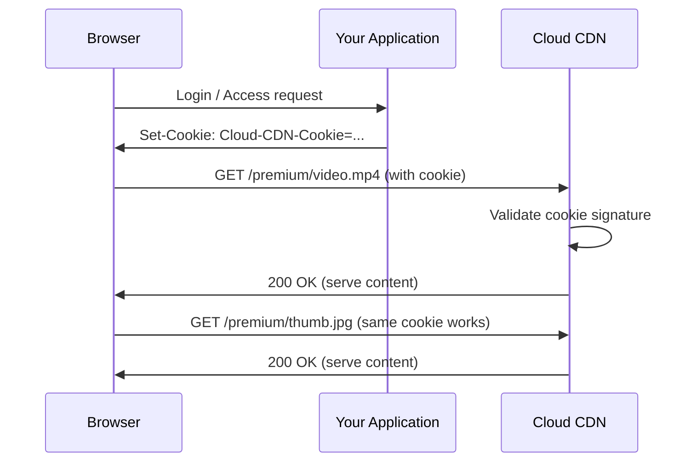

# How to Set Up Signed Cookies for Authentication with Google Cloud CDN

Author: [nawazdhandala](https://www.github.com/nawazdhandala)

Tags: GCP, Cloud CDN, Signed Cookies, Authentication, Security

Description: Learn how to configure signed cookies with Google Cloud CDN for session-based content access control without requiring signed URLs.

---

Signed URLs work great for protecting individual resources, but they become impractical when users need access to many assets on a page. Think of a premium video player that loads the video file, thumbnail, subtitles, and poster image - generating a signed URL for each one is messy. Signed cookies solve this by granting access to a URL prefix through a single cookie, so all requests under that prefix are authenticated automatically.

In this post, I will walk through setting up signed cookies in Cloud CDN, generating them in your application, and handling the edge cases.

## How Signed Cookies Work

With signed cookies, the authentication flow is:

1. A user logs in to your application and is authorized for certain content
2. Your application generates a signed cookie that grants access to a URL prefix
3. The browser stores the cookie and sends it with every request to that domain
4. Cloud CDN validates the cookie signature and expiration on each request
5. Valid cookies get content, invalid cookies get 403 Forbidden

The big advantage over signed URLs is that the cookie covers an entire URL prefix. One cookie can authorize access to `/premium/video-123/*`, which includes the video file, thumbnails, subtitles, and any other assets under that path.



## Prerequisites

- Cloud CDN enabled on a backend service or backend bucket
- A signing key configured (same as for signed URLs)
- Your application can set cookies on the CDN domain

## Step 1: Generate and Configure the Signing Key

If you already have a signing key from a signed URL setup, you can reuse it. Otherwise, create one.

```bash
# Generate a 128-bit signing key
head -c 16 /dev/urandom | base64 > cdn-signing-key.txt

# Add the key to your backend service
gcloud compute backend-services \
    add-signed-url-key my-backend \
    --key-name=cookie-signing-key \
    --key-file=cdn-signing-key.txt \
    --global \
    --project=my-project
```

## Step 2: Configure the Backend for Signed Cookies

Enable signed request handling on the backend service.

```bash
# Set the signed URL/cookie cache max age
gcloud compute backend-services update my-backend \
    --signed-url-cache-max-age=3600 \
    --global \
    --project=my-project
```

## Step 3: Generate Signed Cookies in Your Application

The signed cookie value has a specific format. It contains a URL prefix, expiration time, key name, and HMAC signature.

### Python Implementation

```python
# signed_cookie.py - Generate signed cookies for Cloud CDN
import base64
import hashlib
import hmac
import datetime
from urllib.parse import quote

def generate_signed_cookie(url_prefix, key_name, key_base64, expiration_time):
    """Generate a signed cookie value for Cloud CDN.

    Args:
        url_prefix: The URL prefix to grant access to (e.g., https://cdn.example.com/premium/)
        key_name: The name of the signing key in Cloud CDN
        key_base64: The base64-encoded signing key
        expiration_time: datetime object for when access should expire

    Returns:
        A dictionary with the cookie name and value
    """
    # Convert expiration to Unix timestamp
    epoch = datetime.datetime(1970, 1, 1)
    expiration_timestamp = int((expiration_time - epoch).total_seconds())

    # Base64url encode the URL prefix
    encoded_url_prefix = base64.urlsafe_b64encode(url_prefix.encode("utf-8")).decode("utf-8")

    # Build the cookie value to sign
    policy = f"URLPrefix={encoded_url_prefix}:Expires={expiration_timestamp}:KeyName={key_name}"

    # Decode the signing key
    decoded_key = base64.urlsafe_b64decode(key_base64)

    # Create the HMAC-SHA1 signature
    signature = hmac.new(decoded_key, policy.encode("utf-8"), hashlib.sha1)
    encoded_signature = base64.urlsafe_b64encode(signature.digest()).decode("utf-8")

    # Combine into the full cookie value
    cookie_value = f"{policy}:Signature={encoded_signature}"

    return {
        "name": "Cloud-CDN-Cookie",
        "value": cookie_value
    }

# Example usage
url_prefix = "https://cdn.example.com/premium/"
key_name = "cookie-signing-key"
key_base64 = "YOUR_BASE64_KEY_HERE"

# Cookie expires in 2 hours
expiration = datetime.datetime.utcnow() + datetime.timedelta(hours=2)

cookie = generate_signed_cookie(url_prefix, key_name, key_base64, expiration)
print(f"Cookie name: {cookie['name']}")
print(f"Cookie value: {cookie['value']}")
```

### Node.js Implementation

```javascript
// signedCookie.js - Generate signed cookies for Cloud CDN in Node.js
const crypto = require('crypto');

function generateSignedCookie(urlPrefix, keyName, keyBase64, expirationDate) {
  // Convert expiration to Unix timestamp
  const expirationTimestamp = Math.floor(expirationDate.getTime() / 1000);

  // Base64url encode the URL prefix
  const encodedUrlPrefix = Buffer.from(urlPrefix)
    .toString('base64')
    .replace(/\+/g, '-')
    .replace(/\//g, '_');

  // Build the policy string
  const policy = `URLPrefix=${encodedUrlPrefix}:Expires=${expirationTimestamp}:KeyName=${keyName}`;

  // Decode the signing key
  const decodedKey = Buffer.from(keyBase64, 'base64');

  // Create HMAC-SHA1 signature
  const signature = crypto
    .createHmac('sha1', decodedKey)
    .update(policy)
    .digest();

  // Base64url encode the signature
  const encodedSignature = signature
    .toString('base64')
    .replace(/\+/g, '-')
    .replace(/\//g, '_');

  return {
    name: 'Cloud-CDN-Cookie',
    value: `${policy}:Signature=${encodedSignature}`
  };
}

// Example usage in an Express route
const express = require('express');
const app = express();

app.get('/authorize-content', (req, res) => {
  // Verify the user is authorized (your auth logic here)
  if (!req.user.hasPremiumAccess) {
    return res.status(403).json({ error: 'Premium access required' });
  }

  const cookie = generateSignedCookie(
    'https://cdn.example.com/premium/',
    'cookie-signing-key',
    process.env.CDN_SIGNING_KEY,
    new Date(Date.now() + 2 * 60 * 60 * 1000) // 2 hours
  );

  // Set the cookie on the CDN domain
  res.cookie(cookie.name, cookie.value, {
    domain: '.example.com',  // Must cover both app and CDN domains
    path: '/',
    httpOnly: true,
    secure: true,
    sameSite: 'None',        // Required for cross-origin cookie
    maxAge: 2 * 60 * 60 * 1000
  });

  res.json({ message: 'Content access granted' });
});
```

### Go Implementation

```go
// signed_cookie.go - Generate signed cookies for Cloud CDN in Go
package main

import (
	"crypto/hmac"
	"crypto/sha1"
	"encoding/base64"
	"fmt"
	"net/http"
	"time"
)

// GenerateSignedCookie creates a Cloud CDN signed cookie value
func GenerateSignedCookie(urlPrefix, keyName string, key []byte, expiration time.Time) (string, string) {
	// Base64url encode the URL prefix
	encodedPrefix := base64.URLEncoding.EncodeToString([]byte(urlPrefix))

	// Build the policy string
	policy := fmt.Sprintf("URLPrefix=%s:Expires=%d:KeyName=%s",
		encodedPrefix, expiration.Unix(), keyName)

	// Create HMAC-SHA1 signature
	mac := hmac.New(sha1.New, key)
	mac.Write([]byte(policy))
	signature := base64.URLEncoding.EncodeToString(mac.Sum(nil))

	// Return cookie name and value
	cookieValue := fmt.Sprintf("%s:Signature=%s", policy, signature)
	return "Cloud-CDN-Cookie", cookieValue
}

// Handler sets the signed cookie in the HTTP response
func authorizeHandler(w http.ResponseWriter, r *http.Request) {
	key, _ := base64.URLEncoding.DecodeString("YOUR_BASE64_KEY_HERE")

	// Generate the cookie - expires in 2 hours
	name, value := GenerateSignedCookie(
		"https://cdn.example.com/premium/",
		"cookie-signing-key",
		key,
		time.Now().Add(2*time.Hour),
	)

	http.SetCookie(w, &http.Cookie{
		Name:     name,
		Value:    value,
		Domain:   ".example.com",
		Path:     "/",
		Secure:   true,
		HttpOnly: true,
		SameSite: http.SameSiteNoneMode,
		MaxAge:   7200,
	})

	w.Write([]byte("Content access granted"))
}
```

## Step 4: Cookie Domain Configuration

For signed cookies to work, the cookie domain must cover both your application domain and the CDN domain. There are two approaches:

**Same domain**: If your app is at `app.example.com` and CDN is at `cdn.example.com`, set the cookie domain to `.example.com`.

**Different domains**: If the domains are completely different, you need a redirect flow. Your app redirects the user to the CDN domain with a one-time token, the CDN domain sets the cookie, then redirects back.

```python
# Example redirect flow for cross-domain cookie setting
@app.route('/grant-access')
def grant_access():
    # Generate a one-time token
    token = generate_one_time_token(user_id, expires_in=60)

    # Redirect to CDN domain to set the cookie
    return redirect(f"https://cdn.example.com/set-cookie?token={token}&redirect={request.url}")
```

## Step 5: Testing Signed Cookies

Test the cookie by setting it manually with curl.

```bash
# Generate a test cookie value using your application
# Then test with curl

# Test without cookie - should get 403
curl -I https://cdn.example.com/premium/video.mp4

# Test with valid cookie - should get 200
curl -I -b "Cloud-CDN-Cookie=URLPrefix=aHR0cHM6Ly9jZG4uZXhhbXBsZS5jb20vcHJlbWl1bS8=:Expires=1739923200:KeyName=cookie-signing-key:Signature=abc123..." \
    https://cdn.example.com/premium/video.mp4
```

## Security Best Practices

**Set HttpOnly flag**: Prevents JavaScript from reading the cookie, protecting against XSS attacks.

**Set Secure flag**: Ensures the cookie is only sent over HTTPS.

**Use SameSite=None with Secure**: Required for cross-origin cookie sending in modern browsers.

**Keep expiration times reasonable**: Match the cookie expiration to the user's session or content access duration.

**Scope URL prefixes tightly**: Instead of granting access to `/`, grant access to the specific content path like `/premium/user-123/`.

**Rotate signing keys**: Use the multi-key support to rotate keys without disrupting active sessions.

## Wrapping Up

Signed cookies provide a smoother experience than signed URLs when users need access to multiple assets under the same path. Set the cookie once after authentication, and all subsequent requests to content under that URL prefix are automatically validated by Cloud CDN at the edge. The implementation requires a bit more work on the cookie domain setup, but the result is a cleaner integration between your application's authentication and CDN content protection.
