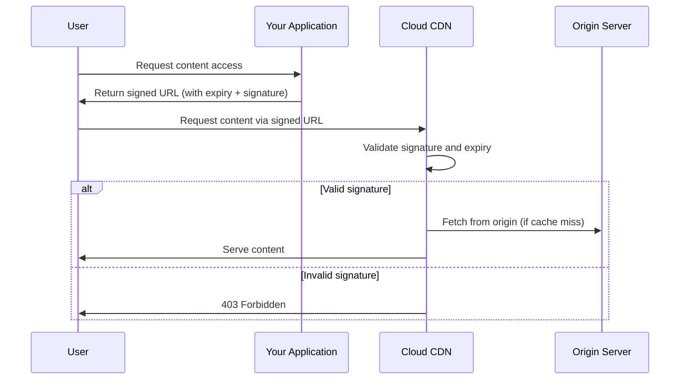

# How to Set Up Signed URLs for Secure Content Delivery with Google Cloud CDN

Author: [nawazdhandala](https://www.github.com/nawazdhandala)

Tags: GCP, Cloud CDN, Signed URLs, Security, Content Delivery

Description: Learn how to create and use signed URLs with Google Cloud CDN to control access to cached content and prevent unauthorized downloads.

---

Signed URLs let you control who can access content served through Cloud CDN. Instead of making your content publicly accessible, you generate time-limited URLs that include a cryptographic signature. Only requests with a valid signature get served - everything else gets rejected with a 403 Forbidden response.

This is essential for scenarios like paid content, premium downloads, video streaming, or any content that should not be freely accessible to the public. In this guide, I will walk through setting up signed URLs from key generation to request validation.

## How Signed URLs Work

The process involves three components:

1. **Signing key**: A shared secret stored on both your application server and Cloud CDN
2. **URL generation**: Your application generates URLs that include an expiration time and HMAC signature
3. **Validation**: Cloud CDN validates the signature and expiration before serving the content

When a user requests content, Cloud CDN checks the URL parameters. If the signature is valid and the URL has not expired, the content is served from cache (or fetched from origin if not cached). If the signature is invalid or expired, Cloud CDN returns a 403 error.



## Step 1: Generate a Signing Key

Cloud CDN uses HMAC-SHA1 keys for URL signing. Generate a random key and store it securely.

```bash
# Generate a random 128-bit signing key (base64 encoded)
head -c 16 /dev/urandom | base64 > cdn-signing-key.txt

# View the key (keep this secret)
cat cdn-signing-key.txt
```

The key must be a base64-encoded string of exactly 16 bytes (128 bits).

## Step 2: Add the Signing Key to Cloud CDN

Attach the signing key to your backend service or backend bucket.

```bash
# Add a signing key to a backend service
gcloud compute backend-services \
    add-signed-url-key my-backend \
    --key-name=my-signing-key \
    --key-file=cdn-signing-key.txt \
    --global \
    --project=my-project

# Or add a signing key to a backend bucket
gcloud compute backend-buckets \
    add-signed-url-key my-bucket-backend \
    --key-name=my-signing-key \
    --key-file=cdn-signing-key.txt \
    --project=my-project
```

You can have multiple signing keys (up to 3) on each backend. This is useful for key rotation - add the new key, update your application to use it, then remove the old key.

## Step 3: Enable Signed URL Requirement

You need to tell Cloud CDN to require signed URLs. This is done through the CDN policy on the backend.

```bash
# Update the backend service to require signed URLs
gcloud compute backend-services update my-backend \
    --signed-url-cache-max-age=3600 \
    --global \
    --project=my-project
```

The `--signed-url-cache-max-age` parameter sets how long a response can be cached in Cloud CDN for signed URL requests. This is separate from the regular cache TTL.

## Step 4: Generate Signed URLs in Your Application

Now you need to generate signed URLs in your application code. Here are examples in several languages.

### Python

```python
# sign_url.py - Generate a signed URL for Cloud CDN
import base64
import hashlib
import hmac
import datetime
from urllib.parse import urlparse, urlencode

def sign_url(url, key_name, key_base64, expiration_time):
    """Generate a signed URL for Cloud CDN.

    Args:
        url: The URL to sign (without query parameters for signing)
        key_name: The name of the signing key in Cloud CDN
        key_base64: The base64-encoded signing key
        expiration_time: datetime object for when the URL should expire

    Returns:
        The signed URL string
    """
    # Convert expiration to Unix timestamp
    epoch = datetime.datetime(1970, 1, 1)
    expiration_timestamp = int((expiration_time - epoch).total_seconds())

    # Build the URL with expiration and key name parameters
    stripped_url = url.split("?")[0]
    url_to_sign = f"{stripped_url}?Expires={expiration_timestamp}&KeyName={key_name}"

    # Decode the base64 key
    decoded_key = base64.urlsafe_b64decode(key_base64)

    # Create the HMAC-SHA1 signature
    signature = hmac.new(decoded_key, url_to_sign.encode("utf-8"), hashlib.sha1)
    encoded_signature = base64.urlsafe_b64encode(signature.digest()).decode("utf-8")

    # Return the complete signed URL
    signed_url = f"{url_to_sign}&Signature={encoded_signature}"
    return signed_url

# Example usage
url = "https://cdn.example.com/premium/video.mp4"
key_name = "my-signing-key"
key_base64 = "YOUR_BASE64_KEY_HERE"

# URL expires in 1 hour
expiration = datetime.datetime.utcnow() + datetime.timedelta(hours=1)

signed = sign_url(url, key_name, key_base64, expiration)
print(f"Signed URL: {signed}")
```

### Node.js

```javascript
// signUrl.js - Generate a signed URL for Cloud CDN in Node.js
const crypto = require('crypto');

function signUrl(url, keyName, keyBase64, expirationDate) {
  // Convert expiration to Unix timestamp
  const expirationTimestamp = Math.floor(expirationDate.getTime() / 1000);

  // Build the URL with parameters
  const strippedUrl = url.split('?')[0];
  const urlToSign = `${strippedUrl}?Expires=${expirationTimestamp}&KeyName=${keyName}`;

  // Decode the base64 key
  const decodedKey = Buffer.from(keyBase64, 'base64');

  // Create HMAC-SHA1 signature
  const signature = crypto
    .createHmac('sha1', decodedKey)
    .update(urlToSign)
    .digest();

  // Base64url encode the signature
  const encodedSignature = signature
    .toString('base64')
    .replace(/\+/g, '-')
    .replace(/\//g, '_');

  // Return the signed URL
  return `${urlToSign}&Signature=${encodedSignature}`;
}

// Example usage
const url = 'https://cdn.example.com/premium/video.mp4';
const keyName = 'my-signing-key';
const keyBase64 = 'YOUR_BASE64_KEY_HERE';

// Expire in 1 hour
const expiration = new Date(Date.now() + 3600 * 1000);

const signedUrl = signUrl(url, keyName, keyBase64, expiration);
console.log(`Signed URL: ${signedUrl}`);
```

### Go

```go
// sign_url.go - Generate a signed URL for Cloud CDN in Go
package main

import (
	"crypto/hmac"
	"crypto/sha1"
	"encoding/base64"
	"fmt"
	"strings"
	"time"
)

// SignURL generates a signed URL for Google Cloud CDN
func SignURL(url, keyName string, key []byte, expiration time.Time) string {
	// Strip query parameters from the URL
	strippedURL := strings.Split(url, "?")[0]

	// Build URL with expiration and key name
	expirationUnix := expiration.Unix()
	urlToSign := fmt.Sprintf("%s?Expires=%d&KeyName=%s", strippedURL, expirationUnix, keyName)

	// Create HMAC-SHA1 signature
	mac := hmac.New(sha1.New, key)
	mac.Write([]byte(urlToSign))
	signature := base64.URLEncoding.EncodeToString(mac.Sum(nil))

	// Return the signed URL
	return fmt.Sprintf("%s&Signature=%s", urlToSign, signature)
}

func main() {
	url := "https://cdn.example.com/premium/video.mp4"
	keyName := "my-signing-key"

	// Decode the base64 key
	key, _ := base64.URLEncoding.DecodeString("YOUR_BASE64_KEY_HERE")

	// Expire in 1 hour
	expiration := time.Now().Add(1 * time.Hour)

	signedURL := SignURL(url, keyName, key, expiration)
	fmt.Printf("Signed URL: %s\n", signedURL)
}
```

## Step 5: Test the Signed URL

Generate a test URL and verify it works.

```bash
# Generate a signed URL using gcloud for testing
gcloud compute sign-url \
    "https://cdn.example.com/premium/video.mp4" \
    --key-name=my-signing-key \
    --key-file=cdn-signing-key.txt \
    --expires-in=1h

# Test with curl
curl -I "https://cdn.example.com/premium/video.mp4?Expires=1739836800&KeyName=my-signing-key&Signature=abc123..."
```

A valid signed URL returns a 200 OK. An invalid or expired URL returns 403 Forbidden.

## Step 6: Key Rotation

Rotate your signing keys periodically without downtime by using multiple keys.

```bash
# Add a new signing key
gcloud compute backend-services \
    add-signed-url-key my-backend \
    --key-name=my-signing-key-v2 \
    --key-file=new-cdn-signing-key.txt \
    --global \
    --project=my-project

# Update your application to use the new key name
# Wait for all old signed URLs to expire
# Then remove the old key

gcloud compute backend-services \
    delete-signed-url-key my-backend \
    --key-name=my-signing-key \
    --global \
    --project=my-project
```

## Security Best Practices

**Keep expiration times short.** For one-time downloads, 15-30 minutes is usually enough. For streaming video, match the expected viewing duration plus a buffer.

**Never expose the signing key to clients.** All URL signing must happen server-side. The signing key should only exist on your application servers and in Cloud CDN.

**Use URL prefix signing for related assets.** If a page needs multiple assets (video + thumbnails + subtitles), sign a URL prefix instead of individual URLs.

**Rotate keys regularly.** Set a schedule for key rotation - monthly is a good starting point. The multi-key support makes this seamless.

**Store keys securely.** Use Secret Manager to store signing keys, not environment variables or config files.

## Wrapping Up

Signed URLs are a straightforward way to protect content behind Cloud CDN. The setup is a one-time effort - generate a key, configure the backend, and add URL signing to your application. From there, every content URL your application generates includes a time-limited, cryptographically validated signature that Cloud CDN enforces at the edge. This keeps your protected content safe without adding latency or requiring complex authentication at the origin.
