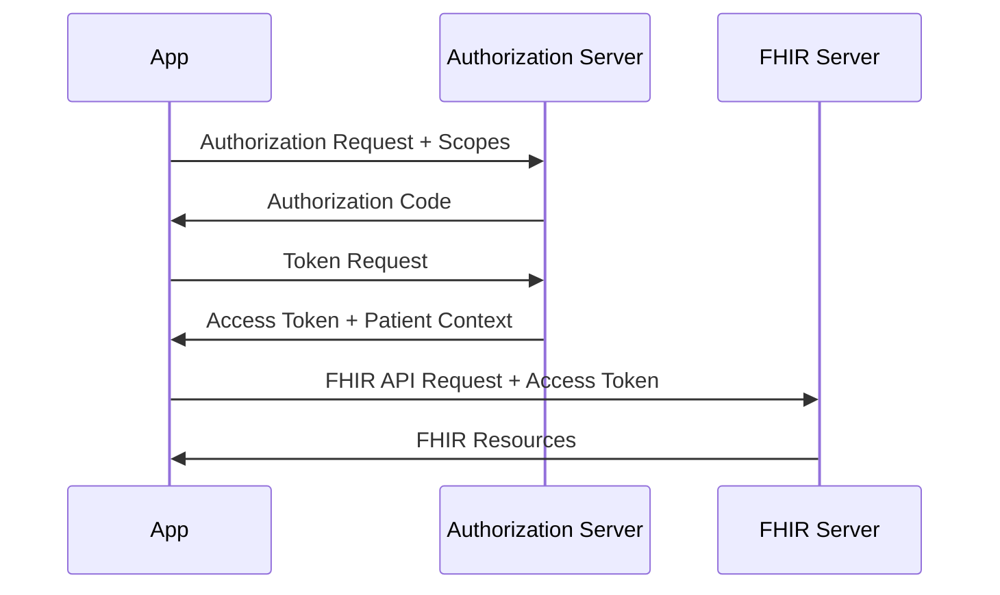

# How to Set Up SMART on FHIR Authentication for Google Cloud Healthcare API Applications

Author: [nawazdhandala](https://www.github.com/nawazdhandala)

Tags: GCP, Healthcare API, FHIR, SMART on FHIR, Authentication, OAuth2, Google Cloud

Description: Set up SMART on FHIR authentication for Google Cloud Healthcare API to enable standards-based access control for healthcare applications.

---

SMART on FHIR (Substitutable Medical Applications, Reusable Technologies) is the standard way to handle authentication and authorization in healthcare applications. It builds on OAuth 2.0 and adds healthcare-specific scoping so that apps can request access to specific types of clinical data. If you are building a patient-facing app, a clinical decision support tool, or any application that needs to interact with EHR data through FHIR, implementing SMART on FHIR authentication is not just good practice - it is usually required.

Google Cloud Healthcare API supports SMART on FHIR out of the box. In this post, I will walk through setting up the authentication flow, configuring scopes, and building a working client application.

## How SMART on FHIR Works

SMART on FHIR defines two main launch contexts:

1. **EHR Launch** - the app is launched from within an EHR system and receives context about the current patient and encounter
2. **Standalone Launch** - the app launches independently and the user authenticates and selects a patient

Both flows use OAuth 2.0 under the hood, but with SMART-specific extensions for clinical scoping.



## Prerequisites

You will need:

- A Google Cloud project with Healthcare API enabled
- A FHIR store with some test data
- A registered OAuth 2.0 client in Google Cloud
- Node.js or Python for the client application

## Step 1: Configure the FHIR Store for SMART Access

First, you need to set up consent enforcement on your FHIR store so that SMART scopes are actually enforced.

This command updates the FHIR store to enable SMART access control:

```bash
# Update FHIR store with SMART enforcement configuration
curl -X PATCH \
  -H "Authorization: Bearer $(gcloud auth print-access-token)" \
  -H "Content-Type: application/json" \
  "https://healthcare.googleapis.com/v1beta1/projects/MY_PROJECT/locations/us-central1/datasets/my-dataset/fhirStores/my-fhir-store?updateMask=validationConfig" \
  -d '{
    "validationConfig": {
      "enabledImplementationGuides": [
        "http://hl7.org/fhir/smart-app-launch"
      ]
    }
  }'
```

## Step 2: Set Up the OAuth 2.0 Consent Screen and Credentials

Configure the OAuth consent screen in Google Cloud Console and create OAuth 2.0 credentials. For SMART on FHIR, you will want to register the SMART-specific scopes.

These are the common SMART on FHIR scopes you will work with:

```
# Patient-level scopes (for patient-facing apps)
patient/Patient.read
patient/Observation.read
patient/MedicationRequest.read
patient/Condition.read
patient/AllergyIntolerance.read

# User-level scopes (for clinician-facing apps)
user/Patient.read
user/Patient.write
user/Encounter.read

# Launch scopes
launch
launch/patient
openid
fhirUser
```

Create OAuth credentials using the gcloud CLI:

```bash
# Create an OAuth 2.0 client ID for a web application
# Note: You'll need to do this in Cloud Console for full SMART support
# But here's how to set up the service account for backend access

gcloud iam service-accounts create smart-fhir-app \
  --display-name="SMART on FHIR Application"

# Grant the service account access to the FHIR store
gcloud projects add-iam-policy-binding MY_PROJECT \
  --member="serviceAccount:smart-fhir-app@MY_PROJECT.iam.gserviceaccount.com" \
  --role="roles/healthcare.fhirResourceReader"
```

## Step 3: Implement the SMART Discovery Endpoint

SMART on FHIR requires a well-known configuration endpoint. If you are building a SMART-compliant server in front of the Healthcare API, you need to serve this metadata.

This Node.js Express handler serves the SMART configuration document:

```javascript
const express = require('express');
const app = express();

// Serve the SMART configuration endpoint
// This tells client apps where to authenticate and what scopes are supported
app.get('/fhir/.well-known/smart-configuration', (req, res) => {
  res.json({
    authorization_endpoint: 'https://accounts.google.com/o/oauth2/v2/auth',
    token_endpoint: 'https://oauth2.googleapis.com/token',
    token_endpoint_auth_methods_supported: [
      'client_secret_basic',
      'client_secret_post',
      'private_key_jwt'
    ],
    registration_endpoint: null,
    scopes_supported: [
      'openid',
      'fhirUser',
      'launch',
      'launch/patient',
      'patient/Patient.read',
      'patient/Observation.read',
      'patient/MedicationRequest.read',
      'patient/Condition.read',
      'user/Patient.read',
      'user/Patient.write'
    ],
    response_types_supported: ['code'],
    capabilities: [
      'launch-ehr',
      'launch-standalone',
      'client-public',
      'client-confidential-symmetric',
      'sso-openid-connect',
      'context-passthrough-banner',
      'context-passthrough-style',
      'context-ehr-patient',
      'context-standalone-patient',
      'permission-offline',
      'permission-patient',
      'permission-user'
    ]
  });
});

// Capability statement for the FHIR server
app.get('/fhir/metadata', (req, res) => {
  res.json({
    resourceType: 'CapabilityStatement',
    status: 'active',
    kind: 'instance',
    fhirVersion: '4.0.1',
    format: ['json'],
    rest: [{
      mode: 'server',
      security: {
        extension: [{
          url: 'http://fhir-registry.smarthealthit.org/StructureDefinition/oauth-uris',
          extension: [
            {
              url: 'authorize',
              valueUri: 'https://accounts.google.com/o/oauth2/v2/auth'
            },
            {
              url: 'token',
              valueUri: 'https://oauth2.googleapis.com/token'
            }
          ]
        }],
        service: [{
          coding: [{
            system: 'http://terminology.hl7.org/CodeSystem/restful-security-service',
            code: 'SMART-on-FHIR'
          }]
        }]
      }
    }]
  });
});

app.listen(3000, () => console.log('SMART FHIR proxy running on port 3000'));
```

## Step 4: Build a SMART Client Application

Now build a client application that authenticates using the SMART flow and queries FHIR resources.

This Python client implements the standalone launch flow:

```python
import requests
import webbrowser
from urllib.parse import urlencode, urlparse, parse_qs
from http.server import HTTPServer, BaseHTTPRequestHandler
import json

# Configuration for the SMART client
CLIENT_ID = "your-oauth-client-id"
CLIENT_SECRET = "your-oauth-client-secret"
REDIRECT_URI = "http://localhost:8080/callback"
FHIR_BASE = "https://healthcare.googleapis.com/v1/projects/MY_PROJECT/locations/us-central1/datasets/my-dataset/fhirStores/my-fhir-store/fhir"

# SMART scopes to request
SCOPES = "openid fhirUser launch/patient patient/Patient.read patient/Observation.read"

auth_code = None

class CallbackHandler(BaseHTTPRequestHandler):
    """Handles the OAuth callback to capture the authorization code."""

    def do_GET(self):
        global auth_code
        query = parse_qs(urlparse(self.path).query)
        auth_code = query.get("code", [None])[0]

        self.send_response(200)
        self.end_headers()
        self.wfile.write(b"Authentication successful. You can close this window.")

def authenticate():
    """Runs the SMART standalone launch flow."""

    # Build the authorization URL with SMART scopes
    auth_params = urlencode({
        "response_type": "code",
        "client_id": CLIENT_ID,
        "redirect_uri": REDIRECT_URI,
        "scope": SCOPES,
        "aud": FHIR_BASE,
        "state": "random-state-value"
    })

    auth_url = f"https://accounts.google.com/o/oauth2/v2/auth?{auth_params}"

    # Open the browser for user authentication
    webbrowser.open(auth_url)

    # Start a local server to capture the callback
    server = HTTPServer(("localhost", 8080), CallbackHandler)
    server.handle_request()

    # Exchange the authorization code for an access token
    token_response = requests.post(
        "https://oauth2.googleapis.com/token",
        data={
            "grant_type": "authorization_code",
            "code": auth_code,
            "redirect_uri": REDIRECT_URI,
            "client_id": CLIENT_ID,
            "client_secret": CLIENT_SECRET
        }
    )

    return token_response.json()

def fetch_patient_data(access_token, patient_id):
    """Fetches patient data using the SMART access token."""
    headers = {"Authorization": f"Bearer {access_token}"}

    # Fetch the patient resource
    patient = requests.get(
        f"{FHIR_BASE}/Patient/{patient_id}",
        headers=headers
    ).json()

    # Fetch recent observations for this patient
    observations = requests.get(
        f"{FHIR_BASE}/Observation?patient={patient_id}&_count=10&_sort=-date",
        headers=headers
    ).json()

    return patient, observations

# Run the authentication flow
tokens = authenticate()
print(f"Access token received. Expires in {tokens.get('expires_in')} seconds.")

# Fetch patient data
patient, obs = fetch_patient_data(tokens["access_token"], "example-patient-id")
print(json.dumps(patient, indent=2))
```

## Step 5: Enforce SMART Scopes on the Server Side

On the server side, you need to validate that the access token's scopes match the requested resource. This middleware checks SMART scopes before proxying requests to the Healthcare API.

This Express middleware validates SMART scopes against the requested FHIR resource:

```javascript
// Middleware to enforce SMART on FHIR scopes
function enforceSMARTScopes(req, res, next) {
  const token = req.headers.authorization;
  const scopes = req.tokenScopes || [];

  // Extract resource type from the FHIR URL path
  const pathParts = req.path.split('/');
  const resourceType = pathParts[2]; // e.g., /fhir/Patient/123

  // Determine required scope based on HTTP method
  const action = req.method === 'GET' ? 'read' : 'write';

  // Check for matching patient-level or user-level scope
  const requiredPatientScope = `patient/${resourceType}.${action}`;
  const requiredUserScope = `user/${resourceType}.${action}`;

  const hasAccess = scopes.includes(requiredPatientScope)
    || scopes.includes(requiredUserScope);

  if (!hasAccess) {
    return res.status(403).json({
      resourceType: 'OperationOutcome',
      issue: [{
        severity: 'error',
        code: 'forbidden',
        diagnostics: `Insufficient scope. Required: ${requiredPatientScope} or ${requiredUserScope}`
      }]
    });
  }

  next();
}
```

## Summary

Setting up SMART on FHIR with Google Cloud Healthcare API involves configuring the OAuth flow, serving the SMART discovery endpoints, building a client that handles the authorization dance, and enforcing scopes on the server side. The Healthcare API handles the FHIR data storage and retrieval, while you layer the SMART authentication on top. This gives you a standards-compliant setup that third-party healthcare apps can integrate with, which is increasingly a regulatory requirement for health IT systems.
