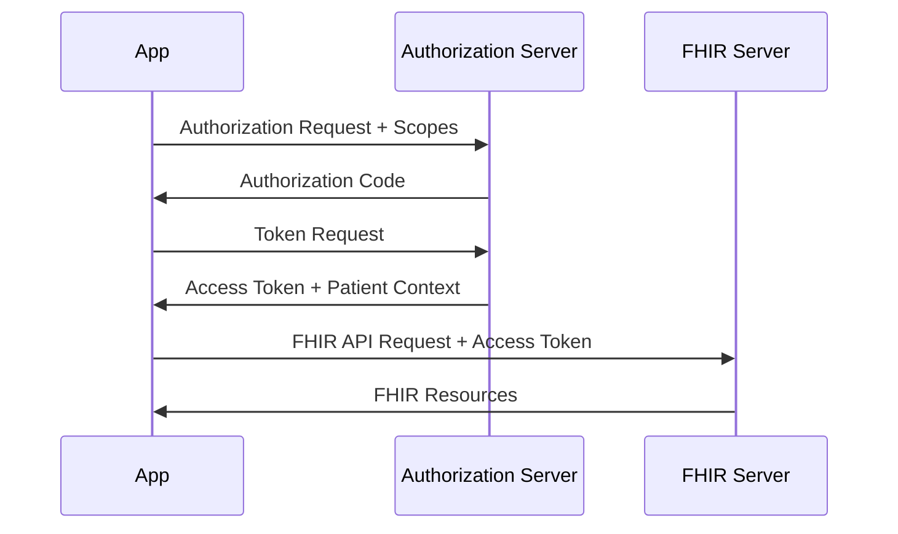

# Set Up SMART on FHIR Authentication for Google Cloud Healthcare API Applications

Author: [nawazdhandala](https://www.github.com/nawazdhandala)

Tags: GCP, Healthcare API, FHIR, SMART on FHIR, Authentication, OAuth2, Google Cloud

Description: Set up SMART on FHIR authentication for Google Cloud Healthcare API to enable standards-based access control for healthcare applications.

---

SMART on FHIR (Substitutable Medical Applications, Reusable Technologies) is the standard way to handle authentication and authorization in healthcare applications. It builds on OAuth 2.0 and adds healthcare-specific scoping so that apps can request access to specific types of clinical data. If you are building a patient-facing app, a clinical decision support tool, or any application that needs to interact with EHR data through FHIR, implementing SMART on FHIR authentication is not just good practice - it is usually required.

Google Cloud Healthcare API supports SMART on FHIR access enforcement, but the authorization server runs outside the Healthcare API. In this post, I will walk through setting up the authentication flow, configuring scopes, and building a working client application that talks to the Healthcare API through SMARTProxy or a similar trusted proxy.

## How SMART on FHIR Works

SMART on FHIR defines two main launch contexts:

1. **EHR Launch** - the app is launched from within an EHR system and receives context about the current patient and encounter
2. **Standalone Launch** - the app launches independently and the user authenticates and selects a patient

Both flows use OAuth 2.0 under the hood, but with SMART-specific extensions for clinical scoping.


```mermaid
sequenceDiagram
    participant App
    participant AuthServer as Authorization Server
    participant FHIR as FHIR Server
    App->>AuthServer: Authorization Request + Scopes
    AuthServer->>App: Authorization Code
    App->>AuthServer: Token Request
    AuthServer->>App: Access Token + Patient Context
    App->>FHIR: FHIR API Request + Access Token
    FHIR->>App: FHIR Resources
```

## Prerequisites

You will need:

- A Google Cloud project with Healthcare API enabled
- A FHIR store with some test data
- A registered client in your SMART authorization server
- SMARTProxy or a similar proxy in front of the FHIR store
- Node.js or Python for the client application

## Step 1: Configure a Proxy for SMART Access

First, put SMARTProxy or a similar trusted proxy in front of your FHIR store. The Cloud Healthcare API enforces SMART scopes and patient context from `X-Authorization-*` headers, and the proxy is responsible for validating the SMART access token and forwarding the scope and launch context to the Healthcare API.

You do not need to update the FHIR store itself for SMART on FHIR access. Configure the proxy to call your FHIR store and use a Google Cloud service account:

```bash
# Create a service account for the SMART proxy

gcloud iam service-accounts create smart-fhir-proxy \
  --display-name="SMART on FHIR Proxy"

# Grant the proxy read access to the FHIR store.
# Use roles/healthcare.fhirResourceEditor instead if your SMART apps need write access.
gcloud projects add-iam-policy-binding MY_PROJECT \
  --member="serviceAccount:smart-fhir-proxy@MY_PROJECT.iam.gserviceaccount.com" \
  --role="roles/healthcare.fhirResourceReader"
```

## Step 2: Set Up the SMART Authorization Server and Client

Configure your SMART authorization server and register the client application. The Cloud Healthcare API does not mint SMART access tokens itself. Your authorization server grants SMART scopes and patient context, and the proxy validates the token before calling the Healthcare API.

These are the common SMART on FHIR scopes you will work with:

```text
# Patient-level scopes (for patient-facing apps)
patient/Patient.read
patient/Observation.read
patient/MedicationRequest.read
patient/Condition.read
patient/AllergyIntolerance.read

# User-level scopes (for clinician-facing apps)
user/Patient.read
user/Patient.write
user/Encounter.read

# Launch scopes
launch
launch/patient
openid
fhirUser
```

Register the redirect URI, client type, and allowed scopes in your SMART authorization server. If you use a public client, use the authorization code flow with PKCE. If you use a confidential web application, store the client secret only on the server side.

## Step 3: Implement the SMART Discovery Endpoint

SMART on FHIR requires a well-known configuration endpoint. If you are building a SMART-compliant server in front of the Healthcare API, you need to serve this metadata.

This Node.js Express handler serves the SMART configuration document:

```javascript
const express = require('express');
const app = express();

const SMART_AUTH_BASE = 'https://auth.example.com';

// Serve the SMART configuration endpoint
// This tells client apps where to authenticate and what scopes are supported
app.get('/fhir/.well-known/smart-configuration', (req, res) => {
  res.json({
    authorization_endpoint: `${SMART_AUTH_BASE}/authorize`,
    token_endpoint: `${SMART_AUTH_BASE}/token`,
    token_endpoint_auth_methods_supported: [
      'client_secret_basic',
      'client_secret_post',
      'private_key_jwt'
    ],
    registration_endpoint: null,
    scopes_supported: [
      'openid',
      'fhirUser',
      'launch',
      'launch/patient',
      'patient/Patient.read',
      'patient/Observation.read',
      'patient/MedicationRequest.read',
      'patient/Condition.read',
      'user/Patient.read',
      'user/Patient.write'
    ],
    response_types_supported: ['code'],
    capabilities: [
      'launch-ehr',
      'launch-standalone',
      'client-public',
      'client-confidential-symmetric',
      'sso-openid-connect',
      'context-passthrough-banner',
      'context-passthrough-style',
      'context-ehr-patient',
      'context-standalone-patient',
      'permission-offline',
      'permission-patient',
      'permission-user'
    ]
  });
});

// Capability statement for the FHIR server
app.get('/fhir/metadata', (req, res) => {
  res.json({
    resourceType: 'CapabilityStatement',
    status: 'active',
    kind: 'instance',
    fhirVersion: '4.0.1',
    format: ['json'],
    rest: [{
      mode: 'server',
      security: {
        extension: [{
          url: 'http://fhir-registry.smarthealthit.org/StructureDefinition/oauth-uris',
          extension: [
            {
              url: 'authorize',
              valueUri: `${SMART_AUTH_BASE}/authorize`
            },
            {
              url: 'token',
              valueUri: `${SMART_AUTH_BASE}/token`
            }
          ]
        }],
        service: [{
          coding: [{
            system: 'http://terminology.hl7.org/CodeSystem/restful-security-service',
            code: 'SMART-on-FHIR'
          }]
        }]
      }
    }]
  });
});

app.listen(3000, () => console.log('SMART FHIR proxy running on port 3000'));
```

## Step 4: Build a SMART Client Application

Now build a client application that authenticates using the SMART flow and queries FHIR resources.

This Python client implements the standalone launch flow:

```python
import requests
import webbrowser
from urllib.parse import urlencode, urlparse, parse_qs
from http.server import HTTPServer, BaseHTTPRequestHandler
import json

# Configuration for the SMART client
CLIENT_ID = "your-oauth-client-id"
CLIENT_SECRET = "your-oauth-client-secret"
REDIRECT_URI = "http://localhost:8080/callback"
FHIR_BASE = "https://smart-proxy.example.com/fhir"
SMART_CONFIG = f"{FHIR_BASE}/.well-known/smart-configuration"

# SMART scopes to request
SCOPES = "openid fhirUser launch/patient patient/Patient.read patient/Observation.read"

auth_code = None

class CallbackHandler(BaseHTTPRequestHandler):
    """Handles the OAuth callback to capture the authorization code."""

    def do_GET(self):
        global auth_code
        query = parse_qs(urlparse(self.path).query)
        auth_code = query.get("code", [None])[0]

        self.send_response(200)
        self.end_headers()
        self.wfile.write(b"Authentication successful. You can close this window.")

def authenticate():
    """Runs the SMART standalone launch flow."""
    smart_config = requests.get(SMART_CONFIG).json()
    authorization_endpoint = smart_config["authorization_endpoint"]
    token_endpoint = smart_config["token_endpoint"]

    # Build the authorization URL with SMART scopes
    auth_params = urlencode({
        "response_type": "code",
        "client_id": CLIENT_ID,
        "redirect_uri": REDIRECT_URI,
        "scope": SCOPES,
        "aud": FHIR_BASE,
        "state": "random-state-value"
    })

    auth_url = f"{authorization_endpoint}?{auth_params}"

    # Open the browser for user authentication
    webbrowser.open(auth_url)

    # Start a local server to capture the callback
    server = HTTPServer(("localhost", 8080), CallbackHandler)
    server.handle_request()

    # Exchange the authorization code for an access token
    token_response = requests.post(
        token_endpoint,
        data={
            "grant_type": "authorization_code",
            "code": auth_code,
            "redirect_uri": REDIRECT_URI,
            "client_id": CLIENT_ID,
            "client_secret": CLIENT_SECRET
        }
    )

    token_response.raise_for_status()
    return token_response.json()

def fetch_patient_data(access_token, patient_id):
    """Fetches patient data using the SMART access token."""
    headers = {"Authorization": f"Bearer {access_token}"}

    # Fetch the patient resource
    patient = requests.get(
        f"{FHIR_BASE}/Patient/{patient_id}",
        headers=headers
    ).json()

    # Fetch recent observations for this patient
    observations = requests.get(
        f"{FHIR_BASE}/Observation?patient={patient_id}&_count=10&_sort=-date",
        headers=headers
    ).json()

    return patient, observations

# Run the authentication flow
tokens = authenticate()
print(f"Access token received. Expires in {tokens.get('expires_in')} seconds.")

# Fetch patient data. SMART standalone launch usually returns the selected
# patient context in the token response.
patient_id = tokens.get("patient", "example-patient-id")
patient, obs = fetch_patient_data(tokens["access_token"], patient_id)
print(json.dumps(patient, indent=2))
```

## Step 5: Enforce SMART Scopes on the Server Side

On the server side, the proxy validates the SMART access token and forwards the granted scopes and patient context to the Healthcare API. The Healthcare API then enforces access against the requested FHIR resources.

This Express middleware shows the important proxy step after token validation:

```javascript
// Middleware to forward SMART on FHIR authorization context
function addSMARTHeaders(req, res, next) {
  // Assume earlier middleware verified the JWT signature, issuer, audience,
  // expiration, and client registration.
  const tokenClaims = req.smartTokenClaims;

  if (!tokenClaims || !tokenClaims.scope) {
    return res.status(403).json({
      resourceType: 'OperationOutcome',
      issue: [{
        severity: 'error',
        code: 'forbidden',
        diagnostics: 'Missing SMART authorization scope'
      }]
    });
  }

  req.healthcareHeaders = {
    'X-Authorization-Scope': tokenClaims.scope,
    'X-Authorization-Subject': tokenClaims.sub,
    'X-Authorization-Issuer': tokenClaims.iss
  };

  if (tokenClaims.patient) {
    req.healthcareHeaders['X-Authorization-Patient'] = tokenClaims.patient;
  }

  next();
}
```

## Summary

Setting up SMART on FHIR with Google Cloud Healthcare API involves configuring an external SMART authorization server, serving the SMART discovery endpoints, building a client that handles the authorization dance, and forwarding validated SMART scopes and patient context through a trusted proxy. The Healthcare API handles the FHIR data storage, retrieval, and SMART access enforcement, while you layer token issuance and validation on top. This gives you a standards-compliant setup that third-party healthcare apps can integrate with, which is increasingly a regulatory requirement for health IT systems.
