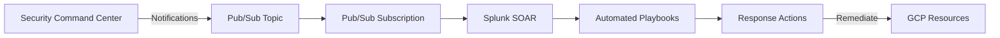

# How to Set Up Splunk SOAR with Google Cloud Security Command Center Findings

Author: [nawazdhandala](https://www.github.com/nawazdhandala)

Tags: GCP, Splunk SOAR, Security Command Center, Security Automation, Google Cloud, SIEM

Description: Configure Splunk SOAR to automatically ingest and respond to Google Cloud Security Command Center findings for automated security incident response.

---

Security teams are drowning in alerts. Google Cloud Security Command Center (SCC) generates findings for vulnerabilities, misconfigurations, and threats across your GCP environment, but without automation, those findings sit in a queue waiting for someone to manually triage each one. Splunk SOAR (formerly Phantom) changes this by letting you build automated playbooks that respond to security findings in seconds rather than hours.

This guide covers integrating Splunk SOAR with Google Cloud SCC so that findings automatically trigger investigation and response workflows.

## What Security Command Center Provides

Google Cloud SCC aggregates security findings from multiple sources: Security Health Analytics for misconfigurations, Web Security Scanner for web vulnerabilities, Event Threat Detection for runtime threats, and Container Threat Detection for GKE-specific issues.

Each finding includes a severity level, the affected resource, a description of the issue, and recommended remediation steps. The integration with Splunk SOAR lets you automate the triage and response for these findings based on your security policies.

## Architecture

The integration works through a pipeline. SCC generates findings and publishes notifications to a Pub/Sub topic. Splunk SOAR polls the Pub/Sub subscription (or receives webhook notifications) and creates containers (SOAR's term for cases) for each finding. Playbooks then run automatically based on the finding type and severity.



## GCP-Side Configuration

### Enable SCC Notifications

First, set up SCC to publish finding notifications to Pub/Sub.

```bash
# Create a Pub/Sub topic for SCC notifications
gcloud pubsub topics create scc-findings-topic \
  --project=my-project

# Create a notification config that sends all high and critical findings to the topic
gcloud scc notifications create scc-to-splunk-soar \
  --organization=123456789 \
  --pubsub-topic=projects/my-project/topics/scc-findings-topic \
  --filter='severity="HIGH" OR severity="CRITICAL"'

# Create a subscription for Splunk SOAR to pull from
gcloud pubsub subscriptions create scc-soar-subscription \
  --topic=scc-findings-topic \
  --ack-deadline=120 \
  --message-retention-duration=7d \
  --project=my-project
```

### Create a Service Account for SOAR

Splunk SOAR needs a service account with permissions to read SCC findings and take remediation actions.

```bash
# Create the service account
gcloud iam service-accounts create splunk-soar-scc \
  --display-name="Splunk SOAR SCC Integration" \
  --project=my-project

# Grant Security Center findings viewer at org level
gcloud organizations add-iam-policy-binding 123456789 \
  --member="serviceAccount:splunk-soar-scc@my-project.iam.gserviceaccount.com" \
  --role="roles/securitycenter.findingsViewer"

# Grant Pub/Sub subscriber for pulling notifications
gcloud projects add-iam-policy-binding my-project \
  --member="serviceAccount:splunk-soar-scc@my-project.iam.gserviceaccount.com" \
  --role="roles/pubsub.subscriber"

# Grant permissions needed for common remediation actions
# Adjust these based on what your playbooks need to do
gcloud projects add-iam-policy-binding my-project \
  --member="serviceAccount:splunk-soar-scc@my-project.iam.gserviceaccount.com" \
  --role="roles/compute.securityAdmin"

gcloud projects add-iam-policy-binding my-project \
  --member="serviceAccount:splunk-soar-scc@my-project.iam.gserviceaccount.com" \
  --role="roles/iam.securityReviewer"

# Generate the key file
gcloud iam service-accounts keys create soar-scc-key.json \
  --iam-account=splunk-soar-scc@my-project.iam.gserviceaccount.com
```

## Configuring the SOAR App

In Splunk SOAR, install the Google Cloud Security Command Center app from the SOAR app store.

### Asset Configuration

Create a new asset for the GCP SCC app with the following settings:

- Asset Name: `gcp-scc-production`
- Product: Google Cloud Security Command Center
- Configuration:
  - Service Account JSON: Paste the contents of your key file
  - Organization ID: Your GCP organization ID
  - Project ID: The project containing your Pub/Sub resources
  - Pub/Sub Subscription: `scc-soar-subscription`

### Ingestion Settings

Configure the app to poll for new findings on a regular interval.

```json
{
  "polling_interval": 60,
  "container_label": "gcp_security",
  "severity_mapping": {
    "CRITICAL": "high",
    "HIGH": "high",
    "MEDIUM": "medium",
    "LOW": "low"
  },
  "max_containers_per_poll": 50,
  "artifact_fields": [
    "finding.category",
    "finding.resourceName",
    "finding.sourceProperties",
    "finding.severity",
    "finding.state"
  ]
}
```

## Building Automated Playbooks

The real value of SOAR comes from playbooks that automate your response procedures. Here are examples for common SCC findings.

### Playbook: Auto-Remediate Public Firewall Rules

When SCC detects a firewall rule that allows unrestricted access (0.0.0.0/0), this playbook can automatically restrict it.

```python
# playbook_restrict_public_firewall.py
# Automatically restricts overly permissive firewall rules detected by SCC

def restrict_firewall_rule(action=None, success=None, container=None, results=None, handle=None, filtered_artifacts=None, filtered_results=None, custom_function=None, **kwargs):
    """Main playbook function for firewall rule remediation."""

    # Get the finding details from the container artifacts
    artifacts = phantom.collect2(
        container=container,
        datapath=["artifact:*.cef.resourceName", "artifact:*.cef.category"],
        filter_func=lambda x: x[1] == "FIREWALL_RULE_OPEN_TO_PUBLIC"
    )

    for artifact_data in artifacts:
        resource_name = artifact_data[0]

        # Extract project and rule name from the resource path
        # Format: //compute.googleapis.com/projects/PROJECT/global/firewalls/RULE_NAME
        parts = resource_name.split("/")
        project = parts[4]
        rule_name = parts[-1]

        # Call the GCP app action to update the firewall rule
        parameters = [{
            "project": project,
            "firewall_rule": rule_name,
            "action": "restrict_source_ranges",
            "allowed_ranges": "10.0.0.0/8,172.16.0.0/12,192.168.0.0/16"
        }]

        phantom.act(
            "update firewall rule",
            parameters=parameters,
            app="Google Cloud Platform",
            callback=post_remediation_notify
        )

def post_remediation_notify(action=None, success=None, container=None, results=None, **kwargs):
    """Send notification after remediation."""
    if success:
        phantom.comment(container=container, comment="Firewall rule automatically restricted to private ranges.")
        # Update the SCC finding state to mark it as remediated
        phantom.act(
            "update finding",
            parameters=[{"state": "INACTIVE"}],
            app="Google Cloud SCC"
        )
    else:
        phantom.set_severity(container=container, severity="high")
        phantom.comment(container=container, comment="Auto-remediation failed. Manual intervention required.")
```

### Playbook: Investigate Service Account Key Findings

When SCC detects an old or leaked service account key, this playbook gathers context and creates a ticket.

```python
# playbook_investigate_sa_key.py
# Investigates service account key findings and creates investigation tickets

def investigate_sa_key(action=None, success=None, container=None, results=None, **kwargs):
    """Gather context about a service account key finding."""

    artifacts = phantom.collect2(
        container=container,
        datapath=["artifact:*.cef.resourceName", "artifact:*.cef.sourceProperties"]
    )

    for artifact_data in artifacts:
        resource_name = artifact_data[0]
        source_props = artifact_data[1]

        # Get the service account details
        phantom.act(
            "describe service account",
            parameters=[{"resource_name": resource_name}],
            app="Google Cloud Platform",
            callback=enrich_with_iam_info
        )

def enrich_with_iam_info(action=None, success=None, container=None, results=None, **kwargs):
    """Add IAM policy information and create a Jira ticket."""
    if success:
        sa_info = results[0]["data"]
        # Create investigation ticket with all gathered context
        phantom.act(
            "create ticket",
            parameters=[{
                "summary": f"SCC Finding: Service Account Key Investigation - {sa_info['email']}",
                "description": f"Security Command Center detected an issue with SA: {sa_info['email']}",
                "priority": "High",
                "project_key": "SEC"
            }],
            app="Jira"
        )
```

## Testing the Integration

Generate a test finding in SCC and verify it flows through to SOAR.

```bash
# Create a test finding in Security Command Center
gcloud scc findings create test-finding-001 \
  --organization=123456789 \
  --source=organizations/123456789/sources/SOURCE_ID \
  --state=ACTIVE \
  --severity=HIGH \
  --category="TEST_FINDING" \
  --resource-name="//compute.googleapis.com/projects/my-project/global/firewalls/test-rule"
```

Check the Splunk SOAR mission control dashboard to see if a new container was created for the finding. Verify that the playbook triggered and the expected actions ran.

## Operational Considerations

Keep your playbook permissions scoped tightly. The service account should only have the permissions needed for the specific remediation actions your playbooks perform. Avoid granting broad admin roles.

Monitor the Pub/Sub subscription lag. If SOAR falls behind, findings pile up and your response time degrades. Set up an alert in Cloud Monitoring for subscription age.

```bash
# Create an alert for Pub/Sub subscription backlog
gcloud alpha monitoring policies create \
  --display-name="SOAR Subscription Backlog" \
  --condition-display-name="High unacked messages" \
  --condition-filter='resource.type="pubsub_subscription" AND resource.labels.subscription_id="scc-soar-subscription" AND metric.type="pubsub.googleapis.com/subscription/num_undelivered_messages"' \
  --condition-threshold-value=100 \
  --condition-threshold-comparison=COMPARISON_GT
```

Start with low-risk playbooks that gather information and create tickets. Once you trust the automation, gradually add remediation actions. The combination of SCC's detection capabilities and SOAR's automation gives you a security operations workflow that scales without scaling your team linearly.
