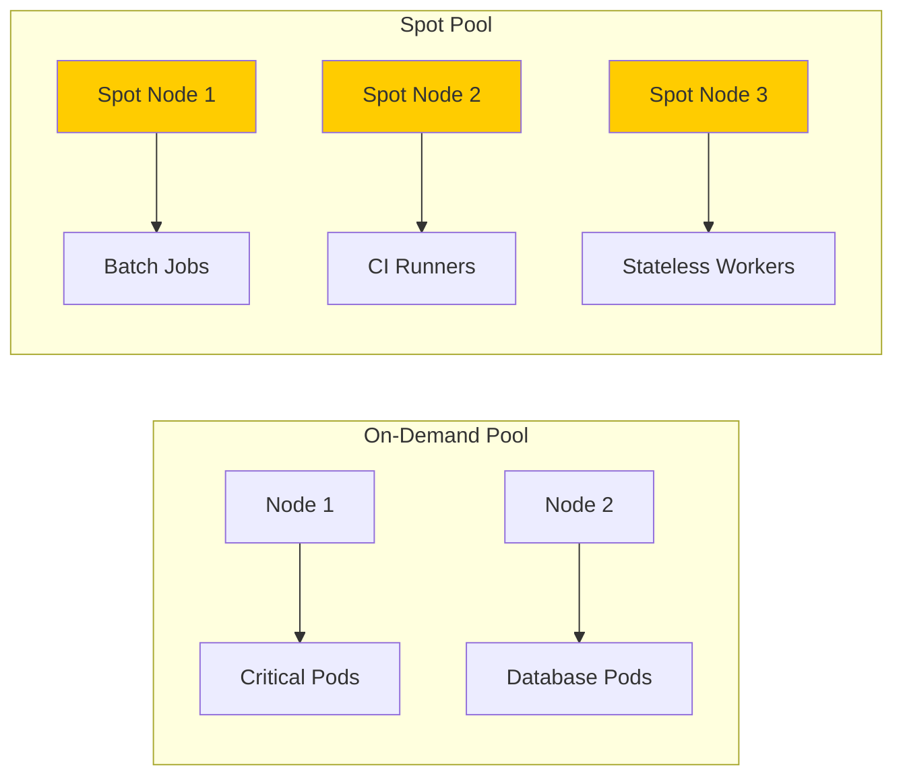

# How to Set Up Spot Node Pools in GKE and Configure Tolerations for Cost-Optimized Workloads

Author: [nawazdhandala](https://www.github.com/nawazdhandala)

Tags: GCP, GKE, Kubernetes, Spot VMs, Cost Optimization, Node Pools

Description: Learn how to create Spot VM node pools in GKE and configure your workloads with proper tolerations and scheduling to save up to 60-91% on compute costs.

---

Spot VMs on Google Cloud cost 60-91% less than regular VMs. The catch is that Google can reclaim them with a 30-second notice when it needs the capacity. For workloads that can handle interruptions - batch processing, CI/CD runners, stateless web servers with enough replicas, data processing pipelines - the savings are significant.

Running Spot VMs on GKE is straightforward once you understand how Kubernetes scheduling, taints, and tolerations work together. The key is making sure only fault-tolerant workloads land on Spot nodes, while critical services stay on reliable on-demand nodes.

## How Spot Nodes Work in GKE

When you create a Spot node pool, GKE provisions Spot VMs. These VMs have a taint applied automatically, which prevents pods from scheduling on them unless the pods explicitly tolerate the taint.



If Google reclaims a Spot node, Kubernetes reschedules the affected pods onto other available Spot nodes (if any) or they stay pending until capacity is available.

## Step 1: Create a Spot Node Pool

Create a node pool with the `--spot` flag.

```bash
# Create a Spot node pool alongside your existing on-demand pool
gcloud container node-pools create spot-pool \
  --cluster my-cluster \
  --region us-central1 \
  --machine-type e2-standard-4 \
  --spot \
  --enable-autoscaling \
  --min-nodes 0 \
  --max-nodes 20 \
  --num-nodes 3
```

Key details:
- `--spot`: Creates the pool with Spot VMs
- `--min-nodes 0`: Allows scaling to zero when no Spot workloads are running
- The pool automatically gets a taint: `cloud.google.com/gke-spot=true:NoSchedule`

Verify the node pool and its taint.

```bash
# Check the node pool details
gcloud container node-pools describe spot-pool \
  --cluster my-cluster \
  --region us-central1

# Verify nodes have the Spot taint
kubectl get nodes -l cloud.google.com/gke-spot=true -o jsonpath='{.items[*].spec.taints}' | jq .
```

## Step 2: Configure Workloads to Tolerate Spot Nodes

For pods to schedule on Spot nodes, they need to tolerate the Spot taint and optionally prefer (or require) Spot nodes.

### Option A: Tolerate Spot Nodes (can run anywhere, prefers Spot)

```yaml
# workload-tolerates-spot.yaml
# This pod CAN run on Spot nodes but does not have to
apiVersion: apps/v1
kind: Deployment
metadata:
  name: batch-processor
spec:
  replicas: 10
  selector:
    matchLabels:
      app: batch-processor
  template:
    metadata:
      labels:
        app: batch-processor
    spec:
      tolerations:
        # Tolerate the Spot taint so pods can schedule on Spot nodes
        - key: cloud.google.com/gke-spot
          operator: Equal
          value: "true"
          effect: NoSchedule
      affinity:
        nodeAffinity:
          # Prefer Spot nodes but fall back to on-demand if needed
          preferredDuringSchedulingIgnoredDuringExecution:
            - weight: 100
              preference:
                matchExpressions:
                  - key: cloud.google.com/gke-spot
                    operator: In
                    values:
                      - "true"
      containers:
        - name: processor
          image: batch-processor:latest
          resources:
            requests:
              cpu: "500m"
              memory: "1Gi"
```

### Option B: Require Spot Nodes (only runs on Spot)

```yaml
# workload-requires-spot.yaml
# This pod MUST run on Spot nodes - will not schedule on on-demand
apiVersion: apps/v1
kind: Deployment
metadata:
  name: ci-runner
spec:
  replicas: 5
  selector:
    matchLabels:
      app: ci-runner
  template:
    metadata:
      labels:
        app: ci-runner
    spec:
      tolerations:
        - key: cloud.google.com/gke-spot
          operator: Equal
          value: "true"
          effect: NoSchedule
      nodeSelector:
        # Require Spot nodes
        cloud.google.com/gke-spot: "true"
      containers:
        - name: runner
          image: ci-runner:latest
          resources:
            requests:
              cpu: "1"
              memory: "2Gi"
      # Short grace period since Spot gives 30-second warning
      terminationGracePeriodSeconds: 25
```

## Step 3: Handle Preemption Gracefully

When Google reclaims a Spot VM, your pod gets a SIGTERM signal with approximately 30 seconds to shut down gracefully. Design your workloads to handle this.

```javascript
// Node.js - Graceful shutdown on SIGTERM
const express = require("express");
const app = express();

let isShuttingDown = false;

// Handle SIGTERM for graceful shutdown
process.on("SIGTERM", () => {
  console.log("SIGTERM received - starting graceful shutdown");
  isShuttingDown = true;

  // Stop accepting new work
  server.close(() => {
    // Finish any in-progress work
    finishCurrentWork().then(() => {
      console.log("Graceful shutdown complete");
      process.exit(0);
    });
  });

  // Force exit after 25 seconds (before the 30-second deadline)
  setTimeout(() => {
    console.log("Forced exit after timeout");
    process.exit(1);
  }, 25000);
});

// Health check endpoint - report unhealthy during shutdown
app.get("/healthz", (req, res) => {
  if (isShuttingDown) {
    res.status(503).json({ status: "shutting down" });
  } else {
    res.status(200).json({ status: "healthy" });
  }
});

const server = app.listen(8080);
```

For batch jobs, checkpoint your progress so you can resume after rescheduling.

```python
# Python - Batch job with checkpointing
import signal
import json
import sys

checkpoint_file = "/data/checkpoint.json"

def save_checkpoint(processed_items):
    """Save progress so we can resume after preemption."""
    with open(checkpoint_file, "w") as f:
        json.dump({"last_processed": processed_items}, f)
    print(f"Checkpoint saved at item {processed_items}")

def load_checkpoint():
    """Resume from last checkpoint."""
    try:
        with open(checkpoint_file, "r") as f:
            data = json.load(f)
            return data["last_processed"]
    except FileNotFoundError:
        return 0

# Handle SIGTERM by saving checkpoint
def handle_sigterm(signum, frame):
    print("SIGTERM received - saving checkpoint")
    save_checkpoint(current_item)
    sys.exit(0)

signal.signal(signal.SIGTERM, handle_sigterm)

# Resume from checkpoint
start_from = load_checkpoint()
for current_item in range(start_from, total_items):
    process_item(current_item)
    # Checkpoint every 100 items
    if current_item % 100 == 0:
        save_checkpoint(current_item)
```

## Step 4: Mix Spot and On-Demand for Reliability

The best approach is running critical workloads on on-demand nodes and fault-tolerant workloads on Spot nodes.

```yaml
# Critical service - runs on on-demand nodes only (no Spot toleration)
apiVersion: apps/v1
kind: Deployment
metadata:
  name: payment-service
spec:
  replicas: 3
  template:
    spec:
      # No toleration for Spot taint = will NOT schedule on Spot nodes
      containers:
        - name: payment
          image: payment-service:latest
---
# Non-critical service - runs on Spot nodes
apiVersion: apps/v1
kind: Deployment
metadata:
  name: recommendation-engine
spec:
  replicas: 5
  template:
    spec:
      tolerations:
        - key: cloud.google.com/gke-spot
          operator: Equal
          value: "true"
          effect: NoSchedule
      nodeSelector:
        cloud.google.com/gke-spot: "true"
      containers:
        - name: recommender
          image: recommendation-engine:latest
```

## Step 5: Use Priority and Preemption

Kubernetes priority classes let you ensure important pods get scheduled first when Spot capacity is limited.

```yaml
# High priority for production workloads
apiVersion: scheduling.k8s.io/v1
kind: PriorityClass
metadata:
  name: spot-high-priority
value: 1000
description: "High priority Spot workloads"
---
# Low priority for batch jobs
apiVersion: scheduling.k8s.io/v1
kind: PriorityClass
metadata:
  name: spot-low-priority
value: 100
preemptionPolicy: Never  # Do not evict other pods
description: "Low priority Spot workloads - batch jobs"
---
# Apply to your deployments
apiVersion: apps/v1
kind: Deployment
metadata:
  name: important-spot-workload
spec:
  template:
    spec:
      priorityClassName: spot-high-priority
      tolerations:
        - key: cloud.google.com/gke-spot
          operator: Equal
          value: "true"
          effect: NoSchedule
```

## Cost Savings Calculation

Let me show a real cost comparison.

```bash
# Check Spot vs on-demand pricing for your machine type
gcloud compute machine-types describe e2-standard-4 \
  --zone us-central1-a \
  --format "value(description)"

# Approximate monthly cost comparison:
# e2-standard-4 on-demand: ~$97/month
# e2-standard-4 Spot:      ~$29/month (70% savings)
#
# 20-node cluster:
# On-demand: 20 x $97 = $1,940/month
# Spot:      20 x $29 = $580/month
# Savings:   $1,360/month
```

## Monitoring Spot Node Pool Behavior

Keep an eye on preemption events and capacity.

```bash
# Watch for preemption events
kubectl get events --field-selector reason=Preempted --sort-by='.lastTimestamp'

# Check current Spot node count
kubectl get nodes -l cloud.google.com/gke-spot=true --no-headers | wc -l

# View node pool scaling activity
gcloud container operations list \
  --filter "targetLink:nodePools/spot-pool" \
  --limit 20
```

Set up monitoring alerts for:
- Spot node preemption rate exceeding a threshold
- Pods pending due to insufficient Spot capacity
- Spot pool scaling to zero unexpectedly

## Best Practices Summary

1. **Set `terminationGracePeriodSeconds` to 25 seconds or less** - Spot gives you 30 seconds, and you need a buffer.

2. **Always have an on-demand fallback** - Set tolerations to prefer Spot but not require it, or keep a minimum on-demand pool.

3. **Spread across multiple zones** - Spot availability varies by zone. Using multiple zones reduces the chance of losing all nodes at once.

4. **Use multiple machine types** - If e2-standard-4 Spot instances are unavailable, e2-standard-8 might still have capacity. Consider using Node Auto-Provisioning.

5. **Checkpoint long-running work** - Save progress regularly so preempted jobs can resume instead of restart.

## Wrapping Up

Spot node pools in GKE offer substantial cost savings for workloads that can tolerate interruptions. The setup is simple - create a Spot pool, add tolerations to your fault-tolerant workloads, and keep critical services on on-demand nodes. The key to success is proper workload classification: understand which of your services can handle a 30-second termination notice and which cannot. For batch processing, CI/CD, development environments, and stateless services with enough replicas, Spot VMs are an easy win that can cut your compute bill by more than half.
