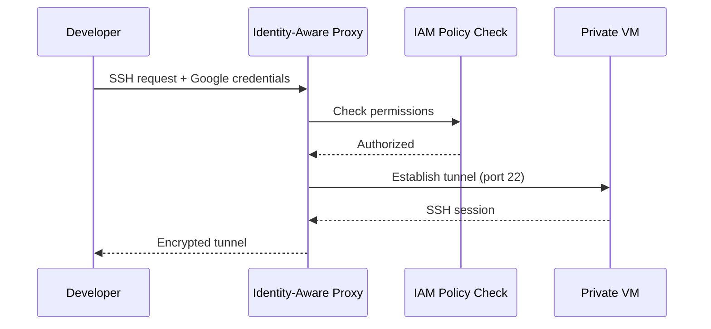

# How to Set Up SSH Tunneling Through IAP to Reach Compute Engine VMs Without Public IPs

Author: [nawazdhandala](https://www.github.com/nawazdhandala)

Tags: GCP, Compute Engine, IAP, SSH Tunneling, Security

Description: Learn how to use Identity-Aware Proxy to SSH into Compute Engine VMs that have no public IP addresses, improving your security posture while maintaining access.

---

Giving every VM a public IP address is a security anti-pattern. Each public IP is an attack surface - one more endpoint that needs to be defended against brute force attempts, vulnerability scans, and other internet noise. The best practice is to keep your VMs on private networks and use Google's Identity-Aware Proxy (IAP) to tunnel SSH connections securely.

IAP acts as a gatekeeper between you and your VMs. It verifies your identity through your Google account, checks your IAM permissions, and then establishes an encrypted tunnel to the VM. No public IP needed, no VPN to maintain, and full audit logging of who accessed what.

## How IAP TCP Forwarding Works

When you SSH through IAP, the connection flow looks like this:



The important thing to notice is that the VM only needs to accept connections from the IAP IP range - it does not need any internet-facing connectivity.

## Step 1: Create a VM Without a Public IP

Create a VM with only an internal IP address:

```bash
# Create a VM with no external IP address
gcloud compute instances create private-vm \
    --zone=us-central1-a \
    --machine-type=e2-medium \
    --image-family=debian-12 \
    --image-project=debian-cloud \
    --no-address \
    --tags=iap-ssh
```

The `--no-address` flag ensures the VM has no public IP. The `iap-ssh` tag will be used for firewall rules.

## Step 2: Create a Firewall Rule for IAP

Allow SSH traffic from IAP's IP range to reach your VMs:

```bash
# Allow SSH traffic from IAP's IP range
gcloud compute firewall-rules create allow-ssh-from-iap \
    --network=default \
    --action=allow \
    --direction=ingress \
    --source-ranges=35.235.240.0/20 \
    --target-tags=iap-ssh \
    --rules=tcp:22
```

The IP range `35.235.240.0/20` is Google's IAP forwarding range. This is the only ingress rule you need for SSH access.

## Step 3: Grant IAP Tunnel Permissions

Users need the `iap.tunnelResourceAccessor` role to use IAP tunneling:

```bash
# Grant IAP tunnel access to a user
gcloud projects add-iam-policy-binding my-project \
    --member="user:developer@example.com" \
    --role="roles/iap.tunnelResourceAccessor"
```

You can also scope the permission to specific instances using IAM conditions:

```bash
# Grant IAP tunnel access only to instances with a specific tag
gcloud projects add-iam-policy-binding my-project \
    --member="user:developer@example.com" \
    --role="roles/iap.tunnelResourceAccessor" \
    --condition="expression=resource.name.startsWith('projects/my-project/iap_tunnel/zones/us-central1-a'),title=us-central1-a-only"
```

## Step 4: SSH Through IAP

With everything set up, SSH using gcloud. It automatically detects that the VM has no public IP and uses IAP:

```bash
# SSH to a private VM through IAP - gcloud handles this automatically
gcloud compute ssh private-vm --zone=us-central1-a --tunnel-through-iap
```

The `--tunnel-through-iap` flag is actually optional for recent gcloud versions - if the VM has no public IP, gcloud uses IAP automatically. But being explicit does not hurt.

## Port Forwarding Through IAP

IAP tunneling is not limited to SSH. You can forward any TCP port:

```bash
# Forward local port 8080 to the VM's port 8080 through IAP
gcloud compute start-iap-tunnel private-vm 8080 \
    --local-host-port=localhost:8080 \
    --zone=us-central1-a
```

Now you can access `http://localhost:8080` in your browser, and the traffic goes through IAP to port 8080 on the private VM.

Common use cases for port forwarding:

```bash
# Access a web server running on the VM
gcloud compute start-iap-tunnel private-vm 80 \
    --local-host-port=localhost:8080 \
    --zone=us-central1-a

# Access a database on the VM
gcloud compute start-iap-tunnel db-vm 5432 \
    --local-host-port=localhost:5432 \
    --zone=us-central1-a

# Access a Jupyter notebook server
gcloud compute start-iap-tunnel ml-vm 8888 \
    --local-host-port=localhost:8888 \
    --zone=us-central1-a
```

## Using ProxyCommand for Standard SSH

If you prefer using the `ssh` command directly (or need it for tools like SCP, rsync, or VS Code Remote), configure your SSH config to use IAP as a proxy:

```bash
# Add this to your ~/.ssh/config
Host *.iap
    ProxyCommand gcloud compute start-iap-tunnel %h %p --listen-on-stdin --zone=us-central1-a --project=my-project --quiet
    StrictHostKeyChecking no
    UserKnownHostsFile /dev/null
```

Then SSH using the instance name:

```bash
# SSH using standard ssh command through IAP
ssh private-vm.iap
```

For SCP:

```bash
# Copy files through IAP tunnel
scp -o ProxyCommand="gcloud compute start-iap-tunnel %h %p --listen-on-stdin --zone=us-central1-a --quiet" \
    local-file.txt private-vm:/home/user/
```

## Terraform Configuration

Here is the complete Terraform setup for IAP SSH access:

```hcl
# Private VM with no external IP
resource "google_compute_instance" "private" {
  name         = "private-vm"
  machine_type = "e2-medium"
  zone         = "us-central1-a"

  boot_disk {
    initialize_params {
      image = "debian-cloud/debian-12"
    }
  }

  # No access_config block means no external IP
  network_interface {
    network    = "default"
    subnetwork = "default"
  }

  tags = ["iap-ssh"]
}

# Firewall rule allowing SSH from IAP
resource "google_compute_firewall" "iap_ssh" {
  name    = "allow-ssh-from-iap"
  network = "default"

  allow {
    protocol = "tcp"
    ports    = ["22"]
  }

  source_ranges = ["35.235.240.0/20"]
  target_tags   = ["iap-ssh"]
}

# IAM binding for IAP tunnel access
resource "google_project_iam_member" "iap_tunnel" {
  project = "my-project"
  role    = "roles/iap.tunnelResourceAccessor"
  member  = "user:developer@example.com"
}
```

## Connecting from CI/CD Pipelines

For automated access from CI/CD systems, use a service account:

```bash
# Authenticate as a service account
gcloud auth activate-service-account --key-file=sa-key.json

# SSH through IAP using the service account
gcloud compute ssh private-vm \
    --zone=us-central1-a \
    --tunnel-through-iap \
    --command="echo 'Hello from CI/CD'"
```

The service account needs both `roles/iap.tunnelResourceAccessor` and `roles/compute.instanceAdmin.v1` (or `roles/compute.osLogin` if using OS Login).

## RDP Through IAP for Windows VMs

IAP tunneling also works for Windows Remote Desktop:

```bash
# Create an IAP tunnel for RDP (port 3389)
gcloud compute start-iap-tunnel windows-vm 3389 \
    --local-host-port=localhost:3389 \
    --zone=us-central1-a
```

Then connect your RDP client to `localhost:3389`.

## Audit Logging

Every IAP tunnel connection is logged in Cloud Audit Logs. This gives you a complete record of who accessed which VM and when:

```bash
# View IAP tunnel access logs
gcloud logging read 'resource.type="gce_instance" AND protoPayload.methodName="AuthorizeUser"' \
    --limit=20 \
    --format=json
```

## Performance Considerations

IAP tunneling adds a small amount of latency since traffic goes through Google's proxy infrastructure. For interactive SSH sessions, the latency is typically unnoticeable (10-20ms extra). For bulk file transfers, you might notice slower speeds compared to a direct connection.

If you need high-throughput access to private VMs, consider:
- Using Cloud NAT for outbound internet access from the VMs
- Setting up a bastion host (jump box) for internal access
- Using VPN or Interconnect for site-to-site connectivity

## Troubleshooting

**Error: "Error while connecting [4003: 'failed to connect to backend']"**

This usually means the firewall rule is missing or incorrect. Verify:

```bash
# Check that the firewall rule exists and matches
gcloud compute firewall-rules describe allow-ssh-from-iap
```

**Error: "Permission denied"**

Check that the user has the IAP tunnel role:

```bash
# List IAM bindings for the project
gcloud projects get-iam-policy my-project \
    --flatten="bindings[].members" \
    --filter="bindings.role=roles/iap.tunnelResourceAccessor"
```

**Slow connection or timeouts**

Try specifying a different zone or check if the VM's guest OS has SSH configured correctly:

```bash
# Check the VM's serial output for SSH daemon status
gcloud compute instances get-serial-port-output private-vm \
    --zone=us-central1-a 2>&1 | grep sshd
```

## Wrapping Up

IAP SSH tunneling is the recommended way to access Compute Engine VMs on GCP. It eliminates the need for public IPs, VPNs, or bastion hosts while providing identity-based access control and full audit logging. The setup is minimal - a firewall rule and an IAM binding - and it works seamlessly with gcloud SSH. If you are still giving VMs public IPs just for SSH access, make the switch to IAP. Your security posture will improve immediately.
