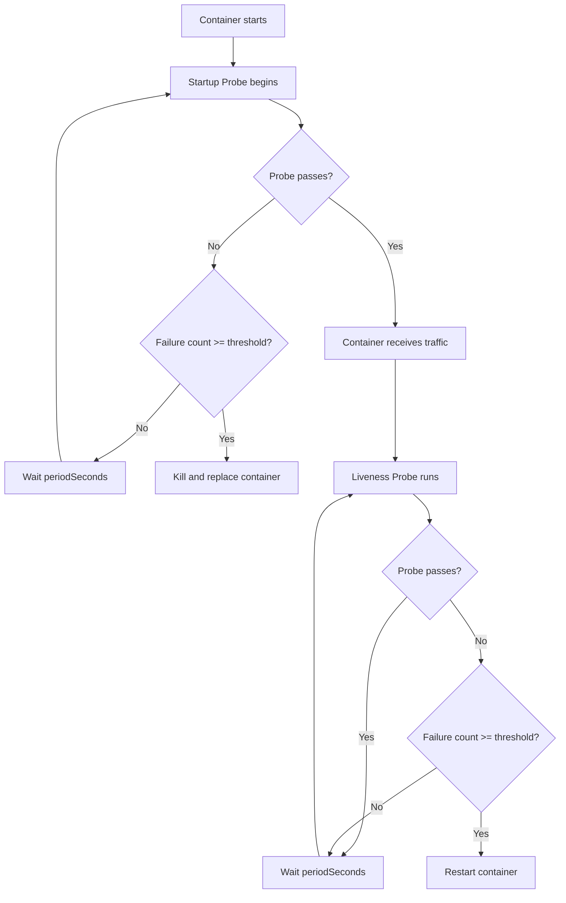

# How to Set Up Startup and Liveness Probes for Cloud Run Services to Improve Reliability

Author: [nawazdhandala](https://www.github.com/nawazdhandala)

Tags: GCP, Cloud Run, Health Checks, Liveness Probes, Startup Probes, Google Cloud

Description: Learn how to configure startup and liveness probes for Cloud Run services to detect unhealthy containers and improve overall service reliability.

---

Cloud Run containers can get into bad states. Maybe the application crashed but the process is still running. Maybe a database connection pool is exhausted and the service cannot handle requests. Without health checks, Cloud Run has no way to know something is wrong until requests start timing out.

Startup and liveness probes fix this. They give Cloud Run a way to check whether your container is actually working, not just running. This guide covers how to configure both types of probes, when to use each one, and practical patterns I have found work well in production.

## The Difference Between Startup and Liveness Probes

These two probes serve different purposes at different stages of your container's lifecycle.

**Startup probes** run when a new container instance starts. They tell Cloud Run "this container is ready to receive traffic." Until the startup probe passes, Cloud Run will not send any requests to the container. If the startup probe keeps failing past the configured threshold, Cloud Run kills the container and starts a new one.

**Liveness probes** run continuously after the startup probe has passed. They tell Cloud Run "this container is still healthy." If a liveness probe fails repeatedly, Cloud Run restarts the container. This catches situations where your app is running but not functional - deadlocks, corrupted state, or resource exhaustion.

## When to Use Each Probe

Use startup probes when your application takes time to initialize. This includes:

- Loading ML models into memory
- Warming up caches
- Establishing database connection pools
- Running database migrations on startup
- Pre-computing lookup tables

Use liveness probes when your application can degrade over time. This includes:

- Memory leaks that eventually make the app unresponsive
- Thread pool exhaustion
- Lost database connections that do not auto-reconnect
- Deadlocks in concurrent code

## Configuring Probes via YAML

The most flexible way to set up probes is through a service YAML file. Here is a complete example:

```yaml
# service.yaml - Cloud Run service with startup and liveness probes
apiVersion: serving.knative.dev/v1
kind: Service
metadata:
  name: my-reliable-service
spec:
  template:
    metadata:
      annotations:
        autoscaling.knative.dev/minScale: "1"
    spec:
      containers:
        - image: us-central1-docker.pkg.dev/MY_PROJECT/my-repo/my-app:latest
          ports:
            - containerPort: 8080

          # Startup probe - checks if the container is ready
          startupProbe:
            httpGet:
              path: /healthz/startup
              port: 8080
            initialDelaySeconds: 5      # Wait 5s before first check
            periodSeconds: 5            # Check every 5 seconds
            failureThreshold: 12        # Allow up to 60s for startup (12 x 5s)
            timeoutSeconds: 3           # Each check times out after 3s

          # Liveness probe - checks if the container is still healthy
          livenessProbe:
            httpGet:
              path: /healthz/liveness
              port: 8080
            initialDelaySeconds: 0      # Start immediately after startup passes
            periodSeconds: 15           # Check every 15 seconds
            failureThreshold: 3         # Restart after 3 consecutive failures
            timeoutSeconds: 5           # Each check times out after 5s

          resources:
            limits:
              memory: 512Mi
              cpu: "1"
```

Deploy it:

```bash
# Deploy the service with health probes configured
gcloud run services replace service.yaml --region=us-central1
```

## Configuring Probes via gcloud CLI

You can also set probes during deployment with gcloud flags:

```bash
# Deploy with startup and liveness probes using gcloud
gcloud run deploy my-reliable-service \
  --image=us-central1-docker.pkg.dev/MY_PROJECT/my-repo/my-app:latest \
  --region=us-central1 \
  --startup-probe-path=/healthz/startup \
  --startup-probe-initial-delay=5 \
  --startup-probe-period=5 \
  --startup-probe-failure-threshold=12 \
  --startup-probe-timeout=3 \
  --liveness-probe-path=/healthz/liveness \
  --liveness-probe-period=15 \
  --liveness-probe-failure-threshold=3 \
  --liveness-probe-timeout=5
```

## Probe Types: HTTP, TCP, and gRPC

Cloud Run supports three types of probes.

**HTTP probes** send a GET request to a specified path. A 200-299 status code means healthy. This is the most common and most flexible option:

```yaml
# HTTP probe - checks a specific endpoint
startupProbe:
  httpGet:
    path: /healthz
    port: 8080
```

**TCP probes** just check if the port is accepting connections. They are simpler but less informative:

```yaml
# TCP probe - just checks if the port is open
startupProbe:
  tcpSocket:
    port: 8080
```

**gRPC probes** are for services that implement the gRPC health checking protocol:

```yaml
# gRPC probe - uses the gRPC health check protocol
startupProbe:
  grpc:
    port: 8080
    service: my.service.Name
```

## Building Good Health Check Endpoints

The quality of your health check endpoints directly determines how useful your probes are. Here is a pattern that works well in production:

```python
# health.py - Health check endpoints for Cloud Run probes
import psycopg2
import redis
from flask import Flask, jsonify

app = Flask(__name__)

# Track whether the app has finished initializing
startup_complete = False

@app.route("/healthz/startup")
def startup_check():
    """Startup probe endpoint. Returns 200 only after initialization is done."""
    if not startup_complete:
        return jsonify({"status": "initializing"}), 503
    return jsonify({"status": "ready"}), 200

@app.route("/healthz/liveness")
def liveness_check():
    """
    Liveness probe endpoint. Checks that critical dependencies are reachable.
    Keep this fast - do not run expensive queries here.
    """
    errors = []

    # Check database connectivity
    try:
        conn = psycopg2.connect(DATABASE_URL, connect_timeout=2)
        conn.close()
    except Exception as e:
        errors.append(f"database: {str(e)}")

    # Check Redis connectivity
    try:
        r = redis.Redis.from_url(REDIS_URL, socket_timeout=2)
        r.ping()
    except Exception as e:
        errors.append(f"redis: {str(e)}")

    if errors:
        return jsonify({"status": "unhealthy", "errors": errors}), 503

    return jsonify({"status": "healthy"}), 200
```

Some important guidelines for health check endpoints:

- Keep them fast. A health check that takes 10 seconds defeats the purpose.
- Check critical dependencies only. If your app works without a particular service, do not include it in liveness checks.
- Do not do heavy work. No database queries, no cache warming, no file processing.
- Use separate endpoints for startup and liveness so each can check what makes sense.

## Tuning Probe Parameters

Getting the timing right is important. Here is how I think about each parameter:

**initialDelaySeconds**: How long to wait before the first probe. For startup probes, set this to however long your app takes to start its HTTP server. For liveness probes, you can usually leave this at 0 since the startup probe already confirmed the app is up.

**periodSeconds**: How often to probe. For startup probes, shorter is better (3-5 seconds) so you detect readiness quickly. For liveness probes, longer is fine (10-30 seconds) since you are just watching for degradation.

**failureThreshold**: How many consecutive failures before taking action. For startup probes, multiply this by periodSeconds to get your maximum startup time. For liveness probes, 3 is a good default since you do not want to restart on a single transient failure.

**timeoutSeconds**: How long to wait for a probe response. Set this slightly longer than your health check endpoint's expected response time. If your endpoint calls a database with a 2-second timeout, set this to 3-4 seconds.

Here is a decision flow:



## Common Mistakes

**Making liveness probes too sensitive.** If your liveness probe checks an external API that has occasional latency spikes, a single slow response can trigger unnecessary restarts. Use a higher failure threshold or remove flaky dependencies from the check.

**Checking non-critical dependencies in liveness probes.** If your liveness probe fails because a logging service is down, Cloud Run restarts your container. But the logging service is still down, so the new container also fails. Now you are in a restart loop for a non-critical dependency.

**Setting startup timeout too short.** If your app needs 30 seconds to initialize but your startup probe only allows 20 seconds, every instance will fail to start. Calculate your maximum expected startup time and add a buffer.

**Forgetting that probes count as requests.** If your liveness probe runs every 10 seconds and you have 5 instances, that is 30 extra requests per minute hitting your health endpoint. Keep it lightweight.

## Verifying Probes Are Working

After deployment, check that your probes are configured correctly:

```bash
# Describe the service to see probe configuration
gcloud run services describe my-reliable-service \
  --region=us-central1 \
  --format="yaml(spec.template.spec.containers[0].startupProbe, spec.template.spec.containers[0].livenessProbe)"
```

Monitor probe results in Cloud Logging:

```bash
# Check for probe-related log entries
gcloud logging read "resource.type=cloud_run_revision \
  AND resource.labels.service_name=my-reliable-service \
  AND textPayload:probe" \
  --limit=20
```

## Summary

Startup and liveness probes are one of the simplest ways to improve Cloud Run reliability. Startup probes prevent traffic from hitting containers that are not ready. Liveness probes catch containers that are running but broken. Configure them with appropriate timing, build lightweight health endpoints, and you will have a service that self-heals from most failure scenarios.
