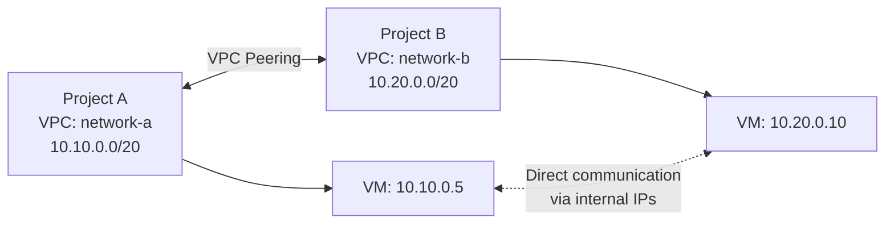

# How to Set Up VPC Network Peering Between Two Projects in GCP

Author: [nawazdhandala](https://www.github.com/nawazdhandala)

Tags: GCP, VPC Peering, Networking, Multi-Project, Cross-Project

Description: A step-by-step guide to setting up VPC network peering between two GCP projects, including bidirectional configuration, route exchange, and connectivity verification.

---

VPC network peering in GCP lets two VPC networks communicate using internal IP addresses without traffic ever touching the public internet. It works across projects within the same organization, across organizations, and even within the same project (for networks that need to be logically separated but still talk to each other).

In this post, I will walk through the complete process of peering two VPCs in different projects, verifying connectivity, and handling common configuration details.

## How VPC Peering Works

VPC peering is a bidirectional relationship that must be established from both sides. Network A peers with Network B, and Network B peers with Network A. Once both sides are configured, subnet routes are exchanged and VMs in either network can communicate using private IPs.



Key characteristics of VPC peering:
- Traffic stays on Google's internal network
- No bandwidth bottleneck (uses the same infrastructure as intra-VPC traffic)
- No single point of failure
- No gateway or VPN needed
- Subnet routes are exchanged automatically
- Peering is not transitive (if A peers with B and B peers with C, A cannot reach C)

## Prerequisites

Before setting up peering, verify these conditions:

1. **No overlapping IP ranges**: The primary and secondary subnet ranges in both networks must not overlap. Check this before proceeding.
2. **Appropriate IAM permissions**: You need `compute.networks.addPeering` on both networks, typically granted through `roles/compute.networkAdmin`.
3. **Custom mode VPCs**: Auto mode VPCs use the same predefined ranges and will always overlap with each other.

```bash
# Check subnets in Project A
gcloud compute networks subnets list \
  --project=project-a \
  --network=network-a \
  --format="table(name, region, ipCidrRange)"

# Check subnets in Project B
gcloud compute networks subnets list \
  --project=project-b \
  --network=network-b \
  --format="table(name, region, ipCidrRange)"
```

## Step 1: Create the Peering from Project A

```bash
# Create peering from network-a to network-b
gcloud compute networks peerings create peer-a-to-b \
  --project=project-a \
  --network=network-a \
  --peer-project=project-b \
  --peer-network=network-b \
  --export-custom-routes \
  --import-custom-routes
```

The `--export-custom-routes` and `--import-custom-routes` flags control whether custom static and dynamic routes (not subnet routes) are shared between the networks. Subnet routes are always shared.

At this point, the peering is in `INACTIVE` state because the other side has not been configured yet.

## Step 2: Create the Peering from Project B

```bash
# Create peering from network-b to network-a
gcloud compute networks peerings create peer-b-to-a \
  --project=project-b \
  --network=network-b \
  --peer-project=project-a \
  --peer-network=network-a \
  --export-custom-routes \
  --import-custom-routes
```

Once both sides are configured, both peerings transition to `ACTIVE` state.

## Step 3: Verify the Peering

```bash
# Check peering status from Project A's perspective
gcloud compute networks peerings list \
  --project=project-a \
  --network=network-a \
  --format="table(name, network, peerNetwork, state, exportCustomRoutes, importCustomRoutes)"
```

```bash
# Check peering status from Project B's perspective
gcloud compute networks peerings list \
  --project=project-b \
  --network=network-b \
  --format="table(name, network, peerNetwork, state, exportCustomRoutes, importCustomRoutes)"
```

Both should show `ACTIVE` state.

## Step 4: Verify Route Exchange

Check that subnet routes from the peer network are visible:

```bash
# List routes in Project A - should include routes to Project B's subnets
gcloud compute routes list \
  --project=project-a \
  --filter="network=network-a AND nextHopPeering:*" \
  --format="table(name, destRange, nextHopPeering, priority)"
```

You should see routes for Project B's subnet ranges with `nextHopPeering` pointing to the peering connection.

## Step 5: Configure Firewall Rules

VPC peering shares routes but not firewall rules. Each network maintains its own firewall rules. You need to create rules in both networks to allow the desired traffic:

```bash
# In Project A: allow traffic from Project B's subnet
gcloud compute firewall-rules create allow-from-peer-b \
  --project=project-a \
  --network=network-a \
  --direction=INGRESS \
  --action=ALLOW \
  --rules=tcp,udp,icmp \
  --source-ranges=10.20.0.0/20 \
  --description="Allow traffic from peered network B"
```

```bash
# In Project B: allow traffic from Project A's subnet
gcloud compute firewall-rules create allow-from-peer-a \
  --project=project-b \
  --network=network-b \
  --direction=INGRESS \
  --action=ALLOW \
  --rules=tcp,udp,icmp \
  --source-ranges=10.10.0.0/20 \
  --description="Allow traffic from peered network A"
```

## Step 6: Test Connectivity

Create test VMs in both networks and verify they can communicate:

```bash
# Create a test VM in Project A
gcloud compute instances create test-vm-a \
  --project=project-a \
  --zone=us-central1-a \
  --machine-type=e2-micro \
  --subnet=subnet-a \
  --no-address

# Create a test VM in Project B
gcloud compute instances create test-vm-b \
  --project=project-b \
  --zone=us-central1-a \
  --machine-type=e2-micro \
  --subnet=subnet-b \
  --no-address
```

```bash
# SSH into VM A and ping VM B
gcloud compute ssh test-vm-a --project=project-a --zone=us-central1-a --tunnel-through-iap
# Once connected:
# ping 10.20.0.x  (VM B's internal IP)
```

## Peering with Internal DNS Resolution

By default, VMs in peered networks cannot resolve each other using internal DNS names (`vm-name.zone.c.project-id.internal`). To enable cross-network DNS:

```bash
# Enable DNS peering - create a DNS peering zone in Project A
gcloud dns managed-zones create peer-dns-to-b \
  --project=project-a \
  --dns-name="c.project-b.internal." \
  --description="DNS peering to Project B" \
  --visibility=private \
  --networks=network-a \
  --target-project=project-b \
  --target-network=network-b
```

This lets VMs in Project A resolve the internal DNS names of VMs in Project B.

## Updating Peering Configuration

You can update peering settings without deleting and recreating:

```bash
# Update peering to change route exchange settings
gcloud compute networks peerings update peer-a-to-b \
  --project=project-a \
  --network=network-a \
  --export-custom-routes \
  --no-import-custom-routes
```

## Peering Limits and Quotas

Be aware of these limits:

- Each VPC can have up to 25 peering connections (can be increased with a quota request)
- The total number of VM instances across all peered networks cannot exceed 15,500 (configurable)
- Maximum peered group size limit applies to the aggregate of all directly peered networks

Check your current usage:

```bash
# Check peering connection count
gcloud compute networks peerings list \
  --project=project-a \
  --network=network-a \
  --format="table(name, state)" | wc -l
```

## Deleting a Peering Connection

To remove peering, delete from both sides:

```bash
# Delete peering from Project A
gcloud compute networks peerings delete peer-a-to-b \
  --project=project-a \
  --network=network-a

# Delete peering from Project B
gcloud compute networks peerings delete peer-b-to-a \
  --project=project-b \
  --network=network-b
```

Deleting from one side puts the other in `INACTIVE` state. Clean up both sides to keep things tidy.

## Peering vs. Shared VPC

A common question is when to use peering versus Shared VPC. Here is a quick comparison:

- **Shared VPC**: Use when a central team should own the network and service projects deploy into it. Best for a single organization with centralized networking.
- **VPC Peering**: Use when two independently managed networks need to communicate. Best for cross-organization connectivity or when teams need full network autonomy.

You can also combine both - a Shared VPC host project can peer with other VPCs.

## Wrapping Up

VPC peering is straightforward to set up but requires attention to a few details: non-overlapping IP ranges, bidirectional configuration, and firewall rules in both networks. The non-transitive nature means you need to plan your peering topology carefully - if multiple networks need full mesh connectivity, every pair needs a direct peering connection. For most multi-project setups, VPC peering provides the simplest path to secure, high-performance cross-project networking.
