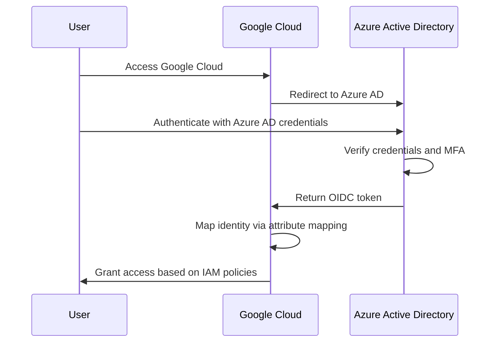

# How to Set Up Workforce Identity Federation with Azure Active Directory for GCP

Author: [nawazdhandala](https://www.github.com/nawazdhandala)

Tags: GCP, Workforce Identity Federation, Azure AD, Identity Management, Multi-Cloud

Description: Step-by-step guide to configuring Workforce Identity Federation with Azure Active Directory so your organization can access Google Cloud using existing Azure AD credentials.

---

Organizations running multi-cloud environments with both Azure and Google Cloud face a common identity challenge: managing separate user accounts in each platform. Workforce Identity Federation solves this by letting your Azure AD users access Google Cloud resources without needing separate Google identities. Users authenticate through Azure AD, and Google Cloud maps those identities to IAM permissions.

This guide covers the end-to-end setup of Workforce Identity Federation with Azure AD, including the Azure app registration, Google Cloud configuration, and IAM permission mapping.

## Architecture Overview

The integration uses OIDC (OpenID Connect) as the protocol between Azure AD and Google Cloud. When a user accesses Google Cloud, they are redirected to Azure AD for authentication. After successful authentication, Azure AD issues an OIDC token that Google Cloud uses to establish the user's identity.



## Step 1: Register an Application in Azure AD

Start by creating an application registration in Azure AD that Google Cloud will use as the OIDC relying party.

1. Go to Azure Active Directory in the Azure portal
2. Navigate to App registrations and click New registration
3. Set the name to "Google Cloud Workforce Federation"
4. Under Redirect URIs, select Web and enter:
   `https://auth.cloud.google/signin-callback/locations/global/workforcePools/azure-ad-pool/providers/azure-ad-provider`
5. Click Register

After registration:

1. Go to Certificates and secrets
2. Create a new client secret and save the value
3. Note the Application (client) ID from the Overview page
4. Note the Directory (tenant) ID

Configure the token to include group claims:
1. Go to Token configuration
2. Click Add groups claim
3. Select Security groups and check the "Emit groups as role claims" option for ID tokens

## Step 2: Create the Workforce Identity Pool

```bash
# Create a workforce identity pool for Azure AD users
gcloud iam workforce-pools create azure-ad-pool \
  --organization=123456789 \
  --location=global \
  --display-name="Azure AD Workforce Pool" \
  --description="Workforce pool for employees authenticating through Azure Active Directory" \
  --session-duration=28800s
```

## Step 3: Create the Workforce Provider

Connect the workforce pool to your Azure AD application using the OIDC provider configuration.

```bash
# Create an OIDC provider linked to Azure AD
gcloud iam workforce-pools providers create-oidc azure-ad-provider \
  --workforce-pool=azure-ad-pool \
  --location=global \
  --display-name="Azure AD OIDC Provider" \
  --description="OIDC federation with corporate Azure AD tenant" \
  --issuer-uri="https://login.microsoftonline.com/YOUR_TENANT_ID/v2.0" \
  --client-id="YOUR_APPLICATION_CLIENT_ID" \
  --client-secret-value="YOUR_CLIENT_SECRET_VALUE" \
  --web-sso-response-type="code" \
  --web-sso-assertion-claims-behavior="MERGE_USER_INFO_OVER_ID_TOKEN_CLAIMS" \
  --web-sso-additional-scopes="email,profile" \
  --attribute-mapping="google.subject=assertion.sub,google.display_name=assertion.name,google.groups=assertion.groups" \
  --attribute-condition="assertion.iss=='https://login.microsoftonline.com/YOUR_TENANT_ID/v2.0'"
```

Replace `YOUR_TENANT_ID`, `YOUR_APPLICATION_CLIENT_ID`, and `YOUR_CLIENT_SECRET_VALUE` with the values from your Azure AD app registration.

The attribute condition ensures only tokens from your specific Azure AD tenant are accepted, preventing tokens from other tenants from being used.

## Step 4: Map Azure AD Groups to IAM Roles

The real power of this integration is using Azure AD groups to manage Google Cloud access. When a user is added to or removed from an Azure AD group, their Google Cloud access changes automatically.

```bash
# Grant the Azure AD "GCP-Project-Admins" group the Editor role
gcloud projects add-iam-policy-binding my-project \
  --member="principalSet://iam.googleapis.com/locations/global/workforcePools/azure-ad-pool/group/AZURE_GROUP_OBJECT_ID" \
  --role="roles/editor"

# Grant the "GCP-Viewers" group read access
gcloud projects add-iam-policy-binding my-project \
  --member="principalSet://iam.googleapis.com/locations/global/workforcePools/azure-ad-pool/group/AZURE_GROUP_OBJECT_ID_2" \
  --role="roles/viewer"

# Grant the security team org-level access
gcloud organizations add-iam-policy-binding 123456789 \
  --member="principalSet://iam.googleapis.com/locations/global/workforcePools/azure-ad-pool/group/SECURITY_GROUP_OBJECT_ID" \
  --role="roles/securitycenter.admin"
```

Note that Azure AD sends group Object IDs (GUIDs), not group names, in the token. You need to use the group's Object ID from Azure AD in the IAM binding.

## Step 5: Configure Console Access URL

Generate the URL your users will use to access Google Cloud Console.

```bash
# The console access URL for Azure AD workforce users
echo "https://console.cloud.google/workforce?provider=locations/global/workforcePools/azure-ad-pool/providers/azure-ad-provider"
```

You can add this URL to your Azure AD enterprise application portal so users can launch Google Cloud Console directly from their My Apps page.

## Terraform Configuration

Here is the complete setup managed through Terraform.

```hcl
# Variables for Azure AD configuration
variable "azure_tenant_id" {
  description = "Azure AD tenant ID"
  type        = string
  sensitive   = true
}

variable "azure_client_id" {
  description = "Azure AD application client ID"
  type        = string
}

variable "azure_client_secret" {
  description = "Azure AD application client secret"
  type        = string
  sensitive   = true
}

# Workforce identity pool
resource "google_iam_workforce_pool" "azure_ad" {
  workforce_pool_id = "azure-ad-pool"
  parent            = "organizations/123456789"
  location          = "global"
  display_name      = "Azure AD Workforce Pool"
  description       = "Federation with corporate Azure AD"
  session_duration  = "28800s"
}

# OIDC provider for Azure AD
resource "google_iam_workforce_pool_provider" "azure_ad_oidc" {
  workforce_pool_id = google_iam_workforce_pool.azure_ad.workforce_pool_id
  location          = google_iam_workforce_pool.azure_ad.location
  provider_id       = "azure-ad-provider"
  display_name      = "Azure AD OIDC"

  attribute_mapping = {
    "google.subject"      = "assertion.sub"
    "google.display_name" = "assertion.name"
    "google.groups"       = "assertion.groups"
  }

  # Only accept tokens from our specific Azure AD tenant
  attribute_condition = "assertion.iss == 'https://login.microsoftonline.com/${var.azure_tenant_id}/v2.0'"

  oidc {
    issuer_uri = "https://login.microsoftonline.com/${var.azure_tenant_id}/v2.0"
    client_id  = var.azure_client_id

    client_secret {
      value = var.azure_client_secret
    }

    web_sso_config {
      response_type             = "CODE"
      assertion_claims_behavior = "MERGE_USER_INFO_OVER_ID_TOKEN_CLAIMS"
      additional_scopes         = ["email", "profile"]
    }
  }
}

# IAM bindings for Azure AD groups
# Replace AZURE_GROUP_ID with actual Azure AD group Object IDs
resource "google_project_iam_member" "admin_group" {
  project = "my-project"
  role    = "roles/editor"
  member  = "principalSet://iam.googleapis.com/${google_iam_workforce_pool.azure_ad.name}/group/AZURE_ADMIN_GROUP_ID"
}

resource "google_project_iam_member" "viewer_group" {
  project = "my-project"
  role    = "roles/viewer"
  member  = "principalSet://iam.googleapis.com/${google_iam_workforce_pool.azure_ad.name}/group/AZURE_VIEWER_GROUP_ID"
}
```

## Configuring CLI and API Access

Workforce users can also use the gcloud CLI and call Google Cloud APIs. They need to configure credential generation.

```bash
# Configure gcloud to use workforce identity federation
gcloud auth login --workforce-pool-provider=locations/global/workforcePools/azure-ad-pool/providers/azure-ad-provider

# After browser-based authentication, verify the identity
gcloud auth list
```

For programmatic API access, applications can use the workforce credential configuration file.

```bash
# Generate a credential configuration file for applications
gcloud iam workforce-pools create-cred-config \
  locations/global/workforcePools/azure-ad-pool/providers/azure-ad-provider \
  --output-file=workforce-cred-config.json \
  --workforce-pool-user-project=my-project
```

## Handling Azure AD Conditional Access

Azure AD Conditional Access policies continue to apply. If you have policies requiring:
- MFA for specific apps or locations
- Compliant device enrollment
- IP range restrictions

These are enforced during the Azure AD authentication step before the token reaches Google Cloud. This is an advantage - your existing Azure AD security policies protect Google Cloud access automatically.

## Monitoring and Auditing

Track workforce authentication activity through Cloud Audit Logs.

```bash
# View recent workforce authentication attempts
gcloud logging read 'protoPayload.serviceName="sts.googleapis.com" AND protoPayload.methodName="google.identity.sts.v1.SecurityTokenService.ExchangeToken"' \
  --project=my-admin-project \
  --limit=20 \
  --format="table(timestamp, protoPayload.authenticationInfo.principalEmail, protoPayload.status.code)"
```

For a more detailed report, query the logs in BigQuery.

```sql
-- Weekly report of workforce authentication activity
SELECT
  DATE(timestamp) AS auth_date,
  protopayload_auditlog.authenticationInfo.principalEmail AS user,
  COUNT(*) AS login_count,
  COUNTIF(protopayload_auditlog.status.code = 0) AS successful,
  COUNTIF(protopayload_auditlog.status.code != 0) AS failed
FROM `audit-project.audit_logs.cloudaudit_googleapis_com_data_access`
WHERE protopayload_auditlog.serviceName = 'sts.googleapis.com'
  AND timestamp >= TIMESTAMP_SUB(CURRENT_TIMESTAMP(), INTERVAL 7 DAY)
GROUP BY auth_date, user
ORDER BY auth_date DESC, login_count DESC;
```

## Troubleshooting

Common issues and their solutions:

1. **"Invalid issuer" error** - verify the issuer URI matches your Azure AD tenant ID exactly, including the `/v2.0` suffix
2. **Missing group claims** - check that group claims are configured in the Azure AD app registration token configuration
3. **Group ID not recognized** - remember Azure AD sends Object IDs, not display names. Use `az ad group show --group "GROUP_NAME" --query id` to get the correct ID
4. **Redirect URI mismatch** - the redirect URI in Azure AD must exactly match the workforce pool and provider names

Workforce Identity Federation with Azure AD removes the friction of managing dual identities across cloud platforms. Your users get seamless access with their existing Azure AD credentials, your security team keeps centralized control through Azure AD groups and Conditional Access, and you avoid the ongoing maintenance of separate Google Cloud accounts.
