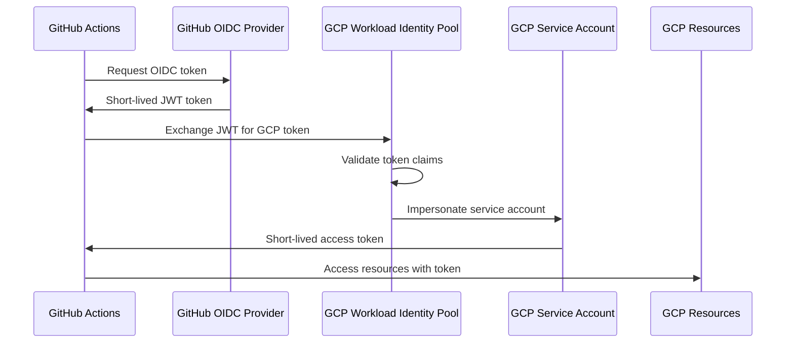

# How to Set Up Workload Identity Federation for GitHub Actions to Access GCP Resources

Author: [nawazdhandala](https://www.github.com/nawazdhandala)

Tags: GCP, Workload Identity Federation, GitHub Actions, CI/CD, Security, IAM

Description: A step-by-step guide to configuring Workload Identity Federation in GCP for GitHub Actions, eliminating the need for long-lived service account keys.

---

If you are using GitHub Actions to deploy to GCP, you probably have a service account key stored as a GitHub secret. It works, but it is a security risk. That JSON key file is a long-lived credential that grants full access to whatever the service account can do. If it leaks, you have a problem.

Workload Identity Federation is the better way. It lets GitHub Actions authenticate directly to GCP without any stored keys. GitHub's OIDC (OpenID Connect) tokens are exchanged for short-lived GCP credentials at runtime. No keys to rotate, no secrets to manage, and if someone gets the OIDC token, it expires in minutes.

## How It Works

Here is the authentication flow:



1. GitHub Actions requests an OIDC token from GitHub's identity provider
2. The token is sent to GCP's Security Token Service
3. GCP validates the token against the Workload Identity Pool configuration
4. GCP issues a short-lived access token for the service account
5. The workflow uses this token to access GCP resources

## Step 1: Create a Workload Identity Pool

The pool is a container for external identity providers:

```bash
# Create the Workload Identity Pool
gcloud iam workload-identity-pools create "github-pool" \
    --project="my-project" \
    --location="global" \
    --display-name="GitHub Actions Pool" \
    --description="Pool for GitHub Actions OIDC authentication"
```

## Step 2: Create a Workload Identity Provider

This tells GCP how to validate tokens from GitHub:

```bash
# Create the OIDC provider within the pool
gcloud iam workload-identity-pools providers create-oidc "github-provider" \
    --project="my-project" \
    --location="global" \
    --workload-identity-pool="github-pool" \
    --display-name="GitHub OIDC Provider" \
    --issuer-uri="https://token.actions.githubusercontent.com" \
    --attribute-mapping="google.subject=assertion.sub,attribute.actor=assertion.actor,attribute.repository=assertion.repository,attribute.repository_owner=assertion.repository_owner" \
    --attribute-condition="assertion.repository_owner == 'my-github-org'"
```

Let me break down the important parts:

- `--issuer-uri`: GitHub's OIDC token issuer URL. This is always the same for all GitHub repos.
- `--attribute-mapping`: Maps claims from the GitHub token to attributes in GCP. This is how you reference specific repos or branches later.
- `--attribute-condition`: A CEL (Common Expression Language) condition that filters which tokens are accepted. Here, only tokens from your organization are accepted.

The attribute condition is critical for security. Without it, any GitHub repository could potentially authenticate to your GCP project. Always restrict to your organization at minimum.

## Step 3: Create or Identify a Service Account

Create a service account that your GitHub Actions workflows will impersonate:

```bash
# Create a service account for GitHub Actions
gcloud iam service-accounts create github-actions-sa \
    --project="my-project" \
    --display-name="GitHub Actions Service Account" \
    --description="Used by GitHub Actions via Workload Identity Federation"
```

Grant the service account only the permissions it needs:

```bash
# Grant specific roles to the service account
# Example: deploy to Cloud Run
gcloud projects add-iam-policy-binding my-project \
    --member="serviceAccount:github-actions-sa@my-project.iam.gserviceaccount.com" \
    --role="roles/run.developer"

# Example: push to Artifact Registry
gcloud projects add-iam-policy-binding my-project \
    --member="serviceAccount:github-actions-sa@my-project.iam.gserviceaccount.com" \
    --role="roles/artifactregistry.writer"
```

## Step 4: Allow the Workload Identity to Impersonate the Service Account

This is the step that links the external identity (GitHub) to the GCP service account:

```bash
# Get the Workload Identity Pool ID
PROJECT_NUMBER=$(gcloud projects describe my-project --format="value(projectNumber)")

# Allow the pool to impersonate the service account
# Restrict to a specific repository
gcloud iam service-accounts add-iam-policy-binding \
    github-actions-sa@my-project.iam.gserviceaccount.com \
    --project="my-project" \
    --role="roles/iam.workloadIdentityUser" \
    --member="principalSet://iam.googleapis.com/projects/${PROJECT_NUMBER}/locations/global/workloadIdentityPools/github-pool/attribute.repository/my-github-org/my-repo"
```

You can also restrict to specific branches:

```bash
# Allow only the main branch
gcloud iam service-accounts add-iam-policy-binding \
    github-actions-sa@my-project.iam.gserviceaccount.com \
    --project="my-project" \
    --role="roles/iam.workloadIdentityUser" \
    --member="principalSet://iam.googleapis.com/projects/${PROJECT_NUMBER}/locations/global/workloadIdentityPools/github-pool/subject/repo:my-github-org/my-repo:ref:refs/heads/main"
```

## Step 5: Configure the GitHub Actions Workflow

Now set up your GitHub Actions workflow to use Workload Identity Federation. You need the `google-github-actions/auth` action:

```yaml
# .github/workflows/deploy.yml
name: Deploy to GCP

on:
  push:
    branches: [main]

# Required for OIDC token generation
permissions:
  contents: read
  id-token: write

jobs:
  deploy:
    runs-on: ubuntu-latest

    steps:
      - name: Checkout code
        uses: actions/checkout@v4

      # Authenticate to GCP using Workload Identity Federation
      - name: Authenticate to Google Cloud
        id: auth
        uses: google-github-actions/auth@v2
        with:
          workload_identity_provider: "projects/PROJECT_NUMBER/locations/global/workloadIdentityPools/github-pool/providers/github-provider"
          service_account: "github-actions-sa@my-project.iam.gserviceaccount.com"

      # Now you can use gcloud, gsutil, etc.
      - name: Set up Cloud SDK
        uses: google-github-actions/setup-gcloud@v2

      - name: Deploy to Cloud Run
        run: |
          gcloud run deploy my-service \
            --source . \
            --region us-central1 \
            --project my-project
```

The critical part is the `permissions` block at the top. The `id-token: write` permission is required for the workflow to request an OIDC token from GitHub.

## Step 6: Get the Provider Resource Name

You need the full provider resource name for the workflow. Get it with:

```bash
# Get the full provider resource name
PROJECT_NUMBER=$(gcloud projects describe my-project --format="value(projectNumber)")

echo "projects/${PROJECT_NUMBER}/locations/global/workloadIdentityPools/github-pool/providers/github-provider"
```

Use this value in the `workload_identity_provider` field of your workflow.

## Security Best Practices

### Restrict by Repository

Always use attribute conditions to limit which repositories can authenticate:

```bash
# Only allow specific repositories
--attribute-condition="assertion.repository_owner == 'my-github-org' && assertion.repository == 'my-github-org/my-repo'"
```

### Restrict by Branch

For production deployments, restrict to specific branches:

```bash
# Only allow main branch and release tags
--attribute-condition="assertion.repository_owner == 'my-github-org' && assertion.repository == 'my-github-org/my-repo' && (assertion.ref == 'refs/heads/main' || assertion.ref.startsWith('refs/tags/v'))"
```

### Use Separate Service Accounts per Environment

```bash
# Production service account - tightly scoped
gcloud iam service-accounts create github-actions-prod \
    --display-name="GitHub Actions - Production"

# Staging service account - more permissive
gcloud iam service-accounts create github-actions-staging \
    --display-name="GitHub Actions - Staging"
```

Then in your workflows, use the appropriate service account based on the trigger:

```yaml
# Different auth for different environments
- name: Auth (Production)
  if: github.ref == 'refs/heads/main'
  uses: google-github-actions/auth@v2
  with:
    workload_identity_provider: "projects/NUMBER/locations/global/workloadIdentityPools/github-pool/providers/github-provider"
    service_account: "github-actions-prod@my-project.iam.gserviceaccount.com"

- name: Auth (Staging)
  if: github.ref != 'refs/heads/main'
  uses: google-github-actions/auth@v2
  with:
    workload_identity_provider: "projects/NUMBER/locations/global/workloadIdentityPools/github-pool/providers/github-provider"
    service_account: "github-actions-staging@my-project.iam.gserviceaccount.com"
```

## Troubleshooting

**Error: "Unable to acquire impersonation credentials"**: The service account IAM binding is missing or wrong. Verify the `workloadIdentityUser` role binding.

**Error: "The audience in the token did not match"**: The `workload_identity_provider` value in the workflow does not match the actual provider resource name. Double-check the project number.

**Error: "The attribute condition was not met"**: Your attribute condition in the provider configuration is rejecting the token. Check that the repository name and branch match.

```bash
# Debug: View the provider configuration
gcloud iam workload-identity-pools providers describe github-provider \
    --project="my-project" \
    --location="global" \
    --workload-identity-pool="github-pool" \
    --format="yaml(attributeCondition, attributeMapping)"
```

## Wrapping Up

Workload Identity Federation eliminates the biggest security risk in CI/CD pipelines that deploy to GCP: stored service account keys. The setup takes about 15 minutes, and once it is done, your GitHub Actions workflows authenticate securely with short-lived tokens. The key steps are creating the pool and provider, binding the provider to a service account with appropriate restrictions, and updating your workflow to use the `google-github-actions/auth` action. If you are still using service account keys in GitHub secrets, make this migration a priority.
