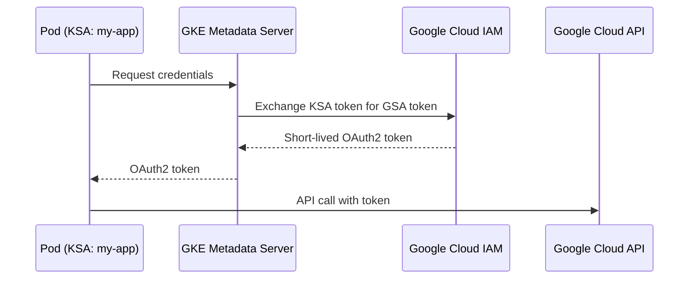

# How to Set Up Workload Identity Federation on GKE to Access Google Cloud APIs Without Service Account Keys

Author: [nawazdhandala](https://www.github.com/nawazdhandala)

Tags: GCP, GKE, Kubernetes, Workload Identity, IAM, Security

Description: A practical guide to setting up Workload Identity Federation on GKE so your pods can securely access Google Cloud APIs without managing service account keys.

---

Service account keys are a security liability. They are long-lived credentials that can be leaked, stolen, or accidentally committed to a repository. If someone gets hold of a key, they have access until you revoke it - and most teams do not have great key rotation practices.

Workload Identity Federation on GKE eliminates the need for service account keys entirely. Instead of mounting a JSON key file into your pods, you create a binding between a Kubernetes service account and a Google Cloud service account. When your pod makes an API call, GKE automatically provides short-lived credentials through the instance metadata service. No keys to manage, no secrets to rotate, no risk of credential leakage.

Let me show you how to set it up.

## How Workload Identity Works

The mechanism is straightforward. When Workload Identity is enabled, GKE runs a metadata server on each node that intercepts calls to the instance metadata endpoint (`169.254.169.254`). When a pod configured with Workload Identity requests credentials, the metadata server returns short-lived OAuth2 tokens for the bound Google Cloud service account.



KSA = Kubernetes Service Account, GSA = Google Cloud Service Account.

## Step 1: Enable Workload Identity on the Cluster

If you are creating a new cluster, enable Workload Identity at creation time. If you have an existing cluster, you can enable it with an update command.

```bash
# For a new cluster
gcloud container clusters create my-cluster \
  --region us-central1 \
  --workload-pool YOUR_PROJECT_ID.svc.id.goog \
  --num-nodes 3

# For an existing cluster
gcloud container clusters update my-cluster \
  --region us-central1 \
  --workload-pool YOUR_PROJECT_ID.svc.id.goog
```

The `--workload-pool` flag specifies the workload identity pool, which is always `PROJECT_ID.svc.id.goog`.

After enabling Workload Identity on an existing cluster, you also need to update your node pools to use the GKE metadata server.

```bash
# Update existing node pools to use the GKE metadata server
gcloud container node-pools update default-pool \
  --cluster my-cluster \
  --region us-central1 \
  --workload-metadata GKE_METADATA
```

## Step 2: Create the Google Cloud Service Account

Create a GSA with the permissions your application needs.

```bash
# Create a Google Cloud service account for the application
gcloud iam service-accounts create my-app-gsa \
  --display-name "My App Workload Identity SA" \
  --description "Used by the my-app pods in GKE via Workload Identity"

# Grant it the permissions your app needs
# Example: read from Cloud Storage and write to BigQuery
gcloud projects add-iam-policy-binding YOUR_PROJECT_ID \
  --member "serviceAccount:my-app-gsa@YOUR_PROJECT_ID.iam.gserviceaccount.com" \
  --role "roles/storage.objectViewer"

gcloud projects add-iam-policy-binding YOUR_PROJECT_ID \
  --member "serviceAccount:my-app-gsa@YOUR_PROJECT_ID.iam.gserviceaccount.com" \
  --role "roles/bigquery.dataEditor"
```

## Step 3: Create the Kubernetes Service Account

Create a KSA in the namespace where your application runs.

```yaml
# ksa.yaml - Kubernetes Service Account with Workload Identity annotation
apiVersion: v1
kind: ServiceAccount
metadata:
  name: my-app-ksa
  namespace: default
  annotations:
    # This annotation links the KSA to the GSA
    iam.gke.io/gcp-service-account: my-app-gsa@YOUR_PROJECT_ID.iam.gserviceaccount.com
```

```bash
kubectl apply -f ksa.yaml
```

## Step 4: Create the IAM Policy Binding

This is the critical step. You need to allow the Kubernetes service account to impersonate the Google Cloud service account.

```bash
# Allow the KSA to act as the GSA
gcloud iam service-accounts add-iam-policy-binding \
  my-app-gsa@YOUR_PROJECT_ID.iam.gserviceaccount.com \
  --role roles/iam.workloadIdentityUser \
  --member "serviceAccount:YOUR_PROJECT_ID.svc.id.goog[default/my-app-ksa]"
```

The member format is `serviceAccount:PROJECT_ID.svc.id.goog[NAMESPACE/KSA_NAME]`. Make sure the namespace and KSA name match exactly.

## Step 5: Configure Your Pods

Update your deployment to use the Kubernetes service account.

```yaml
# deployment.yaml - Pod configured to use Workload Identity
apiVersion: apps/v1
kind: Deployment
metadata:
  name: my-app
  namespace: default
spec:
  replicas: 3
  selector:
    matchLabels:
      app: my-app
  template:
    metadata:
      labels:
        app: my-app
    spec:
      # Reference the KSA with the Workload Identity annotation
      serviceAccountName: my-app-ksa
      containers:
        - name: my-app
          image: gcr.io/YOUR_PROJECT_ID/my-app:latest
          ports:
            - containerPort: 8080
          # No need for GOOGLE_APPLICATION_CREDENTIALS or secret volumes
          # The GKE metadata server handles authentication automatically
```

Notice what is NOT in this manifest: no secret volumes, no environment variables pointing to key files, no init containers downloading credentials. The Google Cloud client libraries automatically detect the Workload Identity metadata server and use it.

## Step 6: Verify It Works

Deploy the app and verify that it can access Google Cloud APIs.

```bash
# Deploy the application
kubectl apply -f deployment.yaml

# Run a test pod with the same service account to verify
kubectl run test-wi \
  --rm -i --tty \
  --image google/cloud-sdk:slim \
  --serviceaccount my-app-ksa \
  --namespace default \
  -- /bin/bash

# Inside the pod, check which identity you are using
gcloud auth list
# Should show: my-app-gsa@YOUR_PROJECT_ID.iam.gserviceaccount.com

# Try accessing a resource
gsutil ls gs://your-bucket/
```

## Application Code Changes

The beautiful thing about Workload Identity is that it requires zero code changes if you are using Google Cloud client libraries. The Application Default Credentials (ADC) flow automatically discovers the metadata server.

```javascript
// No explicit credentials needed - ADC handles it automatically
const { Storage } = require("@google-cloud/storage");
const storage = new Storage(); // No key file, no credentials parameter

async function listFiles() {
  const [files] = await storage.bucket("my-bucket").getFiles();
  files.forEach((file) => console.log(file.name));
}
```

```python
# Python - same thing, no credentials needed
from google.cloud import storage

# The client automatically uses Workload Identity credentials
client = storage.Client()
blobs = client.list_blobs("my-bucket")
for blob in blobs:
    print(blob.name)
```

## Multiple Applications with Different Permissions

The real power shows when you have multiple applications that need different permissions. Each gets its own KSA-to-GSA binding.

```bash
# Application 1: needs Storage read access
gcloud iam service-accounts create reader-gsa
gcloud projects add-iam-policy-binding YOUR_PROJECT_ID \
  --member "serviceAccount:reader-gsa@YOUR_PROJECT_ID.iam.gserviceaccount.com" \
  --role "roles/storage.objectViewer"
gcloud iam service-accounts add-iam-policy-binding \
  reader-gsa@YOUR_PROJECT_ID.iam.gserviceaccount.com \
  --role roles/iam.workloadIdentityUser \
  --member "serviceAccount:YOUR_PROJECT_ID.svc.id.goog[default/reader-ksa]"

# Application 2: needs Pub/Sub publish access
gcloud iam service-accounts create publisher-gsa
gcloud projects add-iam-policy-binding YOUR_PROJECT_ID \
  --member "serviceAccount:publisher-gsa@YOUR_PROJECT_ID.iam.gserviceaccount.com" \
  --role "roles/pubsub.publisher"
gcloud iam service-accounts add-iam-policy-binding \
  publisher-gsa@YOUR_PROJECT_ID.iam.gserviceaccount.com \
  --role roles/iam.workloadIdentityUser \
  --member "serviceAccount:YOUR_PROJECT_ID.svc.id.goog[default/publisher-ksa]"
```

Each application can only access what it needs. If one is compromised, the attacker only gets the permissions bound to that specific service account.

## Troubleshooting

Common issues and how to fix them:

```bash
# Check if the metadata server is running on the node
kubectl get pods -n kube-system | grep gke-metadata-server

# If pods cannot get credentials, check the annotation on the KSA
kubectl get serviceaccount my-app-ksa -o yaml

# Verify the IAM binding exists
gcloud iam service-accounts get-iam-policy \
  my-app-gsa@YOUR_PROJECT_ID.iam.gserviceaccount.com

# Check if the pod is actually using the correct KSA
kubectl get pod my-app-pod -o jsonpath='{.spec.serviceAccountName}'
```

The most common mistake is a mismatch between the namespace in the IAM binding and the namespace where the pod actually runs. Double-check that `YOUR_PROJECT_ID.svc.id.goog[NAMESPACE/KSA_NAME]` matches your actual deployment namespace.

## Wrapping Up

Workload Identity Federation is one of those features that makes your cluster significantly more secure with relatively little effort. You eliminate the entire class of vulnerabilities related to leaked service account keys, you get automatic credential rotation (tokens are short-lived), and you maintain proper least-privilege access for each application. If you are still using mounted key files in your GKE workloads, migrating to Workload Identity should be high on your priority list. The setup is a one-time investment per application, and the security benefits are ongoing.
