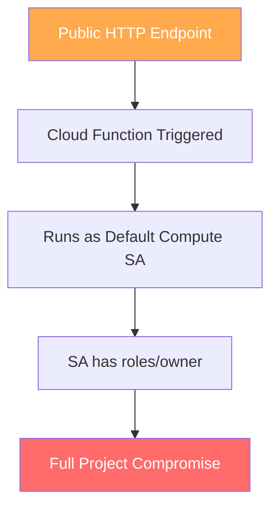
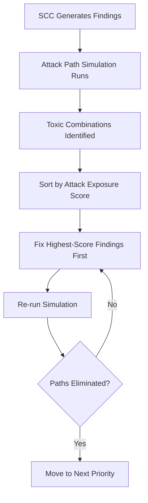

# How to Simulate Attack Paths and Identify Toxic Combinations in Security Command Center

Author: [nawazdhandala](https://www.github.com/nawazdhandala)

Tags: GCP, Security Command Center, Attack Path Simulation, Cloud Security, Threat Modeling

Description: A practical guide to using Security Command Center's attack path simulation and toxic combination detection to find exploitable chains of misconfigurations in your Google Cloud environment.

---

Individual security findings are manageable. What keeps security teams up at night is the combination of seemingly minor issues that, when chained together, create a viable attack path to your most critical assets. Google Cloud's Security Command Center (SCC) Enterprise tier includes attack path simulation that does exactly this - it models how an attacker could move through your environment by exploiting multiple weaknesses.

In this post, I will cover how attack path simulation works, how to configure it, and how to use its output to prioritize remediation efforts based on real exploitability rather than individual finding severity.

## Understanding Attack Path Simulation

Attack path simulation in SCC works by building a graph of your cloud resources, their configurations, IAM bindings, and network connectivity. It then runs simulated attacks against this graph to identify paths an attacker could take from an entry point (like a public-facing VM) to a high-value target (like a database with sensitive data).

The key concepts are:

- **High-value resources** - assets you designate as critical, such as databases, secret managers, or specific projects
- **Attack exposure scores** - numeric scores indicating how exposed a resource is based on the number and quality of attack paths leading to it
- **Toxic combinations** - specific sets of findings that, individually, might be low or medium severity but together create a high-severity exploitable chain

## Enabling Attack Path Simulation

Attack path simulation requires SCC Enterprise tier. Once enabled, the simulation runs automatically, but you need to configure your high-value resources for meaningful results.

This command designates specific resource types as high-value targets for the simulation engine.

```bash
# Create a resource value configuration to mark BigQuery datasets as high-value
gcloud scc resource-value-configs create \
  --organization=123456789 \
  --resource-type="bigquery.googleapis.com/Dataset" \
  --resource-value=HIGH \
  --description="Production BigQuery datasets containing customer data"
```

You can also scope high-value designations using tag filters.

```bash
# Mark only resources tagged as production as high-value
gcloud scc resource-value-configs create \
  --organization=123456789 \
  --resource-type="sqladmin.googleapis.com/Instance" \
  --resource-value=HIGH \
  --tag-filter='environment=production' \
  --description="Production Cloud SQL instances"
```

## Configuring Resource Value Levels

SCC supports three resource value levels: HIGH, MEDIUM, and LOW. The simulation engine uses these to calculate attack exposure scores. Resources marked HIGH get the most attention in the simulation.

Here is a Terraform configuration that sets up resource value configs for multiple resource types.

```hcl
# Define high-value resource configurations for the attack path simulator
resource "google_scc_management_organization_resource_value_config" "secret_manager" {
  organization = "123456789"
  resource_type = "secretmanager.googleapis.com/Secret"
  resource_value = "HIGH"
  description = "Secret Manager secrets are high-value targets"
}

resource "google_scc_management_organization_resource_value_config" "cloud_sql" {
  organization = "123456789"
  resource_type = "sqladmin.googleapis.com/Instance"
  resource_value = "HIGH"
  tag_values = ["tagValues/production"]
  description = "Production databases"
}

resource "google_scc_management_organization_resource_value_config" "gke_clusters" {
  organization = "123456789"
  resource_type = "container.googleapis.com/Cluster"
  resource_value = "MEDIUM"
  description = "GKE clusters as medium-value targets"
}
```

## Reading Attack Path Results

Once the simulation has run, you can query the results through the SCC API or console. The most useful output is the attack exposure score on findings and the actual attack path details.

This command retrieves findings sorted by their attack exposure score, showing you which findings present the greatest real-world risk.

```bash
# List findings sorted by attack exposure score, highest first
gcloud scc findings list 123456789 \
  --source=SECURITY_HEALTH_ANALYTICS \
  --filter="state=\"ACTIVE\"" \
  --order-by="attackExposure.score DESC" \
  --format="table(resourceName, category, severity, attackExposure.score)" \
  --limit=20
```

## Understanding Toxic Combinations

Toxic combinations are one of the most valuable outputs of the attack path simulation. A toxic combination is a set of findings that, together, form an actionable attack path. Here are some common patterns:

**Public VM with Service Account Key Access**
- A Compute Engine instance has a public IP
- The instance's service account has access to Secret Manager
- The service account key is downloadable

Individually, each of these might be medium severity. Together, they are a direct path to credential theft.

**Overprivileged Service Account Chain**
- A Cloud Function uses the default compute service account
- That service account has `roles/owner` on the project
- The function is triggered by a public HTTP endpoint

The flow of how these combine into an exploitable path looks like this.



## Querying Toxic Combinations via API

The SCC API provides direct access to toxic combination findings. Here is a Python script that retrieves and processes them.

```python
# Fetch toxic combination findings from SCC and display attack paths
from google.cloud import securitycenter_v2

def get_toxic_combinations(org_id):
    """Retrieve toxic combination findings for an organization."""
    client = securitycenter_v2.SecurityCenterClient()

    parent = f"organizations/{org_id}/sources/-/locations/-"

    # Filter for toxic combination findings specifically
    finding_filter = 'category="TOXIC_COMBINATION" AND state="ACTIVE"'

    request = securitycenter_v2.ListFindingsRequest(
        parent=parent,
        filter=finding_filter,
        order_by="attackExposure.score desc"
    )

    findings = client.list_findings(request=request)

    for response in findings:
        finding = response.finding
        print(f"Toxic Combination: {finding.display_name}")
        print(f"  Score: {finding.attack_exposure.score}")
        print(f"  Severity: {finding.severity.name}")

        # Print the individual findings that form this combination
        if finding.connections:
            print("  Component Findings:")
            for conn in finding.connections:
                print(f"    - {conn.destination_finding}")
        print()

# Run for your organization
get_toxic_combinations("123456789")
```

## Building Custom Attack Exposure Reports

For regular reporting, you can export attack path data to BigQuery and build dashboards that track your exposure over time.

This script exports findings with attack exposure scores for trend analysis.

```bash
# Export SCC findings with attack exposure data to BigQuery
gcloud scc findings list 123456789 \
  --source=- \
  --filter="attackExposure.score > 0 AND state=\"ACTIVE\"" \
  --format=json > /tmp/attack_exposure_findings.json

# Load into BigQuery for analysis
bq load \
  --source_format=NEWLINE_DELIMITED_JSON \
  --autodetect \
  security_analytics.attack_exposure_findings \
  /tmp/attack_exposure_findings.json
```

Once the data is in BigQuery, you can run queries to identify trends.

```sql
-- Find the most exposed projects based on cumulative attack exposure scores
SELECT
  JSON_EXTRACT_SCALAR(resourceName, '$.project') AS project_id,
  COUNT(*) AS finding_count,
  AVG(CAST(attackExposure.score AS FLOAT64)) AS avg_exposure_score,
  MAX(CAST(attackExposure.score AS FLOAT64)) AS max_exposure_score
FROM `security_analytics.attack_exposure_findings`
GROUP BY project_id
ORDER BY max_exposure_score DESC
LIMIT 10;
```

## Prioritizing Remediation with Attack Paths

The biggest practical benefit of attack path simulation is better prioritization. Instead of working through findings sorted by severity (which treats every HIGH finding equally), you can sort by attack exposure score to focus on findings that actually contribute to exploitable paths.

Here is a workflow that works well for security teams:



The key insight is that fixing one finding in a toxic combination often breaks the entire attack path. You do not necessarily need to fix all three or four findings - removing one link in the chain is enough. The simulation helps you identify which single fix has the biggest impact.

## Automating Response to Toxic Combinations

You can set up SCC notifications to trigger automated responses when new toxic combinations are detected.

```bash
# Create a notification config for toxic combination findings
gcloud scc notifications create toxic-combo-alerts \
  --organization=123456789 \
  --pubsub-topic=projects/my-project/topics/scc-toxic-combos \
  --filter='category="TOXIC_COMBINATION" AND state="ACTIVE" AND attackExposure.score >= 7.0'
```

With Pub/Sub receiving these notifications, you can wire up Cloud Functions to automatically create tickets, page on-call engineers, or even apply temporary mitigations like restricting network access.

## Practical Tips

After working with attack path simulation across several organizations, here are the things that make the biggest difference:

1. **Be deliberate about high-value resources** - if everything is high-value, nothing is. Mark only your truly critical assets.
2. **Review toxic combinations weekly** - they change as your environment evolves.
3. **Track attack exposure scores over time** - a rising score means your risk posture is degrading.
4. **Use the simulation to justify security work** - showing a concrete attack path is far more convincing to stakeholders than citing a finding severity level.
5. **Focus on breaking chains** - find the single easiest fix that eliminates the most attack paths.

Attack path simulation transforms SCC from a finding generator into a risk-based security tool. It answers the question every security team cares about most: which of these hundreds of findings actually matter right now?
