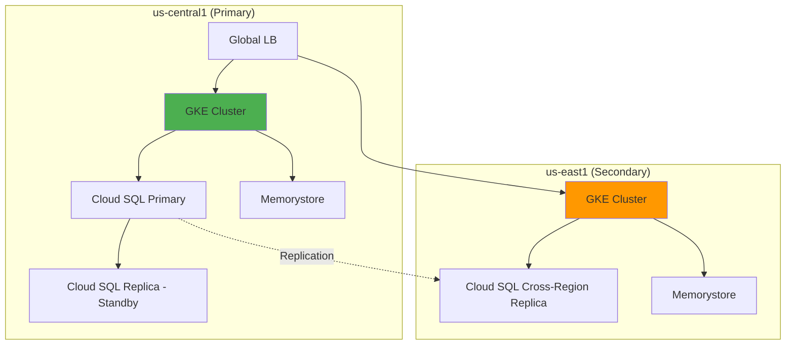
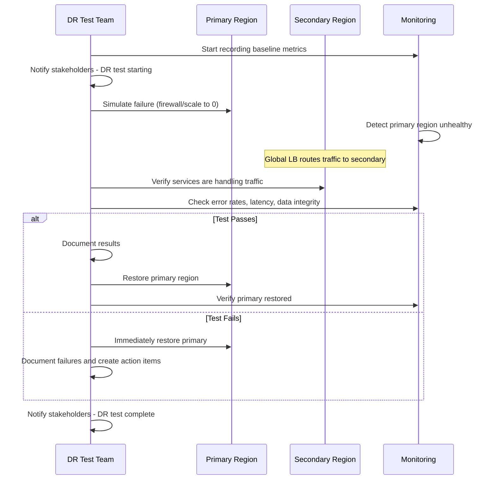

# How to Simulate Regional Outages for Disaster Recovery Testing on Google Cloud

Author: [nawazdhandala](https://www.github.com/nawazdhandala)

Tags: GCP, Disaster Recovery, Regional Outages, Chaos Engineering, Google Cloud, High Availability

Description: Learn how to simulate regional outages on Google Cloud to test and validate your disaster recovery procedures before a real incident occurs.

---

Everyone has a disaster recovery plan until the disaster actually happens. The difference between a plan that works and one that does not is testing. On Google Cloud, you can simulate regional outages to validate that your multi-region architecture actually fails over correctly, that your data replication is working, and that your recovery procedures are documented and practiced. In this post, I will show you practical ways to simulate regional failures without actually breaking production.

## Why Simulate Regional Outages?

Google Cloud regions rarely go down entirely, but it does happen. More commonly, specific services within a region experience degradation. Either way, if your application depends on a single region and that region has issues, your users are affected. DR testing validates that your multi-region setup actually works, your team knows the procedures, and your RTO and RPO targets are achievable.

## Preparation Checklist

Before running any DR test, have these in place.

- A documented DR runbook
- Communication plan for stakeholders
- Rollback procedures
- Monitoring dashboards for both primary and secondary regions
- A scheduled maintenance window (even for non-production tests)

## Architecture for Testing

Here is a typical multi-region architecture on GCP that we will test.



## Method 1: Firewall-Based Region Isolation

The safest way to simulate a regional outage is to use firewall rules to block all traffic to and from the primary region's resources. This does not actually stop the services - it just makes them unreachable.

```bash
# Create a firewall rule that blocks all ingress to the primary region
gcloud compute firewall-rules create dr-test-block-ingress \
    --network=my-vpc \
    --direction=INGRESS \
    --action=DENY \
    --rules=all \
    --source-ranges=0.0.0.0/0 \
    --target-tags=primary-region \
    --priority=100 \
    --description="DR test: Block ingress to primary region"

# Create a firewall rule that blocks all egress from the primary region
gcloud compute firewall-rules create dr-test-block-egress \
    --network=my-vpc \
    --direction=EGRESS \
    --action=DENY \
    --rules=all \
    --destination-ranges=0.0.0.0/0 \
    --target-tags=primary-region \
    --priority=100 \
    --description="DR test: Block egress from primary region"
```

To roll back, simply delete the rules.

```bash
# Remove the DR test firewall rules to restore normal operation
gcloud compute firewall-rules delete dr-test-block-ingress dr-test-block-egress --quiet
```

## Method 2: Load Balancer Traffic Steering

Use the global load balancer to shift all traffic away from the primary region. This tests the failover path without disrupting the primary region's services.

```bash
# Update the backend service to set the primary region's capacity to zero
gcloud compute backend-services update my-backend-service \
    --global \
    --no-backends

# Re-add only the secondary region's backend
gcloud compute backend-services add-backend my-backend-service \
    --global \
    --instance-group=my-ig-us-east1 \
    --instance-group-zone=us-east1-b \
    --balancing-mode=UTILIZATION \
    --max-utilization=0.8
```

## Method 3: GKE Cluster Scaling to Zero

Scale the primary GKE cluster's workloads to zero to simulate the cluster being unavailable.

```bash
# Scale all deployments in the primary cluster to zero replicas
# Make sure kubectl is pointing to the primary cluster
gcloud container clusters get-credentials primary-cluster \
    --region=us-central1 \
    --project=my-gcp-project

# Scale down all application deployments
kubectl scale deployment --all --replicas=0 -n production

# Verify all pods are terminated
kubectl get pods -n production
```

To restore, scale back up.

```bash
# Restore the primary cluster deployments
kubectl scale deployment api-server --replicas=3 -n production
kubectl scale deployment order-service --replicas=2 -n production
kubectl scale deployment worker --replicas=4 -n production
```

## Method 4: Cloud SQL Failover Test

Test the database failover by promoting the cross-region replica.

```bash
# First, check the current replication status
gcloud sql instances describe my-sql-replica \
    --project=my-gcp-project \
    --format="table(name,state,replicaConfiguration.failoverTarget)"

# Promote the replica to become the primary
# WARNING: This is a destructive operation that breaks replication
gcloud sql instances promote-replica my-sql-replica \
    --project=my-gcp-project

# After promotion, update your application configuration
# to point to the new primary database
```

For a less disruptive test, use Cloud SQL's built-in failover if you have a high availability configuration.

```bash
# Trigger a failover within the HA configuration
gcloud sql instances failover my-sql-primary \
    --project=my-gcp-project
```

## DR Test Workflow

Here is the structured workflow for a DR test.



## Step-by-Step DR Test Script

Here is a comprehensive script that automates the DR test process.

```bash
#!/bin/bash
# dr-test.sh - Automated DR test script for GCP

set -euo pipefail

PROJECT_ID="my-gcp-project"
PRIMARY_CLUSTER="primary-cluster"
PRIMARY_REGION="us-central1"
SECONDARY_CLUSTER="secondary-cluster"
SECONDARY_REGION="us-east1"

echo "=== DR Test Starting ==="
echo "Time: $(date -u)"

# Step 1: Record baseline metrics
echo "Step 1: Recording baseline metrics..."
BASELINE_ERROR_RATE=$(curl -s "https://my-service.example.com/health" | jq .status)
echo "Baseline status: $BASELINE_ERROR_RATE"

# Step 2: Verify secondary region is healthy
echo "Step 2: Verifying secondary region health..."
gcloud container clusters get-credentials $SECONDARY_CLUSTER \
    --region=$SECONDARY_REGION --project=$PROJECT_ID
kubectl get pods -n production

# Step 3: Simulate primary region failure
echo "Step 3: Simulating primary region failure..."
gcloud container clusters get-credentials $PRIMARY_CLUSTER \
    --region=$PRIMARY_REGION --project=$PROJECT_ID
kubectl scale deployment --all --replicas=0 -n production

# Step 4: Wait for failover
echo "Step 4: Waiting 60 seconds for failover..."
sleep 60

# Step 5: Verify secondary is handling traffic
echo "Step 5: Verifying secondary region is handling traffic..."
for i in $(seq 1 10); do
    HTTP_CODE=$(curl -s -o /dev/null -w "%{http_code}" "https://my-service.example.com/health")
    echo "  Request $i: HTTP $HTTP_CODE"
    if [ "$HTTP_CODE" != "200" ]; then
        echo "FAILURE: Service not healthy after failover!"
    fi
    sleep 2
done

# Step 6: Verify data integrity
echo "Step 6: Checking data integrity..."
# Add your data verification queries here

# Step 7: Restore primary region
echo "Step 7: Restoring primary region..."
gcloud container clusters get-credentials $PRIMARY_CLUSTER \
    --region=$PRIMARY_REGION --project=$PROJECT_ID
kubectl scale deployment api-server --replicas=3 -n production
kubectl scale deployment order-service --replicas=2 -n production

# Step 8: Wait for primary to recover
echo "Step 8: Waiting for primary region recovery..."
kubectl rollout status deployment/api-server -n production --timeout=120s

echo "=== DR Test Complete ==="
echo "Time: $(date -u)"
```

## Measuring RTO and RPO

During the test, measure two critical metrics.

**Recovery Time Objective (RTO)** - how long it takes to restore service. Measure from the moment the primary region goes down to when the secondary region starts serving traffic successfully.

**Recovery Point Objective (RPO)** - how much data you lose. Check the replication lag of your Cloud SQL replica just before failover. If the lag is 2 seconds, your RPO is 2 seconds.

```bash
# Check Cloud SQL replication lag before failover
gcloud sql instances describe my-sql-replica \
    --project=$PROJECT_ID \
    --format="value(replicaConfiguration.mysqlReplicaConfiguration.secondsBehindMaster)"
```

## Common Failures Found During DR Tests

The most common issues discovered during DR tests include: DNS propagation delays that exceed expected failover time, database connection strings hardcoded to the primary region, cache warmup time not accounted for in RTO estimates, service accounts and IAM permissions not replicated to the secondary region, and secrets or configuration not available in the secondary region.

Each of these is much better to discover during a planned test than during a real outage at 3 AM.

## Wrapping Up

Simulating regional outages on Google Cloud is not just a nice-to-have - it is essential for any service that claims to be highly available. The methods range from simple (firewall rules blocking traffic) to comprehensive (full failover including database promotion). Start with the simpler methods in a non-production environment, work your way up to production tests during planned maintenance windows, and run these tests regularly - at least quarterly. Every time you run a DR test, you will find something that needs improvement, and that is exactly the point.
