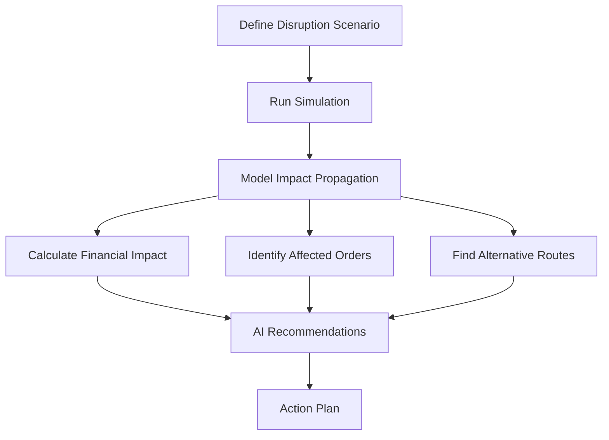

# How to Simulate Supply Chain Disruption Scenarios with Supply Chain Twin AI Recommendations

Author: [nawazdhandala](https://www.github.com/nawazdhandala)

Tags: GCP, Supply Chain Twin, AI, Simulation, Supply Chain Risk Management

Description: Use Google Cloud Supply Chain Twin to simulate supply chain disruption scenarios and get AI-powered recommendations for mitigation strategies.

---

Supply chain disruptions are inevitable. Whether it is a port closure, a supplier going offline, a natural disaster, or a sudden demand spike, the question is not if disruptions will happen but how prepared you are when they do. Google Cloud Supply Chain Twin includes simulation capabilities that let you model what-if scenarios before they happen, and AI-powered recommendations that suggest the best response strategies.

This guide walks through setting up disruption simulations, configuring different scenarios, and interpreting the AI recommendations that come out.

## Why Simulate Before Disruptions Happen

Traditional supply chain planning relies on historical patterns and manual scenario analysis. Someone in the planning team creates a spreadsheet, adjusts some numbers, and eyeballs the impact. This does not scale when you have thousands of SKUs, hundreds of suppliers, and dozens of facilities.

Supply Chain Twin simulations model the full network effect of a disruption. Block a port, and the system calculates the cascade: which shipments are delayed, which warehouses run out of stock, which customers are affected, and what alternative routes could mitigate the impact.



## Defining Disruption Scenarios

Scenarios are defined as modifications to the supply chain model. Each scenario changes one or more parameters and the simulation engine calculates the downstream effects.

```python
# scenarios.py - Define supply chain disruption scenarios
from dataclasses import dataclass
from typing import List, Optional
from datetime import datetime, timedelta


@dataclass
class DisruptionScenario:
    """Represents a what-if scenario for simulation."""
    name: str
    description: str
    disruption_type: str  # port_closure, supplier_outage, demand_spike, etc.
    start_date: datetime
    end_date: datetime
    affected_entities: List[str]  # IDs of affected facilities, lanes, or suppliers
    severity: float  # 0.0 (no impact) to 1.0 (complete shutdown)
    parameters: dict


# Scenario 1: Major port closure
port_closure_scenario = DisruptionScenario(
    name="LA Port Closure - 2 Weeks",
    description="Simulates closure of Port of Los Angeles due to labor dispute",
    disruption_type="port_closure",
    start_date=datetime(2026, 3, 1),
    end_date=datetime(2026, 3, 15),
    affected_entities=["PORT-LA", "PORT-LB"],
    severity=1.0,  # Complete closure
    parameters={
        "affected_lanes": ["LANE-001", "LANE-005", "LANE-012"],
        "reroute_options": ["PORT-OAKLAND", "PORT-SEATTLE"],
        "additional_transit_days": 3,
    }
)

# Scenario 2: Key supplier outage
supplier_outage_scenario = DisruptionScenario(
    name="Critical Supplier Shutdown",
    description="Primary electronics component supplier factory fire",
    disruption_type="supplier_outage",
    start_date=datetime(2026, 3, 1),
    end_date=datetime(2026, 4, 15),
    affected_entities=["SUPPLIER-ELEC-001"],
    severity=1.0,
    parameters={
        "affected_products": ["COMP-A1", "COMP-A2", "COMP-B1"],
        "alternative_suppliers": ["SUPPLIER-ELEC-002", "SUPPLIER-ELEC-003"],
        "lead_time_increase_days": 21,
        "cost_increase_percent": 15,
    }
)

# Scenario 3: Demand spike
demand_spike_scenario = DisruptionScenario(
    name="Holiday Demand Surge",
    description="Unexpected 40% demand increase across consumer electronics",
    disruption_type="demand_spike",
    start_date=datetime(2026, 11, 15),
    end_date=datetime(2026, 12, 31),
    affected_entities=["CATEGORY-ELECTRONICS"],
    severity=0.4,  # 40% increase
    parameters={
        "demand_multiplier": 1.4,
        "affected_categories": ["smartphones", "tablets", "accessories"],
        "regions_affected": ["US", "EU"],
    }
)
```

## Running Simulations

Submit scenarios to the simulation engine and analyze results.

```python
# run_simulation.py - Execute disruption simulations
from google.cloud import bigquery
import json
import logging
from datetime import datetime

logger = logging.getLogger(__name__)
client = bigquery.Client()


def run_disruption_simulation(scenario):
    """Run a supply chain disruption simulation."""
    logger.info(f"Starting simulation: {scenario.name}")

    # Step 1: Calculate direct impact on affected lanes/facilities
    direct_impact = calculate_direct_impact(scenario)

    # Step 2: Propagate impact through the supply chain network
    cascading_impact = propagate_impact(direct_impact, scenario)

    # Step 3: Calculate financial impact
    financial_impact = calculate_financial_impact(cascading_impact)

    # Step 4: Identify mitigation options
    mitigations = identify_mitigations(scenario, cascading_impact)

    return {
        "scenario": scenario.name,
        "direct_impact": direct_impact,
        "cascading_impact": cascading_impact,
        "financial_impact": financial_impact,
        "mitigations": mitigations,
        "simulation_timestamp": datetime.utcnow().isoformat(),
    }


def calculate_direct_impact(scenario):
    """Calculate the immediate impact of the disruption."""
    if scenario.disruption_type == "port_closure":
        # Find all in-transit and planned shipments through affected ports
        query = f"""
            SELECT
                s.shipment_id,
                s.product_id,
                s.quantity,
                s.origin_facility,
                s.destination_facility,
                s.estimated_arrival,
                p.product_name,
                p.unit_value
            FROM `supply_chain.active_shipments` s
            JOIN `supply_chain.products` p ON s.product_id = p.product_id
            WHERE s.route_port IN UNNEST(@affected_ports)
              AND s.estimated_arrival BETWEEN @start_date AND @end_date
        """
        job_config = bigquery.QueryJobConfig(
            query_parameters=[
                bigquery.ArrayQueryParameter("affected_ports", "STRING", scenario.affected_entities),
                bigquery.ScalarQueryParameter("start_date", "TIMESTAMP", scenario.start_date),
                bigquery.ScalarQueryParameter("end_date", "TIMESTAMP", scenario.end_date),
            ]
        )
        results = client.query(query, job_config=job_config).result()
        affected_shipments = [dict(row) for row in results]

        return {
            "type": "port_closure",
            "affected_shipments": len(affected_shipments),
            "affected_units": sum(s["quantity"] for s in affected_shipments),
            "at_risk_value": sum(s["quantity"] * s["unit_value"] for s in affected_shipments),
            "details": affected_shipments[:100],  # First 100 for review
        }

    elif scenario.disruption_type == "supplier_outage":
        # Find all orders and inventory dependent on the supplier
        query = """
            SELECT
                po.order_id,
                po.product_id,
                po.quantity,
                po.expected_delivery,
                i.current_quantity AS current_stock,
                p.daily_demand_avg,
                SAFE_DIVIDE(i.current_quantity, p.daily_demand_avg) AS days_of_stock
            FROM `supply_chain.purchase_orders` po
            JOIN `supply_chain.inventory_levels` i ON po.product_id = i.product_id
            JOIN `supply_chain.products` p ON po.product_id = p.product_id
            WHERE po.supplier_id IN UNNEST(@affected_suppliers)
              AND po.status IN ('open', 'in_progress')
        """
        job_config = bigquery.QueryJobConfig(
            query_parameters=[
                bigquery.ArrayQueryParameter("affected_suppliers", "STRING", scenario.affected_entities),
            ]
        )
        results = client.query(query, job_config=job_config).result()
        affected_orders = [dict(row) for row in results]

        return {
            "type": "supplier_outage",
            "affected_orders": len(affected_orders),
            "products_at_risk": len(set(o["product_id"] for o in affected_orders)),
            "details": affected_orders,
        }

    return {"type": scenario.disruption_type, "details": "Simulation type not implemented"}


def propagate_impact(direct_impact, scenario):
    """Calculate cascading effects through the supply chain."""
    # Find downstream impacts - which warehouses run out, which customers are affected
    query = """
        WITH stock_runway AS (
            SELECT
                i.warehouse_id,
                i.product_id,
                i.current_quantity,
                p.daily_demand_avg,
                SAFE_DIVIDE(i.current_quantity, p.daily_demand_avg) AS days_until_stockout,
                @disruption_days AS disruption_duration_days
            FROM `supply_chain.inventory_levels` i
            JOIN `supply_chain.products` p ON i.product_id = p.product_id
            WHERE i.product_id IN UNNEST(@affected_products)
        )
        SELECT
            warehouse_id,
            product_id,
            current_quantity,
            daily_demand_avg,
            days_until_stockout,
            CASE
                WHEN days_until_stockout < disruption_duration_days THEN 'WILL_STOCKOUT'
                WHEN days_until_stockout < disruption_duration_days * 1.5 THEN 'AT_RISK'
                ELSE 'COVERED'
            END AS risk_level
        FROM stock_runway
        ORDER BY days_until_stockout ASC
    """

    disruption_days = (scenario.end_date - scenario.start_date).days
    affected_products = scenario.parameters.get("affected_products", [])

    job_config = bigquery.QueryJobConfig(
        query_parameters=[
            bigquery.ScalarQueryParameter("disruption_days", "INT64", disruption_days),
            bigquery.ArrayQueryParameter("affected_products", "STRING", affected_products),
        ]
    )

    results = client.query(query, job_config=job_config).result()
    cascade = [dict(row) for row in results]

    stockout_count = sum(1 for c in cascade if c["risk_level"] == "WILL_STOCKOUT")
    at_risk_count = sum(1 for c in cascade if c["risk_level"] == "AT_RISK")

    return {
        "warehouses_will_stockout": stockout_count,
        "warehouses_at_risk": at_risk_count,
        "warehouses_covered": len(cascade) - stockout_count - at_risk_count,
        "details": cascade,
    }


def calculate_financial_impact(cascading_impact):
    """Estimate the financial impact of the disruption."""
    details = cascading_impact.get("details", [])

    lost_sales = 0
    expediting_costs = 0

    for item in details:
        if item.get("risk_level") == "WILL_STOCKOUT":
            days_without_stock = max(0, item.get("daily_demand_avg", 0) * 5)  # Estimate 5 days of lost sales
            lost_sales += days_without_stock * 50  # Average revenue per unit
            expediting_costs += 5000  # Estimated expediting cost per warehouse-product combination

    return {
        "estimated_lost_sales": lost_sales,
        "estimated_expediting_costs": expediting_costs,
        "total_financial_impact": lost_sales + expediting_costs,
    }


def identify_mitigations(scenario, cascading_impact):
    """Generate mitigation recommendations."""
    mitigations = []

    if scenario.disruption_type == "port_closure":
        mitigations.append({
            "action": "Reroute shipments through alternative ports",
            "ports": scenario.parameters.get("reroute_options", []),
            "additional_cost_estimate": "15-25% increase in shipping costs",
            "time_impact": f"+{scenario.parameters.get('additional_transit_days', 3)} days transit time",
            "priority": "immediate",
        })

    if scenario.disruption_type == "supplier_outage":
        mitigations.append({
            "action": "Activate alternative suppliers",
            "suppliers": scenario.parameters.get("alternative_suppliers", []),
            "lead_time": f"+{scenario.parameters.get('lead_time_increase_days', 14)} days",
            "cost_impact": f"+{scenario.parameters.get('cost_increase_percent', 10)}% per unit",
            "priority": "immediate",
        })

    # Common mitigations
    stockout_items = [d for d in cascading_impact.get("details", []) if d.get("risk_level") == "WILL_STOCKOUT"]
    if stockout_items:
        mitigations.append({
            "action": "Redistribute inventory from well-stocked warehouses",
            "affected_locations": len(stockout_items),
            "priority": "high",
        })

    return mitigations
```

## Storing and Comparing Simulation Results

Save simulation results to BigQuery so you can compare scenarios side by side.

```sql
-- Create a table to store simulation results
CREATE TABLE IF NOT EXISTS `project.supply_chain.simulation_results` (
  simulation_id STRING NOT NULL,
  scenario_name STRING NOT NULL,
  run_timestamp TIMESTAMP NOT NULL,
  disruption_type STRING,
  duration_days INTEGER,
  financial_impact_total NUMERIC,
  lost_sales_estimate NUMERIC,
  expediting_cost_estimate NUMERIC,
  warehouses_at_risk INTEGER,
  warehouses_will_stockout INTEGER,
  mitigation_count INTEGER,
  full_results JSON
);
```

## Scheduling Regular Simulations

Run key scenarios on a regular basis to keep your preparedness current as inventory levels and supplier relationships change.

```bash
# Run the top 5 risk scenarios weekly
gcloud scheduler jobs create http weekly-risk-simulations \
  --location=us-central1 \
  --schedule="0 6 * * 1" \
  --uri="https://us-central1-YOUR_PROJECT.cloudfunctions.net/run-simulations" \
  --http-method=POST \
  --message-body='{"scenarios": ["port_closure_la", "supplier_outage_elec", "demand_spike_holiday", "logistics_disruption_eu", "raw_material_shortage"]}' \
  --headers="Content-Type=application/json" \
  --oidc-service-account-email=simulation-sa@YOUR_PROJECT.iam.gserviceaccount.com
```

## Wrapping Up

Supply chain disruption simulation with Supply Chain Twin turns reactive crisis management into proactive planning. By defining scenarios as code, running them regularly against current data, and storing results for comparison, you build organizational muscle memory for disruption response. The AI recommendations provide a starting point for action plans that can be refined by your supply chain team. The most valuable part is not any single simulation but the practice of regularly stress-testing your supply chain before real disruptions force you to.
