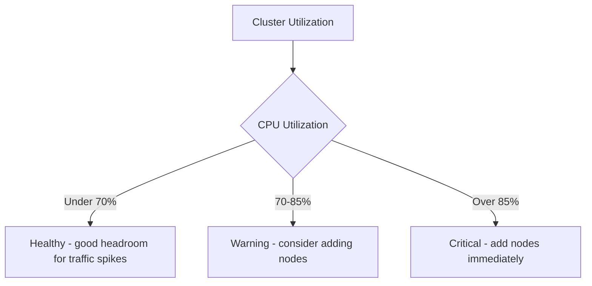

# How to Size a Cloud Bigtable Cluster for Your Production Workload

Author: [nawazdhandala](https://www.github.com/nawazdhandala)

Tags: GCP, Cloud Bigtable, Cluster Sizing, Capacity Planning, Performance

Description: Learn how to properly size your Cloud Bigtable cluster for production workloads by understanding node capacity, storage requirements, and scaling strategies.

---

Sizing a Cloud Bigtable cluster wrong is expensive in both directions. Too few nodes and your latency spikes, your application slows to a crawl, and your users suffer. Too many nodes and you burn money on capacity you never use. Getting it right requires understanding how Bigtable distributes data, what each node can handle, and how your specific workload behaves.

I have gone through this process for workloads ranging from a few thousand requests per second to millions. In this post, I will share the framework I use to size Bigtable clusters and the key metrics you should monitor after launch.

## Understanding Bigtable Node Capacity

Each Bigtable node provides a certain amount of throughput capacity. The exact numbers depend on your workload profile, but here are the general guidelines from Google:

- **SSD storage type:** Up to 10,000 reads/writes per second per node at 6ms latency (99th percentile)
- **HDD storage type:** Up to 500 reads per second and 10,000 writes per second per node
- **Storage per node:** Up to 5 TB for SSD, up to 16 TB for HDD

These are upper bounds. Your actual throughput depends on row size, access patterns, and how well your row keys distribute load.

## Step 1: Characterize Your Workload

Before picking a cluster size, answer these questions:

**What is your expected throughput?** Measure in operations per second for both reads and writes. If you do not have production numbers yet, estimate based on your application's expected traffic.

**What is your average row size?** Bigtable performance degrades as row sizes grow. A row with 100 bytes performs differently than a row with 100 KB.

**What are your latency requirements?** If you need sub-10ms reads for a real-time application, you need more headroom than a batch analytics workload that can tolerate 100ms.

**How much data will you store?** Total storage determines the minimum number of nodes required.

**What are your access patterns?** Sequential scans, random point reads, and bulk writes each have different performance characteristics.

## Step 2: Calculate Minimum Nodes for Storage

Each SSD node supports up to 5 TB of data. Each HDD node supports up to 16 TB. Calculate your minimum node count based on storage:

```
Minimum nodes (SSD) = Total data size / 5 TB
Minimum nodes (HDD) = Total data size / 16 TB
```

For example, if you expect to store 20 TB of data on SSD:

```
Minimum nodes = 20 TB / 5 TB = 4 nodes
```

## Step 3: Calculate Minimum Nodes for Throughput

Now calculate the nodes needed for your throughput requirements. Here is a Python script that helps with the math:

```python
# bigtable_sizing.py - Calculate the minimum Bigtable cluster size
def calculate_cluster_size(
    read_ops_per_second,
    write_ops_per_second,
    avg_row_size_bytes,
    total_data_tb,
    storage_type="SSD"
):
    """Calculate recommended Bigtable cluster size."""

    # Per-node capacity baselines
    if storage_type == "SSD":
        reads_per_node = 10000
        writes_per_node = 10000
        storage_per_node_tb = 5
    else:
        reads_per_node = 500
        writes_per_node = 10000
        storage_per_node_tb = 16

    # Adjust for row size - larger rows reduce throughput
    # Baseline assumes ~1KB rows, adjust proportionally
    size_factor = max(1, avg_row_size_bytes / 1024)
    adjusted_reads_per_node = reads_per_node / size_factor
    adjusted_writes_per_node = writes_per_node / size_factor

    # Calculate nodes needed for read throughput
    nodes_for_reads = read_ops_per_second / adjusted_reads_per_node

    # Calculate nodes needed for write throughput
    nodes_for_writes = write_ops_per_second / adjusted_writes_per_node

    # Calculate nodes needed for storage
    nodes_for_storage = total_data_tb / storage_per_node_tb

    # Take the maximum - you need enough nodes for all three
    min_nodes = max(nodes_for_reads, nodes_for_writes, nodes_for_storage)

    # Add 30% headroom for production stability
    recommended_nodes = int(min_nodes * 1.3) + 1

    # Bigtable requires a minimum of 1 node (3 for production)
    recommended_nodes = max(3, recommended_nodes)

    print(f"Nodes for read throughput: {nodes_for_reads:.1f}")
    print(f"Nodes for write throughput: {nodes_for_writes:.1f}")
    print(f"Nodes for storage: {nodes_for_storage:.1f}")
    print(f"Recommended nodes (with 30% headroom): {recommended_nodes}")

    return recommended_nodes

# Example: an IoT workload
calculate_cluster_size(
    read_ops_per_second=15000,
    write_ops_per_second=50000,
    avg_row_size_bytes=512,
    total_data_tb=8,
    storage_type="SSD"
)
```

## Step 4: Factor in Headroom

Never run a Bigtable cluster at 100% capacity. Here is the recommended utilization:



Google recommends keeping CPU utilization below 70% for latency-sensitive workloads. This gives you headroom for traffic spikes, compaction operations, and the rebalancing that happens when tablets split.

## Step 5: Choose Your Storage Type

The choice between SSD and HDD significantly impacts both performance and cost.

**Choose SSD when:**
- You need low-latency reads (under 10ms)
- Your workload is read-heavy
- You are serving real-time application traffic
- Data size is under 10 TB per node

**Choose HDD when:**
- You are doing batch analytics or bulk processing
- Your workload is write-heavy with infrequent reads
- Latency above 100ms is acceptable
- You need to store massive amounts of data cheaply

HDD nodes are roughly one-third the cost of SSD nodes, so the savings are significant for the right workload.

## Step 6: Create the Cluster

Once you have determined the right size, create the cluster:

```bash
# Create a production Bigtable instance with an appropriately sized cluster
gcloud bigtable instances create my-production-instance \
  --display-name="Production Bigtable" \
  --cluster-config=id=my-cluster,zone=us-central1-a,nodes=6,storage-type=SSD

# Verify the cluster configuration
gcloud bigtable clusters list --instances=my-production-instance
```

## Step 7: Enable Autoscaling

For workloads with variable traffic, autoscaling automatically adjusts the number of nodes:

```bash
# Enable autoscaling with min/max node boundaries
gcloud bigtable clusters update my-cluster \
  --instance=my-production-instance \
  --autoscaling-min-nodes=3 \
  --autoscaling-max-nodes=20 \
  --autoscaling-cpu-target=60 \
  --autoscaling-storage-target=2560
```

The `--autoscaling-cpu-target` sets the target CPU utilization percentage. Setting it to 60 means Bigtable will scale up before hitting 70%.

The `--autoscaling-storage-target` is in GB per node. Setting it to 2560 (2.5 TB) means Bigtable scales up before hitting the 5 TB per node limit.

## Monitoring Your Cluster After Launch

After deployment, monitor these key metrics:

**CPU utilization per node.** The most important metric. If it consistently exceeds 70%, you need more nodes.

```bash
# Query CPU utilization metric for your Bigtable cluster
gcloud monitoring metrics list \
  --filter='metric.type="bigtable.googleapis.com/cluster/cpu_load"'
```

**Request latencies.** Track p50, p95, and p99 latencies for both reads and writes.

**Storage utilization.** Monitor how close each node is to its storage limit.

**Hot tablets.** Uneven load distribution means some tablets are getting disproportionate traffic. This usually indicates a row key design problem.

**Error rates.** Track the rate of failed operations. A sudden increase often means the cluster is under-provisioned.

## Common Sizing Mistakes

**Starting too small.** A 1-node cluster is fine for development but should never be used in production. Google recommends a minimum of 3 nodes for production to handle node failures.

**Ignoring rebalancing time.** When you add nodes, Bigtable takes time to redistribute tablets. During this period, performance may not improve immediately. Plan for 10-20 minutes of rebalancing time.

**Not accounting for compactions.** Bigtable periodically merges and reorganizes data files. This uses CPU and can increase latency if your cluster is already near capacity.

**Sizing based on average load instead of peak.** Your cluster needs to handle peak traffic, not average traffic. If your peak is 3x your average, size accordingly or use autoscaling.

## Cost Optimization Tips

**Use committed use discounts.** If you know your base capacity, commit to it for 1 or 3 years to save up to 40%.

**Use autoscaling for variable workloads.** Pay for extra nodes only when you need them.

**Consider multi-cluster routing.** Spread reads across multiple clusters in different regions instead of over-provisioning a single cluster.

**Review cluster sizing quarterly.** Workloads change. Revisit your sizing every quarter to avoid paying for unused capacity or running too close to limits.

## Wrapping Up

Sizing a Bigtable cluster is not a one-time exercise. Start with a reasonable estimate based on your throughput, storage, and latency requirements. Add 30% headroom. Enable autoscaling if your traffic patterns vary. Then monitor relentlessly and adjust as you learn more about your actual workload. The goal is to find the sweet spot where performance is consistently good and you are not wasting money on idle nodes.
