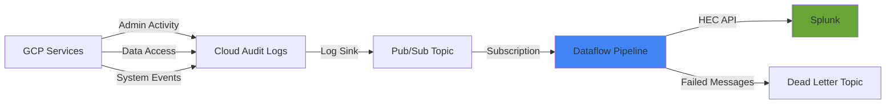
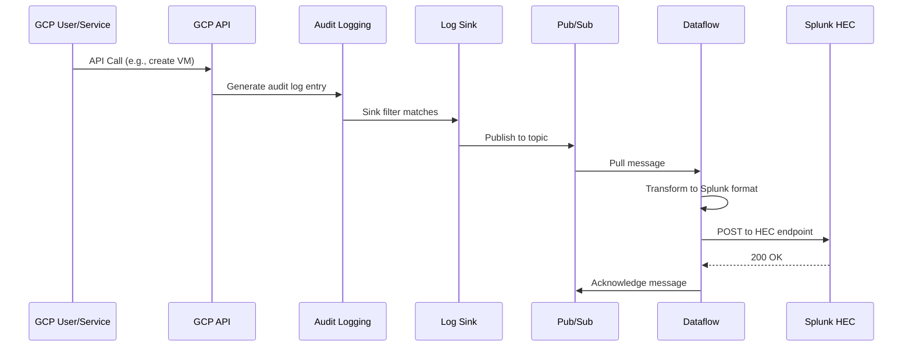

# How to Stream Google Cloud Audit Logs to Splunk Using Dataflow on GCP

Author: [nawazdhandala](https://www.github.com/nawazdhandala)

Tags: GCP, Splunk, Audit Logs, Dataflow, Cloud Logging, Security, Google Cloud

Description: Learn how to stream Google Cloud audit logs to Splunk using a Dataflow pipeline for centralized security monitoring and compliance.

---

Organizations that use Splunk as their SIEM (Security Information and Event Management) platform need to get Google Cloud audit logs into Splunk for security monitoring, compliance reporting, and incident investigation. While there are several ways to do this, using Dataflow provides a scalable, managed pipeline that handles large volumes of audit logs without you managing any infrastructure. In this post, I will show you how to set up the complete pipeline from Cloud Logging to Splunk using Dataflow.

## Why Dataflow Instead of Simple Pub/Sub Push?

You could use a Pub/Sub push subscription to send logs directly to Splunk's HEC (HTTP Event Collector) endpoint, similar to the Datadog approach. However, Dataflow offers advantages for audit log streaming. It handles message transformation and formatting natively. It provides exactly-once processing guarantees. It scales automatically with log volume. And it gives you built-in monitoring and error handling. For security-critical audit logs, these guarantees matter.

## Architecture

Here is the end-to-end architecture.



## Prerequisites

- A GCP project with audit logging enabled
- A Splunk instance with HEC (HTTP Event Collector) enabled
- A Splunk HEC token
- The Dataflow API enabled on your GCP project
- A GCS bucket for Dataflow temp files

## Step 1: Configure Audit Logging

Make sure the audit log types you need are enabled. Admin Activity logs are always on, but Data Access logs need to be explicitly enabled.

```bash
# Enable Data Access audit logs for all services
# Create the audit config
cat > audit-config.json << 'EOF'
{
  "auditConfigs": [
    {
      "service": "allServices",
      "auditLogConfigs": [
        { "logType": "ADMIN_READ" },
        { "logType": "DATA_READ" },
        { "logType": "DATA_WRITE" }
      ]
    }
  ]
}
EOF

# Apply the audit config to the project
gcloud projects set-iam-policy my-gcp-project audit-config.json
```

Be careful with Data Access logs - they can be extremely high volume and expensive. Start with Admin Activity and System Events, and add Data Access selectively.

## Step 2: Create the Pub/Sub Topic and Subscription

```bash
# Create the Pub/Sub topic for audit log export
gcloud pubsub topics create splunk-audit-logs \
    --project=my-gcp-project

# Create a pull subscription for the Dataflow pipeline
gcloud pubsub subscriptions create splunk-audit-logs-sub \
    --topic=splunk-audit-logs \
    --ack-deadline=120 \
    --project=my-gcp-project

# Create a dead letter topic for failed messages
gcloud pubsub topics create splunk-audit-logs-dead-letter \
    --project=my-gcp-project
```

## Step 3: Create the Log Sink

Export audit logs to the Pub/Sub topic using a log sink.

```bash
# Create a sink that exports all audit logs
gcloud logging sinks create splunk-audit-sink \
    pubsub.googleapis.com/projects/my-gcp-project/topics/splunk-audit-logs \
    --log-filter='logName:"cloudaudit.googleapis.com"' \
    --project=my-gcp-project

# Get the sink's writer identity
SINK_WRITER=$(gcloud logging sinks describe splunk-audit-sink \
    --project=my-gcp-project \
    --format="value(writerIdentity)")

# Grant publish permission to the sink
gcloud pubsub topics add-iam-policy-binding splunk-audit-logs \
    --member="$SINK_WRITER" \
    --role="roles/pubsub.publisher" \
    --project=my-gcp-project
```

For organization-wide audit logs, create an aggregated sink at the organization level.

```bash
# Organization-level audit log sink
gcloud logging sinks create splunk-org-audit-sink \
    pubsub.googleapis.com/projects/my-gcp-project/topics/splunk-audit-logs \
    --log-filter='logName:"cloudaudit.googleapis.com"' \
    --organization=$ORG_ID \
    --include-children
```

## Step 4: Launch the Dataflow Pipeline

Google provides a pre-built Dataflow template specifically for streaming Pub/Sub messages to Splunk.

```bash
# Create a GCS bucket for Dataflow temporary files
gcloud storage buckets create gs://my-project-dataflow-temp \
    --location=us-central1 \
    --project=my-gcp-project

# Launch the Dataflow pipeline using the Pub/Sub to Splunk template
gcloud dataflow jobs run splunk-audit-log-stream \
    --gcs-location=gs://dataflow-templates/latest/Cloud_PubSub_to_Splunk \
    --region=us-central1 \
    --staging-location=gs://my-project-dataflow-temp/staging \
    --parameters \
inputSubscription=projects/my-gcp-project/subscriptions/splunk-audit-logs-sub,\
url=https://splunk-hec.example.com:8088,\
token=YOUR_SPLUNK_HEC_TOKEN,\
outputDeadletterTopic=projects/my-gcp-project/topics/splunk-audit-logs-dead-letter,\
batchCount=50,\
parallelism=8,\
disableCertificateValidation=false \
    --project=my-gcp-project
```

## Step 5: Configure Splunk HEC

On the Splunk side, set up the HTTP Event Collector to receive the audit logs.

In Splunk Web, go to Settings, then Data Inputs, then HTTP Event Collector.

Create a new token with these settings.

```
Name: gcp-audit-logs
Source Type: google:gcp:audit
Index: gcp_audit
```

Make sure the HEC endpoint is accessible from Google Cloud. If your Splunk instance is on-premises, you may need a VPN or Cloud Interconnect connection.

## Step 6: Configure with Terraform

Here is the complete Terraform configuration.

```hcl
# Pub/Sub topic for audit logs
resource "google_pubsub_topic" "splunk_audit" {
  name    = "splunk-audit-logs"
  project = var.project_id
}

# Pub/Sub subscription for Dataflow
resource "google_pubsub_subscription" "splunk_audit_sub" {
  name    = "splunk-audit-logs-sub"
  topic   = google_pubsub_topic.splunk_audit.id
  project = var.project_id

  ack_deadline_seconds = 120

  # Retain unacked messages for 7 days
  message_retention_duration = "604800s"
}

# Dead letter topic
resource "google_pubsub_topic" "splunk_dead_letter" {
  name    = "splunk-audit-logs-dead-letter"
  project = var.project_id
}

# Log sink for audit logs
resource "google_logging_project_sink" "audit_to_splunk" {
  name        = "splunk-audit-sink"
  project     = var.project_id
  destination = "pubsub.googleapis.com/${google_pubsub_topic.splunk_audit.id}"
  filter      = "logName:\"cloudaudit.googleapis.com\""

  unique_writer_identity = true
}

# Grant publish permission to the sink
resource "google_pubsub_topic_iam_member" "audit_sink_publisher" {
  topic   = google_pubsub_topic.splunk_audit.id
  role    = "roles/pubsub.publisher"
  member  = google_logging_project_sink.audit_to_splunk.writer_identity
  project = var.project_id
}

# Dataflow job
resource "google_dataflow_job" "splunk_stream" {
  name              = "splunk-audit-log-stream"
  template_gcs_path = "gs://dataflow-templates/latest/Cloud_PubSub_to_Splunk"
  temp_gcs_location = "gs://${var.dataflow_bucket}/temp"
  region            = var.region
  project           = var.project_id

  parameters = {
    inputSubscription      = google_pubsub_subscription.splunk_audit_sub.id
    url                    = var.splunk_hec_url
    token                  = var.splunk_hec_token
    outputDeadletterTopic  = google_pubsub_topic.splunk_dead_letter.id
    batchCount             = "50"
    parallelism            = "8"
  }

  on_delete = "drain"
}
```

## Step 7: Monitor the Pipeline

Set up monitoring to ensure the pipeline stays healthy.

```bash
# Monitor Dataflow pipeline health
# Check for failed elements
gcloud monitoring policies create --policy-from-file=- << 'EOF'
{
  "displayName": "Splunk Pipeline - Failed Elements",
  "conditions": [{
    "displayName": "Dataflow pipeline errors",
    "conditionThreshold": {
      "filter": "metric.type=\"dataflow.googleapis.com/job/element_count\" AND resource.type=\"dataflow_job\" AND metric.labels.pcollection=~\".*dead-letter.*\"",
      "comparison": "COMPARISON_GT",
      "thresholdValue": 0,
      "duration": "300s",
      "aggregations": [{
        "alignmentPeriod": "300s",
        "perSeriesAligner": "ALIGN_SUM"
      }]
    }
  }],
  "combiner": "OR"
}
EOF

# Monitor Pub/Sub subscription backlog
gcloud monitoring policies create --policy-from-file=- << 'EOF'
{
  "displayName": "Splunk Pipeline - Subscription Backlog",
  "conditions": [{
    "displayName": "Backlog exceeds 50000 messages",
    "conditionThreshold": {
      "filter": "metric.type=\"pubsub.googleapis.com/subscription/num_undelivered_messages\" AND resource.labels.subscription_id=\"splunk-audit-logs-sub\"",
      "comparison": "COMPARISON_GT",
      "thresholdValue": 50000,
      "duration": "600s"
    }
  }],
  "combiner": "OR"
}
EOF
```

## Data Flow Detail

Here is the detailed flow of an audit log entry through the pipeline.



## Handling High Volume

For organizations generating millions of audit log entries per day, tune the pipeline.

Increase the number of Dataflow workers by adjusting the `maxNumWorkers` parameter. Increase the batch count to reduce the number of HTTP calls to Splunk. Use autoscaling to handle traffic spikes.

```bash
# Launch with autoscaling configuration
gcloud dataflow jobs run splunk-audit-log-stream \
    --gcs-location=gs://dataflow-templates/latest/Cloud_PubSub_to_Splunk \
    --region=us-central1 \
    --staging-location=gs://my-project-dataflow-temp/staging \
    --max-workers=10 \
    --num-workers=2 \
    --parameters \
inputSubscription=projects/my-gcp-project/subscriptions/splunk-audit-logs-sub,\
url=https://splunk-hec.example.com:8088,\
token=YOUR_SPLUNK_HEC_TOKEN,\
outputDeadletterTopic=projects/my-gcp-project/topics/splunk-audit-logs-dead-letter,\
batchCount=100,\
parallelism=16 \
    --project=my-gcp-project
```

## Security Considerations

Store the Splunk HEC token in Secret Manager and reference it from the Dataflow pipeline rather than passing it as a plain text parameter. Use VPC Service Controls to restrict where the audit logs can be exported. Enable CMEK (Customer-Managed Encryption Keys) on the Pub/Sub topic if required by your compliance policies.

## Wrapping Up

Streaming Google Cloud audit logs to Splunk via Dataflow gives you a managed, scalable pipeline that handles the entire flow from log generation to SIEM ingestion. The pipeline uses Pub/Sub for reliable message delivery, Dataflow for scalable processing with exactly-once guarantees, and Splunk HEC for efficient log ingestion. Once set up, the pipeline runs without manual intervention, automatically scaling with your audit log volume. Monitor it with alerts on dead letter messages and subscription backlog to catch any issues before they become gaps in your security monitoring.
