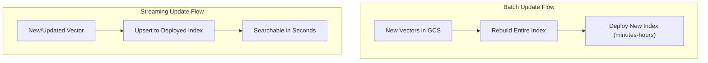

# How to Stream Index Updates to Vertex AI Vector Search for Real-Time Applications

Author: [nawazdhandala](https://www.github.com/nawazdhandala)

Tags: GCP, Vertex AI, Vector Search, Streaming Updates, Real-Time Search

Description: Learn how to stream index updates to Vertex AI Vector Search to keep your similarity search results fresh for real-time applications.

---

A product catalog changes throughout the day. New items get listed, prices update, items go out of stock. If your recommendation system relies on vector search but only rebuilds the index once a day, your users see stale results for hours. Streaming index updates solve this by letting you add, update, and remove vectors from a deployed index without rebuilding the entire thing.

Vertex AI Vector Search supports two types of updates: batch updates that rebuild the index from scratch and streaming updates that modify the index incrementally. This guide focuses on the streaming approach for keeping your index fresh in near-real-time.

## Batch vs Streaming Updates

Batch updates are the simpler approach. You upload a new set of vectors to GCS and trigger an index rebuild. The problem is that rebuilding a large index takes minutes to hours, and during that time your index serves the old data.

Streaming updates let you insert, update, or delete individual vectors from a deployed index. Changes become searchable within seconds. The trade-off is slightly lower recall compared to a freshly built batch index, because the streaming updates use an append-based structure that gets compacted periodically.



## Creating an Index with Streaming Enabled

To use streaming updates, your index must be created with the streaming update feature enabled.

This code creates a streaming-enabled index:

```python
from google.cloud import aiplatform

aiplatform.init(project="your-project-id", location="us-central1")

# Create the index with streaming updates enabled
index = aiplatform.MatchingEngineIndex.create_tree_ah_index(
    display_name="product-embeddings-streaming",
    contents_delta_uri="gs://your-bucket/initial-vectors/",  # Initial vector data
    dimensions=768,
    approximate_neighbors_count=150,
    distance_measure_type="DOT_PRODUCT_DISTANCE",
    leaf_node_embedding_count=1000,
    leaf_nodes_to_search_percent=7,
    description="Product embeddings with streaming updates",
    # Enable streaming updates
    index_update_method="STREAM_UPDATE"
)

print(f"Index created: {index.resource_name}")

# Create an endpoint and deploy
endpoint = aiplatform.MatchingEngineIndexEndpoint.create(
    display_name="product-search-streaming",
    public_endpoint_enabled=True
)

endpoint.deploy_index(
    index=index,
    deployed_index_id="products_streaming_v1",
    display_name="Products Streaming v1",
    machine_type="e2-standard-16",
    min_replica_count=1,
    max_replica_count=3
)

print(f"Deployed to: {endpoint.resource_name}")
```

## Upserting Vectors

To add or update vectors in the index, use the upsert operation. If a vector with the same ID already exists, it gets replaced.

This code upserts vectors to the deployed index:

```python
from google.cloud import aiplatform_v1
import numpy as np

def upsert_vectors(project_id, location, index_id, vectors):
    """Upsert vectors to a streaming-enabled Vector Search index.

    Args:
        project_id: GCP project ID
        location: GCP region
        index_id: The index resource ID
        vectors: List of dicts with 'id', 'embedding', and optional 'restricts'
    """
    # Create the client
    client = aiplatform_v1.IndexServiceClient(
        client_options={"api_endpoint": f"{location}-aiplatform.googleapis.com"}
    )

    index_name = f"projects/{project_id}/locations/{location}/indexes/{index_id}"

    # Build the upsert datapoints
    datapoints = []
    for v in vectors:
        dp = aiplatform_v1.IndexDatapoint(
            datapoint_id=v["id"],
            feature_vector=v["embedding"]
        )

        # Add restricts (filters) if provided
        if "restricts" in v:
            dp.restricts = [
                aiplatform_v1.IndexDatapoint.Restriction(
                    namespace=r["namespace"],
                    allow_list=r.get("allow_list", [])
                )
                for r in v["restricts"]
            ]

        datapoints.append(dp)

    # Execute the upsert
    request = aiplatform_v1.UpsertDatapointsRequest(
        index=index_name,
        datapoints=datapoints
    )

    client.upsert_datapoints(request=request)
    print(f"Upserted {len(datapoints)} vectors")

# Example: upsert new product embeddings
new_products = [
    {
        "id": "product_new_001",
        "embedding": np.random.randn(768).astype(np.float32).tolist(),
        "restricts": [
            {"namespace": "category", "allow_list": ["electronics"]},
            {"namespace": "in_stock", "allow_list": ["true"]}
        ]
    },
    {
        "id": "product_new_002",
        "embedding": np.random.randn(768).astype(np.float32).tolist(),
        "restricts": [
            {"namespace": "category", "allow_list": ["clothing"]},
            {"namespace": "in_stock", "allow_list": ["true"]}
        ]
    }
]

upsert_vectors(
    project_id="your-project-id",
    location="us-central1",
    index_id="YOUR_INDEX_ID",
    vectors=new_products
)
```

## Removing Vectors

When products are discontinued or content is deleted, remove the corresponding vectors from the index.

This code removes vectors by their IDs:

```python
def remove_vectors(project_id, location, index_id, datapoint_ids):
    """Remove vectors from a streaming-enabled index.

    Args:
        project_id: GCP project ID
        location: GCP region
        index_id: The index resource ID
        datapoint_ids: List of vector IDs to remove
    """
    client = aiplatform_v1.IndexServiceClient(
        client_options={"api_endpoint": f"{location}-aiplatform.googleapis.com"}
    )

    index_name = f"projects/{project_id}/locations/{location}/indexes/{index_id}"

    request = aiplatform_v1.RemoveDatapointsRequest(
        index=index_name,
        datapoint_ids=datapoint_ids
    )

    client.remove_datapoints(request=request)
    print(f"Removed {len(datapoint_ids)} vectors")

# Remove discontinued products
remove_vectors(
    project_id="your-project-id",
    location="us-central1",
    index_id="YOUR_INDEX_ID",
    datapoint_ids=["product_old_001", "product_old_002", "product_old_003"]
)
```

## Building a Streaming Pipeline

For production use, you want to automatically update the index as your data changes. Here is a pipeline that listens for changes via Pub/Sub and streams updates to the vector search index.

This Cloud Function processes product update events and updates the index:

```python
# stream_updater.py - Cloud Function for streaming vector updates

import functions_framework
import json
import base64
import numpy as np
from google.cloud import aiplatform_v1

# Initialize the client once
INDEX_CLIENT = aiplatform_v1.IndexServiceClient(
    client_options={"api_endpoint": "us-central1-aiplatform.googleapis.com"}
)

INDEX_NAME = "projects/your-project-id/locations/us-central1/indexes/YOUR_INDEX_ID"

# Your embedding model (loaded once)
embedding_model = None

def get_embedding_model():
    """Lazy-load the embedding model."""
    global embedding_model
    if embedding_model is None:
        from sentence_transformers import SentenceTransformer
        embedding_model = SentenceTransformer("all-MiniLM-L6-v2")
    return embedding_model

@functions_framework.cloud_event
def process_product_event(cloud_event):
    """Process a product update event from Pub/Sub."""

    # Decode the Pub/Sub message
    message_data = base64.b64decode(cloud_event.data["message"]["data"])
    event = json.loads(message_data)

    event_type = event.get("type")
    product_id = event.get("product_id")

    if event_type == "product_created" or event_type == "product_updated":
        # Generate embedding from product description
        model = get_embedding_model()
        text = f"{event['title']} {event['description']} {event.get('category', '')}"
        embedding = model.encode(text).tolist()

        # Build the datapoint
        datapoint = aiplatform_v1.IndexDatapoint(
            datapoint_id=product_id,
            feature_vector=embedding,
            restricts=[
                aiplatform_v1.IndexDatapoint.Restriction(
                    namespace="category",
                    allow_list=[event.get("category", "uncategorized")]
                ),
                aiplatform_v1.IndexDatapoint.Restriction(
                    namespace="in_stock",
                    allow_list=["true" if event.get("in_stock") else "false"]
                )
            ]
        )

        # Upsert to the index
        INDEX_CLIENT.upsert_datapoints(
            request=aiplatform_v1.UpsertDatapointsRequest(
                index=INDEX_NAME,
                datapoints=[datapoint]
            )
        )
        print(f"Upserted vector for product {product_id}")

    elif event_type == "product_deleted":
        # Remove from the index
        INDEX_CLIENT.remove_datapoints(
            request=aiplatform_v1.RemoveDatapointsRequest(
                index=INDEX_NAME,
                datapoint_ids=[product_id]
            )
        )
        print(f"Removed vector for product {product_id}")
```

## Batch Upserts for Efficiency

When processing many updates, batch them together rather than making individual API calls. The upsert API accepts up to 10,000 datapoints per call.

This code batches updates for better throughput:

```python
def batch_upsert(project_id, location, index_id, vectors, batch_size=1000):
    """Upsert vectors in batches for better throughput.

    The API accepts up to 10,000 datapoints per call,
    but 1,000 per batch is a good balance of throughput and reliability.
    """
    client = aiplatform_v1.IndexServiceClient(
        client_options={"api_endpoint": f"{location}-aiplatform.googleapis.com"}
    )

    index_name = f"projects/{project_id}/locations/{location}/indexes/{index_id}"
    total = len(vectors)

    for i in range(0, total, batch_size):
        batch = vectors[i:i + batch_size]

        datapoints = [
            aiplatform_v1.IndexDatapoint(
                datapoint_id=v["id"],
                feature_vector=v["embedding"]
            )
            for v in batch
        ]

        client.upsert_datapoints(
            request=aiplatform_v1.UpsertDatapointsRequest(
                index=index_name,
                datapoints=datapoints
            )
        )

        processed = min(i + batch_size, total)
        print(f"Upserted {processed}/{total} vectors")
```

## Monitoring Index Health

After streaming many updates, monitor the index to ensure search quality has not degraded.

```python
def check_index_stats(project_id, location, index_id):
    """Check the current state of a streaming index."""
    client = aiplatform_v1.IndexServiceClient(
        client_options={"api_endpoint": f"{location}-aiplatform.googleapis.com"}
    )

    index_name = f"projects/{project_id}/locations/{location}/indexes/{index_id}"
    index = client.get_index(name=index_name)

    print(f"Index: {index.display_name}")
    print(f"  State: {index.index_stats}")
    print(f"  Update time: {index.update_time}")
    print(f"  Vectors count: {index.index_stats.vectors_count}")
    print(f"  Shards count: {index.index_stats.shards_count}")

    return index.index_stats
```

## Periodic Index Compaction

Streaming updates create an append-based structure that can fragment over time. Schedule periodic batch rebuilds to compact the index and maintain optimal search quality.

```python
def schedule_compaction(project_id, location, index_id, vectors_gcs_uri):
    """Trigger a batch update to compact the streaming index.

    Run this weekly or when recall metrics degrade.
    """
    client = aiplatform_v1.IndexServiceClient(
        client_options={"api_endpoint": f"{location}-aiplatform.googleapis.com"}
    )

    index_name = f"projects/{project_id}/locations/{location}/indexes/{index_id}"

    # Export current vectors to GCS, then rebuild
    # This replaces the fragmented streaming data with a clean batch index
    operation = client.update_index(
        index=aiplatform_v1.Index(
            name=index_name,
            metadata={
                "contentsDeltaUri": vectors_gcs_uri,
                "isCompleteOverwrite": True  # Replace all data
            }
        )
    )

    print(f"Compaction started: {operation.operation.name}")
    return operation
```

Streaming index updates let you keep your vector search results fresh without the latency of full index rebuilds. The combination of real-time upserts for individual changes and periodic batch compaction for index health gives you the best of both worlds - fresh results and optimal search quality.
