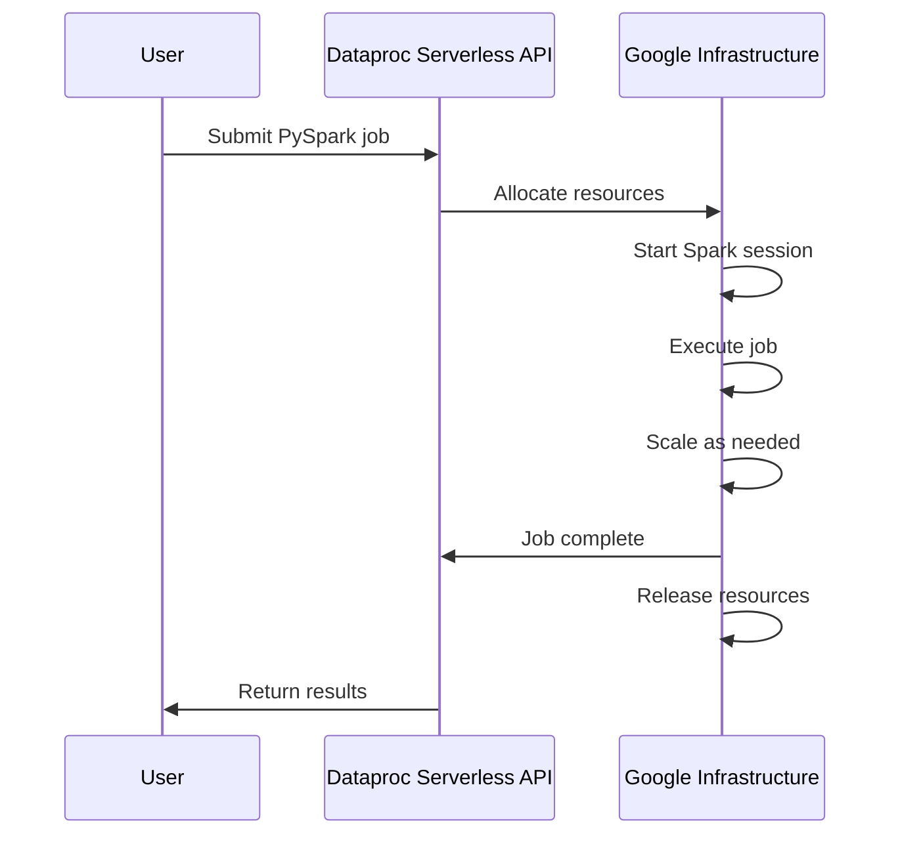

# How to Submit a PySpark Job to Dataproc Serverless for Batch Processing

Author: [nawazdhandala](https://www.github.com/nawazdhandala)

Tags: GCP, Google Cloud Dataproc, Serverless, PySpark, Batch Processing

Description: Submit PySpark batch jobs to Dataproc Serverless without managing clusters, with automatic resource allocation, scaling, and infrastructure management.

---

Managing Dataproc clusters is operational overhead. You create a cluster, submit a job, wait for it to finish, then delete the cluster. Or worse, you keep a cluster running 24/7 for jobs that run a few times a day. Dataproc Serverless eliminates this entirely. You submit a PySpark job, and Google handles everything else - provisioning, scaling, teardown.

I switched several batch processing pipelines from cluster-based Dataproc to Serverless and the reduction in operational complexity was significant. No more cluster lifecycle management, no more idle cluster costs, no more capacity planning.

## How Dataproc Serverless Works

When you submit a batch job to Dataproc Serverless, the service allocates compute resources on demand, runs your job, and releases the resources when the job completes. You do not manage clusters, workers, or scaling. You pay only for the compute time your job actually uses.



## Prerequisites

Before submitting your first serverless batch job, set up the required networking.

```bash
# Create a subnet with Private Google Access enabled
# (required for Dataproc Serverless)
gcloud compute networks subnets update default \
  --region=us-central1 \
  --enable-private-ip-google-access

# Or create a dedicated subnet
gcloud compute networks subnets create dataproc-serverless \
  --network=default \
  --region=us-central1 \
  --range=10.0.0.0/24 \
  --enable-private-ip-google-access
```

Dataproc Serverless requires Private Google Access because the Spark executors do not have external IP addresses.

## Submitting a Basic PySpark Job

Here is the simplest way to submit a PySpark batch job.

```bash
# Submit a PySpark job to Dataproc Serverless
gcloud dataproc batches submit pyspark \
  gs://my-bucket/jobs/daily_etl.py \
  --region=us-central1 \
  --subnet=default \
  --service-account=my-sa@my-project.iam.gserviceaccount.com \
  -- --input-path=gs://my-bucket/data/raw/ \
     --output-path=gs://my-bucket/data/processed/ \
     --date=2026-02-17
```

Everything after the `--` is passed as arguments to your PySpark script.

## Writing a PySpark Batch Job

Here is a complete PySpark job that reads raw data from GCS, transforms it, and writes the results back.

```python
# daily_etl.py - Daily ETL batch job for Dataproc Serverless
import argparse
from pyspark.sql import SparkSession
from pyspark.sql import functions as F
from pyspark.sql.types import StructType, StructField, StringType, DoubleType, TimestampType

def main():
    # Parse command line arguments
    parser = argparse.ArgumentParser(description="Daily ETL job")
    parser.add_argument("--input-path", required=True, help="GCS path to raw data")
    parser.add_argument("--output-path", required=True, help="GCS path for processed data")
    parser.add_argument("--date", required=True, help="Processing date in YYYY-MM-DD format")
    args = parser.parse_args()

    # Create Spark session - no need to configure master URL
    # Dataproc Serverless handles that automatically
    spark = SparkSession.builder \
        .appName(f"DailyETL-{args.date}") \
        .getOrCreate()

    print(f"Processing data for date: {args.date}")

    # Read raw events from GCS
    raw_events = spark.read.json(
        f"{args.input_path}/{args.date}/*.json"
    )

    print(f"Read {raw_events.count()} raw events")

    # Clean and transform the data
    processed = raw_events \
        .filter(F.col("event_id").isNotNull()) \
        .filter(F.col("timestamp").isNotNull()) \
        .withColumn("event_date", F.to_date(F.col("timestamp"))) \
        .withColumn("event_hour", F.hour(F.col("timestamp"))) \
        .withColumn("user_id", F.coalesce(F.col("user_id"), F.lit("anonymous"))) \
        .dropDuplicates(["event_id"])

    # Compute aggregates
    hourly_stats = processed.groupBy("event_date", "event_hour", "event_type") \
        .agg(
            F.count("*").alias("event_count"),
            F.countDistinct("user_id").alias("unique_users"),
            F.avg("duration_ms").alias("avg_duration_ms")
        )

    # Write processed events as Parquet
    processed.write \
        .mode("overwrite") \
        .partitionBy("event_date") \
        .parquet(f"{args.output_path}/events/")

    # Write hourly stats
    hourly_stats.write \
        .mode("overwrite") \
        .partitionBy("event_date") \
        .parquet(f"{args.output_path}/hourly_stats/")

    print(f"Processed {processed.count()} events into {args.output_path}")

    spark.stop()

if __name__ == "__main__":
    main()
```

## Configuring Resources

Dataproc Serverless autoscales automatically, but you can set bounds and configure executor specifications.

```bash
# Submit with custom resource configuration
gcloud dataproc batches submit pyspark \
  gs://my-bucket/jobs/daily_etl.py \
  --region=us-central1 \
  --subnet=default \
  --service-account=my-sa@my-project.iam.gserviceaccount.com \
  --properties="\
spark.executor.instances=10,\
spark.executor.cores=4,\
spark.executor.memory=8g,\
spark.driver.cores=4,\
spark.driver.memory=8g,\
spark.dynamicAllocation.initialExecutors=5,\
spark.dynamicAllocation.minExecutors=2,\
spark.dynamicAllocation.maxExecutors=50" \
  -- --input-path=gs://my-bucket/data/raw/ \
     --output-path=gs://my-bucket/data/processed/ \
     --date=2026-02-17
```

Spark dynamic allocation is enabled by default in Dataproc Serverless. The service starts with an initial number of executors and scales up or down based on the workload.

## Adding Python Dependencies

Your PySpark job might need additional Python packages. There are several ways to include them.

```bash
# Option 1: Specify packages via properties
gcloud dataproc batches submit pyspark \
  gs://my-bucket/jobs/ml_pipeline.py \
  --region=us-central1 \
  --subnet=default \
  --service-account=my-sa@my-project.iam.gserviceaccount.com \
  --py-files=gs://my-bucket/jobs/utils.py \
  --properties="\
spark.submit.pyFiles=gs://my-bucket/libs/my_library.zip"

# Option 2: Use a custom container (covered in a separate post)

# Option 3: Bundle dependencies in a zip file
# Create the zip locally:
# pip install -t deps/ pandas scikit-learn
# cd deps && zip -r ../my-deps.zip . && cd ..
gcloud dataproc batches submit pyspark \
  gs://my-bucket/jobs/ml_pipeline.py \
  --region=us-central1 \
  --subnet=default \
  --py-files=gs://my-bucket/libs/my-deps.zip
```

## Writing Results to BigQuery

A common pattern is reading from GCS and writing to BigQuery.

```python
# pyspark_to_bigquery.py - Read from GCS, write to BigQuery
from pyspark.sql import SparkSession
from pyspark.sql import functions as F

def main():
    spark = SparkSession.builder \
        .appName("GCS-to-BigQuery") \
        .getOrCreate()

    # Read raw data from GCS
    raw_data = spark.read.parquet("gs://my-bucket/data/raw/")

    # Transform the data
    transformed = raw_data \
        .withColumn("processed_at", F.current_timestamp()) \
        .withColumn("revenue_usd",
            F.when(F.col("currency") == "EUR", F.col("amount") * 1.08)
            .when(F.col("currency") == "GBP", F.col("amount") * 1.27)
            .otherwise(F.col("amount")))

    # Write to BigQuery using the Spark BigQuery connector
    transformed.write \
        .format("bigquery") \
        .option("table", "my-project.analytics.transactions") \
        .option("temporaryGcsBucket", "my-bucket-temp") \
        .mode("append") \
        .save()

    print("Data written to BigQuery successfully")
    spark.stop()

if __name__ == "__main__":
    main()
```

Submit with the BigQuery connector.

```bash
# Submit with BigQuery connector
gcloud dataproc batches submit pyspark \
  gs://my-bucket/jobs/pyspark_to_bigquery.py \
  --region=us-central1 \
  --subnet=default \
  --service-account=my-sa@my-project.iam.gserviceaccount.com \
  --jars=gs://spark-lib/bigquery/spark-bigquery-with-dependencies_2.12-0.32.2.jar
```

## Monitoring Batch Jobs

Check the status of your batch jobs.

```bash
# List recent batch jobs
gcloud dataproc batches list --region=us-central1

# Get details of a specific batch
gcloud dataproc batches describe BATCH_ID --region=us-central1

# View the Spark UI for a running or completed batch
# The output includes a link to the Spark History Server
gcloud dataproc batches describe BATCH_ID \
  --region=us-central1 \
  --format="value(runtimeInfo.endpoints)"
```

## Scheduling with Cloud Composer

For recurring batch jobs, use Cloud Composer (Airflow) to schedule submissions.

```python
# Airflow DAG for scheduling a Dataproc Serverless batch job
from airflow import DAG
from airflow.providers.google.cloud.operators.dataproc import (
    DataprocCreateBatchOperator,
)
from datetime import datetime, timedelta

default_args = {
    "owner": "data-team",
    "retries": 2,
    "retry_delay": timedelta(minutes=5),
}

with DAG(
    dag_id="daily_etl_serverless",
    default_args=default_args,
    schedule_interval="0 2 * * *",  # Run at 2 AM daily
    start_date=datetime(2026, 2, 1),
    catchup=False,
) as dag:

    submit_batch = DataprocCreateBatchOperator(
        task_id="submit_daily_etl",
        project_id="my-project",
        region="us-central1",
        batch={
            "pyspark_batch": {
                "main_python_file_uri": "gs://my-bucket/jobs/daily_etl.py",
                "args": [
                    "--input-path", "gs://my-bucket/data/raw/",
                    "--output-path", "gs://my-bucket/data/processed/",
                    "--date", "{{ ds }}",  # Airflow template for execution date
                ],
                "jar_file_uris": [
                    "gs://spark-lib/bigquery/spark-bigquery-with-dependencies_2.12-0.32.2.jar"
                ],
            },
            "runtime_config": {
                "properties": {
                    "spark.executor.instances": "10",
                    "spark.executor.memory": "8g",
                }
            },
            "environment_config": {
                "execution_config": {
                    "service_account": "my-sa@my-project.iam.gserviceaccount.com",
                    "subnetwork_uri": "default",
                }
            },
        },
        batch_id=f"daily-etl-{{{{ ds_nodash }}}}",
    )
```

## Cost Comparison

Dataproc Serverless charges per vCPU-hour and GB-hour of memory used. For batch jobs that run for fixed periods, compare the cost against a cluster-based approach.

A job that uses 10 executors with 4 cores each for 30 minutes costs about the same as running a 10-worker Dataproc cluster for 30 minutes. The savings come from not paying for idle time. With clusters, you often pay for startup and teardown time. With Serverless, you pay only for actual compute time.

Dataproc Serverless is the right choice for batch PySpark jobs that run periodically or on demand. It removes the operational burden of cluster management and lets you focus on the actual data processing logic.
