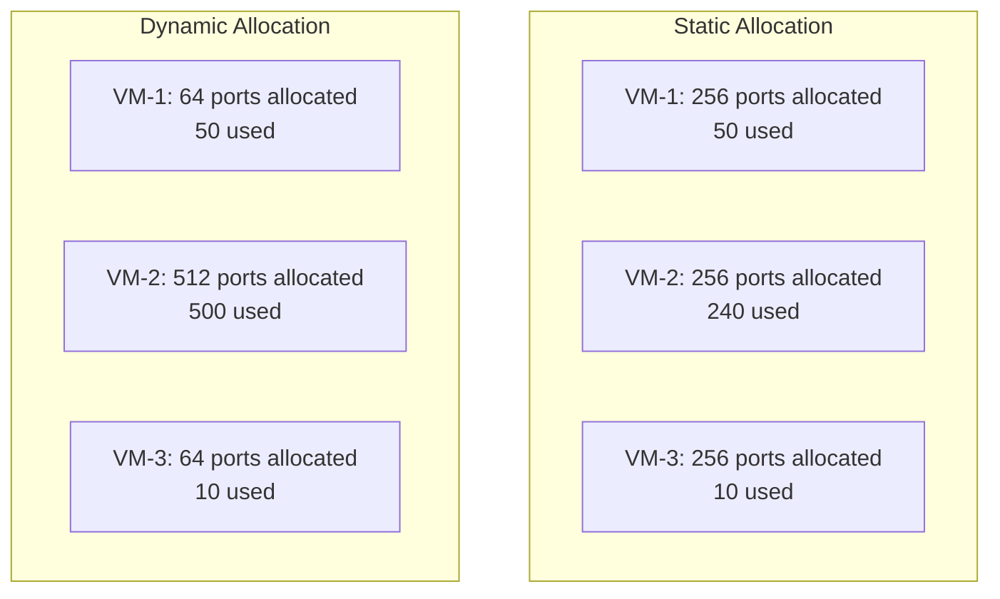

# How to Switch from Static to Dynamic Port Allocation on Cloud NAT in GCP

Author: [nawazdhandala](https://www.github.com/nawazdhandala)

Tags: GCP, Cloud NAT, Port Allocation, Networking, Performance

Description: Migrate your Cloud NAT gateway from static to dynamic port allocation to improve port utilization, reduce exhaustion errors, and handle variable workloads efficiently.

---

When you first set up Cloud NAT, it uses static port allocation by default. Each VM gets a fixed number of ports regardless of how many it actually needs. This works fine for predictable workloads, but causes problems when some VMs need lots of outbound connections while others barely use any. Dynamic port allocation solves this by letting VMs borrow ports from a shared pool as needed. Switching over is straightforward, but there are a few things to know before you flip the switch.

## Static vs Dynamic Port Allocation

Here is how the two models compare:

**Static allocation:** Each VM gets exactly `min-ports-per-vm` ports. If a VM needs more, it is out of luck. If a VM needs fewer, those ports sit unused.

**Dynamic allocation:** Each VM starts with `min-ports-per-vm` ports and can grow up to `max-ports-per-vm` as needed. Unused ports are returned to the shared pool.



In the static example, VM-2 might hit port exhaustion while VM-1 and VM-3 waste most of their allocation. Dynamic allocation fixes this imbalance automatically.

## When to Switch to Dynamic Allocation

Consider switching if you are experiencing any of these:

- Port exhaustion errors (`OUT_OF_RESOURCES`) on some VMs while others are barely using ports
- You have diverse workloads with very different connection patterns (some VMs need 50 connections, others need 5,000)
- You are paying for extra NAT IPs just because static allocation wastes ports
- Autoscaling groups where the number of VMs fluctuates, making static allocation planning difficult

## Prerequisites

Before switching, check your current setup:

```bash
# Describe your current NAT configuration
gcloud compute routers nats describe your-nat-gateway \
  --router=your-router \
  --region=us-central1 \
  --project=your-project-id \
  --format=yaml
```

Note the current values for:
- `minPortsPerVm` - current static allocation per VM
- `natIpAllocateOption` - whether using static or auto-allocated IPs
- `sourceSubnetworkIpRangesToNat` - which subnets are covered

## Step 1: Choose Your Min and Max Port Values

For dynamic allocation, you need to set both a minimum and maximum:

- **min-ports-per-vm:** The guaranteed minimum ports each VM always has. Set this to a value that covers the baseline connection needs of most VMs. Must be a power of 2.
- **max-ports-per-vm:** The maximum ports a single VM can use. Set this high enough for your most demanding workloads. Must also be a power of 2.

Common configurations:

| Workload Type | Min Ports | Max Ports |
|--------------|-----------|-----------|
| Web servers with light external calls | 32 | 512 |
| Microservices calling external APIs | 64 | 2048 |
| Data pipelines with heavy external I/O | 128 | 4096 |
| Mixed workloads (safe default) | 64 | 4096 |

## Step 2: Enable Dynamic Port Allocation

Run the update command:

```bash
# Switch from static to dynamic port allocation
gcloud compute routers nats update your-nat-gateway \
  --router=your-router \
  --region=us-central1 \
  --enable-dynamic-port-allocation \
  --min-ports-per-vm=64 \
  --max-ports-per-vm=4096 \
  --project=your-project-id
```

This change takes effect within a few minutes. Existing connections are not disrupted - the new allocation applies to new port assignments.

## Step 3: Verify the Change

Confirm that dynamic port allocation is active:

```bash
# Verify the updated NAT configuration
gcloud compute routers nats describe your-nat-gateway \
  --router=your-router \
  --region=us-central1 \
  --project=your-project-id \
  --format="yaml(enableDynamicPortAllocation, minPortsPerVm, maxPortsPerVm)"
```

You should see `enableDynamicPortAllocation: true` in the output.

## Step 4: Enable Logging to Monitor the Change

If logging is not already enabled, turn it on to monitor how dynamic allocation is performing:

```bash
# Enable comprehensive NAT logging
gcloud compute routers nats update your-nat-gateway \
  --router=your-router \
  --region=us-central1 \
  --enable-logging \
  --log-filter=ALL \
  --project=your-project-id
```

## Step 5: Monitor Port Usage After the Switch

Watch port allocation patterns over the next few days:

```bash
# Check for any remaining port exhaustion after switching to dynamic allocation
gcloud logging read \
  'resource.type="nat_gateway" AND resource.labels.gateway_name="your-nat-gateway" AND jsonPayload.allocation_status="DROPPED"' \
  --project=your-project-id \
  --freshness=24h \
  --format="table(timestamp, jsonPayload.connection.src_ip)"
```

If you still see dropped connections, your `max-ports-per-vm` might be too low or you need more NAT IP addresses.

Look at per-VM port consumption to understand the distribution:

```bash
# View NAT translation logs to see port usage per VM
gcloud logging read \
  'resource.type="nat_gateway" AND resource.labels.gateway_name="your-nat-gateway" AND jsonPayload.allocation_status="OK"' \
  --project=your-project-id \
  --limit=50 \
  --format="table(jsonPayload.connection.src_ip, jsonPayload.connection.dest_ip, jsonPayload.allocation_status)"
```

## How Dynamic Allocation Works Internally

Understanding the internal mechanics helps you set good values:

1. When a VM starts, it gets `min-ports-per-vm` ports allocated
2. As the VM opens more connections and approaches its current allocation, Cloud NAT increases the allocation in increments (powers of 2)
3. The allocation can grow up to `max-ports-per-vm`
4. When connections close and port usage drops, the allocation shrinks back down after a cooldown period
5. Freed ports return to the shared pool for other VMs

The scale-up is fast (happens when ports are needed), but scale-down is conservative (happens after a delay to avoid thrashing).

## Handling the Endpoint-Independent Mapping Change

There is an important behavioral difference: dynamic port allocation uses endpoint-dependent mapping, while static allocation uses endpoint-independent mapping.

**Endpoint-independent mapping (static):** A VM always uses the same NAT IP and port for all connections from a given internal IP and port, regardless of the destination.

**Endpoint-dependent mapping (dynamic):** Different connections from the same internal IP and port can use different NAT IPs and ports depending on the destination.

This matters for:
- Applications that depend on the same external IP for all connections (some third-party allowlists)
- Protocols that establish multiple related connections (like FTP active mode)
- WebRTC and some P2P protocols

If your workload depends on endpoint-independent mapping, test thoroughly before switching to dynamic allocation in production.

## Rolling Back If Needed

If dynamic allocation causes issues, you can switch back to static:

```bash
# Revert to static port allocation
gcloud compute routers nats update your-nat-gateway \
  --router=your-router \
  --region=us-central1 \
  --no-enable-dynamic-port-allocation \
  --min-ports-per-vm=256 \
  --project=your-project-id
```

## Adjusting After the Switch

You might need to tune your settings after observing real traffic:

```bash
# If VMs are still hitting max allocation, increase the max
gcloud compute routers nats update your-nat-gateway \
  --router=your-router \
  --region=us-central1 \
  --max-ports-per-vm=8192 \
  --project=your-project-id

# If most VMs need more than the minimum, raise the minimum
gcloud compute routers nats update your-nat-gateway \
  --router=your-router \
  --region=us-central1 \
  --min-ports-per-vm=128 \
  --project=your-project-id
```

## Combining with Other Optimizations

For the best results, combine dynamic allocation with:

```bash
# Reduce TCP TIME_WAIT to free ports faster
gcloud compute routers nats update your-nat-gateway \
  --router=your-router \
  --region=us-central1 \
  --tcp-time-wait-timeout=30 \
  --project=your-project-id

# Reduce idle connection timeout
gcloud compute routers nats update your-nat-gateway \
  --router=your-router \
  --region=us-central1 \
  --tcp-established-idle-timeout=600 \
  --project=your-project-id
```

These tweaks work together with dynamic allocation to maximize port availability.

## Wrapping Up

Switching from static to dynamic port allocation is one of the most impactful changes you can make to improve Cloud NAT reliability. It eliminates the waste of static allocation and adapts to your actual traffic patterns. The migration itself is a single command with no downtime. Just be aware of the endpoint-dependent mapping change and test if your applications rely on consistent NAT IP and port pairs. For most workloads, dynamic allocation is strictly better than static, and it should be the default choice for new Cloud NAT gateways.
