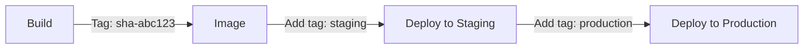

# How to Tag and Manage Docker Image Versions in Artifact Registry

Author: [nawazdhandala](https://www.github.com/nawazdhandala)

Tags: GCP, Artifact Registry, Docker, Image Tagging, Version Management, DevOps

Description: Learn best practices for tagging and managing Docker image versions in Google Artifact Registry, including tagging strategies and lifecycle management.

---

How you tag your Docker images matters more than most people think. Poor tagging practices lead to confusion about what is running in production, difficulty rolling back, and wasted storage. Artifact Registry gives you the tools to manage tags and versions effectively, but you need a good strategy to make the most of them.

Let me share the tagging patterns that work well and how to manage image versions in Artifact Registry.

## Understanding Tags vs Digests

Before diving into strategies, it is important to understand the difference between tags and digests.

A **tag** is a human-readable label like `v1.0.0` or `latest`. Tags are mutable by default - you can point them to a different image at any time.

A **digest** is a content-addressable hash like `sha256:abc123...`. Digests are immutable - they always refer to the exact same image content.

```bash
# Pull by tag (could change over time)
docker pull us-central1-docker.pkg.dev/my-project/my-repo/my-app:v1.0.0

# Pull by digest (always the same image)
docker pull us-central1-docker.pkg.dev/my-project/my-repo/my-app@sha256:abc123def456...
```

## Tagging Strategies

### Semantic Versioning

The most common approach for release images:

```bash
# Tag with full semantic version
docker tag my-app:local \
  us-central1-docker.pkg.dev/my-project/my-repo/my-app:1.2.3

# Also tag with major.minor for automatic patch updates
docker tag my-app:local \
  us-central1-docker.pkg.dev/my-project/my-repo/my-app:1.2

# And major only for those who want the latest in that major version
docker tag my-app:local \
  us-central1-docker.pkg.dev/my-project/my-repo/my-app:1

# Push all tags
docker push us-central1-docker.pkg.dev/my-project/my-repo/my-app:1.2.3
docker push us-central1-docker.pkg.dev/my-project/my-repo/my-app:1.2
docker push us-central1-docker.pkg.dev/my-project/my-repo/my-app:1
```

### Git SHA Tagging

For CI/CD pipelines, tag with the git commit SHA:

```bash
# Tag with the short commit SHA
docker tag my-app:local \
  us-central1-docker.pkg.dev/my-project/my-repo/my-app:$(git rev-parse --short HEAD)

# Push
docker push us-central1-docker.pkg.dev/my-project/my-repo/my-app:$(git rev-parse --short HEAD)
```

This is great for traceability - you always know exactly which commit produced which image.

### Combined Strategy

The best approach combines both:

```yaml
# cloudbuild.yaml - Multiple tagging strategy
steps:
  - name: 'gcr.io/cloud-builders/docker'
    args:
      - 'build'
      # Tag with commit SHA for traceability
      - '-t'
      - 'us-central1-docker.pkg.dev/$PROJECT_ID/my-repo/my-app:$SHORT_SHA'
      # Tag with branch name for easy reference
      - '-t'
      - 'us-central1-docker.pkg.dev/$PROJECT_ID/my-repo/my-app:$BRANCH_NAME'
      # Tag with build number
      - '-t'
      - 'us-central1-docker.pkg.dev/$PROJECT_ID/my-repo/my-app:build-$BUILD_ID'
      - '.'

images:
  - 'us-central1-docker.pkg.dev/$PROJECT_ID/my-repo/my-app:$SHORT_SHA'
  - 'us-central1-docker.pkg.dev/$PROJECT_ID/my-repo/my-app:$BRANCH_NAME'
  - 'us-central1-docker.pkg.dev/$PROJECT_ID/my-repo/my-app:build-$BUILD_ID'
```

## Managing Tags with gcloud

### Listing Tags

```bash
# List all tags for an image
gcloud artifacts docker tags list \
  us-central1-docker.pkg.dev/my-project/my-repo/my-app \
  --project=my-project
```

### Adding Tags to Existing Images

You can add a new tag to an image that is already in the repository:

```bash
# Add a "production" tag to a specific image version
gcloud artifacts docker tags add \
  us-central1-docker.pkg.dev/my-project/my-repo/my-app:abc123f \
  us-central1-docker.pkg.dev/my-project/my-repo/my-app:production
```

This is useful for promoting images between environments without re-pushing:

```bash
# Promote an image from staging to production
gcloud artifacts docker tags add \
  us-central1-docker.pkg.dev/my-project/my-repo/my-app:staging \
  us-central1-docker.pkg.dev/my-project/my-repo/my-app:production
```

### Deleting Tags

```bash
# Remove a tag (the image itself remains if other tags point to it)
gcloud artifacts docker tags delete \
  us-central1-docker.pkg.dev/my-project/my-repo/my-app:old-tag \
  --project=my-project
```

## Immutable Tags

For production repositories, consider enabling immutable tags. This prevents anyone from overwriting a tag once it is pushed:

```bash
# Create a repository with immutable tags
gcloud artifacts repositories create prod-images \
  --repository-format=docker \
  --location=us-central1 \
  --immutable-tags \
  --description="Production images with immutable tags" \
  --project=my-project
```

With immutable tags:
- `docker push my-app:v1.0.0` succeeds the first time
- `docker push my-app:v1.0.0` with a different image fails
- You must use a new tag for each new image

This is a strong guarantee that `v1.0.0` always means exactly the same image.

## Listing Images and Their Details

```bash
# List all images in a repository
gcloud artifacts docker images list \
  us-central1-docker.pkg.dev/my-project/my-repo \
  --project=my-project

# Get detailed info about a specific image
gcloud artifacts docker images describe \
  us-central1-docker.pkg.dev/my-project/my-repo/my-app:v1.0.0 \
  --project=my-project

# Show image details including size and creation time
gcloud artifacts docker images list \
  us-central1-docker.pkg.dev/my-project/my-repo/my-app \
  --include-tags \
  --format="table(package, tags, createTime, updateTime)" \
  --project=my-project
```

## Deleting Images

Delete specific image versions:

```bash
# Delete a specific image by tag
gcloud artifacts docker images delete \
  us-central1-docker.pkg.dev/my-project/my-repo/my-app:old-version \
  --project=my-project

# Delete a specific image by digest
gcloud artifacts docker images delete \
  us-central1-docker.pkg.dev/my-project/my-repo/my-app@sha256:abc123... \
  --project=my-project

# Delete untagged images (orphaned manifests)
gcloud artifacts docker images list \
  us-central1-docker.pkg.dev/my-project/my-repo/my-app \
  --include-tags \
  --filter="NOT tags:*" \
  --format="value(version)" | \
  while read digest; do
    gcloud artifacts docker images delete \
      "us-central1-docker.pkg.dev/my-project/my-repo/my-app@${digest}" \
      --quiet --project=my-project
  done
```

## Tag-Based Deployment Workflow

A common pattern is using tags to represent deployment stages:



In practice:

```bash
# CI/CD builds and pushes with commit SHA tag
# cloudbuild pushes: my-app:abc123f

# Promote to staging
gcloud artifacts docker tags add \
  us-central1-docker.pkg.dev/my-project/my-repo/my-app:abc123f \
  us-central1-docker.pkg.dev/my-project/my-repo/my-app:staging

# After testing, promote to production
gcloud artifacts docker tags add \
  us-central1-docker.pkg.dev/my-project/my-repo/my-app:abc123f \
  us-central1-docker.pkg.dev/my-project/my-repo/my-app:production
```

Your GKE deployments reference the environment tag (`staging` or `production`), and promoting is just a tag operation - no re-push needed.

## Best Practices

1. **Never rely solely on `latest`**. It is ambiguous and you cannot tell what version is actually running. Always have a specific version tag alongside it.

2. **Use immutable tags for production**. This prevents accidental overwrites and gives you confidence in reproducibility.

3. **Include the git SHA in at least one tag**. This makes it easy to trace a running image back to the exact source code that produced it.

4. **Clean up untagged images regularly**. When you re-tag images, the old manifest becomes untagged but still consumes storage.

5. **Automate tag management**. Use Cloud Build and scripts to tag consistently rather than relying on manual processes.

## Wrapping Up

Good image tagging is the foundation of reliable deployments. Use semantic versions for releases, git SHAs for traceability, and environment tags for promotion workflows. Artifact Registry's tag management commands make it easy to add, move, and clean up tags without re-pushing images. Combine this with immutable tags on production repositories and cleanup policies for old images, and you have a solid version management strategy.
