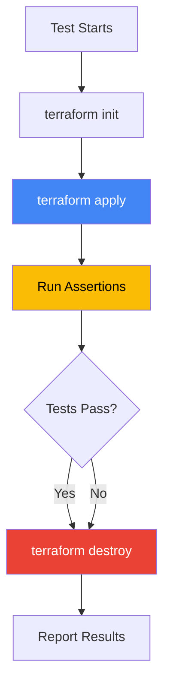

# How to Test Terraform GCP Modules with Terratest and Automated Integration Tests

Author: [nawazdhandala](https://www.github.com/nawazdhandala)

Tags: GCP, Terraform, Terratest, Testing, Infrastructure as Code, DevOps

Description: Test Terraform GCP modules using Terratest for automated integration tests that validate your infrastructure actually works before deploying to production.

---

Writing Terraform modules without tests is like writing application code without tests - it works until it doesn't, and finding out in production is expensive. Terratest is a Go library that lets you write real integration tests for your Terraform modules. It deploys actual infrastructure, validates it works, and tears it down.

This is not unit testing where you mock everything. Terratest creates real GCP resources, checks that they are configured correctly, and destroys them when the test finishes. It takes longer to run, but it catches real problems that static analysis misses.

## Why Terratest?

There are several Terraform testing tools available. Here is why Terratest stands out:

- **Real infrastructure** - It deploys actual resources, so you test what really happens
- **Go-based** - Full programming language for assertions, not limited to HCL
- **Retry logic** - Built-in functions for handling eventual consistency
- **HTTP helpers** - Test HTTP endpoints created by your infrastructure
- **Parallel tests** - Run tests concurrently with automatic resource isolation

## Setting Up

Create a test directory in your Terraform module:

```bash
modules/
  cloud-run/
    main.tf
    variables.tf
    outputs.tf
    test/
      cloud_run_test.go
      go.mod
      go.sum
```

Initialize the Go module for tests:

```bash
cd modules/cloud-run/test
go mod init test
go get github.com/gruntwork-io/terratest/modules/terraform
go get github.com/gruntwork-io/terratest/modules/gcp
go get github.com/gruntwork-io/terratest/modules/http-helper
go get github.com/stretchr/testify/assert
```

## Testing a Cloud Run Module

Let us write tests for a Cloud Run module. We will deploy a real Cloud Run service and verify it is configured correctly.

```go
package test

import (
    "fmt"
    "os"
    "strings"
    "testing"
    "time"

    "github.com/gruntwork-io/terratest/modules/gcp"
    httpHelper "github.com/gruntwork-io/terratest/modules/http-helper"
    "github.com/gruntwork-io/terratest/modules/random"
    "github.com/gruntwork-io/terratest/modules/terraform"
    "github.com/stretchr/testify/assert"
    "github.com/stretchr/testify/require"
)

// TestCloudRunServiceCreation verifies that the module creates a working Cloud Run service
func TestCloudRunServiceCreation(t *testing.T) {
    t.Parallel()

    // Use a unique name to avoid conflicts with parallel tests
    uniqueID := random.UniqueId()
    serviceName := fmt.Sprintf("test-service-%s", strings.ToLower(uniqueID))
    projectID := os.Getenv("GCP_PROJECT_ID")
    region := "us-central1"

    // Configure Terraform options
    terraformOptions := terraform.WithDefaultRetryableErrors(t, &terraform.Options{
        // Point to the module directory (one level up from test/)
        TerraformDir: "../",

        // Set the input variables
        Vars: map[string]interface{}{
            "project_id":   projectID,
            "region":       region,
            "service_name": serviceName,
            "image":        "gcr.io/cloudrun/hello",
            "port":         8080,
            "min_instances": 0,
            "max_instances": 2,
            "cpu":          "1",
            "memory":       "256Mi",
            "allow_unauthenticated": true,
            "env_vars": map[string]string{
                "ENVIRONMENT": "test",
            },
        },

        // Do not prompt for input
        NoColor: true,
    })

    // Destroy resources at the end of the test
    defer terraform.Destroy(t, terraformOptions)

    // Deploy the infrastructure
    terraform.InitAndApply(t, terraformOptions)

    // Get outputs
    serviceURL := terraform.Output(t, terraformOptions, "service_url")
    outputServiceName := terraform.Output(t, terraformOptions, "service_name")

    // Verify the service name matches
    assert.Equal(t, serviceName, outputServiceName)

    // Verify the service URL is not empty
    assert.NotEmpty(t, serviceURL)

    // Verify the service responds to HTTP requests
    // Retry because Cloud Run may take a moment to become ready
    httpHelper.HttpGetWithRetryWithCustomValidation(
        t,
        serviceURL,
        nil, // no custom TLS config
        30,  // max retries
        10*time.Second, // time between retries
        func(status int, body string) bool {
            return status == 200
        },
    )
}
```

## Testing IAM Configuration

Verify that IAM bindings are applied correctly.

```go
// TestCloudRunIAMBindings verifies that IAM policies are set correctly
func TestCloudRunIAMBindings(t *testing.T) {
    t.Parallel()

    uniqueID := random.UniqueId()
    serviceName := fmt.Sprintf("test-iam-%s", strings.ToLower(uniqueID))
    projectID := os.Getenv("GCP_PROJECT_ID")

    testSA := fmt.Sprintf("serviceAccount:test-sa@%s.iam.gserviceaccount.com", projectID)

    terraformOptions := terraform.WithDefaultRetryableErrors(t, &terraform.Options{
        TerraformDir: "../",
        Vars: map[string]interface{}{
            "project_id":             projectID,
            "region":                 "us-central1",
            "service_name":           serviceName,
            "image":                  "gcr.io/cloudrun/hello",
            "allow_unauthenticated":  false,
            "invoker_members": []string{testSA},
        },
    })

    defer terraform.Destroy(t, terraformOptions)
    terraform.InitAndApply(t, terraformOptions)

    // Verify that allUsers is NOT in the invoker role
    // This confirms unauthenticated access is disabled
    serviceID := terraform.Output(t, terraformOptions, "service_id")
    assert.NotEmpty(t, serviceID)

    // Use gcloud to verify IAM policy
    // Terratest's GCP module provides helpers for this
    policy := gcp.GetProjectPolicy(t, projectID)
    _ = policy // In practice, you would check specific bindings
}
```

## Testing VPC Connectivity

For modules that create networking resources, verify the network configuration.

```go
// TestVPCConfiguration verifies that the VPC is configured correctly
func TestVPCConfiguration(t *testing.T) {
    t.Parallel()

    uniqueID := random.UniqueId()
    projectID := os.Getenv("GCP_PROJECT_ID")

    terraformOptions := terraform.WithDefaultRetryableErrors(t, &terraform.Options{
        TerraformDir: "../../network-module",
        Vars: map[string]interface{}{
            "project_id":   projectID,
            "network_name": fmt.Sprintf("test-network-%s", strings.ToLower(uniqueID)),
            "subnet_cidr":  "10.100.0.0/24",
        },
    })

    defer terraform.Destroy(t, terraformOptions)
    terraform.InitAndApply(t, terraformOptions)

    // Verify outputs
    networkName := terraform.Output(t, terraformOptions, "network_name")
    subnetName := terraform.Output(t, terraformOptions, "subnet_name")

    assert.NotEmpty(t, networkName)
    assert.NotEmpty(t, subnetName)

    // Verify the subnet CIDR is correct
    subnetCIDR := terraform.Output(t, terraformOptions, "subnet_cidr")
    assert.Equal(t, "10.100.0.0/24", subnetCIDR)
}
```

## Testing GKE Cluster Module

GKE clusters take longer to create, so these tests have longer timeouts.

```go
// TestGKEClusterCreation verifies the GKE Autopilot cluster module
func TestGKEClusterCreation(t *testing.T) {
    t.Parallel()

    uniqueID := random.UniqueId()
    clusterName := fmt.Sprintf("test-gke-%s", strings.ToLower(uniqueID))
    projectID := os.Getenv("GCP_PROJECT_ID")

    terraformOptions := terraform.WithDefaultRetryableErrors(t, &terraform.Options{
        TerraformDir: "../../gke-module",
        Vars: map[string]interface{}{
            "project_id":   projectID,
            "region":       "us-central1",
            "cluster_name": clusterName,
        },
        // GKE clusters can take 10+ minutes to create
        // Increase the retry timeout accordingly
    })

    defer terraform.Destroy(t, terraformOptions)
    terraform.InitAndApply(t, terraformOptions)

    // Verify the cluster was created
    endpoint := terraform.Output(t, terraformOptions, "cluster_endpoint")
    assert.NotEmpty(t, endpoint)

    // Verify the cluster name
    outputName := terraform.Output(t, terraformOptions, "cluster_name")
    assert.Equal(t, clusterName, outputName)
}
```

## Helper Functions

Create reusable helpers for common test patterns.

```go
// helpers.go

package test

import (
    "os"
    "testing"
)

// getProjectID returns the GCP project ID for testing
func getProjectID(t *testing.T) string {
    t.Helper()
    projectID := os.Getenv("GCP_PROJECT_ID")
    if projectID == "" {
        t.Fatal("GCP_PROJECT_ID environment variable must be set")
    }
    return projectID
}

// getRegion returns the GCP region for testing, with a default
func getRegion() string {
    region := os.Getenv("GCP_REGION")
    if region == "" {
        return "us-central1"
    }
    return region
}

// skipIfShort skips the test if the -short flag is set
// Useful for separating quick validation from full integration tests
func skipIfShort(t *testing.T) {
    t.Helper()
    if testing.Short() {
        t.Skip("Skipping integration test in short mode")
    }
}
```

## Validation Tests (No Infrastructure)

Not every test needs to create real resources. Validation tests check the Terraform configuration without deploying anything.

```go
// TestTerraformValidate checks that the module configuration is valid
func TestTerraformValidate(t *testing.T) {
    t.Parallel()

    terraformOptions := &terraform.Options{
        TerraformDir: "../",
        Vars: map[string]interface{}{
            "project_id":   "test-project",
            "service_name": "test-service",
            "image":        "gcr.io/test/image:latest",
        },
    }

    // Init and validate without applying
    terraform.Init(t, terraformOptions)
    terraform.Validate(t, terraformOptions)
}

// TestTerraformPlan verifies the plan produces expected changes
func TestTerraformPlan(t *testing.T) {
    t.Parallel()

    terraformOptions := &terraform.Options{
        TerraformDir: "../",
        Vars: map[string]interface{}{
            "project_id":   "test-project",
            "service_name": "test-service",
            "image":        "gcr.io/test/image:latest",
        },
        PlanFilePath: "/tmp/tfplan",
    }

    terraform.Init(t, terraformOptions)

    // Get the plan output
    planOutput := terraform.Plan(t, terraformOptions)

    // Verify expected resources are in the plan
    assert.Contains(t, planOutput, "google_cloud_run_v2_service")
}
```

## Running Tests

```bash
# Run all tests
cd modules/cloud-run/test
GCP_PROJECT_ID=my-test-project go test -v -timeout 30m

# Run only validation tests (fast, no infrastructure)
go test -v -short -timeout 5m

# Run a specific test
go test -v -run TestCloudRunServiceCreation -timeout 30m

# Run tests in parallel with a limit on concurrent tests
go test -v -parallel 3 -timeout 60m
```

## Test Lifecycle



## CI Integration

Add Terratest to your CI pipeline to run tests automatically.

```yaml
# cloudbuild/test.yaml
steps:
  - id: 'run-terratest'
    name: 'golang:1.22'
    dir: 'modules/cloud-run/test'
    env:
      - 'GCP_PROJECT_ID=${_TEST_PROJECT_ID}'
      - 'GOPATH=/workspace/go'
    args:
      - 'go'
      - 'test'
      - '-v'
      - '-timeout'
      - '30m'
      - '-parallel'
      - '2'

substitutions:
  _TEST_PROJECT_ID: 'my-test-project'

timeout: '3600s'
```

## Best Practices

1. **Use a dedicated test project** - Never run infrastructure tests against production. Use a separate GCP project.

2. **Clean up on failure** - The `defer terraform.Destroy` pattern ensures resources are cleaned up even when tests fail. Run periodic cleanup scripts as a safety net.

3. **Use unique names** - Terratest's `random.UniqueId()` prevents name collisions when tests run in parallel.

4. **Set appropriate timeouts** - GKE clusters can take 15 minutes to create. Set your test timeout accordingly.

5. **Separate fast and slow tests** - Use the `-short` flag for quick validation tests and run the full suite on a schedule.

6. **Cost awareness** - Integration tests create real resources that cost money. Run them in CI, not on every local save.

## Wrapping Up

Terratest gives you confidence that your Terraform modules actually work. Validation tests catch syntax and configuration errors quickly, while integration tests verify that your infrastructure deploys correctly and functions as expected. The investment in writing these tests pays off the first time you catch a breaking change before it hits production.

For monitoring the infrastructure deployed by your tested Terraform modules, OneUptime provides comprehensive observability that helps you verify your infrastructure stays healthy after deployment.
