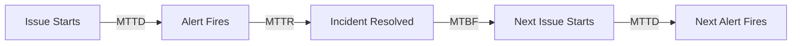

# How to Track Incident Metrics MTTR MTTD and MTBF Using Google Cloud Monitoring Data

Author: [nawazdhandala](https://www.github.com/nawazdhandala)

Tags: GCP, Incident Metrics, MTTR, MTTD, MTBF, Google Cloud Monitoring, SRE

Description: Learn how to calculate and track key incident metrics like MTTR, MTTD, and MTBF using data from Google Cloud Monitoring incidents and alerting.

---

When you are running an on-call rotation and managing incidents week after week, gut feelings about how things are going are not enough. You need numbers. Specifically, you need to track three metrics that tell you how effective your incident response really is: Mean Time to Detect (MTTD), Mean Time to Resolve (MTTR), and Mean Time Between Failures (MTBF).

These metrics are not just for management dashboards. They directly inform whether you need better monitoring (MTTD is too high), better runbooks (MTTR is too high), or better reliability practices (MTBF is too low). Google Cloud Monitoring gives you the raw data you need to calculate all three. This post shows you how.

## Understanding the Metrics

Let me define each metric clearly before we start calculating them.

**MTTD - Mean Time to Detect** is the average time between when an issue starts affecting users and when your monitoring detects it. If your database starts returning errors at 2:00 AM and your alert fires at 2:05 AM, the detection time for that incident is 5 minutes.

**MTTR - Mean Time to Resolve** is the average time between when an incident is detected and when it is resolved. If the alert fires at 2:05 AM and you fix the issue at 2:35 AM, the resolution time is 30 minutes.

**MTBF - Mean Time Between Failures** is the average time between the end of one incident and the start of the next. If you resolved an incident on Monday at 3 PM and the next incident started on Thursday at 10 AM, the time between failures is about 67 hours.

Here is how these metrics relate to the incident lifecycle:



## Extracting Incident Data from Cloud Monitoring

Cloud Monitoring stores incident data that you can access through the API. Each incident has a start time, an acknowledgment time, and an end time. These timestamps are what you need for calculating MTTR and MTTD.

Here is a Python script that pulls incident data from the Cloud Monitoring API:

```python
from google.cloud import monitoring_v3
from datetime import datetime, timedelta
import statistics

def get_incidents(project_id, days_back=30):
    """Fetch all incidents from the last N days."""
    client = monitoring_v3.AlertPolicyServiceClient()
    project_name = f"projects/{project_id}"

    # List all alert policies to get their incidents
    policies = client.list_alert_policies(name=project_name)

    # Use the incidents API to fetch incident history
    # Note: incidents are accessed through the monitoring API
    query_client = monitoring_v3.QueryServiceClient()

    # Fetch incident data from Cloud Logging instead
    # Incidents generate log entries in Cloud Audit Logs
    from google.cloud import logging as cloud_logging

    logging_client = cloud_logging.Client(project=project_id)

    # Query for incident state changes
    filter_str = (
        'resource.type="monitoring_alert_policy" '
        f'timestamp>="{(datetime.utcnow() - timedelta(days=days_back)).isoformat()}Z"'
    )

    incidents = {}
    for entry in logging_client.list_entries(filter_=filter_str):
        payload = entry.payload
        if isinstance(payload, dict):
            incident_id = payload.get("incident", {}).get("incident_id")
            state = payload.get("incident", {}).get("state")
            timestamp = entry.timestamp

            if incident_id not in incidents:
                incidents[incident_id] = {}

            if state == "open":
                incidents[incident_id]["opened"] = timestamp
            elif state == "closed":
                incidents[incident_id]["closed"] = timestamp
            elif state == "acknowledged":
                incidents[incident_id]["acknowledged"] = timestamp

    return incidents
```

## Calculating MTTR

MTTR is the most commonly tracked incident metric. To calculate it from Cloud Monitoring data, subtract the incident open time from the incident close time for each incident, then take the average.

```python
def calculate_mttr(incidents):
    """Calculate Mean Time to Resolve from incident data."""
    resolution_times = []

    for incident_id, times in incidents.items():
        opened = times.get("opened")
        closed = times.get("closed")

        # Skip incidents that are still open or missing data
        if not opened or not closed:
            continue

        resolution_time = (closed - opened).total_seconds() / 60  # in minutes
        resolution_times.append(resolution_time)

    if not resolution_times:
        return None

    mttr = statistics.mean(resolution_times)
    median_ttr = statistics.median(resolution_times)

    print(f"MTTR (mean): {mttr:.1f} minutes")
    print(f"MTTR (median): {median_ttr:.1f} minutes")
    print(f"MTTR (p90): {sorted(resolution_times)[int(len(resolution_times) * 0.9)]:.1f} minutes")
    print(f"Total incidents analyzed: {len(resolution_times)}")

    return mttr
```

I recommend tracking both the mean and the median. A single multi-hour incident can skew the mean significantly, so the median gives you a better sense of the typical experience.

## Calculating MTTD

MTTD is harder to measure because you need to know when the issue actually started, not just when it was detected. One practical approach is to use the gap between when a metric crossed its threshold and when the alert actually fired. Cloud Monitoring alerting policies have a duration parameter that introduces a deliberate delay, but there can also be additional detection latency.

```python
def calculate_mttd(project_id, days_back=30):
    """Estimate MTTD by analyzing the gap between metric threshold crossing and alert firing."""
    from google.cloud import monitoring_v3
    from datetime import datetime, timedelta

    client = monitoring_v3.QueryServiceClient()

    # For each incident, compare the alert fire time to when the metric
    # first crossed the threshold
    # This requires querying the raw metrics for the incident period

    detection_times = []

    # Get incidents
    incidents = get_incidents(project_id, days_back)

    for incident_id, times in incidents.items():
        opened = times.get("opened")
        if not opened:
            continue

        # The actual detection delay includes:
        # 1. Metric collection interval (usually 60s)
        # 2. Alerting policy evaluation interval
        # 3. Alerting policy duration (waiting for condition to persist)
        # 4. Notification delivery time

        # A practical estimate: subtract the policy duration from the alert time
        # to estimate when the issue actually started
        # For a more precise MTTD, log the first user-reported error time

        # Here we track time from incident open to acknowledgment
        # as a proxy for detection-to-human-awareness time
        acknowledged = times.get("acknowledged")
        if acknowledged:
            detect_to_ack = (acknowledged - opened).total_seconds() / 60
            detection_times.append(detect_to_ack)

    if detection_times:
        mttd = statistics.mean(detection_times)
        print(f"MTTD estimate (mean): {mttd:.1f} minutes")
        print(f"MTTD estimate (median): {statistics.median(detection_times):.1f} minutes")
        return mttd

    return None
```

## Calculating MTBF

MTBF measures the reliability of your system over time. A higher MTBF means fewer incidents and more stable infrastructure.

```python
def calculate_mtbf(incidents):
    """Calculate Mean Time Between Failures."""
    # Sort incidents by open time
    sorted_incidents = sorted(
        [(iid, times) for iid, times in incidents.items() if times.get("opened") and times.get("closed")],
        key=lambda x: x[1]["opened"]
    )

    if len(sorted_incidents) < 2:
        print("Need at least 2 incidents to calculate MTBF")
        return None

    gaps = []
    for i in range(1, len(sorted_incidents)):
        prev_closed = sorted_incidents[i - 1][1]["closed"]
        curr_opened = sorted_incidents[i][1]["opened"]
        gap_hours = (curr_opened - prev_closed).total_seconds() / 3600
        gaps.append(gap_hours)

    mtbf = statistics.mean(gaps)
    print(f"MTBF (mean): {mtbf:.1f} hours")
    print(f"MTBF (median): {statistics.median(gaps):.1f} hours")

    return mtbf
```

## Storing Metrics in BigQuery for Long-Term Analysis

Cloud Monitoring retains incident data for a limited time. For long-term trend analysis, export your metrics to BigQuery. Here is a Cloud Function that runs weekly and stores the calculated metrics:

```python
from google.cloud import bigquery
from datetime import datetime

def export_incident_metrics(request):
    """Weekly Cloud Function to calculate and store incident metrics."""
    project_id = "my-project"

    # Calculate metrics
    incidents = get_incidents(project_id, days_back=7)
    mttr = calculate_mttr(incidents)
    mtbf = calculate_mtbf(incidents)

    # Store in BigQuery
    bq_client = bigquery.Client(project=project_id)
    table_id = f"{project_id}.incident_metrics.weekly_metrics"

    rows = [
        {
            "week_ending": datetime.utcnow().isoformat(),
            "mttr_minutes": mttr,
            "mtbf_hours": mtbf,
            "total_incidents": len(incidents),
        }
    ]

    errors = bq_client.insert_rows_json(table_id, rows)
    if errors:
        print(f"BigQuery insert errors: {errors}")
    else:
        print("Metrics stored successfully")

    return "OK"
```

Create the BigQuery table to hold the data:

```bash
# Create a dataset and table for incident metrics
bq mk --dataset my-project:incident_metrics

bq mk --table my-project:incident_metrics.weekly_metrics \
  week_ending:TIMESTAMP,mttr_minutes:FLOAT,mtbf_hours:FLOAT,total_incidents:INTEGER
```

## Building a Metrics Dashboard

Use Google Data Studio or Looker Studio to build a dashboard that shows MTTR, MTTD, and MTBF trends over time. Connect it to the BigQuery table and create line charts that show weekly trends.

You can also build a simpler dashboard directly in Cloud Monitoring using custom metrics. Write the calculated values back as custom metrics:

```python
from google.cloud import monitoring_v3

def write_custom_metric(project_id, metric_type, value):
    """Write a custom metric value to Cloud Monitoring."""
    client = monitoring_v3.MetricServiceClient()
    project_name = f"projects/{project_id}"

    # Build the time series
    series = monitoring_v3.TimeSeries()
    series.metric.type = f"custom.googleapis.com/{metric_type}"
    series.resource.type = "global"

    point = monitoring_v3.Point()
    point.value.double_value = value
    now = datetime.utcnow()
    point.interval.end_time.seconds = int(now.timestamp())

    series.points = [point]

    # Write the time series
    client.create_time_series(name=project_name, time_series=[series])

# Example: write MTTR as a custom metric
write_custom_metric("my-project", "incident/mttr_minutes", 25.3)
write_custom_metric("my-project", "incident/mtbf_hours", 72.5)
```

## Setting Targets and Alerting on Metrics

Once you are tracking these metrics, set targets and create alerts when they regress. For example, if your MTTR target is under 30 minutes, create an alert when it exceeds that threshold. This meta-monitoring - monitoring your monitoring effectiveness - is what separates mature SRE practices from ad hoc operations.

## Summary

MTTR, MTTD, and MTBF are the three metrics that tell you how well your incident response is working. Google Cloud Monitoring provides the raw incident data, and with a bit of scripting you can calculate these metrics, store them in BigQuery for trend analysis, and even write them back as custom metrics for dashboarding and alerting. Track these numbers weekly, review them in your team meetings, and use them to drive targeted improvements in your monitoring, runbooks, and reliability practices.
