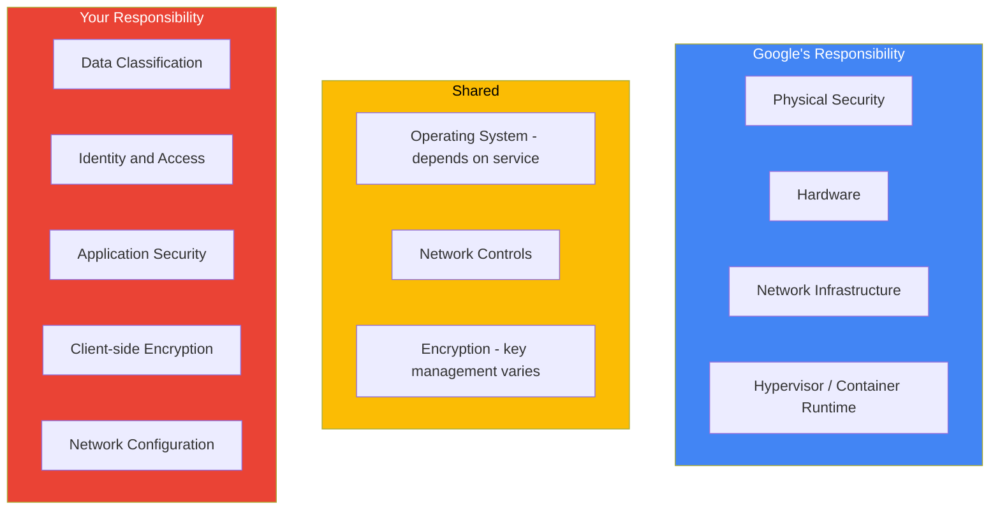

# How to Track Shared Responsibility Model Compliance Obligations in Google Cloud

Author: [nawazdhandala](https://www.github.com/nawazdhandala)

Tags: GCP, Shared Responsibility, Compliance, Security, Google Cloud Governance

Description: Learn how to track and manage your compliance obligations under the shared responsibility model on Google Cloud, clearly delineating what Google handles and what you own.

---

The shared responsibility model is fundamental to cloud security, but it is also one of the most misunderstood concepts. Google handles the security of the cloud infrastructure - physical security, hardware, networking fabric, and the hypervisor. You handle the security of everything you put in the cloud - your data, identity management, application security, and network configuration. The tricky part is knowing exactly where Google's responsibility ends and yours begins for each service you use.

This guide provides a practical framework for tracking these obligations across your Google Cloud environment.

## The Shared Responsibility Spectrum

Different GCP services shift the boundary differently. IaaS services like Compute Engine give you more responsibility. PaaS services like Cloud Run take on more. Understanding where each service falls is critical:



## Mapping Responsibilities by Service

Here is a detailed breakdown for common GCP services:

### Compute Engine (IaaS)

| Responsibility Area | Owner | Details |
|---------------------|-------|---------|
| Physical infrastructure | Google | Data center security, hardware |
| Hypervisor | Google | VM isolation |
| Guest OS patching | You | OS updates, security patches |
| Application security | You | Code, dependencies, vulnerabilities |
| Firewall rules | You | VPC firewall configuration |
| Data encryption at rest | Shared | Google encrypts by default, you manage CMEK |
| IAM | You | Who can access the VM |

### GKE (Container Platform)

| Responsibility Area | Owner | Details |
|---------------------|-------|---------|
| Control plane | Google | API server, etcd, scheduler |
| Node OS | Shared | Google provides optimized OS, you handle node pool updates |
| Container images | You | Base images, vulnerabilities, updates |
| Pod security | You | Security contexts, network policies |
| Workload identity | You | Service account mappings |
| Network policies | You | Pod-to-pod traffic rules |

### Cloud Run (Serverless)

| Responsibility Area | Owner | Details |
|---------------------|-------|---------|
| Infrastructure | Google | Servers, scaling, patching |
| Container runtime | Google | Sandbox, isolation |
| Application code | You | Security, dependencies |
| IAM | You | Access control |
| Secrets management | You | How secrets reach your app |

## Building a Compliance Tracking System

### Step 1: Create a Central Tracking Dataset

```bash
# Create a BigQuery dataset for compliance tracking
bq mk --dataset \
    --location=US \
    --description="Shared responsibility compliance tracking" \
    my-project:compliance_tracking
```

Create tables that map your responsibilities:

```sql
-- Create a table to track compliance obligations by service
CREATE TABLE `compliance_tracking.service_obligations` (
    service_name STRING,
    obligation_area STRING,
    responsible_party STRING,  -- 'google', 'customer', 'shared'
    control_description STRING,
    compliance_framework STRING,
    implementation_status STRING,  -- 'implemented', 'in_progress', 'not_started'
    evidence_location STRING,
    last_reviewed DATE,
    next_review_date DATE,
    owner_email STRING
);

-- Insert obligations for Compute Engine
INSERT INTO `compliance_tracking.service_obligations` VALUES
('Compute Engine', 'OS Patching', 'customer', 'Apply security patches within 30 days of release', 'SOC 2', 'implemented', 'gs://evidence/os-patching/', CURRENT_DATE(), DATE_ADD(CURRENT_DATE(), INTERVAL 90 DAY), 'platform-team@company.com'),
('Compute Engine', 'Firewall Rules', 'customer', 'Restrict network access to required ports only', 'PCI DSS', 'implemented', 'gs://evidence/firewall-configs/', CURRENT_DATE(), DATE_ADD(CURRENT_DATE(), INTERVAL 90 DAY), 'network-team@company.com'),
('Compute Engine', 'Encryption at Rest', 'shared', 'Use CMEK for sensitive workloads', 'HIPAA', 'implemented', 'gs://evidence/encryption-config/', CURRENT_DATE(), DATE_ADD(CURRENT_DATE(), INTERVAL 90 DAY), 'security-team@company.com');
```

### Step 2: Automate Compliance Checks

Create a Cloud Function that verifies your obligations are being met:

```python
# compliance_checker.py
# Automatically verifies that customer-side compliance obligations are met
# Runs weekly via Cloud Scheduler

import functions_framework
from google.cloud import asset_v1
from google.cloud import compute_v1
from google.cloud import bigquery
from datetime import datetime, timedelta
import json

@functions_framework.http
def check_compliance_obligations(request):
    """Check that all customer-owned obligations are being met."""

    findings = []

    # Check 1: Are all VMs using CMEK encryption?
    findings.extend(check_vm_encryption())

    # Check 2: Are firewall rules following least privilege?
    findings.extend(check_firewall_rules())

    # Check 3: Are service accounts following best practices?
    findings.extend(check_service_accounts())

    # Check 4: Is audit logging enabled everywhere?
    findings.extend(check_audit_logging())

    # Store findings in BigQuery
    store_findings(findings)

    return json.dumps({
        'total_checks': len(findings),
        'passed': len([f for f in findings if f['status'] == 'PASS']),
        'failed': len([f for f in findings if f['status'] == 'FAIL'])
    })


def check_vm_encryption():
    """Verify all VM disks use CMEK encryption."""
    findings = []
    client = compute_v1.DisksClient()

    # List all disks in the project
    for zone in ['us-central1-a', 'us-central1-b', 'us-east1-b']:
        request = compute_v1.ListDisksRequest(
            project='my-project',
            zone=zone
        )
        for disk in client.list(request=request):
            has_cmek = disk.disk_encryption_key is not None
            findings.append({
                'check': 'vm_disk_encryption',
                'resource': disk.self_link,
                'status': 'PASS' if has_cmek else 'FAIL',
                'detail': 'CMEK enabled' if has_cmek else 'Using default encryption - CMEK required',
                'obligation': 'customer',
                'framework': 'HIPAA'
            })

    return findings


def check_firewall_rules():
    """Verify no overly permissive firewall rules exist."""
    findings = []
    client = compute_v1.FirewallsClient()

    request = compute_v1.ListFirewallsRequest(project='my-project')
    for rule in client.list(request=request):
        # Check for 0.0.0.0/0 source range on non-HTTP ports
        if rule.source_ranges and '0.0.0.0/0' in rule.source_ranges:
            for allowed in rule.allowed:
                if allowed.ports and not set(allowed.ports).issubset({'80', '443'}):
                    findings.append({
                        'check': 'firewall_least_privilege',
                        'resource': rule.name,
                        'status': 'FAIL',
                        'detail': f'Rule allows 0.0.0.0/0 access to ports: {allowed.ports}',
                        'obligation': 'customer',
                        'framework': 'SOC 2'
                    })
                else:
                    findings.append({
                        'check': 'firewall_least_privilege',
                        'resource': rule.name,
                        'status': 'PASS',
                        'detail': 'Rule allows public access only to HTTP/HTTPS',
                        'obligation': 'customer',
                        'framework': 'SOC 2'
                    })

    return findings


def check_service_accounts():
    """Verify service account hygiene."""
    findings = []
    # Check for service accounts with key-based authentication
    # Check for over-privileged service accounts
    # (Implementation details depend on your specific requirements)
    return findings


def check_audit_logging():
    """Verify audit logging is enabled for all services."""
    findings = []
    # Query the IAM policy for audit configs
    # (Implementation depends on project structure)
    return findings


def store_findings(findings):
    """Store compliance findings in BigQuery."""
    client = bigquery.Client()
    table_id = "my-project.compliance_tracking.automated_findings"

    rows = [{
        **f,
        'timestamp': datetime.utcnow().isoformat(),
    } for f in findings]

    errors = client.insert_rows_json(table_id, rows)
    if errors:
        print(f"Error inserting findings: {errors}")
```

### Step 3: Create a Compliance Dashboard

Use the BigQuery data to build a dashboard in Looker or Data Studio:

```sql
-- Query for compliance dashboard - obligation status overview
SELECT
    service_name,
    responsible_party,
    implementation_status,
    COUNT(*) as obligation_count,
    COUNTIF(next_review_date < CURRENT_DATE()) as overdue_reviews
FROM `compliance_tracking.service_obligations`
GROUP BY service_name, responsible_party, implementation_status
ORDER BY service_name

-- Query for automated compliance check trends
SELECT
    DATE(timestamp) as check_date,
    check_type,
    COUNTIF(status = 'PASS') as passed,
    COUNTIF(status = 'FAIL') as failed,
    ROUND(COUNTIF(status = 'PASS') / COUNT(*) * 100, 1) as pass_rate
FROM `compliance_tracking.automated_findings`
WHERE timestamp > TIMESTAMP_SUB(CURRENT_TIMESTAMP(), INTERVAL 90 DAY)
GROUP BY check_date, check_type
ORDER BY check_date DESC
```

### Step 4: Set Up Review Workflows

```bash
# Schedule quarterly compliance reviews
gcloud scheduler jobs create http quarterly-compliance-review \
    --schedule="0 9 1 1,4,7,10 *" \
    --uri="https://REGION-PROJECT.cloudfunctions.net/check_compliance_obligations" \
    --http-method=GET \
    --oidc-service-account-email=compliance-checker@my-project.iam.gserviceaccount.com

# Send notification when reviews are due
gcloud scheduler jobs create http review-due-notification \
    --schedule="0 9 * * 1" \
    --uri="https://REGION-PROJECT.cloudfunctions.net/notify_pending_reviews" \
    --http-method=GET \
    --oidc-service-account-email=compliance-checker@my-project.iam.gserviceaccount.com
```

## Leveraging Google's Compliance Documentation

Google publishes compliance reports and certifications that document their side of the shared responsibility:

```bash
# Access Google's compliance reports through the Compliance Reports Manager
# Available at: https://cloud.google.com/security/compliance/compliance-reports-manager

# Use the Compliance Reports API to programmatically access reports
gcloud assured workloads violations list \
    --organization=123456789 \
    --location=global
```

Key Google compliance documents to reference:
- SOC 2 Type II report - covers Google's operational controls
- ISO 27001 certificate - covers Google's information security management
- PCI DSS Attestation of Compliance - covers Google's payment card controls

These documents are evidence of Google meeting their obligations. You need separate evidence for your obligations.

## Best Practices

**Document everything.** For each GCP service you use, document who is responsible for what. Keep this documentation current as you adopt new services.

**Automate compliance checks.** Manual reviews are error-prone and infrequent. Automated checks run continuously and catch drift immediately.

**Use Security Command Center.** SCC provides built-in compliance monitoring against common frameworks. It does not replace your obligation tracking but supplements it.

**Review when services change.** When Google launches new features or changes service behavior, review your responsibility mapping. What was once your responsibility might now be managed by Google, or vice versa.

**Train your teams.** Engineers deploying to GCP need to understand what the shared responsibility model means for their specific services. A developer deploying to Cloud Run has different obligations than one managing Compute Engine VMs.

The shared responsibility model is not static. As you migrate between service types, adopt new features, or change compliance frameworks, your obligations shift. Building a systematic tracking approach ensures nothing falls through the cracks.
